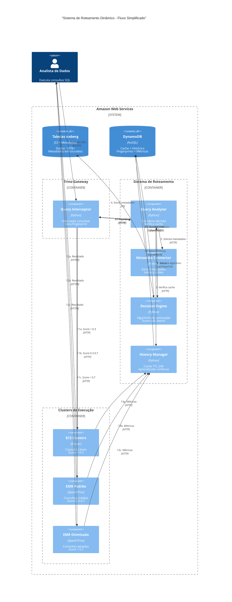

# Arquitetura do Sistema de Roteamento Dinâmico - Fluxo Completo

## Diagrama de Arquitetura e Fluxo do Sistema

### Versão Organizada - Fluxo Principal

```mermaid
C4Component
    title "Sistema de Roteamento Dinâmico - Fluxo Completo"

    Person(analyst, "Analista de Dados", "Executa consultas SQL para análise")
    
    System_Boundary(aws, "Amazon Web Services") {
        Container_Boundary(trino_gateway, "Trino Gateway") {
            Component(query_interceptor, "Query Interceptor Plugin", "Python Plugin", "Intercepta consultas SQL<br/>Gera fingerprint único")
        }
        
        Container_Boundary(routing_system, "Sistema de Roteamento Dinâmico") {
            Component(query_analyzer, "Query Analyzer", "Python", "Coordena processo de decisão<br/>Verifica cache DynamoDB")
            Component(metadata_connector, "Metadata Connector", "Python", "Extrai metadados Iceberg<br/>file_count, total_size, record_count<br/>partition_info, column_stats")
            Component(decision_engine, "Decision Engine", "Python", "Algoritmo de pontuação<br/>Score = w₁×f_volume + w₂×f_complex + w₃×f_hist")
            Component(history_manager, "History Management System", "Python", "Cache TTL 24h<br/>Fingerprints de consultas<br/>Aprendizado contínuo")
            Component(monitoring_system, "Monitoring System", "Python", "CloudWatch metrics<br/>Auto-scaling ECS/EMR<br/>Correção dinâmica")
        }
        
        Container_Boundary(execution_clusters, "Clusters de Execução") {
            Component(ecs_clusters, "Clusters ECS", "Docker", "Consultas leves (Score < 0.3)<br/>2-8 vCPUs, 4-32GB RAM<br/>Baixa latência")
            Component(emr_standard, "EMR Padrão", "Spark/Trino", "Consultas médias (Score 0.3-0.7)<br/>4-12 nós<br/>Processamento distribuído")
            Component(emr_optimized, "EMR Otimizado", "Spark/Trino", "Consultas pesadas (Score > 0.7)<br/>8-20 nós<br/>Máximo paralelismo")
        }
        
        ContainerDb(iceberg_tables, "Tabelas Apache Iceberg", "S3 + Metadados", "Dados: 10TB+<br/>Metadados: metadata.json<br/>manifest-list, manifest files")
        ContainerDb(dynamodb, "DynamoDB", "NoSQL", "Cache: TTL 24h<br/>Histórico: fingerprints, métricas<br/>Decisões: scores, clusters")
    }

    %% Fluxo principal - Entrada
    Rel(analyst, query_interceptor, "1. Executa consulta SQL", "HTTPS")
    Rel(query_interceptor, query_analyzer, "2. Intercepta + fingerprint", "HTTP")
    
    %% Verificação de cache
    Rel(query_analyzer, history_manager, "3. Verifica cache", "HTTP")
    Rel(history_manager, dynamodb, "4. Consulta TTL 24h", "DynamoDB API")
    
    %% Cache miss - análise completa
    Rel(query_analyzer, metadata_connector, "5. Solicita metadados", "HTTP")
    Rel(metadata_connector, iceberg_tables, "6. Extrai metadados", "S3 API")
    
    %% Algoritmo de decisão
    Rel(query_analyzer, decision_engine, "7. Executa algoritmo", "HTTP")
    Rel(decision_engine, dynamodb, "8. Consulta histórico", "DynamoDB API")
    Rel(decision_engine, query_analyzer, "9. Score calculado", "HTTP")
    
    %% Roteamento baseado no score
    Rel(query_analyzer, query_interceptor, "10. Decisão de roteamento", "HTTP")
    Rel(query_interceptor, ecs_clusters, "11a. Score < 0.3", "HTTP")
    Rel(query_interceptor, emr_standard, "11b. Score 0.3-0.7", "HTTP")
    Rel(query_interceptor, emr_optimized, "11c. Score > 0.7", "HTTP")
    
    %% Retorno dos resultados
    Rel(ecs_clusters, analyst, "12a. Resultado consulta", "HTTPS")
    Rel(emr_standard, analyst, "12b. Resultado consulta", "HTTPS")
    Rel(emr_optimized, analyst, "12c. Resultado consulta", "HTTPS")
    
    %% Coleta de métricas pós-execução
    Rel(ecs_clusters, monitoring_system, "13a. Métricas de execução", "CloudWatch")
    Rel(emr_standard, monitoring_system, "13b. Métricas de execução", "CloudWatch")
    Rel(emr_optimized, monitoring_system, "13c. Métricas de execução", "CloudWatch")
    
    %% Salvamento no histórico após cada execução
    Rel(monitoring_system, history_manager, "14. Salva dados da execução", "HTTP")
    Rel(history_manager, dynamodb, "15. Atualiza histórico + cache", "DynamoDB API")
    
    %% Monitoramento contínuo e escalonamento
    Rel(monitoring_system, ecs_clusters, "16. Monitora performance", "CloudWatch")
    Rel(monitoring_system, emr_standard, "16. Monitora performance", "CloudWatch")
    Rel(monitoring_system, emr_optimized, "16. Monitora performance", "CloudWatch")
    
    %% Auto-scaling quando necessário
    Rel(monitoring_system, ecs_clusters, "17a. Auto-scaling ECS", "AWS API")
    Rel(monitoring_system, emr_standard, "17b. Auto-scaling EMR", "AWS API")
    Rel(monitoring_system, emr_optimized, "17c. Auto-scaling EMR", "AWS API")
    
    %% Feedback loop para aprendizado
    Rel(dynamodb, decision_engine, "18. Histórico para aprendizado", "DynamoDB API")
```

### Versão Simplificada - Fluxo de Decisão

## Fluxo Detalhado do Sistema

### **Fase 1: Interceptação e Cache (Passos 1-4)**
1. **Cliente executa consulta SQL** → Query Interceptor Plugin
2. **Plugin intercepta e gera fingerprint** → Query Analyzer
3. **Analyzer verifica cache** → History Management System
4. **Sistema consulta DynamoDB** com TTL de 24 horas

### **Fase 2: Análise de Metadados (Passos 5-6)**
5. **Cache miss - solicita metadados** → Metadata Connector
6. **Connector extrai metadados Iceberg** → Tabelas Apache Iceberg
   - file_count, total_size, record_count
   - partition_info, column_stats

### **Fase 3: Algoritmo de Decisão (Passos 7-9)**
7. **Executa algoritmo de pontuação** → Decision Engine
8. **Consulta histórico para aprendizado** → DynamoDB
9. **Score calculado** → Query Analyzer

### **Fase 4: Roteamento Inteligente (Passos 10-11)**
10. **Decisão de roteamento** → Query Interceptor Plugin
11. **Roteamento baseado no score**:
    - **Score < 0.3** → Clusters ECS (consultas leves)
    - **Score 0.3-0.7** → EMR Padrão (consultas médias)
    - **Score > 0.7** → EMR Otimizado (consultas pesadas)

### **Fase 5: Execução e Coleta de Dados (Passos 12-15)**
12. **Resultados retornados** → Cliente
13. **Coleta de métricas pós-execução** → Monitoring System
    - Tempo de execução, custo, utilização de recursos
    - Performance do cluster selecionado
    - Eficácia da decisão de roteamento
14. **Salvamento no histórico** → History Management System
15. **Atualização do DynamoDB** → Histórico + cache atualizado

### **Fase 6: Monitoramento e Aprendizado (Passos 16-18)**
16. **Monitoramento contínuo** → CloudWatch metrics
17. **Auto-scaling quando necessário** → AWS API
18. **Feedback loop para aprendizado** → Decision Engine

## Componentes Principais

### 1. Query Interceptor Plugin
- **Tecnologia**: Python Plugin
- **Responsabilidade**: Intercepta consultas SQL antes do roteamento
- **Integração**: Trino Gateway existente

### 2. Query Analyzer
- **Tecnologia**: Python
- **Responsabilidade**: Analisa consultas e extrai metadados
- **Funcionalidades**: Gera fingerprint, verifica cache, coordena processo

### 3. Metadata Connector
- **Tecnologia**: Python
- **Responsabilidade**: Conecta com catálogos Iceberg
- **Funcionalidades**: Extrai metadados (file_count, total_size, record_count, etc.)

### 4. Decision Engine
- **Tecnologia**: Python
- **Responsabilidade**: Aplica algoritmo de decisão
- **Funcionalidades**: Calcula score, considera histórico, toma decisão

### 5. History Management System
- **Tecnologia**: Python
- **Responsabilidade**: Gerencia cache e histórico
- **Funcionalidades**: TTL 24h, fingerprints, salvamento pós-execução, aprendizado contínuo

### 6. Monitoring System
- **Tecnologia**: Python
- **Responsabilidade**: Monitora performance e escalonamento
- **Funcionalidades**: CloudWatch, auto-scaling, correção dinâmica

## Fluxo de Decisão Otimizado

1. **Interceptação**: Query interceptada pelo plugin
2. **Cache Check**: Verifica DynamoDB para decisão recente (24h)
3. **Cache Hit**: Roteamento direto para cluster (latência mínima)
4. **Cache Miss**: Análise completa de metadados Iceberg
5. **Algoritmo**: Score = w₁×f_volume + w₂×f_complex + w₃×f_hist
6. **Decisão**: Cluster selecionado baseado no score
7. **Execução**: Query executada no cluster escolhido
8. **Coleta Pós-Execução**: Métricas de performance, custo e eficácia coletadas
9. **Salvamento**: Dados da execução salvos no DynamoDB para histórico
10. **Monitoramento**: Métricas coletadas em tempo real
11. **Escalonamento**: Correção automática se necessário
12. **Aprendizado**: Histórico atualizado, pesos ajustados baseado nos resultados