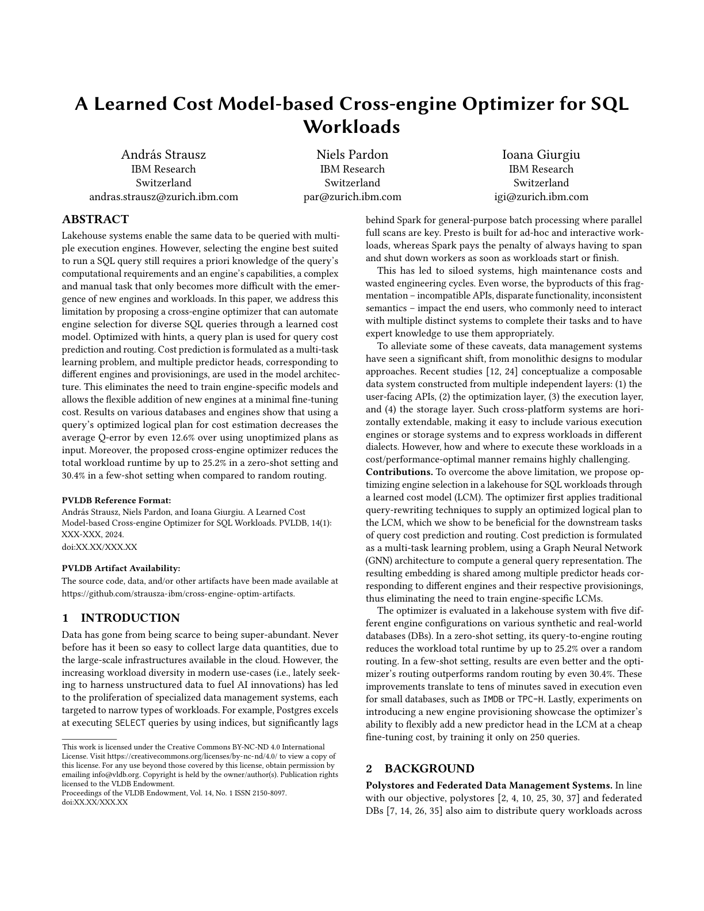
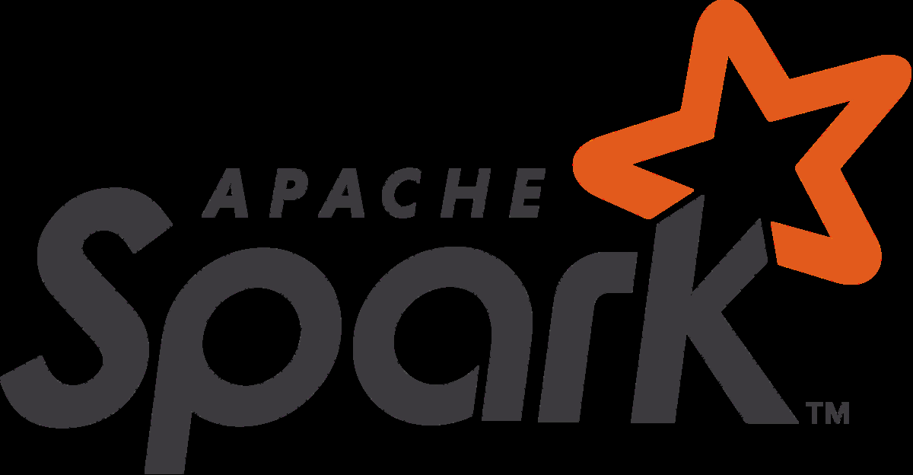
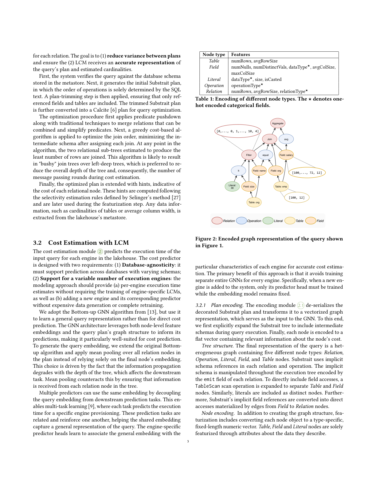
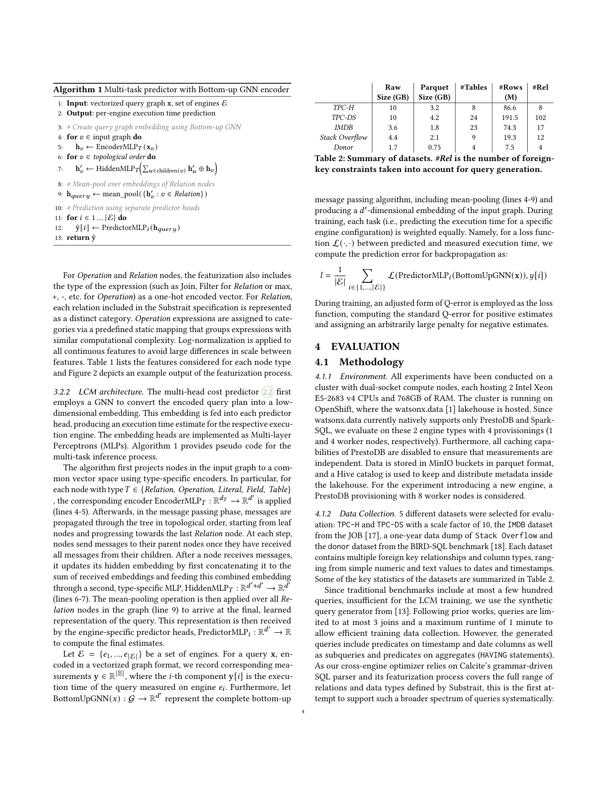
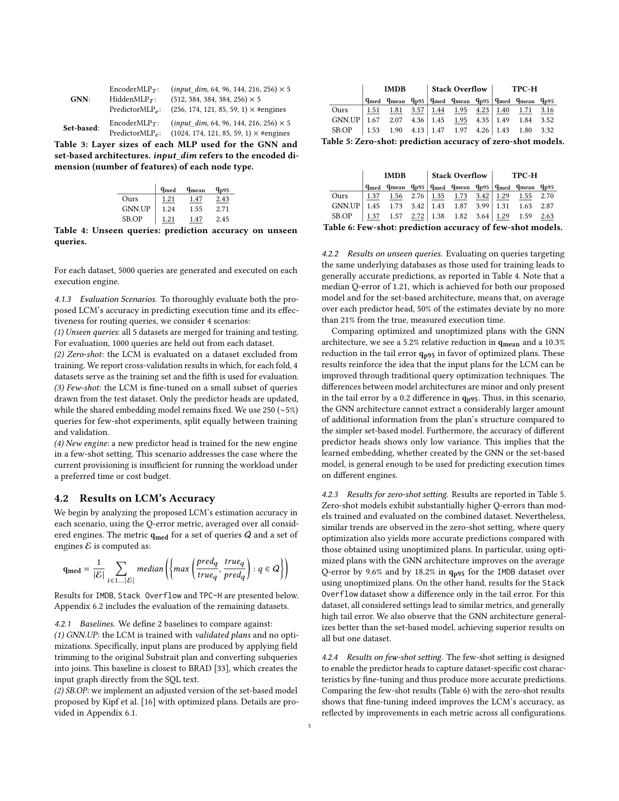
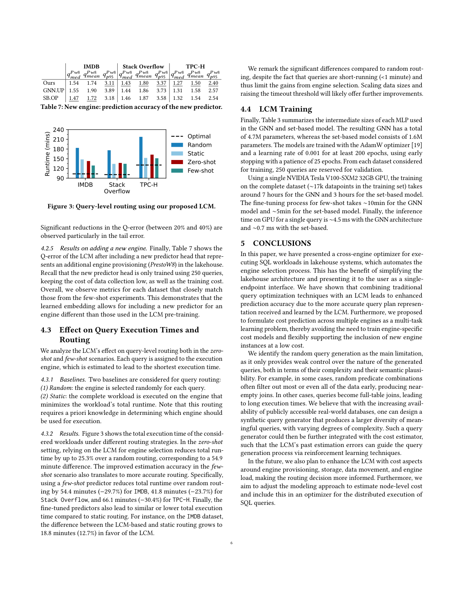
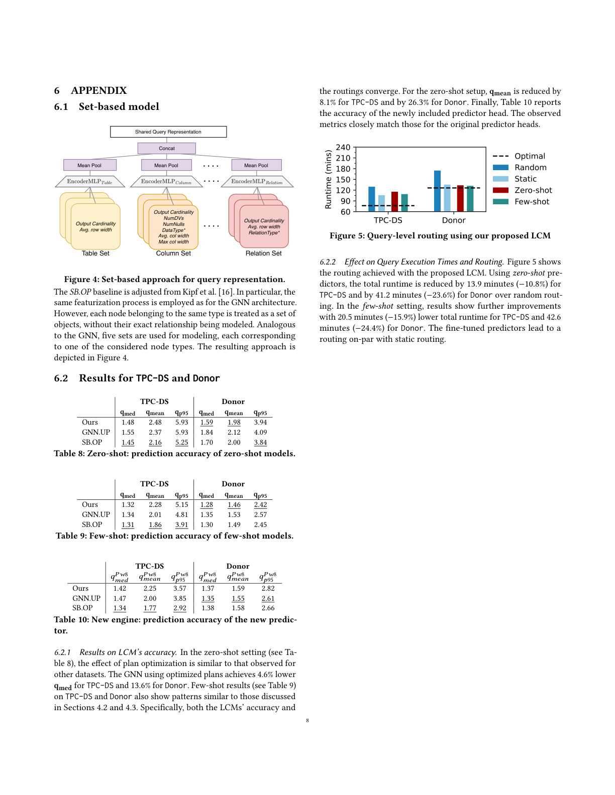

# ALearned Cost Model-based Cross-engine Optimizer for SQL

> Convertido automaticamente de PDF para Markdown
>
> Arquivo original: `referencias/ALearned Cost Model-based Cross-engine Optimizer for SQL.pdf`
> Data de conversão: 22/08/2026 13:04:09
> Imagens extraídas: 8 arquivo(s)

---

**A Learned Cost Model-based Cross-engine Optimizer for SQL**

**Workloads**

Andr&#xe1;s Strausz

IBM Research

Switzerland

andras.strausz@zurich.ibm.com

Niels Pardon

IBM Research

Switzerland

par@zurich.ibm.com

Ioana Giurgiu

IBM Research

Switzerland

igi@zurich.ibm.com

**ABSTRACT**

Lakehouse systems enable the same data to be queried with multi-

ple execution engines. However, selecting the engine best suited

to run a SQL query still requires a priori knowledge of the query&#x2019;s

computational requirements and an engine&#x2019;s capabilities, a complex

and manual task that only becomes more difficult with the emer-

gence of new engines and workloads. In this paper, we address this

limitation by proposing a cross-engine optimizer that can automate

engine selection for diverse SQL queries through a learned cost

model. Optimized with hints, a query plan is used for query cost

prediction and routing. Cost prediction is formulated as a multi-task

learning problem, and multiple predictor heads, corresponding to

different engines and provisionings, are used in the model architec-

ture. This eliminates the need to train engine-specific models and

allows the flexible addition of new engines at a minimal fine-tuning

cost. Results on various databases and engines show that using a

query&#x2019;s optimized logical plan for cost estimation decreases the

average Q-error by even 12.6% over using unoptimized plans as

input. Moreover, the proposed cross-engine optimizer reduces the

total workload runtime by up to 25.2% in a zero-shot setting and

30.4% in a few-shot setting when compared to random routing.

**PVLDB Reference Format:**

Andr&#xe1;s Strausz, Niels Pardon, and Ioana Giurgiu. A Learned Cost

Model-based Cross-engine Optimizer for SQL Workloads. PVLDB, 14(1):

XXX-XXX, 2024.

doi:XX.XX/XXX.XX

**PVLDB Artifact Availability:**

The source code, data, and/or other artifacts have been made available at

https://github.com/strausza-ibm/cross-engine-optim-artifacts.

**1**

**INTRODUCTION**

Data has gone from being scarce to being super-abundant. Never

before has it been so easy to collect large data quantities, due to

the large-scale infrastructures available in the cloud. However, the

increasing workload diversity in modern use-cases (i.e., lately seek-

ing to harness unstructured data to fuel AI innovations) has led

to the proliferation of specialized data management systems, each

targeted to narrow types of workloads. For example, Postgres excels

at executing SELECT queries by using indices, but significantly lags

This work is licensed under the Creative Commons BY-NC-ND 4.0 International

License. Visit https://creativecommons.org/licenses/by-nc-nd/4.0/ to view a copy of

this license. For any use beyond those covered by this license, obtain permission by

emailing info@vldb.org. Copyright is held by the owner/author(s). Publication rights

licensed to the VLDB Endowment.

Proceedings of the VLDB Endowment, Vol. 14, No. 1 ISSN 2150-8097.

doi:XX.XX/XXX.XX

behind Spark for general-purpose batch processing where parallel

full scans are key. Presto is built for ad-hoc and interactive work-

loads, whereas Spark pays the penalty of always having to span

and shut down workers as soon as workloads start or finish.

This has led to siloed systems, high maintenance costs and

wasted engineering cycles. Even worse, the byproducts of this frag-

mentation &#x2013; incompatible APIs, disparate functionality, inconsistent

semantics &#x2013; impact the end users, who commonly need to interact

with multiple distinct systems to complete their tasks and to have

expert knowledge to use them appropriately.

To alleviate some of these caveats, data management systems

have seen a significant shift, from monolithic designs to modular

approaches. Recent studies [12, 24] conceptualize a composable

data system constructed from multiple independent layers: (1) the

user-facing APIs, (2) the optimization layer, (3) the execution layer,

and (4) the storage layer. Such cross-platform systems are hori-

zontally extendable, making it easy to include various execution

engines or storage systems and to express workloads in different

dialects. However, how and where to execute these workloads in a

cost/performance-optimal manner remains highly challenging.

**Contributions.** To overcome the above limitation, we propose op-

timizing engine selection in a lakehouse for SQL workloads through

a learned cost model (LCM). The optimizer first applies traditional

query-rewriting techniques to supply an optimized logical plan to

the LCM, which we show to be beneficial for the downstream tasks

of query cost prediction and routing. Cost prediction is formulated

as a multi-task learning problem, using a Graph Neural Network

(GNN) architecture to compute a general query representation. The

resulting embedding is shared among multiple predictor heads cor-

responding to different engines and their respective provisionings,

thus eliminating the need to train engine-specific LCMs.

The optimizer is evaluated in a lakehouse system with five dif-

ferent engine configurations on various synthetic and real-world

databases (DBs). In a zero-shot setting, its query-to-engine routing

reduces the workload total runtime by up to 25.2% over a random

routing. In a few-shot setting, results are even better and the opti-

mizer&#x2019;s routing outperforms random routing by even 30.4%. These

improvements translate to tens of minutes saved in execution even

for small databases, such as IMDB or TPC-H. Lastly, experiments on

introducing a new engine provisioning showcase the optimizer&#x2019;s

ability to flexibly add a new predictor head in the LCM at a cheap

fine-tuning cost, by training it only on 250 queries.

**2**

**BACKGROUND**

**Polystores and Federated Data Management Systems.** In line

with our objective, polystores [2, 4, 10, 25, 30, 37] and federated

DBs [7, 14, 26, 35] also aim to distribute query workloads across

---

**ML-based Cost Estimation**

**Plan creation**

**Routing**

Validated

plan

Optimized

plan

Decorated

plan

**Multi-head cost predictor**

aggregate { [..]

&#xa0;filter { [..]

&#xa0; join { [..]

&#xa0; &#xa0;} } }

aggregate { [..]

&#xa0;join { [..]

&#xa0; filter { [..]

&#xa0; &#xa0;} } }

aggregate {&#xa0;

&#xa0;hint: {

&#xa0; numRows: 1,

&#xa0; avgSize: 16.2

[..]&#xa0;} } }

**SQL input**

SELECT AVG(emp.salary)

FROM org

JOIN emp&#xa0;

ON org.name = emp.org

WHERE org.size < 30

**Plan Encoder**

Vectorized graph

representation

*Sequence of*

*metadata requests*

*for cardinality*

*estimation*

**1**

**2**

2.1

*SQL-to-Substrait*

*Decorated*

*Substrait plan*

De-serialized

Substrait plan

Predictor 3

Predictor 2

BottomUp GNN

Predictor 1

2.2

1.91 s

7.21 s

2.23 s

Mean pool

*Per-engine&#xa0;*

*estimates*

**watsonx.data lakehouse**

workers: 8

workers: 4

workers: 2

&#xa0; &#xa0; &#xa0; &#xa0; metastore

S3 Data storage

*SQL api*

*SQL api*

*SQL api*

*HIVE api*

**Figure 1: Overview of the cross-engine optimizer.**

heterogeneous engines. Specifically, they optimize queries within

a given set of engines and hardware configurations. For example,

RHEEM [2] requires additional work to specify selectivity and cost

templates for each operator when including a new engine, which

can quickly become a burden for extension. In contrast, we enable

the easy addition of a new engine to the underlying infrastructure

to support the user&#x2019;s workload.

**LCMs for Query Optimization and Cost Estimation.** Recently,

LCMs [5, 8, 15, 20, 21, 23, 32, 38, 39] that aim to learn and enhance

the behavior of the DB engine&#x2019;s optimizer have been proposed.

Some [5, 20, 23] use the traditional optimizer&#x2019;s hints to improve

the optimization procedure. Others [8, 21, 32, 38] attempt to fully

replace the query otimizer with a learned query rewriter. Finally, a

variety of approaches [13, 31, 33] estimate query cost with LCMs.

Stage [31] proposes a hierarchical modeling strategy, where ei-

ther instance-level or global models are used for the task. For the

latter, the Graph Neural Network (GNN) architecture described

in [13] is used. Similarly, BRAD [33] uses the same architecture to

tackle query-to-engine routing. To select the cost-optimal engine,

it considers multiple cost factors, some estimated by closed-form

functions, and others by learned models. Most importantly, for ex-

ecution time prediction, it uses unoptimized logical query plans.

Each execution engine is considered separately, so an individual

predictor model would need to be trained for each. While we are

inspired by the bottom-up GNN architecture, we propose a multi-

head predictor that simultaneously predicts execution times for all

supported engines and allows new engines to be easily added by

fine-tuning a new predictor head on a small volume of queries.

**LCM Architectures.** Various architectures have been explored for

LCMs, ranging from flat vectors [11, 16] with Multi Layer Percep-

trons (MLP), to Tree Convolutional Networks [22], Recurrent Neu-

ral Networks [29, 34] and Transformer models [36]. More recently,

GNNs have gained popularity due to their natural representation

of query structures. A message passing algorithm over the query

execution plan has been proposed in [13]. Similarly to sequence

models, by adjusting the message passing order to follow the execu-

tion plan&#x2019;s topology, nodes receive information from their subtree.

Thus, the computed hidden embedding of a node is a representation

of this subtree. Consequently, the root node&#x2019;s embedding can be

used as a representation of the complete input graph. Embeddings

are computed using node-specific MLPs, and messages are aggre-

gated by summing. Finally, LLMs have been used to embed the

query text [3], because of their understanding of predicated or even

complete SQL statements. These embeddings can be used either as

a complement to other query or predicate embeddings computed

using numeric features or even as standalone representations.

**3**

**CROSS-ENGINE OPTIMIZER**

The cross-engine optimizer acts as a middleware and interacts

with the underlying system&#x2019;s engines and metadata provider in a

lakehouse. Its objective is, upon receiving a user query, to estimate

the query&#x2019;s execution time on each engine using an LCM and then

use those for engine selection.

The architecture of the cross-engine optimizer is shown in Fig-

ure 1. The input query is first received by the** 1*** Plan creation*

module, which transforms it into an optimized Substrait [28] plan

with cardinality hints. This plan is forwarded to the** 2*** ML-based*

*cost-estimation* module, which encodes the deserialized plan and

predicts the query&#x2019;s execution time for each engine. Finally, these

predictions are used for* Routing*.

**3.1**

**Plan Creation**

During plan creation** 1** , the SQL query is transformed into an opti-

mized Substrait plan with hints containing cost-related information

2

---

for each relation. The goal is to (1)** reduce variance between plans**

and ensure the (2) LCM receives an** accurate representation** of

the query&#x2019;s plan and estimated cardinalities.

First, the system verifies the query against the database schema

stored in the metastore. Next, it generates the initial Substrait plan,

in which the order of operations is solely determined by the SQL

text. A plan-trimming step is then applied, ensuring that only ref-

erenced fields and tables are included. The trimmed Substrait plan

is further converted into a Calcite [6] plan for query optimization.

The optimization procedure first applies predicate pushdown

along with traditional techniques to merge relations that can be

combined and simplify predicates. Next, a greedy cost-based al-

gorithm is applied to optimize the join order, minimizing the in-

termediate schema after assigning each join. At any point in the

algorithm, the two relational sub-trees estimated to produce the

least number of rows are joined. This algorithm is likely to result

in "bushy" join trees over left-deep trees, which is preferred to re-

duce the overall depth of the tree and, consequently, the number of

message passing rounds during cost estimation.

Finally, the optimized plan is extended with hints, indicative of

the cost of each relational node. These hints are computed following

the selectivity estimation rules defined by Selinger&#x2019;s method [27]

and are later used during the featurization step. Any data infor-

mation, such as cardinalities of tables or average column width, is

extracted from the lakehouse&#x2019;s metastore.

**3.2**

**Cost Estimation with LCM**

The cost estimation module** 2** predicts the execution time of the

input query for each engine in the lakehouse. The cost predictor

is designed with two requirements: (1)** Database-agnosticity**: it

must support prediction across databases with varying schemas;

(2)** Support for a variable number of execution engines**: the

modeling approach should provide (a) per-engine execution time

estimates without requiring the training of engine-specific LCMs,

as well as (b) adding a new engine and its corresponding predictor

without expensive data generation or complete retraining.

We adopt the Bottom-up GNN algorithm from [13], but use it

to learn a general query representation rather than for direct cost

prediction. The GNN architecture leverages both node-level feature

embeddings and the query plan&#x2019;s graph structure to inform its

predictions, making it particularly well-suited for cost prediction.

To generate the query embedding, we extend the original Bottom-

up algorithm and apply mean pooling over all relation nodes in

the plan instead of relying solely on the final node&#x2019;s embedding.

This choice is driven by the fact that the information propagation

degrades with the depth of the tree, which affects the downstream

task. Mean pooling counteracts this by ensuring that information

is received from each relation node in the tree.

Multiple predictors can use the same embedding by decoupling

the query embedding from downstream prediction tasks. This en-

ables multi-task learning [9], where each task predicts the execution

time for a specific engine provisioning. These prediction tasks are

related and reinforce one another, helping the shared embedding

capture a general representation of the query. The engine-specific

predictor heads learn to associate the general embedding with the

**Node type**

**Features**

*Table*

numRows, avgRowSize

*Field*

numNulls, numDistinctVals, dataType*&#x2605;*, avgColSize,

maxColSize

*Literal*

dataType*&#x2605;*, size, isCasted

*Operation*

operationType*&#x2605;*

*Relation*

numRows, avgRowSize, relationType*&#x2605;*

**Table 1: Encoding of different node types. The*** &#x2605;***denotes one-**

**hot encoded categorical fields.**

[100, 12]

[0,..., 0, 1,..., 10, 4]

[100,..., 72, 12]

*Relation*

*Operation*

*Literal*

*Table*

*Field*

Aggregate

Join

Filter

Field: size

lt

Table: org

Field: name

equal

Literal:

30

Field: org

Table: emp

Field: salary

avg

**Figure 2: Encoded graph representation of the query shown**

**in Figure 1.**

particular characteristics of each engine for accurate cost estima-

tion. The primary benefit of this approach is that it avoids training

separate entire GNNs for every engine. Specifically, when a new en-

gine is added to the system, only its predictor head must be trained

while the embedding model remains fixed.

*3.2.1*

*Plan encoding.* The encoding module 2.1 de-serializes the

decorated Substrait plan and transforms it to a vectorized graph

representation, which serves as the input to the GNN. To this end,

we first explicitly expand the Substrait tree to include intermediate

schemas during query execution. Finally, each node is encoded to a

flat vector containing relevant information about the node&#x2019;s cost.

*Tree structure.* The final representation of the query is a het-

erogeneous graph containing five different node types:* Relation*,

*Operation*,* Literal*,* Field*, and* Table* nodes. Substrait uses implicit

schema references in each relation and operation. The implicit

schema is manipulated throughout the execution tree encoded by

the emit field of each relation. To directly include field accesses, a

TableScan scan operation is expanded to separate* Table* and* Field*

nodes. Similarly, literals are included as distinct nodes. Further-

more, Substrait&#x2019;s implicit field references are converted into direct

accesses materialized by edges from* Field* to* Relation* nodes.

*Node encoding.* In addition to creating the graph structure, fea-

turization includes converting each node object to a type-specific,

fixed-length numeric vector.* Table*,* Field* and* Literal* nodes are solely

featurized through attributes about the data they describe.

3

---

**Algorithm 1** Multi-task predictor with Bottom-up GNN encoder

1:** Input**: vectorized query graph x, set of engines E

2:** Output**: per-engine execution time prediction

3:* # Create query graph embedding using Bottom-up GNN*

4:** for*** &#x1d463;*&#x2208;input graph** do**

5:

h*&#x1d463;*&#x2190;EncoderMLP*&#x1d447;*(x*&#x1d463;*)

6:** for*** &#x1d463;*&#x2208;*topological order*** do**

7:

h&#x2032;*&#x1d463;*&#x2190;HiddenMLP*&#x1d447;*

&#x10;&#xcd;

*&#x1d462;*&#x2208;children(*&#x1d463;*) h&#x2032;*&#x1d462;*&#x2295;h*&#x1d463;*

&#x11;

8:* # Mean-pool over embeddings of Relation nodes*

9: h*&#x1d45e;&#x1d462;&#x1d452;&#x1d45f;&#x1d466;*&#x2190;mean_pool({h&#x2032;*&#x1d463;*:* &#x1d463;*&#x2208;*Relation*})

10:* # Prediction using separate predictor heads*

11:** for*** &#x1d456;*&#x2208;1* ...* | E|** do**

12:

&#x2c6;y[*&#x1d456;*] &#x2190;PredictorMLP*&#x1d456;*(h*&#x1d45e;&#x1d462;&#x1d452;&#x1d45f;&#x1d466;*)

13:** return** &#x2c6;y

For* Operation* and* Relation* nodes, the featurization also includes

the type of the expression (such as Join, Filter for* Relation* or max,

+, -, etc. for* Operation*) as a one-hot encoded vector. For* Relation*,

each relation included in the Substrait specification is represented

as a distinct category.* Operation* expressions are assigned to cate-

gories via a predefined static mapping that groups expressions with

similar computational complexity. Log-normalization is applied to

all continuous features to avoid large differences in scale between

features. Table 1 lists the features considered for each node type

and Figure 2 depicts an example output of the featurization process.

*3.2.2*

*LCM architecture.* The multi-head cost predictor 2.2 first

employs a GNN to convert the encoded query plan into a low-

dimensional embedding. This embedding is fed into each predictor

head, producing an execution time estimate for the respective execu-

tion engine. The embedding heads are implemented as Multi-layer

Perceptrons (MLPs). Algorithm 1 provides pseudo code for the

multi-task inference process.

The algorithm first projects nodes in the input graph to a com-

mon vector space using type-specific encoders. In particular, for

each node with type*&#x1d447;*&#x2208;{*Relation**,** Operation**,** Literal**,** Field**,** Table*}

, the corresponding encoder EncoderMLP*&#x1d447;*: R*&#x1d451;**&#x1d447;*&#x2192;R*&#x1d451;*&#x2032; is applied

(lines 4-5). Afterwards, in the message passing phase, messages are

propagated through the tree in topological order, starting from leaf

nodes and progressing towards the last* Relation* node. At each step,

nodes send messages to their parent nodes once they have received

all messages from their children. After a node receives messages,

it updates its hidden embedding by first concatenating it to the

sum of received embeddings and feeding this combined embedding

through a second, type-specific MLP, HiddenMLP*&#x1d447;*: R*&#x1d451;*&#x2032;+*&#x1d451;*&#x2032; &#x2192;R*&#x1d451;*&#x2032;

(lines 6-7). The mean-pooling operation is then applied over all* Re-*

*lation* nodes in the graph (line 9) to arrive at the final, learned

representation of the query. This representation is then received

by the engine-specific predictor heads, PredictorMLP*&#x1d456;*: R*&#x1d451;*&#x2032; &#x2192;R

to compute the final estimates.

Let E = {*&#x1d452;*1*, ...,&#x1d452;*| E|} be a set of engines. For a query x, en-

coded in a vectorized graph format, we record corresponding mea-

surements y &#x2208;R|E|, where the* &#x1d456;*-th component y[*&#x1d456;*] is the execu-

tion time of the query measured on engine* &#x1d452;**&#x1d456;*. Furthermore, let

BottomUpGNN(*&#x1d465;*) : G &#x2192;R*&#x1d451;*&#x2032; represent the complete bottom-up

**Raw**

**Parquet**

**#Tables**

**#Rows**

**#Rel**

**Size (GB)**

**Size (GB)**

**(M)**

*TPC-H*

10

3.2

8

86.6

8

*TPC-DS*

10

4.2

24

191.5

102

*IMDB*

3.6

1.8

23

74.3

17

*Stack Overflow*

4.4

2.1

9

19.3

12

*Donor*

1.7

0.75

4

7.5

4

**Table 2: Summary of datasets.***** #Rel***** is the number of foreign-**

**key constraints taken into account for query generation.**

message passing algorithm, including mean-pooling (lines 4-9) and

producing a* &#x1d451;*&#x2032;-dimensional embedding of the input graph. During

training, each task (i.e., predicting the execution time for a specific

engine configuration) is weighted equally. Namely, for a loss func-

tion L(&#xb7;*,* &#xb7;) between predicted and measured execution time, we

compute the prediction error for backpropagation as:

*&#x1d459;*=

1

|E|

&#x2211;&#xfe01;

*&#x1d456;*&#x2208;{1*,...,*| E|}

L(PredictorMLP*&#x1d456;*(BottomUpGNN(x))*,&#x1d466;*[*&#x1d456;*])

During training, an adjusted form of Q-error is employed as the loss

function, computing the standard Q-error for positive estimates

and assigning an arbitrarily large penalty for negative estimates.

**4**

**EVALUATION**

**4.1**

**Methodology**

*4.1.1*

*Environment.* All experiments have been conducted on a

cluster with dual-socket compute nodes, each hosting 2 Intel Xeon

E5-2683 v4 CPUs and 768GB of RAM. The cluster is running on

OpenShift, where the watsonx.data [1] lakehouse is hosted. Since

watsonx.data currently natively supports only PrestoDB and Spark-

SQL, we evaluate on these 2 engine types with 4 provisionings (1

and 4 worker nodes, respectively). Furthermore, all caching capa-

bilities of PrestoDB are disabled to ensure that measurements are

independent. Data is stored in MinIO buckets in parquet format,

and a Hive catalog is used to keep and distribute metadata inside

the lakehouse. For the experiment introducing a new engine, a

PrestoDB provisioning with 8 worker nodes is considered.

*4.1.2*

*Data Collection.* 5 different datasets were selected for evalu-

ation: TPC-H and TPC-DS with a scale factor of 10, the IMDB dataset

from the JOB [17], a one-year data dump of Stack Overflow and

the donor dataset from the BIRD-SQL benchmark [18]. Each dataset

contains multiple foreign key relationships and column types, rang-

ing from simple numeric and text values to dates and timestamps.

Some of the key statistics of the datasets are summarized in Table 2.

Since traditional benchmarks include at most a few hundred

queries, insufficient for the LCM training, we use the synthetic

query generator from [13]. Following prior works, queries are lim-

ited to at most 3 joins and a maximum runtime of 1 minute to

allow efficient training data collection. However, the generated

queries include predicates on timestamp and date columns as well

as subqueries and predicates on aggregates (HAVING statements).

As our cross-engine optimizer relies on Calcite&#x2019;s grammar-driven

SQL parser and its featurization process covers the full range of

relations and data types defined by Substrait, this is the first at-

tempt to support such a broader spectrum of queries systematically.

4

---

**GNN**:

EncoderMLP*&#x1d447;*:

(*input_dim*, 64, 96, 144, 216, 256) &#xd7; 5

HiddenMLP*&#x1d447;*:

(512, 384, 384, 384, 256) &#xd7; 5

PredictorMLP*&#x1d452;*:

(256, 174, 121, 85, 59, 1) &#xd7; #engines

**Set-based**:

EncoderMLP*&#x1d447;*:

(*input_dim*, 64, 96, 144, 216, 256) &#xd7; 5

PredictorMLP*&#x1d452;*:

(1024, 174, 121, 85, 59, 1) &#xd7; #engines

**Table 3: Layer sizes of each MLP used for the GNN and**

**set****-****based architectures.***** input_dim***** refers to the encoded di-**

**mension (number of features) of each node type.**

qmed

qmean

qp95

Ours

1.21

1.47

2.43

GNN.UP

1.24

1.55

2.71

SB.OP

1.21

1.47

2.45

**Table 4: Unseen queries: prediction accuracy on unseen**

**queries.**

For each dataset, 5000 queries are generated and executed on each

execution engine.

*4.1.3*

*Evaluation Scenarios.* To thoroughly evaluate both the pro-

posed LCM&#x2019;s accuracy in predicting execution time and its effec-

tiveness for routing queries, we consider 4 scenarios:

*(1) Unseen queries*: all 5 datasets are merged for training and testing.

For evaluation, 1000 queries are held out from each dataset.

*(2) Zero-shot*: the LCM is evaluated on a dataset excluded from

training. We report cross-validation results in which, for each fold, 4

datasets serve as the training set and the fifth is used for evaluation.

*(3) Few-shot*: the LCM is fine-tuned on a small subset of queries

drawn from the test dataset. Only the predictor heads are updated,

while the shared embedding model remains fixed. We use 250 (&#x223c;5%)

queries for few-shot experiments, split equally between training

and validation.

*(4) New engine*: a new predictor head is trained for the new engine

in a few-shot setting. This scenario addresses the case where the

current provisioning is insufficient for running the workload under

a preferred time or cost budget.

**4.2**

**Results on LCM&#x2019;s Accuracy**

We begin by analyzing the proposed LCM&#x2019;s estimation accuracy in

each scenario, using the Q-error metric, averaged over all consid-

ered engines. The metric qmed for a set of queries Q and a set of

engines E is computed as:

qmed =

1

|E|

&#x2211;&#xfe01;

*&#x1d456;*&#x2208;1*...*|E|

*median*

&#x12;&#x1a;

*&#x1d45a;&#x1d44e;&#x1d465;*

&#x12;*&#x1d45d;&#x1d45f;&#x1d452;&#x1d451;**&#x1d45e;*

*&#x1d461;&#x1d45f;&#x1d462;&#x1d452;**&#x1d45e;*

*, **&#x1d461;&#x1d45f;&#x1d462;&#x1d452;**&#x1d45e;*

*&#x1d45d;&#x1d45f;&#x1d452;&#x1d451;**&#x1d45e;*

&#x13;

:* &#x1d45e;*&#x2208;Q

&#x1b;&#x13;

Results for IMDB, Stack Overflow and TPC-H are presented below.

Appendix 6.2 includes the evaluation of the remaining datasets.

*4.2.1*

*Baselines.* We define 2 baselines to compare against:

*(1) GNN.UP*: the LCM is trained with* validated plans* and no opti-

mizations. Specifically, input plans are produced by applying field

trimming to the original Substrait plan and converting subqueries

into joins. This baseline is closest to BRAD [33], which creates the

input graph directly from the SQL text.

*(2) SB.OP*: we implement an adjusted version of the set-based model

proposed by Kipf et al. [16] with optimized plans. Details are pro-

vided in Appendix 6.1.

**IMDB**

**Stack Overflow**

**TPC-H**

qmed qmean qp95 qmed qmean qp95 qmed qmean qp95

Ours

1.51

1.81

3.57

1.44

1.95

4.23

1.40

1.71

3.16

GNN.UP

1.67

2.07

4.36

1.45

1.95

4.35

1.49

1.84

3.52

SB.OP

1.53

1.90

4.13

1.47

1.97

4.26

1.43

1.80

3.32

**Table 5: Zero-shot: prediction accuracy of zero-shot models.**

**IMDB**

**Stack Overflow**

**TPC-H**

qmed qmean qp95 qmed qmean qp95 qmed qmean qp95

Ours

1.37

1.56

2.76

1.35

1.73

3.42

1.29

1.55

2.70

GNN.UP

1.45

1.73

3.42

1.43

1.87

3.99

1.31

1.63

2.87

SB.OP

1.37

1.57

2.72

1.38

1.82

3.64

1.29

1.59

2.63

**Table 6: Few-shot: prediction accuracy of few-shot models.**

*4.2.2*

*Results on unseen queries.* Evaluating on queries targeting

the same underlying databases as those used for training leads to

generally accurate predictions, as reported in Table 4. Note that a

median Q-error of 1.21, which is achieved for both our proposed

model and for the set-based architecture, means that, on average

over each predictor head, 50% of the estimates deviate by no more

than 21% from the true, measured execution time.

Comparing optimized and unoptimized plans with the GNN

architecture, we see a 5.2% relative reduction in qmean and a 10.3%

reduction in the tail error qp95 in favor of optimized plans. These

results reinforce the idea that the input plans for the LCM can be

improved through traditional query optimization techniques. The

differences between model architectures are minor and only present

in the tail error by a 0.2 difference in qp95. Thus, in this scenario,

the GNN architecture cannot extract a considerably larger amount

of additional information from the plan&#x2019;s structure compared to

the simpler set-based model. Furthermore, the accuracy of different

predictor heads shows only low variance. This implies that the

learned embedding, whether created by the GNN or the set-based

model, is general enough to be used for predicting execution times

on different engines.

*4.2.3*

*Results for zero-shot setting.* Results are reported in Table 5.

Zero-shot models exhibit substantially higher Q-errors than mod-

els trained and evaluated on the combined dataset. Nevertheless,

similar trends are observed in the zero-shot setting, where query

optimization also yields more accurate predictions compared with

those obtained using unoptimized plans. In particular, using opti-

mized plans with the GNN architecture improves on the average

Q-error by 9.6% and by 18.2% in qp95 for the IMDB dataset over

using unoptimized plans. On the other hand, results for the Stack

Overflow dataset show a difference only in the tail error. For this

dataset, all considered settings lead to similar metrics, and generally

high tail error. We also observe that the GNN architecture general-

izes better than the set-based model, achieving superior results on

all but one dataset.

*4.2.4*

*Results on few-shot setting.* The few-shot setting is designed

to enable the predictor heads to capture dataset-specific cost charac-

teristics by fine-tuning and thus produce more accurate predictions.

Comparing the few-shot results (Table 6) with the zero-shot results

shows that fine-tuning indeed improves the LCM&#x2019;s accuracy, as

reflected by improvements in each metric across all configurations.

5

---

**IMDB**

**Stack Overflow**

**TPC-H**

*&#x1d45e;**&#x1d443;&#x1d464;*8

*&#x1d45a;&#x1d452;&#x1d451;**&#x1d45e;**&#x1d443;&#x1d464;*8

*&#x1d45a;&#x1d452;&#x1d44e;&#x1d45b;**&#x1d45e;**&#x1d443;&#x1d464;*8

*&#x1d45d;*95

*&#x1d45e;**&#x1d443;&#x1d464;*8

*&#x1d45a;&#x1d452;&#x1d451;**&#x1d45e;**&#x1d443;&#x1d464;*8

*&#x1d45a;&#x1d452;&#x1d44e;&#x1d45b;**&#x1d45e;**&#x1d443;&#x1d464;*8

*&#x1d45d;*95

*&#x1d45e;**&#x1d443;&#x1d464;*8

*&#x1d45a;&#x1d452;&#x1d451;**&#x1d45e;**&#x1d443;&#x1d464;*8

*&#x1d45a;&#x1d452;&#x1d44e;&#x1d45b;**&#x1d45e;**&#x1d443;&#x1d464;*8

*&#x1d45d;*95

Ours

1.54

1.74

3.11

1.43

1.80

3.37

1.27

1.50

2.40

GNN.UP 1.55

1.90

3.89

1.44

1.86

3.73

1.31

1.58

2.57

SB.OP

1.47

1.72

3.18

1.46

1.87

3.58

1.32

1.54

2.54

**Table 7: New engine: prediction accuracy of the new predictor.**

IMDB

Stack

Overflow

TPC-H

90

120

150

180

210

240

Runtime (mins)

Optimal

Random

Static

Zero-shot

Few-shot

**Figure 3: Query-level routing using our proposed LCM.**

Significant reductions in the Q-error (between 20% and 40%) are

observed particularly in the tail error.

*4.2.5*

*Results on adding a new engine.* Finally, Table 7 shows the

Q-error of the LCM after including a new predictor head that repre-

sents an additional engine provisioning (*PrestoW8*) in the lakehouse.

Recall that the new predictor head is only trained using 250 queries,

keeping the cost of data collection low, as well as the training cost.

Overall, we observe metrics for each dataset that closely match

those from the few-shot experiments. This demonstrates that the

learned embedding allows for including a new predictor for an

engine different than those used in the LCM pre-training.

**4.3**

**Effect on Query Execution Times and**

**Routing**

We analyze the LCM&#x2019;s effect on query-level routing both in the* zero-*

*shot* and* few-shot* scenarios. Each query is assigned to the execution

engine, which is estimated to lead to the shortest execution time.

*4.3.1*

*Baselines.* Two baselines are considered for query routing:

*(1) Random*: the engine is selected randomly for each query.

*(2) Static*: the complete workload is executed on the engine that

minimizes the workload&#x2019;s total runtime. Note that this routing

requires a priori knowledge in determining which engine should

be used for execution.

*4.3.2*

*Results.* Figure 3 shows the total execution time of the consid-

ered workloads under different routing strategies. In the* zero-shot*

setting, relying on the LCM for engine selection reduces total run-

time by up to 25.3% over a random routing, corresponding to a 54.9

minute difference. The improved estimation accuracy in the* few-*

*shot* scenario also translates to more accurate routing. Specifically,

using a* few-shot* predictor reduces total runtime over random rout-

ing by 54.4 minutes (&#x2212;29.7%) for IMDB, 41.8 minutes (&#x2212;23.7%) for

Stack Overflow, and 66.1 minutes (&#x2212;30.4%) for TPC-H. Finally, the

fine-tuned predictors also lead to similar or lower total execution

time compared to static routing. For instance, on the IMDB dataset,

the difference between the LCM-based and static routing grows to

18.8 minutes (12.7%) in favor of the LCM.

We remark the significant differences compared to random rout-

ing, despite the fact that queries are short-running (<1 minute) and

thus limit the gains from engine selection. Scaling data sizes and

raising the timeout threshold will likely offer further improvements.

**4.4**

**LCM Training**

Finally, Table 3 summarizes the intermediate sizes of each MLP used

in the GNN and set-based model. The resulting GNN has a total

of 4.7M parameters, whereas the set-based model consists of 1.6M

parameters. The models are trained with the AdamW optimizer [19]

and a learning rate of 0.001 for at least 200 epochs, using early

stopping with a patience of 25 epochs. From each dataset considered

for training, 250 queries are reserved for validation.

Using a single NVIDIA Tesla V100-SXM2 32GB GPU, the training

on the complete dataset (&#x223c;17k datapoints in the training set) takes

around 7 hours for the GNN and 3 hours for the set-based model.

The fine-tuning process for few-shot takes &#x223c;10min for the GNN

model and &#x223c;5min for the set-based model. Finally, the inference

time on GPU for a single query is &#x223c;4.5 ms with the GNN architecture

and &#x223c;0.7 ms with the set-based.

**5**

**CONCLUSIONS**

In this paper, we have presented a cross-engine optimizer for exe-

cuting SQL workloads in lakehouse systems, which automates the

engine selection process. This has the benefit of simplifying the

lakehouse architecture and presenting it to the user as a single-

endpoint interface. We have shown that combining traditional

query optimization techniques with an LCM leads to enhanced

prediction accuracy due to the more accurate query plan represen-

tation received and learned by the LCM. Furthermore, we proposed

to formulate cost prediction across multiple engines as a multi-task

learning problem, thereby avoiding the need to train engine-specific

cost models and flexibly supporting the inclusion of new engine

instances at a low cost.

We identify the random query generation as the main limitation,

as it only provides weak control over the nature of the generated

queries, both in terms of their complexity and their semantic plausi-

bility. For example, in some cases, random predicate combinations

often filter out most or even all of the data early, producing near-

empty joins. In other cases, queries become full-table joins, leading

to long execution times. We believe that with the increasing avail-

ability of publicly accessible real-world databases, one can design a

synthetic query generator that produces a larger diversity of mean-

ingful queries, with varying degrees of complexity. Such a query

generator could then be further integrated with the cost estimator,

such that the LCM&#x2019;s past estimation errors can guide the query

generation process via reinforcement learning techniques.

In the future, we also plan to enhance the LCM with cost aspects

around engine provisioning, storage, data movement, and engine

load, making the routing decision more informed. Furthermore, we

aim to adjust the modeling approach to estimate node-level cost

and include this in an optimizer for the distributed execution of

SQL queries.

6

---

**REFERENCES**

[1] 2025. IBM watsonx.data. https://www.ibm.com/docs/en/watsonx/watsonxdata/

2.1.x?topic=overview

[2] Divy Agrawal, Sanjay Chawla, Bertty Contreras-Rojas, Ahmed Elmagarmid,

Yasser Idris, Zoi Kaoudi, Sebastian Kruse, Ji Lucas, Essam Mansour, Mourad

Ouzzani, Paolo Papotti, Jorge-Arnulfo Quian&#xe9;-Ruiz, Nan Tang, Saravanan Thiru-

muruganathan, and Anis Troudi. 2018. RHEEM: enabling cross-platform data

processing: may the big data be with you!* Proceedings of the VLDB Endowment*

11, 11 (July 2018), 1414&#x2013;1427. https://doi.org/10.14778/3236187.3236195

[3] Peter Akioyamen, Zixuan Yi, and Ryan Marcus. 2024. The Unreasonable Effective-

ness of LLMs for Query Optimization. https://doi.org/10.48550/arXiv.2411.02862

arXiv:2411.02862 [cs].

[4] Rana Alotaibi, Damian Bursztyn, Alin Deutsch, Ioana Manolescu, and Stamatis

Zampetakis. 2019. Towards Scalable Hybrid Stores: Constraint-Based Rewriting

to the Rescue. In* 2019 International Conference on Management of Data*. ACM,

1660&#x2013;1677. https://doi.org/10.1145/3299869.3319895

[5] Christoph Anneser, Nesime Tatbul, David Cohen, Zhenggang Xu, Prithviraj

Pandian, Nikolay Laptev, and Ryan Marcus. 2023. AutoSteer: Learned Query

Optimization for Any SQL Database.* Proceedings of the VLDB Endowment* 16, 12

(Aug. 2023), 3515&#x2013;3527. https://doi.org/10.14778/3611540.3611544

[6] Edmon Begoli, Jes&#xfa;s Camacho Rodr&#xed;guez, Julian Hyde, Michael J. Mior, and

Daniel Lemire. 2018. Apache Calcite: A Foundational Framework for Optimized

Query Processing Over Heterogeneous Data Sources. In* Proceedings of the 2018*

*International Conference on Management of Data*. 221&#x2013;230. https://doi.org/10.

1145/3183713.3190662 arXiv:1802.10233 [cs].

[7] Yuri Breitbart, Hector Garcia-Molina, and Avi Silberschatz. 1992. Overview of

Multidatabase Transaction Management. In* VLDB Journal, vol. 1, no. 2*. ACM,

181&#x2013;239.

[8] George-Octavian B&#x103;rbulescu, Taiyi Wang, Zak Singh, and Eiko Yoneki. 2024.

Learned Graph Rewriting with Equality Saturation: A New Paradigm in

Relational Query Rewrite and Beyond.

http://arxiv.org/abs/2407.12794

arXiv:2407.12794 [cs].

[9] Rich Caruana. [n.d.]. Multitask Learning. ([n. d.]).

[10] Vijay Gadepally, Peinan Chen, Jennie Duggan, Aaron Elmore Elmore, Brandon

Haynesk, Jeremy Kepner Kepner, Samuel Madden Madden, Tim Mattson Matt-

son, and Michael Stonebraker. 2015. The BigDAWG Polystore System. In* ACM*

*SIGMOD Record, vol. 44, no. 2*. ACM, 11&#x2013;16.

[11] Archana Ganapathi, Harumi Kuno, Umeshwar Dayal, Janet L. Wiener, Armando

Fox, Michael Jordan, and David Patterson. 2009. Predicting Multiple Metrics

for Queries: Better Decisions Enabled by Machine Learning. In* 2009 IEEE 25th*

*International Conference on Data Engineering*. 592&#x2013;603. https://doi.org/10.1109/

ICDE.2009.130 ISSN: 2375-026X.

[12] Haralampos Gavriilidis, Lennart Behme, Sokratis Papadopoulos, Stefano Bortoli,

Jorge-Arnulfo Quian&#xe9;-Ruiz, and Volker Markl. [n.d.]. Towards a Modular Data

Management System Framework. ([n. d.]).

[13] Benjamin Hilprecht and Carsten Binnig. 2022. Zero-shot cost models for out-of-

the-box learned cost prediction.* Proceedings of the VLDB Endowment* 15, 11 (July

2022), 2361&#x2013;2374. https://doi.org/10.14778/3551793.3551799

[14] Vanja Josifovski, Peter Schwarz Schwarz, Laura Haas Haas, and Eileen Lin. 2002.

Garlic: A New Flavor of Federated Query Processing for DB2. In* 2002 ACM*

*SIGMOD International Conference on Management of Data*. ACM, 524&#x2013;532.

[15] Amin Kamali, Verena Kantere, Calisto Zuzarte, and Vincent Corvinelli. [n.d.].

Roq: Robust Query Optimization Based on a Risk-aware Learned Cost Model.

([n. d.]).

[16] Andreas Kipf, Thomas Kipf, Bernhard Radke, Viktor Leis, Peter Boncz, and Alfons

Kemper. 2018. Learned Cardinalities: Estimating Correlated Joins with Deep

Learning. https://doi.org/10.48550/arXiv.1809.00677 arXiv:1809.00677 [cs].

[17] Viktor Leis, Andrey Gubichev, Atanas Mirchev, Peter Boncz, Alfons Kemper, and

Thomas Neumann. 2015. How good are query optimizers, really?* Proceedings*

*of the VLDB Endowment* 9, 3 (Nov. 2015), 204&#x2013;215.

https://doi.org/10.14778/

2850583.2850594

[18] Jinyang Li, Binyuan Hui, Ge Qu, Jiaxi Yang, Binhua Li, Bowen Li, Bailin Wang,

Bowen Qin, Rongyu Cao, Ruiying Geng, Nan Huo, Xuanhe Zhou, Chenhao Ma,

Guoliang Li, Kevin C. C. Chang, Fei Huang, Reynold Cheng, and Yongbin Li. 2023.

Can LLM Already Serve as A Database Interface? A BIg Bench for Large-Scale

Database Grounded Text-to-SQLs. https://doi.org/10.48550/arXiv.2305.03111

arXiv:2305.03111 [cs].

[19] Ilya Loshchilov and Frank Hutter. 2019. Decoupled Weight Decay Regularization.

https://doi.org/10.48550/arXiv.1711.05101 arXiv:1711.05101 [cs].

[20] Ryan Marcus, Parimarjan Negi, Hongzi Mao, Nesime Tatbul, Mohammad Al-

izadeh, and Tim Kraska. 2021. Bao: Making Learned Query Optimization Practical.

In* Proceedings of the 2021 International Conference on Management of Data*. ACM,

Virtual Event China, 1275&#x2013;1288. https://doi.org/10.1145/3448016.3452838

[21] Ryan Marcus, Parimarjan Negi, Hongzi Mao, Chi Zhang, Mohammad Alizadeh,

Tim Kraska, Olga Papaemmanouil, and Nesime Tatbul. 2019. Neo: a learned query

optimizer.* Proceedings of the VLDB Endowment* 12, 11 (July 2019), 1705&#x2013;1718.

https://doi.org/10.14778/3342263.3342644

[22] Lili Mou, Ge Li, Lu Zhang, Tao Wang, and Zhi Jin. 2015. Convolutional Neural

Networks over Tree Structures for Programming Language Processing. https:

//doi.org/10.48550/arXiv.1409.5718 arXiv:1409.5718 [cs].

[23] Parimarjan Negi, Matteo Interlandi, Ryan Marcus, Mohammad Alizadeh, Tim

Kraska, Marc Friedman, and Alekh Jindal. 2021. Steering Query Optimizers: A

Practical Take on Big Data Workloads. In* Proceedings of the 2021 International*

*Conference on Management of Data*. ACM, Virtual Event China, 2557&#x2013;2569. https:

//doi.org/10.1145/3448016.3457568

[24] Pedro Pedreira, Orri Erling, Konstantinos Karanasos, Scott Schneider, Wes McKin-

ney, Satya R Valluri, Mohamed Zait, and Jacques Nadeau. 2023. The Composable

Data Management System Manifesto.* Proceedings of the VLDB Endowment* 16,

10 (June 2023), 2679&#x2013;2685. https://doi.org/10.14778/3603581.3603604

[25] Maksim Podkorytov and Michael Gubanov. 2019. Hybrid.Poly: A Consolidated In-

teractive Analytical Polystore System. In* 2019 IEEE 35th International Conference*

*on Data Engineering (ICDE)*. IEEE, 1996&#x2013;1999.

[26] Calton Pu. 1998. Superdatabases for Composition of Heterogeneous Databases.

In* Fourth International Conference on Data Engineering (ICDE)*. IEEE, 548&#x2013;555.

[27] P Griffiths Selinger, M M Astrahan, D D Chamberlin, R A Lorie, and T G Price.

[n.d.]. Access Path Selection in a Relational Database Management System.

([n. d.]).

[28] substrait-io. 2021. Substrait: Cross-Language Serialization for Relational Algebra.

https://github.com/substrait-io/substrait original-date: 2021-08-31T21:40:13Z.

[29] Ji Sun and Guoliang Li. 2019. An end-to-end learning-based cost estimator.

*Proceedings of the VLDB Endowment* 13, 3 (Nov. 2019), 307&#x2013;319. https://doi.org/

10.14778/3368289.3368296

[30] Marco Vogt, Alexander Stiemer, and Heiko Schuld. 2018. Polypheny-DB: Towards

a Distributed and Self-Adaptive Polystore. In* 2018 IEEE International Conference*

*on Big Data (Big Data)*. IEEE, 3364&#x2013;3373.

[31] Ziniu Wu, Ryan Marcus, Zhengchun Liu, Parimarjan Negi, Vikram Nathan, Pascal

Pfeil, Gaurav Saxena, Mohammad Rahman, Balakrishnan Narayanaswamy, and

Tim Kraska. 2024. Stage: Query Execution Time Prediction in Amazon Redshift.

http://arxiv.org/abs/2403.02286 arXiv:2403.02286 [cs].

[32] Zongheng Yang, Wei-Lin Chiang, Sifei Luan, Gautam Mittal, Michael Luo, and Ion

Stoica. 2022. Balsa: Learning a Query Optimizer Without Expert Demonstrations.

In* Proceedings of the 2022 International Conference on Management of Data*. ACM,

Philadelphia PA USA, 931&#x2013;944. https://doi.org/10.1145/3514221.3517885

[33] Geoffrey X. Yu, Ziniu Wu, Ferdi Kossmann, Tianyu Li, Markos Markakis, Amadou

Ngom, Samuel Madden, and Tim Kraska. 2024. Blueprinting the Cloud: Unifying

and Automatically Optimizing Cloud Data Infrastructures with BRAD &#x2013; Extended

Version.* Proceedings of the VLDB Endowment* 17, 11 (July 2024), 3629&#x2013;3643.

https://doi.org/10.14778/3681954.3682026 arXiv:2407.15363 [cs].

[34] Xiang Yu, Guoliang Li, Chengliang Chai, and Nan Tang. 2020. Reinforcement

Learning with Tree-LSTM for Join Order Selection. In* 2020 IEEE 36th International*

*Conference on Data Engineering (ICDE)*. IEEE, Dallas, TX, USA, 1297&#x2013;1308. https:

//doi.org/10.1109/ICDE48307.2020.00116

[35] Jianqiu Zhang, Kaisong Huang, Tianzheng Wang, and King Lv. 2022. Skeena: Effi-

cient and Consistent Cross-Engine Transactions. In* 2022 International Conference*

*on Management of Data*. ACM, 34&#x2013;48.

[36] Yue Zhao, Gao Cong, Jiachen Shi, and Chunyan Miao. 2022. QueryFormer: a

tree transformer model for query plan representation.* Proceedings of the VLDB*

*Endowment* 15, 8 (April 2022), 1658&#x2013;1670.

https://doi.org/10.14778/3529337.

3529349

[37] Xiuwen Zheng, Subhasis Dasgupta, Arun Kumar Kumar, and Amarnath Gupta.

2022. AWESOME: Empowering Scalable Data Science on Social Media Data with

an Optimized Tri-Store Data System. In* https://arxiv.org/pdf/2112.00833*.

[38] Xuanhe Zhou, Guoliang Li, Chengliang Chai, and Jianhua Feng. 2021. A learned

query rewrite system using Monte Carlo tree search.* Proceedings of the VLDB*

*Endowment* 15, 1 (Sept. 2021), 46&#x2013;58. https://doi.org/10.14778/3485450.3485456

[39] Rong Zhu, Wei Chen, Bolin Ding, Xingguang Chen, Andreas Pfadler, Ziniu Wu,

and Jingren Zhou. 2023. Lero: A Learning-to-Rank Query Optimizer.* Proceedings*

*of the VLDB Endowment* 16, 6 (Feb. 2023), 1466&#x2013;1479. https://doi.org/10.14778/

3583140.3583160

7

---

**6**

**APPENDIX**

**6.1**

**Set-based model**

*Output Cardinality*

*Avg. row width*

*Output Cardinality*

*NumDVs*

*NumNulls*

*DataType**

*Avg. col width*

*Max col width*

*Output Cardinality*

*Avg. row width*

*RelationType**

Mean Pool

Mean Pool

Mean Pool

Concat

Table Set

Column Set

Relation Set

Shared Query Representation

**Figure 4: Set-based approach for query representation.**

The* SB.OP* baseline is adjusted from Kipf et al. [16]. In particular, the

same featurization process is employed as for the GNN architecture.

However, each node belonging to the same type is treated as a set of

objects, without their exact relationship being modeled. Analogous

to the GNN, five sets are used for modeling, each corresponding

to one of the considered node types. The resulting approach is

depicted in Figure 4.

**6.2**

**Results for**** TPC-DS**** and**** Donor**

**TPC-DS**

**Donor**

qmed

qmean

qp95

qmed

qmean

qp95

Ours

1.48

2.48

5.93

1.59

1.98

3.94

GNN.UP

1.55

2.37

5.93

1.84

2.12

4.09

SB.OP

1.45

2.16

5.25

1.70

2.00

3.84

**Table 8: Zero-shot: prediction accuracy of zero-shot models.**

**TPC-DS**

**Donor**

qmed

qmean

qp95

qmed

qmean

qp95

Ours

1.32

2.28

5.15

1.28

1.46

2.42

GNN.UP

1.34

2.01

4.81

1.35

1.53

2.57

SB.OP

1.31

1.86

3.91

1.30

1.49

2.45

**Table 9: Few-shot: prediction accuracy of few-shot models.**

**TPC-DS**

**Donor**

*&#x1d45e;**&#x1d443;&#x1d464;*8

*&#x1d45a;&#x1d452;&#x1d451;*

*&#x1d45e;**&#x1d443;&#x1d464;*8

*&#x1d45a;&#x1d452;&#x1d44e;&#x1d45b;*

*&#x1d45e;**&#x1d443;&#x1d464;*8

*&#x1d45d;*95

*&#x1d45e;**&#x1d443;&#x1d464;*8

*&#x1d45a;&#x1d452;&#x1d451;*

*&#x1d45e;**&#x1d443;&#x1d464;*8

*&#x1d45a;&#x1d452;&#x1d44e;&#x1d45b;*

*&#x1d45e;**&#x1d443;&#x1d464;*8

*&#x1d45d;*95

Ours

1.42

2.25

3.57

1.37

1.59

2.82

GNN.UP

1.47

2.00

3.85

1.35

1.55

2.61

SB.OP

1.34

1.77

2.92

1.38

1.58

2.66

**Table 10: New engine: prediction accuracy of the new predic-**

**tor.**

*6.2.1*

*Results on LCM&#x2019;s accuracy.* In the zero-shot setting (see Ta-

ble 8), the effect of plan optimization is similar to that observed for

other datasets. The GNN using optimized plans achieves 4.6% lower

qmed for TPC-DS and 13.6% for Donor. Few-shot results (see Table 9)

on TPC-DS and Donor also show patterns similar to those discussed

in Sections 4.2 and 4.3. Specifically, both the LCMs&#x2019; accuracy and

the routings converge. For the zero-shot setup, qmean is reduced by

8.1% for TPC-DS and by 26.3% for Donor. Finally, Table 10 reports

the accuracy of the newly included predictor head. The observed

metrics closely match those for the original predictor heads.

TPC-DS

Donor

60

90

120

150

180

210

240

Runtime (mins)

Optimal

Random

Static

Zero-shot

Few-shot

**Figure 5: Query-level routing using our proposed LCM**

*6.2.2*

*Effect on Query Execution Times and Routing.* Figure 5 shows

the routing achieved with the proposed LCM. Using* zero-shot* pre-

dictors, the total runtime is reduced by 13.9 minutes (&#x2212;10.8%) for

TPC-DS and by 41.2 minutes (&#x2212;23.6%) for Donor over random rout-

ing. In the* few-shot* setting, results show further improvements

with 20.5 minutes (&#x2212;15.9%) lower total runtime for TPC-DS and 42.6

minutes (&#x2212;24.4%) for Donor. The fine-tuned predictors lead to a

routing on-par with static routing.

8

## Imagens Extraídas

*Página 1 renderizada como imagem (458304 bytes)*

*Figura 1 da página 2 (30224 bytes)*

*Figura 2 da página 2 (55565 bytes)*

*Página 3 renderizada como imagem (467230 bytes)*

*Página 4 renderizada como imagem (471381 bytes)*

*Página 5 renderizada como imagem (458027 bytes)*

*Página 6 renderizada como imagem (459756 bytes)*

*Página 8 renderizada como imagem (268003 bytes)*

