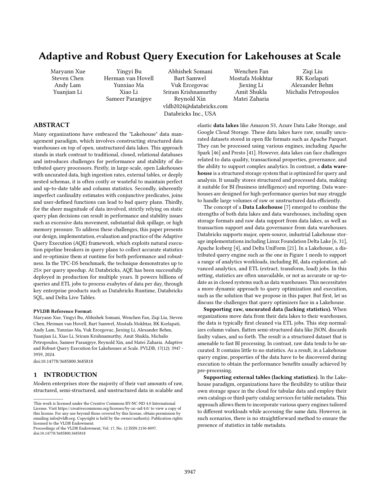
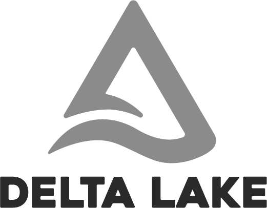
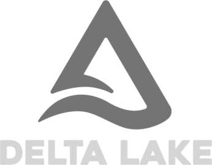
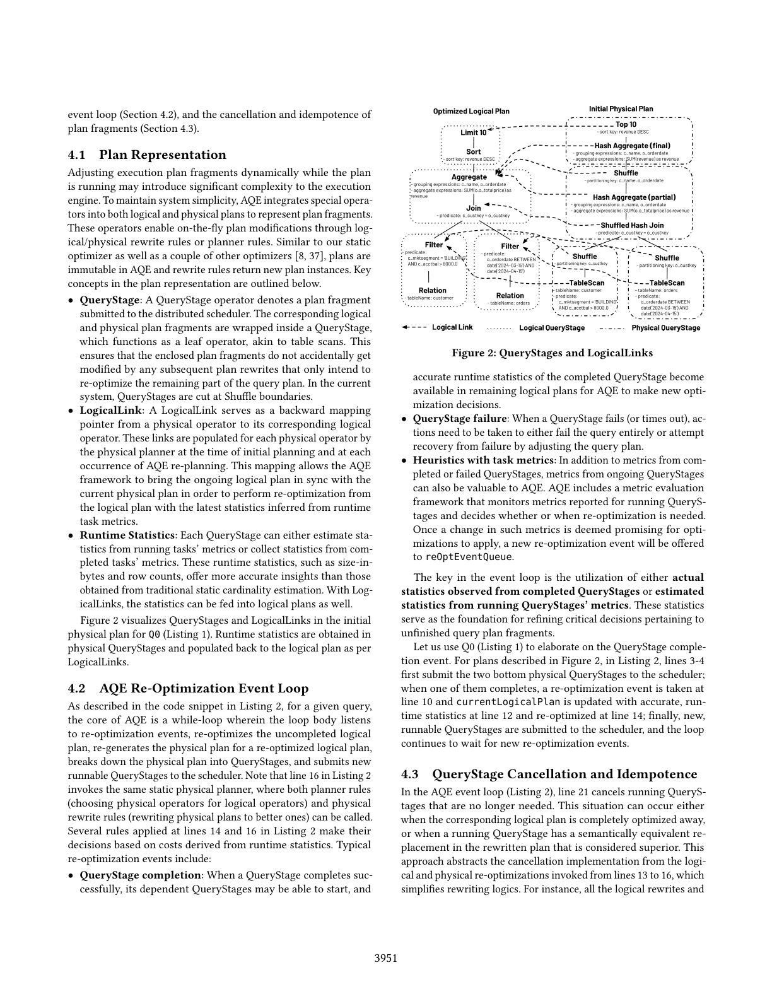
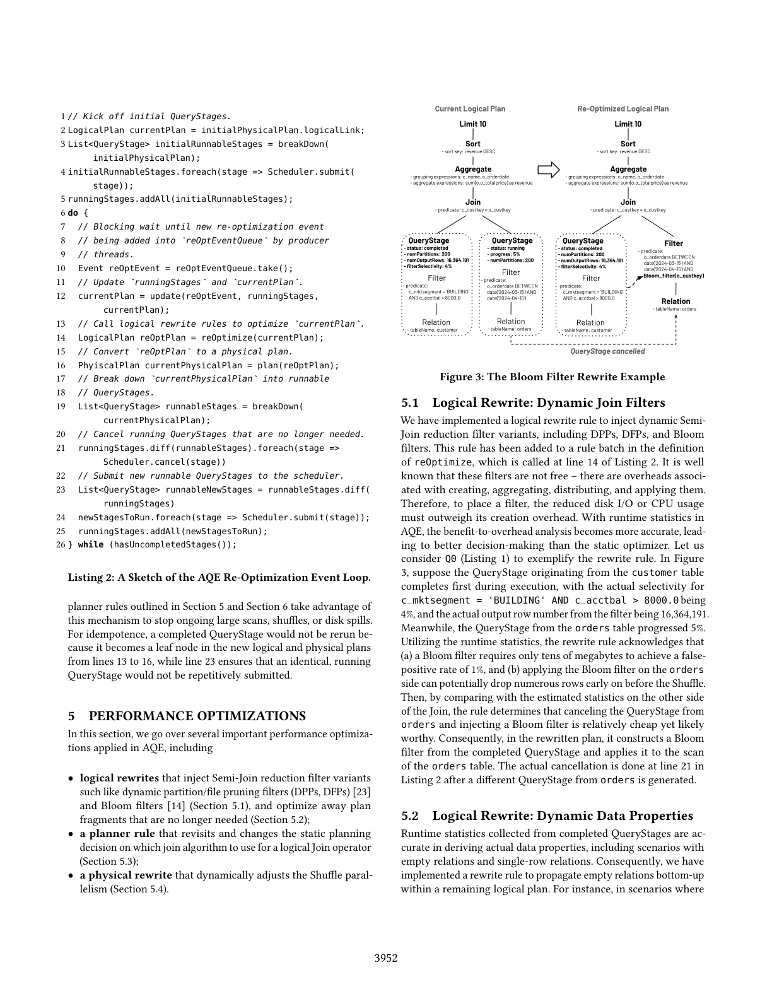
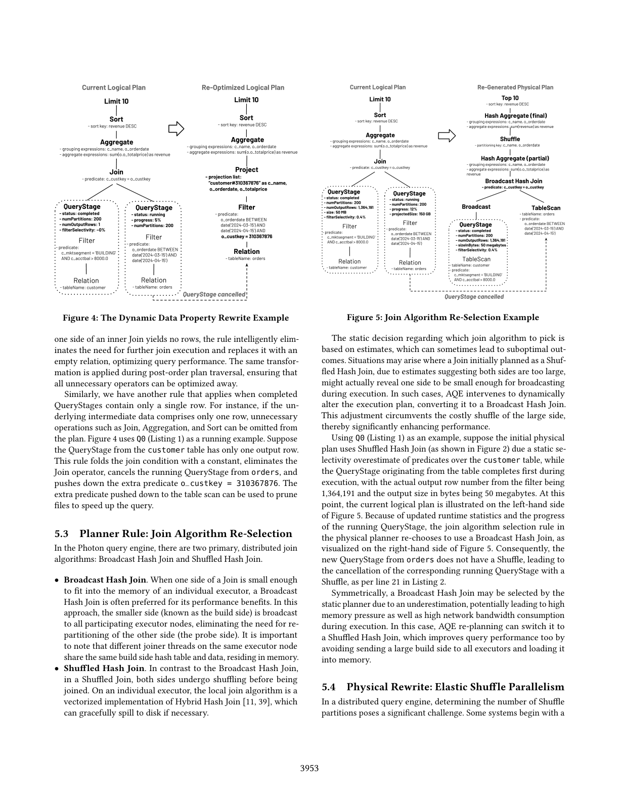
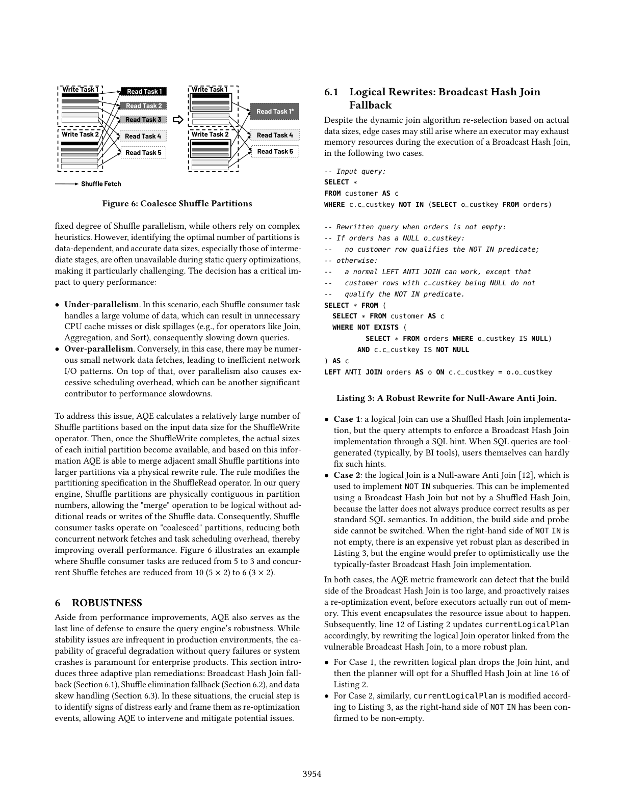
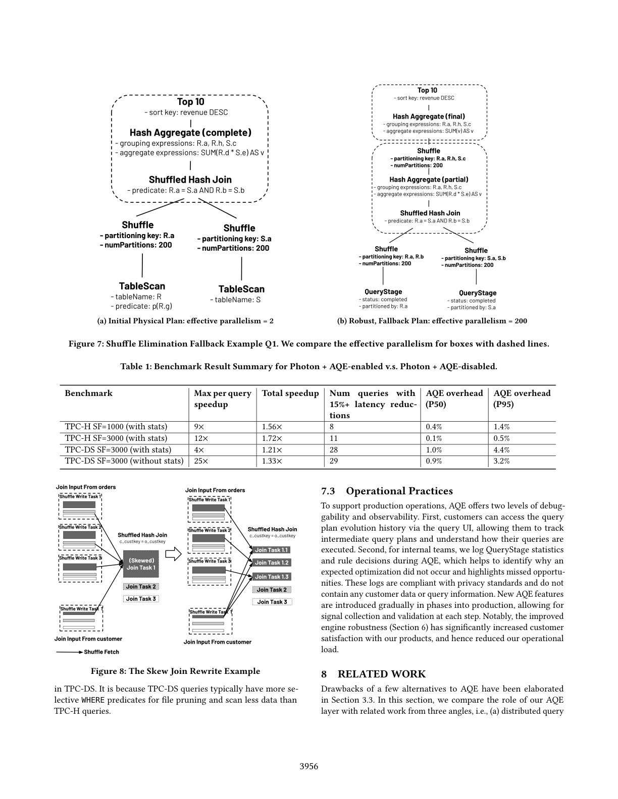
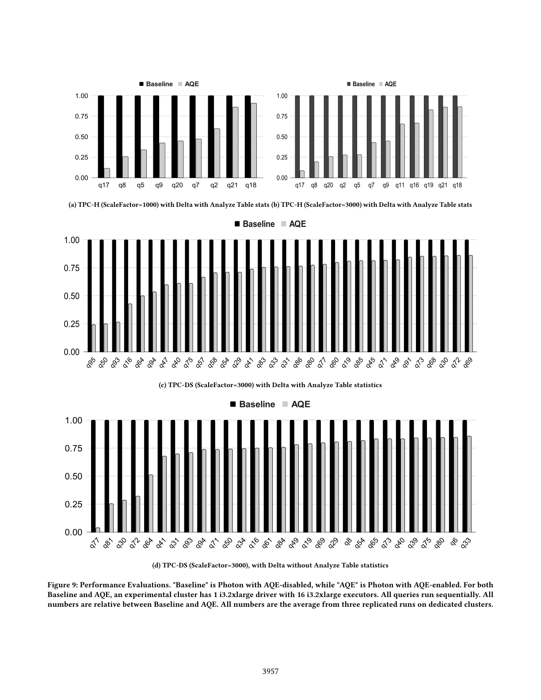

# Adaptive and Robust ery Execution for Lakehouses at Scale

> Convertido automaticamente de PDF para Markdown
>
> Arquivo original: `referencias/Adaptive and Robust ery Execution for Lakehouses at Scale.pdf`
> Data de conversão: 22/08/2026 13:04:10
> Imagens extraídas: 12 arquivo(s)

---

Adaptive and Robust Qery Execution for Lakehouses at Scale

Maryann Xue

Yingyi Bu

Abhishek Somani

Wenchen Fan

Ziqi Liu

Steven Chen

Herman van Hovell

Bart Samwel

Mostafa Mokhtar

RK Korlapati

Andy Lam

Yunxiao Ma

Vuk Ercegovac

Jiexing Li

Alexander Behm

Yuanjian Li

Xiao Li

Sriram Krishnamurthy

Amit Shukla

Michalis Petropoulos

Sameer Paranjpye

Reynold Xin

vldb2024@databricks.com

Databricks Inc., USA

Matei Zaharia

ABSTRACT

Many organizations have embraced the "Lakehouse" data man-

agement paradigm, which involves constructing structured data

warehouses on top of open, unstructured data lakes. This approach

stands in stark contrast to traditional, closed, relational databases

and introduces challenges for performance and stability of dis-

tributed query processors. Firstly, in large-scale, open Lakehouses

with uncurated data, high ingestion rates, external tables, or deeply

nested schemas, it is often costly or wasteful to maintain perfect

and up-to-date table and column statistics. Secondly, inherently

imperfect cardinality estimates with conjunctive predicates, joins

and user-de&#xfb01;ned functions can lead to bad query plans. Thirdly,

for the sheer magnitude of data involved, strictly relying on static

query plan decisions can result in performance and stability issues

such as excessive data movement, substantial disk spillage, or high

memory pressure. To address these challenges, this paper presents

our design, implementation, evaluation and practice of the Adaptive

Query Execution (AQE) framework, which exploits natural execu-

tion pipeline breakers in query plans to collect accurate statistics

and re-optimize them at runtime for both performance and robust-

ness. In the TPC-DS benchmark, the technique demonstrates up to

25&#xd7; per query speedup. At Databricks, AQE has been successfully

deployed in production for multiple years. It powers billions of

queries and ETL jobs to process exabytes of data per day, through

key enterprise products such as Databricks Runtime, Databricks

SQL, and Delta Live Tables.

PVLDB Reference Format:

Maryann Xue, Yingyi Bu, Abhishek Somani, Wenchen Fan, Ziqi Liu, Steven

Chen, Herman van Hovell, Bart Samwel, Mostafa Mokhtar, RK Korlapati,

Andy Lam, Yunxiao Ma, Vuk Ercegovac, Jiexing Li, Alexander Behm,

Yuanjian Li, Xiao Li, Sriram Krishnamurthy, Amit Shukla, Michalis

Petropoulos, Sameer Paranjpye, Reynold Xin, and Matei Zaharia. Adaptive

and Robust Query Execution for Lakehouses at Scale. PVLDB, 17(12): 3947 -

3959, 2024.

doi:10.14778/3685800.3685818

1

INTRODUCTION

Modern enterprises store the majority of their vast amounts of raw,

structured, semi-structured, and unstructured data in scalable and

This work is licensed under the Creative Commons BY-NC-ND 4.0 International

License. Visit https://creativecommons.org/licenses/by-nc-nd/4.0/ to view a copy of

this license. For any use beyond those covered by this license, obtain permission by

emailing info@vldb.org. Copyright is held by the owner/author(s). Publication rights

licensed to the VLDB Endowment.

Proceedings of the VLDB Endowment, Vol. 17, No. 12 ISSN 2150-8097.

doi:10.14778/3685800.3685818

elastic data lakes like Amazon S3, Azure Data Lake Storage, and

Google Cloud Storage. These data lakes have raw, usually uncu-

rated datasets stored in open &#xfb01;le formats such as Apache Parquet.

They can be processed using various engines, including Apache

Spark [46] and Presto [41]. However, data lakes can face challenges

related to data quality, transactional properties, governance, and

the ability to support complex analytics. In contrast, a data ware-

house is a structured storage system that is optimized for query and

analysis. It usually stores structured and processed data, making

it suitable for BI (business intelligence) and reporting. Data ware-

houses are designed for high-performance queries but may struggle

to handle large volumes of raw or unstructured data e&#xfb03;ciently.

The concept of a Data Lakehouse [7] emerged to combine the

strengths of both data lakes and data warehouses, including open

storage formats and raw data support from data lakes, as well as

transaction support and data governance from data warehouses.

Databricks supports major, open-source, industrial Lakehouse stor-

age implementations including Linux Foundation Delta Lake [6, 31],

Apache Iceberg [4], and Delta UniForm [21]. In a Lakehouse, a dis-

tributed query engine such as the one in Figure 1 needs to support

a range of analytics workloads, including BI, data exploration, ad-

vanced analytics, and ETL (extract, transform, load) jobs. In this

setting, statistics are often unavailable, or not as accurate or up-to-

date as in closed systems such as data warehouses. This necessitates

a more dynamic approach to query optimization and execution,

such as the solution that we propose in this paper. But &#xfb01;rst, let us

discuss the challenges that query optimizers face in a Lakehouse.

Supporting raw, uncurated data (lacking statistics). When

organizations move data from their data lakes to their warehouses,

the data is typically &#xfb01;rst cleaned via ETL jobs. This step normal-

izes column values, &#xfb02;atten semi-structured data like JSON, discards

faulty values, and so forth. The result is a structured dataset that is

amenable to fast BI processing. In contrast, raw data tends to be un-

curated. It contains little to no statistics. As a result, in a Lakehouse

query engine, properties of the data have to be discovered during

execution to obtain the performance bene&#xfb01;ts usually achieved by

pre-processing.

Supporting external tables (lacking statistics). In the Lake-

house paradigm, organizations have the &#xfb02;exibility to utilize their

own storage space in the cloud for tabular data and employ their

own catalogs or third-party catalog services for table metadata. This

approach allows them to incorporate various query engines tailored

to di&#xfb00;erent workloads while accessing the same data. However, in

such scenarios, there is no straightforward method to ensure the

presence of statistics in table metadata.

3947

---

Figure 1: Databricks&#x2019; Lakehouse architecture. The AQE layer sits between Query Optimizer and Distributed Scheduler, runs

as part of the Photon distributed query engine. The query engine executes queries on a distributed cluster of public cloud

instances, while AQE drives the execution of decomposed fragments of a query plan.

Supporting deeply nested data (lacking statistics). Nested,

de-normalized schemas are becoming increasingly popular in both

raw and curated datasets because of the enhanced readability by

reducing complex joins. Data types like arrays, maps, and structs,

as well as their arbitrary recursive combinations, are extensively

employed by organizations. Such deeply nested &#xfb01;elds are typically

accessed after unnesting operations and can be referenced in op-

erators like Filter, Join and Aggregation. Gathering statistics for

hundreds to thousands of deeply nested &#xfb01;elds within arrays, structs,

and maps, and subsequently representing them in a catalog, is often

expensive and unpractical.

Supporting rapidly evolving data and workloads (stale sta-

tistics and volatile histories). In many organizations, data from

their products are ingested at an astonishing speed into the Lake-

house. Thus, maintaining up-to-date statistics like histograms of

individual table columns is resource consuming. Furthermore, work-

loads can burst or dip from time to time without a clear repetitive

pattern. Therefore, learning statistics from historical queries is not

always feasible.

Supporting UDFs (lacking information for cardinality es-

timation). The widespread adoption of user-de&#xfb01;ned functions

(UDFs), including user-de&#xfb01;ned scalar functions, user-de&#xfb01;ned aggre-

gation functions (UDAFs) and user-de&#xfb01;ned table-valued functions

(TVFs) within our platform, underscores their importance in cus-

tomer workloads. However, UDFs present a challenge for accurate

cardinality estimation and cost modeling, because they operate as

black boxes to the query optimizer.

Supporting diverse workloads (amplifying bad plans). In a

Lakehouse, table sizes range from Megabytes to Petabytes. Thus, an

optimizer overestimate may cause a miss of a key optimization so

that a query can runs into a timeout, e.g., when shu&#xfb04;ing a massive

amount of data; an underestimate may result in an aggressive query

plan which may lead to unnecessary, high memory pressure or disk

spillage.

To address these challenges, we built an adaptive query execu-

tion (AQE) framework. The key idea is to collect statistics during

query execution from task metrics of completed and ongoing query

plan fragments, and subsequently re-optimize un&#xfb01;nished execution

plan fragments into better ones based on these runtime statistics.

The AQE layer, depicted in Figure 1, is placed between static query

optimizer and distributed scheduler. It incorporates key innova-

tions in plan representation (Section 4.1), event-driven architecture

(Section 4.2), a cancellation primitive (Section 4.3), and leveraged

performance and robustness opportunities in distributed query

processing (Section 5 and 6). As a result, AQE delivers up to 25&#xd7;

individual query speedup for standard TPC benchmark queries as

well as up to 1.7&#xd7; total speedup per benchmark (see Section 7), on

top of our vectorized Photon execution engine [11]. Today, AQE has

been enabled by default in all Databricks production environments,

supporting billions of diverse Lakehouse queries and ETL jobs per

day with latencies ranging from tens of milliseconds to a few hours.

While the idea of dynamic query optimization has been explored in

earlier research prototypes [28, 33, 36, 43, 44], we believe this paper

3948

---

describes one of the largest successful, industrial deployments at

scale.

In the rest of this paper, we describe the background of Lake-

house and Photon in Section 2, and detail our motivations for AQE

in Section 3; Section 4 presents the AQE framework; Section 5 ex-

plains a few important performance optimizations while Section 6

elaborates how AQE makes the query execution robust; we then

present quantitative performance evaluations as well as our opera-

tional practices with AQE in Section 7; &#xfb01;nally, we discuss related

work in Section 8 and conclude the paper in Section 9.

2

BACKGROUND

This section brie&#xfb02;y introduces the background that AQE &#xfb01;ts into,

including an overview of the Lakehouse and the Photon query

engine.

2.1

Data Lakehouse

By combining the strengths of data lakes and data warehouses,

a Data Lakehouse [7] aims to provide a more &#xfb02;exible, scalable,

and cost-e&#xfb00;ective solution for managing and analyzing diverse

data sets in modern data-driven environments. This concept has

gained popularity as organizations seek ways to harness the full

potential of their data assets with one simple platform. As a result,

the majority of Databricks customers have been using Delta or

Delta UniForm for their data. Key advantages of a data Lakehouse

include:

&#x2022; Uni&#xfb01;ed, open storage. A Lakehouse typically uses a uni&#xfb01;ed

storage system with an open data format that can accommodate

both raw, unprocessed data (similar to a data lake) and structured,

processed data (similar to a data warehouse). In an industrial

Lakehouse, the open-source Parquet format is used for both data

and metadata. This way, organizations can use any compute

engines to query or run machine learning models over their

existing data rather than loading the data into a warehouse.

&#x2022; Automatic data management. Like data warehouses, a Lake-

house typically o&#xfb00;ers an ACID table storage layer over cloud

object stores. In our case, both Delta Lake and Delta UniForm

enable warehouse-style features such as ACID transactions, time

travel, audit logging, and fast metadata operations over tabular

datasets.

&#x2022; Data governance. Unlike an ad-hoc data lake, a Lakehouse in-

corporates data governance and metadata management, through

a catalog service, to ensure the quality, security, and compliance

of the data. The catalog service could be run at any third party

outside of the core storage and compute.

&#x2022; Elastic and e&#xfb03;cient query processing. In a Lakehouse with

diverse workloads, an instance of a distributed query engine

(a.k.a. computer cluster) can be created based as-needed to exe-

cute those workloads so as to save costs. The adaptive and robust

query execution described in this paper &#xfb01;ts into this layer in the

Lakehouse stack.

Figure 1 gives a high-level view of query engine, catalog service,

and the Lakehouse storage.

2.2

The Databricks Photon Query Engine

Photon [11], which started as a vectorized, single-thread query

execution library, has evolved into a full-&#xfb02;edged, new-generation,

distributed query engine powering Databricks&#x2019; major products in-

cluding Databricks Runtime, Databricks SQL, and Delta Live Tables.

As illustrated in Figure 1, inputs to the Photon query engine consist

of unresolved logical plans generated from SQL texts, Python/Scala

DataFrame programs, or Pandas programs. The analyzer retrieves

table metadata from catalog services, performs semantic analysis,

and converts an unresolved logical plan into a resolved logical plan.

Next, the static optimizer rewrites the resolved logical plan into

an optimized logical plan and converts it into an initial physical

plan. The scheduler assigns execution tasks, which are parallel in-

stances of a physical plan fragment, to run on executors. Within

each task, vectorized execution operators and expression evaluators

are invoked to process data. Unlike most other query engines, the

Photon engine incorporates an AQE (adaptive query execution)

framework positioned between the static optimizer and scheduler.

Upon receiving an initial physical plan from the optimizer, AQE

divides the plan into fragments, orchestrates their execution with

dependencies, monitors their progress, and continuously adjusts

uncompleted plan fragments based on runtime metrics from the

execution tasks.

3

PROBLEMS AND ALTERNATIVES

In this section, we go over critical query plan decisions in a dis-

tributed, Lakehouse query engine (Section 3.1), a running example

with AQE (Section 3.2), and a detailed comparison with alternative

approaches (Section 3.3).

3.1

Key Query Plan Decisions

In a distributed query engine, the query optimizer typically makes

the following decisions, which are critical to individual query&#x2019;s

performance as well as the engine&#x2019;s stability.

&#x2022; Physical operator selections. Broadcast Join and Shu&#xfb04;ed Join

are two typical distributed Join algorithms. They have very dif-

ferent performance characteristics. A misplacement could cause

severe performance or even stability issues, e.g., either unneces-

sarily shu&#xfb04;ing huge amounts of data or mistakenly broadcasting

a huge amount of data to all executors.

&#x2022; Degrees of parallelism. Determining the optimal degree of

parallelism, including both Scan and Shu&#xfb04;e parallelism, remains

challenging in distributed query processing. Poorly chosen paral-

lelism can lead to severe issues; for example, excessive parallelism

can overload and throttle the task scheduler.

&#x2022; Trade-o&#xfb00;s based on data volume. In our Photon engine, we

have developed several Semi-Join reduction &#xfb01;lter variants, such

as dynamic partition/&#xfb01;le pruning &#xfb01;lters [23] and Bloom &#xfb01;lters [14]

to not only speedup individual joins but also remedy imperfect

join orders. However, due to &#xfb01;lter creation costs, the choice of

these &#xfb01;lters is often a data-dependent decision.

&#x2022; Optimizations based on dynamic data properties. A set of

query optimizations are subject to data properties such as empty

intermediate relations, single-row relations, partitioning proper-

ties, and interesting orders. Oftentimes, such data properties can

only be discovered during query execution.

3949

---

&#x2022; Graceful degradation strategies. Situations due to unantic-

ipated data, e.g., skew or intermediate data bloat, might cause

queries to either run into a timeout (e.g., hours, days) or result

in memory pressure in executors. Therefore, the optimizer may

need to balance performance and stability.

3.2

Example Query

In the rest of this paper, we will use the example SQL query with the

TPC-H schema in Listing 1 (Q0) as a running example to elaborate

problems, concepts, ideas and optimizations. For Q0, key problems

adaptive query execution (AQE) tries to tackle include the following.

**SELECT** c.c_name,

o.o_orderdate,

**SUM**(o.o_totalprice)** AS** revenue

**FROM** customer** AS** c, orders** AS** o

**WHERE** c.c_mktsegment = &apos;BUILDING&apos;

**AND** c.c_acctbal > 8000.0

**AND** c.c_custkey = o.o_custkey

**AND** o.o_orderdate** BETWEEN date**(&apos;2024-03-15&apos;)

**AND date**(&apos;2024-04-15&apos;)

**GROUP BY** c.c_name, o.o_orderdate

**ORDER BY** revenue** DESC**

**LIMIT** 10

Listing 1: Q0: an example SQL query.

&#x2022; What is the number of rows from the customer table qualifying

the two WHERE predicates, and what is the corresponding size-

in-bytes? (Section 4.1.)

&#x2022; Should we apply Semi-Join reduction &#xfb01;lter variants, namely, a

dynamic &#xfb01;le pruning &#xfb01;lter or a Bloom &#xfb01;lter? (Section 5.1.)

&#x2022; How can we leverage dynamic data properties discovered during

execution time to perform further query optimizations? (Sec-

tion 5.2.)

&#x2022; Which join algorithm should be used? (Section 5.3.)

&#x2022; What should be a proper degree-of-parallelism to run the query?

(Section 5.4.)

&#x2022; How should cases like skew and memory pressure be mitigated,

for unanticipated, extreme data? (Section 6.)

3.3

Alternatives to AQE

Static query optimizers rely on stored catalog statistics (e.g., ob-

tained from the Analyze Table command), cardinality estimation,

and a cost model (a.k.a., a function of cardinality and plan), to make

aforementioned planning decisions. A viable alternative to adaptive

query execution is to enhance the accuracy of statistics, cardinality

estimation, and cost modeling. However, despite decades of e&#xfb00;orts

within the database community, cardinality estimations remain

challenging in traditional database systems [32].

Cardinality estimation. Column-level statistics such as the

number of distinct values and histograms can provide good esti-

mates for a local, binary comparison predicate directly over a table

column, yet estimation errors may arise in the case of conjunc-

tive predicates, predicates with UDFs, and join predicates. Further,

errors may amplify on complex query plans with multiple such

predicates. A "famous" cardinality estimation heuristic in System

R [38] is that any equality &#xfb01;lter predicate over an un-indexed table

column by default reduces input cardinality to 1/10. Modern opti-

mizers still have similar heuristics when they lack information. For

instance, the open-source Catalyst optimizer [8] uses the worst-case

cardinality as an estimate when information is unavailable.

Physical plan cost models. A traditional Cascades-style plan-

ner [25] usually requires a numeric physical plan cost to do search

space prioritization, alternative plan comparison, branch-and-bound,

and pruning. As mentioned in literature [32], cost models tend to

have smaller errors than cardinality estimates. However, a "perfect"

cost model still has to be kept in sync with the evolution of query

execution and hardware characteristics over time.

Below, we delve into several alternative approaches along the

lines of improving static optimizer cardinality estimates for the

Lakehouse challenges mentioned in Section 1.

&#x2022; Sampling. There has been a &#xfb02;urry of research literature [1, 17,

18] attempting to leverage sampling, including random samples,

online samples, block samples, materialized samples, and strati-

&#xfb01;ed samples to make cardinality estimation better. In practice,

they could be e&#xfb00;ective for speci&#xfb01;c scenarios, e.g., random sam-

ples for uniformly distributed data, and strati&#xfb01;ed samples [1] for

predicates over strata columns. Nevertheless, there is an inher-

ent trade-o&#xfb00;between the expense of sample collection and its

e&#xfb00;ectiveness.

&#x2022; History-based cardinality estimation like the LEO proto-

type [40] may work for repetitive query workloads in a relatively

closed environment that compute and history-store are bundled

together in a single cluster instance. However, the Lakehouse ar-

chitecture operates at a larger scale with higher elasticity, which

requires a dis-aggregation of compute, storage and catalog. Thus,

building a separate history-store service in the control plane

might pose non-trivial engineering challenges such as binary

compatibility and RPC latency.

&#x2022; Machine learning could be a promising direction to make esti-

mates more accurate. However, in order to deploy it in produc-

tion, there is still substantial engineering work to tune models,

in addition to challenges like debuggability and interpretability.

Note that the adaptive query execution described in this paper

requires the existence of synchronous pipeline breakers during the

distributed execution of a query, such that re-optimizations can

kick in and be e&#xfb00;ective. Some query engines have such breakers in

the way they implement DAG (directed acyclic graph) Scheduler,

Task Scheduler, Shu&#xfb04;e, Join, Aggregation, and Sort; others may

lack it by design. In our Photon engine, the Shu&#xfb04;e implementation

has such a breaker, originally for the simplicity of task scheduling

and fault-tolerance. Thus, AQE is a natural &#xfb01;t. At a high level, AQE

and advancements in its alternatives are largely complementary

in their evolutions. Better static query plans may eventually relax

constraints on the query execution substrate, while AQE provides

the ultimate safeguard to experiment with its alternatives. Based on

these observations several years ago, we prioritized and executed

an adaptive query processing strategy.

4

THE AQE FRAMEWORK

In this section, we present the AQE framework by introducing the

representation of plan fragments (Section 4.1), the re-optimization

3950

---

event loop (Section 4.2), and the cancellation and idempotence of

plan fragments (Section 4.3).

4.1

Plan Representation

Adjusting execution plan fragments dynamically while the plan

is running may introduce signi&#xfb01;cant complexity to the execution

engine. To maintain system simplicity, AQE integrates special opera-

tors into both logical and physical plans to represent plan fragments.

These operators enable on-the-&#xfb02;y plan modi&#xfb01;cations through log-

ical/physical rewrite rules or planner rules. Similar to our static

optimizer as well as a couple of other optimizers [8, 37], plans are

immutable in AQE and rewrite rules return new plan instances. Key

concepts in the plan representation are outlined below.

&#x2022; QueryStage: A QueryStage operator denotes a plan fragment

submitted to the distributed scheduler. The corresponding logical

and physical plan fragments are wrapped inside a QueryStage,

which functions as a leaf operator, akin to table scans. This

ensures that the enclosed plan fragments do not accidentally get

modi&#xfb01;ed by any subsequent plan rewrites that only intend to

re-optimize the remaining part of the query plan. In the current

system, QueryStages are cut at Shu&#xfb04;e boundaries.

&#x2022; LogicalLink: A LogicalLink serves as a backward mapping

pointer from a physical operator to its corresponding logical

operator. These links are populated for each physical operator by

the physical planner at the time of initial planning and at each

occurrence of AQE re-planning. This mapping allows the AQE

framework to bring the ongoing logical plan in sync with the

current physical plan in order to perform re-optimization from

the logical plan with the latest statistics inferred from runtime

task metrics.

&#x2022; Runtime Statistics: Each QueryStage can either estimate sta-

tistics from running tasks&#x2019; metrics or collect statistics from com-

pleted tasks&#x2019; metrics. These runtime statistics, such as size-in-

bytes and row counts, o&#xfb00;er more accurate insights than those

obtained from traditional static cardinality estimation. With Log-

icalLinks, the statistics can be fed into logical plans as well.

Figure 2 visualizes QueryStages and LogicalLinks in the initial

physical plan for Q0 (Listing 1). Runtime statistics are obtained in

physical QueryStages and populated back to the logical plan as per

LogicalLinks.

4.2

AQE Re-Optimization Event Loop

As described in the code snippet in Listing 2, for a given query,

the core of AQE is a while-loop wherein the loop body listens

to re-optimization events, re-optimizes the uncompleted logical

plan, re-generates the physical plan for a re-optimized logical plan,

breaks down the physical plan into QueryStages, and submits new

runnable QueryStages to the scheduler. Note that line 16 in Listing 2

invokes the same static physical planner, where both planner rules

(choosing physical operators for logical operators) and physical

rewrite rules (rewriting physical plans to better ones) can be called.

Several rules applied at lines 14 and 16 in Listing 2 make their

decisions based on costs derived from runtime statistics. Typical

re-optimization events include:

&#x2022; QueryStage completion: When a QueryStage completes suc-

cessfully, its dependent QueryStages may be able to start, and

Figure 2: QueryStages and LogicalLinks

accurate runtime statistics of the completed QueryStage become

available in remaining logical plans for AQE to make new opti-

mization decisions.

&#x2022; QueryStage failure: When a QueryStage fails (or times out), ac-

tions need to be taken to either fail the query entirely or attempt

recovery from failure by adjusting the query plan.

&#x2022; Heuristics with task metrics: In addition to metrics from com-

pleted or failed QueryStages, metrics from ongoing QueryStages

can also be valuable to AQE. AQE includes a metric evaluation

framework that monitors metrics reported for running QueryS-

tages and decides whether or when re-optimization is needed.

Once a change in such metrics is deemed promising for opti-

mizations to apply, a new re-optimization event will be o&#xfb00;ered

to reOptEventQueue.

The key in the event loop is the utilization of either actual

statistics observed from completed QueryStages or estimated

statistics from running QueryStages&#x2019; metrics. These statistics

serve as the foundation for re&#xfb01;ning critical decisions pertaining to

un&#xfb01;nished query plan fragments.

Let us use Q0 (Listing 1) to elaborate on the QueryStage comple-

tion event. For plans described in Figure 2, in Listing 2, lines 3-4

&#xfb01;rst submit the two bottom physical QueryStages to the scheduler;

when one of them completes, a re-optimization event is taken at

line 10 and currentLogicalPlan is updated with accurate, run-

time statistics at line 12 and re-optimized at line 14; &#xfb01;nally, new,

runnable QueryStages are submitted to the scheduler, and the loop

continues to wait for new re-optimization events.

4.3

QueryStage Cancellation and Idempotence

In the AQE event loop (Listing 2), line 21 cancels running QueryS-

tages that are no longer needed. This situation can occur either

when the corresponding logical plan is completely optimized away,

or when a running QueryStage has a semantically equivalent re-

placement in the rewritten plan that is considered superior. This

approach abstracts the cancellation implementation from the logi-

cal and physical re-optimizations invoked from lines 13 to 16, which

simpli&#xfb01;es rewriting logics. For instance, all the logical rewrites and

3951

---

1* // Kick off initial QueryStages.*

2 LogicalPlan currentPlan = initialPhysicalPlan.logicalLink;

3 List<QueryStage> initialRunnableStages = breakDown(

initialPhysicalPlan);

4 initialRunnableStages.foreach(stage => Scheduler.submit(

stage));

5 runningStages.addAll(initialRunnableStages);

6** do** {

7

*// Blocking wait until new re-optimization event*

8

*// being added into* `*reOptEventQueue*`* by producer*

9

*// threads.*

10

Event reOptEvent = reOptEventQueue.take();

11

*// Update* `*runningStages*`* and* `*currentPlan*`*.*

12

currentPlan = update(reOptEvent, runningStages,

currentPlan);

13

*// Call logical rewrite rules to optimize* `*currentPlan*`*.*

14

LogicalPlan reOptPlan = reOptimize(currentPlan);

15

*// Convert* `*reOptPlan*`* to a physical plan.*

16

PhyiscalPlan currentPhysicalPlan = plan(reOptPlan);

17

*// Break down* `*currentPhysicalPlan*`* into runnable*

18

*// QueryStages.*

19

List<QueryStage> runnableStages = breakDown(

currentPhysicalPlan);

20

*// Cancel running QueryStages that are no longer needed.*

21

runningStages.diff(runnableStages).foreach(stage =>

Scheduler.cancel(stage))

22

*// Submit new runnable QueryStages to the scheduler.*

23

List<QueryStage> runnableNewStages = runnableStages.diff(

runningStages)

24

newStagesToRun.foreach(stage => Scheduler.submit(stage));

25

runningStages.addAll(newStagesToRun);

26 }** while** (hasUncompletedStages());

Listing 2: A Sketch of the AQE Re-Optimization Event Loop.

planner rules outlined in Section 5 and Section 6 take advantage of

this mechanism to stop ongoing large scans, shu&#xfb04;es, or disk spills.

For idempotence, a completed QueryStage would not be rerun be-

cause it becomes a leaf node in the new logical and physical plans

from lines 13 to 16, while line 23 ensures that an identical, running

QueryStage would not be repetitively submitted.

5

PERFORMANCE OPTIMIZATIONS

In this section, we go over several important performance optimiza-

tions applied in AQE, including

&#x2022; logical rewrites that inject Semi-Join reduction &#xfb01;lter variants

such like dynamic partition/&#xfb01;le pruning &#xfb01;lters (DPPs, DFPs) [23]

and Bloom &#xfb01;lters [14] (Section 5.1), and optimize away plan

fragments that are no longer needed (Section 5.2);

&#x2022; a planner rule that revisits and changes the static planning

decision on which join algorithm to use for a logical Join operator

(Section 5.3);

&#x2022; a physical rewrite that dynamically adjusts the Shu&#xfb04;e paral-

lelism (Section 5.4).

Figure 3: The Bloom Filter Rewrite Example

5.1

Logical Rewrite: Dynamic Join Filters

We have implemented a logical rewrite rule to inject dynamic Semi-

Join reduction &#xfb01;lter variants, including DPPs, DFPs, and Bloom

&#xfb01;lters. This rule has been added to a rule batch in the de&#xfb01;nition

of reOptimize, which is called at line 14 of Listing 2. It is well

known that these &#xfb01;lters are not free &#x2013; there are overheads associ-

ated with creating, aggregating, distributing, and applying them.

Therefore, to place a &#xfb01;lter, the reduced disk I/O or CPU usage

must outweigh its creation overhead. With runtime statistics in

AQE, the bene&#xfb01;t-to-overhead analysis becomes more accurate, lead-

ing to better decision-making than the static optimizer. Let us

consider Q0 (Listing 1) to exemplify the rewrite rule. In Figure

3, suppose the QueryStage originating from the customer table

completes &#xfb01;rst during execution, with the actual selectivity for

c_mktsegment = &apos;BUILDING&apos; AND c_acctbal > 8000.0 being

4%, and the actual output row number from the &#xfb01;lter being 16,364,191.

Meanwhile, the QueryStage from the orders table progressed 5%.

Utilizing the runtime statistics, the rewrite rule acknowledges that

(a) a Bloom &#xfb01;lter requires only tens of megabytes to achieve a false-

positive rate of 1%, and (b) applying the Bloom &#xfb01;lter on the orders

side can potentially drop numerous rows early on before the Shu&#xfb04;e.

Then, by comparing with the estimated statistics on the other side

of the Join, the rule determines that canceling the QueryStage from

orders and injecting a Bloom &#xfb01;lter is relatively cheap yet likely

worthy. Consequently, in the rewritten plan, it constructs a Bloom

&#xfb01;lter from the completed QueryStage and applies it to the scan

of the orders table. The actual cancellation is done at line 21 in

Listing 2 after a di&#xfb00;erent QueryStage from orders is generated.

5.2

Logical Rewrite: Dynamic Data Properties

Runtime statistics collected from completed QueryStages are ac-

curate in deriving actual data properties, including scenarios with

empty relations and single-row relations. Consequently, we have

implemented a rewrite rule to propagate empty relations bottom-up

within a remaining logical plan. For instance, in scenarios where

3952

---

Figure 4: The Dynamic Data Property Rewrite Example

one side of an inner Join yields no rows, the rule intelligently elim-

inates the need for further join execution and replaces it with an

empty relation, optimizing query performance. The same transfor-

mation is applied during post-order plan traversal, ensuring that

all unnecessary operators can be optimized away.

Similarly, we have another rule that applies when completed

QueryStages contain only a single row. For instance, if the un-

derlying intermediate data comprises only one row, unnecessary

operations such as Join, Aggregation, and Sort can be omitted from

the plan. Figure 4 uses Q0 (Listing 1) as a running example. Suppose

the QueryStage from the customer table has only one output row.

This rule folds the join condition with a constant, eliminates the

Join operator, cancels the running QueryStage from orders, and

pushes down the extra predicate o_custkey = 310367876. The

extra predicate pushed down to the table scan can be used to prune

&#xfb01;les to speed up the query.

5.3

Planner Rule: Join Algorithm Re-Selection

In the Photon query engine, there are two primary, distributed join

algorithms: Broadcast Hash Join and Shu&#xfb04;ed Hash Join.

&#x2022; Broadcast Hash Join. When one side of a Join is small enough

to &#xfb01;t into the memory of an individual executor, a Broadcast

Hash Join is often preferred for its performance bene&#xfb01;ts. In this

approach, the smaller side (known as the build side) is broadcast

to all participating executor nodes, eliminating the need for re-

partitioning of the other side (the probe side). It is important

to note that di&#xfb00;erent joiner threads on the same executor node

share the same build side hash table and data, residing in memory.

&#x2022; Shu&#xfb00;led Hash Join. In contrast to the Broadcast Hash Join,

in a Shu&#xfb04;ed Join, both sides undergo shu&#xfb04;ing before being

joined. On an individual executor, the local join algorithm is a

vectorized implementation of Hybrid Hash Join [11, 39], which

can gracefully spill to disk if necessary.

Figure 5: Join Algorithm Re-Selection Example

The static decision regarding which join algorithm to pick is

based on estimates, which can sometimes lead to suboptimal out-

comes. Situations may arise where a Join initially planned as a Shuf-

&#xfb02;ed Hash Join, due to estimates suggesting both sides are too large,

might actually reveal one side to be small enough for broadcasting

during execution. In such cases, AQE intervenes to dynamically

alter the execution plan, converting it to a Broadcast Hash Join.

This adjustment circumvents the costly shu&#xfb04;e of the large side,

thereby signi&#xfb01;cantly enhancing performance.

Using Q0 (Listing 1) as an example, suppose the initial physical

plan uses Shu&#xfb04;ed Hash Join (as shown in Figure 2) due a static se-

lectivity overestimate of predicates over the customer table, while

the QueryStage originating from the table completes &#xfb01;rst during

execution, with the actual output row number from the &#xfb01;lter being

1,364,191 and the output size in bytes being 50 megabytes. At this

point, the current logical plan is illustrated on the left-hand side

of Figure 5. Because of updated runtime statistics and the progress

of the running QueryStage, the join algorithm selection rule in

the physical planner re-chooses to use a Broadcast Hash Join, as

visualized on the right-hand side of Figure 5. Consequently, the

new QueryStage from orders does not have a Shu&#xfb04;e, leading to

the cancellation of the corresponding running QueryStage with a

Shu&#xfb04;e, as per line 21 in Listing 2.

Symmetrically, a Broadcast Hash Join may be selected by the

static planner due to an underestimation, potentially leading to high

memory pressure as well as high network bandwidth consumption

during execution. In this case, AQE re-planning can switch it to

a Shu&#xfb04;ed Hash Join, which improves query performance too by

avoiding sending a large build side to all executors and loading it

into memory.

5.4

Physical Rewrite: Elastic Shu&#xfb00;le Parallelism

In a distributed query engine, determining the number of Shu&#xfb04;e

partitions poses a signi&#xfb01;cant challenge. Some systems begin with a

3953

---

Figure 6: Coalesce Shu&#xfb00;le Partitions

&#xfb01;xed degree of Shu&#xfb04;e parallelism, while others rely on complex

heuristics. However, identifying the optimal number of partitions is

data-dependent, and accurate data sizes, especially those of interme-

diate stages, are often unavailable during static query optimizations,

making it particularly challenging. The decision has a critical im-

pact to query performance:

&#x2022; Under-parallelism. In this scenario, each Shu&#xfb04;e consumer task

handles a large volume of data, which can result in unnecessary

CPU cache misses or disk spillages (e.g., for operators like Join,

Aggregation, and Sort), consequently slowing down queries.

&#x2022; Over-parallelism. Conversely, in this case, there may be numer-

ous small network data fetches, leading to ine&#xfb03;cient network

I/O patterns. On top of that, over parallelism also causes ex-

cessive scheduling overhead, which can be another signi&#xfb01;cant

contributor to performance slowdowns.

To address this issue, AQE calculates a relatively large number of

Shu&#xfb04;e partitions based on the input data size for the Shu&#xfb04;eWrite

operator. Then, once the Shu&#xfb04;eWrite completes, the actual sizes

of each initial partition become available, and based on this infor-

mation AQE is able to merge adjacent small Shu&#xfb04;e partitions into

larger partitions via a physical rewrite rule. The rule modi&#xfb01;es the

partitioning speci&#xfb01;cation in the Shu&#xfb04;eRead operator. In our query

engine, Shu&#xfb04;e partitions are physically contiguous in partition

numbers, allowing the "merge" operation to be logical without ad-

ditional reads or writes of the Shu&#xfb04;e data. Consequently, Shu&#xfb04;e

consumer tasks operate on "coalesced" partitions, reducing both

concurrent network fetches and task scheduling overhead, thereby

improving overall performance. Figure 6 illustrates an example

where Shu&#xfb04;e consumer tasks are reduced from 5 to 3 and concur-

rent Shu&#xfb04;e fetches are reduced from 10 (5 &#xd7; 2) to 6 (3 &#xd7; 2).

6

ROBUSTNESS

Aside from performance improvements, AQE also serves as the

last line of defense to ensure the query engine&#x2019;s robustness. While

stability issues are infrequent in production environments, the ca-

pability of graceful degradation without query failures or system

crashes is paramount for enterprise products. This section intro-

duces three adaptive plan remediations: Broadcast Hash Join fall-

back (Section 6.1), Shu&#xfb04;e elimination fallback (Section 6.2), and data

skew handling (Section 6.3). In these situations, the crucial step is

to identify signs of distress early and frame them as re-optimization

events, allowing AQE to intervene and mitigate potential issues.

6.1

Logical Rewrites: Broadcast Hash Join

Fallback

Despite the dynamic join algorithm re-selection based on actual

data sizes, edge cases may still arise where an executor may exhaust

memory resources during the execution of a Broadcast Hash Join,

in the following two cases.

*-- Input query:*

**SELECT** *

**FROM** customer** AS** c

**WHERE** c.c_custkey** NOT IN** (**SELECT** o_custkey** FROM** orders)

*-- Rewritten query when orders is not empty:*

*-- If orders has a NULL o**_**custkey:*

*--*

*no customer row qualifies the NOT IN predicate;*

*-- otherwise:*

*--*

*a normal LEFT ANTI JOIN can work, except that*

*--*

*customer rows with c**_**custkey being NULL do not*

*--*

*qualify the NOT IN predicate.*

**SELECT** *** FROM** (

**SELECT** *** FROM** customer** AS** c

**WHERE NOT EXISTS** (

**SELECT** *** FROM** orders** WHERE** o_custkey IS** NULL**)

**AND** c.c_custkey IS** NOT NULL**

)** AS** c

**LEFT** ANTI** JOIN** orders** AS** o** ON** c.c_custkey = o.o_custkey

Listing 3: A Robust Rewrite for Null-Aware Anti Join.

&#x2022; Case 1: a logical Join can use a Shu&#xfb04;ed Hash Join implementa-

tion, but the query attempts to enforce a Broadcast Hash Join

implementation through a SQL hint. When SQL queries are tool-

generated (typically, by BI tools), users themselves can hardly

&#xfb01;x such hints.

&#x2022; Case 2: the logical Join is a Null-aware Anti Join [12], which is

used to implement NOT IN subqueries. This can be implemented

using a Broadcast Hash Join but not by a Shu&#xfb04;ed Hash Join,

because the latter does not always produce correct results as per

standard SQL semantics. In addition, the build side and probe

side cannot be switched. When the right-hand side of NOT IN is

not empty, there is an expensive yet robust plan as described in

Listing 3, but the engine would prefer to optimistically use the

typically-faster Broadcast Hash Join implementation.

In both cases, the AQE metric framework can detect that the build

side of the Broadcast Hash Join is too large, and proactively raises

a re-optimization event, before executors actually run out of mem-

ory. This event encapsulates the resource issue about to happen.

Subsequently, line 12 of Listing 2 updates currentLogicalPlan

accordingly, by rewriting the logical Join operator linked from the

vulnerable Broadcast Hash Join, to a more robust plan.

&#x2022; For Case 1, the rewritten logical plan drops the Join hint, and

then the planner will opt for a Shu&#xfb04;ed Hash Join at line 16 of

Listing 2.

&#x2022; For Case 2, similarly, currentLogicalPlan is modi&#xfb01;ed accord-

ing to Listing 3, as the right-hand side of NOT IN has been con-

&#xfb01;rmed to be non-empty.

3954

---

When new QueryStages are generated for a rewritten plan, as

outlined in Section 4.3, the existing QueryStage containing the sus-

ceptible Broadcast Hash Join gets canceled. This ensures that user

queries can successfully execute instead of encountering failures.

An alternative is to resort to disk spilling in the Broadcast Hash

Join operator, however, it still is not fully robust, because it requires

broadcasting the entire Join build side to each executor and subse-

quently spilling it. For instance, a query with a very large NOT IN

right-hand side can lead to network and disk stability issues for the

entire system beyond the query itself.

6.2

Planner Rule: Shu&#xfb00;le Elimination Fallback

Akin to the Shu&#xfb04;e elimination optimizations in SCOPE [47], our

static optimizer performs cost-based Shu&#xfb04;e elimination too. In

most situations, fewer Shu&#xfb04;es tend to make a query run faster.

However, when there is an overestimate on the number of distinct

values of a partitioning column, a potential risk of this optimization

is the reduced e&#xfb00;ective task parallelism. One symptom of under-

parallelism is excessive disk spillage. In rare and extreme cases, it

may run out of disk quota.

**SELECT** R.a, R.h, S.c,** SUM**(R.d * S.e)** AS** v

**FROM** R, S

**WHERE** R.a = S.a** AND** R.b=S.b** AND** p(R.g)

**GROUP BY** R.a, R.h, S.c

**ORDER BY** v** DESC**

**LIMIT** 10

Listing 4: Q1: Example for Shu&#xfb00;le Elimination.

We reference Q1 from Listing 4 to illustrate this scenario. Sup-

pose there is an overestimation of the number of distinct values

on R.a after &#xfb01;lter predicate p(R.g). As the plan shown Figure 7(a),

this overestimation leads the static optimizer to choose to partition

by R.a and S.a for the Shu&#xfb04;ed Hash Join, e&#xfb00;ectively eliminating

the Shu&#xfb04;e for the subsequent Hash Aggregation by <R.a, R.h,

S.c>. However, during execution, it turns out that there are only

2 distinct values of R.a, and thus the Hash Aggregation after Join

only has two e&#xfb00;ective, parallel tasks across all executors, regardless

of the number of Shu&#xfb04;e partitions. This can cause over spillage

when the number of groups by <R.a, R.h, S.c> is excessively large,

especially if the join predicate leads to a many-to-many join. In this

case, similar to Section 6.1, the metric framework triggers an AQE

re-optimization event when it detects the under parallelism, such

that AQE re-planning disables the Shu&#xfb04;e elimination optimization

and produces a fallback plan like Figure 7(b). For normal cases, the

fallback plan runs slower than the initial physical plan, as it has

more Shu&#xfb04;es, but it saves Q1 by increasing the e&#xfb00;ective parallelism

from 2 to 200.

6.3

Physical Rewrite: Skew Join Handling

We have also implemented a physical rule to handle skewed join

keys. The rule is able to discover data skew on a set of join keys

in a Shu&#xfb04;ed Hashed Join, which manifests as a few partitions

containing signi&#xfb01;cantly more data than others. In such cases, the

rule can eliminate the skewness by logically splitting those large,

consumer-side partitions into smaller, more balanced partitions,

optimizing task sizes for improved performance. The core of this

rewrite is similar to literature [45] except that it is done at runtime

rather than static planning time.

Let us still use Q0 (Listing 1) to explain the rule. As visual-

ized in Figure 8, suppose the orders table is skewed on a spe-

ci&#xfb01;c o_custkey, meaning one customer having placed signi&#xfb01;cantly

more orders than other average customers. Instead of performing

the join operation for all the data containing this skewed o_custkey

in a single task (i.e., Join Task 1 in Figure 8), the rule rewrites the

partitioning speci&#xfb01;cation in the two Shu&#xfb04;eRead operators so as

to create new consumer tasks (Join Task 1.1 to 1.3) to run the

same per-task Hash Join implementation, which joins a slice of

the skewed partition from orders with the replicated (in 3-ways),

corresponding customer partition.

7

EVALUATIONS AND PRACTICES

In this section, we present TPC benchmark results (Section 7.1),

AQE re-optimization overhead (Section 7.2), and our operational

practices (Section 7.3)

7.1

Performance Improvements

We evaluate AQE performance improvements on a 16-node AWS

cluster with one driver node. Each node is an i3.2xlarge instance

with 64GB of memory and 8 vCPUs (Intel Xeon E5 2686 v4). We ran

benchmarks of TPC-H and TPC-DS, stored with the Delta format

in Amazon S3, on di&#xfb00;erent scale factors (1000 and 3000), with and

without pre-collected table and column statistics via the Analyze

Table command. All benchmarking runs, whether AQE-disabled

or AQE-enabled, were performed with the Photon query engine.

Figure 9 plots queries with 15%+ wall clock time reductions in

all benchmarks, in relative wall clock time numbers where the

baseline is always 1.0. Table 1 presents a summary of benchmark

results regarding individual query speedup, total speedup, and the

number of queries experiencing a reduction in latency of 15% or

more. As both TPC benchmarks feature uniformly distributed data,

the observed performance enhancements are largely attributed to

dynamic Join &#xfb01;lters (see Section 5.1), join algorithm re-selection

(refer to Section 5.3), and elastic degree-of-parallelism adjustments

(outlined in Section 5.4). Since all benchmarks were conducted on

clusters of the same size, it is expected that the speedup with a

scale factor of 1000 is less than with a scale factor of 3000. For

example, the di&#xfb00;erence in performance between a Shu&#xfb04;ed Join and

a Broadcast Join is typically smaller on a smaller data set.

7.2

Re-Optimization Overhead

It is important to recognize that lines 11 to 25 in Listing 2 might

not directly contribute to a query&#x2019;s wall clock time. This is be-

cause the AQE event loop operates concurrently with the actual

query execution, and there could be ongoing QueryStages while

the re-optimization steps are running. Thus, in our evaluation, we

record the wall clock time spent on these lines as "re-optimization

time" when there is no running QueryStage. The last two columns

in Table 1 illustrate the P50 (median) and P95 (95 percentile) re-

optimization time percentage in query latency, across all assessed

benchmarks. In Table 1, the AQE overhead in TPC-H is lower than

3955

---

(a) Initial Physical Plan: e&#xfb00;ective parallelism = 2

(b) Robust, Fallback Plan: e&#xfb00;ective parallelism = 200

Figure 7: Shu&#xfb00;le Elimination Fallback Example Q1. We compare the e&#xfb00;ective parallelism for boxes with dashed lines.

Table 1: Benchmark Result Summary for Photon + AQE-enabled v.s. Photon + AQE-disabled.

Benchmark

Max per query

speedup

Total speedup

Num

queries

with

15%+ latency reduc-

tions

AQE overhead

(P50)

AQE overhead

(P95)

TPC-H SF=1000 (with stats)

9&#xd7;

1.56&#xd7;

8

0.4%

1.4%

TPC-H SF=3000 (with stats)

12&#xd7;

1.72&#xd7;

11

0.1%

0.5%

TPC-DS SF=3000 (with stats)

4&#xd7;

1.21&#xd7;

28

1.0%

4.4%

TPC-DS SF=3000 (without stats)

25&#xd7;

1.33&#xd7;

29

0.9%

3.2%

Figure 8: The Skew Join Rewrite Example

in TPC-DS. It is because TPC-DS queries typically have more se-

lective WHERE predicates for &#xfb01;le pruning and scan less data than

TPC-H queries.

7.3

Operational Practices

To support production operations, AQE o&#xfb00;ers two levels of debug-

gability and observability. First, customers can access the query

plan evolution history via the query UI, allowing them to track

intermediate query plans and understand how their queries are

executed. Second, for internal teams, we log QueryStage statistics

and rule decisions during AQE, which helps to identify why an

expected optimization did not occur and highlights missed opportu-

nities. These logs are compliant with privacy standards and do not

contain any customer data or query information. New AQE features

are introduced gradually in phases into production, allowing for

signal collection and validation at each step. Notably, the improved

engine robustness (Section 6) has signi&#xfb01;cantly increased customer

satisfaction with our products, and hence reduced our operational

load.

8

RELATED WORK

Drawbacks of a few alternatives to AQE have been elaborated

in Section 3.3. In this section, we compare the role of our AQE

layer with related work from three angles, i.e., (a) distributed query

3956

---

(a) TPC-H (ScaleFactor=1000) with Delta with Analyze Table stats (b) TPC-H (ScaleFactor=3000) with Delta with Analyze Table stats

(c) TPC-DS (ScaleFactor=3000) with Delta with Analyze Table statistics

(d) TPC-DS (ScaleFactor=3000), with Delta without Analyze Table statistics

Figure 9: Performance Evaluations. "Baseline" is Photon with AQE-disabled, while "AQE" is Photon with AQE-enabled. For both

Baseline and AQE, an experimental cluster has 1 i3.2xlarge driver with 16 i3.2xlarge executors. All queries run sequentially. All

numbers are relative between Baseline and AQE. All numbers are the average from three replicated runs on dedicated clusters.

3957

---

engines, (b) static query optimization techniques, and (c) dynamic

query re-optimization techniques.

Distributed Query Engines. Traditional, shared-nothing data

warehouses (or databases) like GRACE [24], Gamma [22], Tera-

data [16], Vertica [30] and Redshift [27] tightly couple metadata,

storage, and compute in a single cluster. The shared-nothing ar-

chitecture was optimized for query latency, but lacks elasticity for

changing workloads and has a high software complexity due to pro-

prietary implementations of storage format, concurrency control,

and data replication. From 2000s to 2010s, MapReduce [20], and

subsequently its successor Spark [5, 46], were invented to make

large-scale data processing over data lakes simple, elastic, and scal-

able. After the rise of MapReduce and its corresponding open-source

ecosystem Hadoop [3], a &#xfb02;urry of new "shared-disk" query engines

have been developed in the industry, such as SparkSQL [8], Im-

pala [29], F1 Query [37], BigQuery [13], Redshift Spectrum [15],

Presto [41], and Snow&#xfb02;ake [19]. The new "shared-disk" architecture

separates storage out from compute, to shared, distributed &#xfb01;le sys-

tems, which makes the query processing layer simple and elastic.

Although these systems were originally built to &#xfb01;t either a data

lake or a closed data warehouse, by addressing the challenges pre-

sented in Section 1, they can evolve to natively support Lakehouses.

For instance, the work described in this paper is a continuation of

SparkSQL and brings its performance and stability to the next level.

Static Query Optimization. System R [38] &#xfb01;rstly introduced a

bottom-up query optimizer with dynamic programming to select

the "best" plan for a given query, with respect to access paths, join

orders and interesting orders, according to a numeric cost model

of physical plans. As a step forward from the System R optimizer,

Cascades [25] was an optimizer framework involving top-down

dynamic programming, with key components such as a memo struc-

ture, physical data properties and requirements, search space prior-

itization, exploration rules, enforcer rules, and branch-and-bound.

Notably, in the late 1990s, SQL Server rebuilt its query optimizer

with a Cascades-style architecture [34]. To accommodate the need

of processing massive data in a data lake, SCOPE [47] extended

SQL Server&#x2019;s optimizer to better exploit partitioning properties so

as to reduce unnecessary data shu&#xfb04;es in execution plans. When

cardinality estimation is &#xfb02;awless, industrial optimizers usually can

&#xfb01;nd reasonably good physical plans. However, it is well known

that cardinality estimation can be orders-of-magnitude o&#xfb00;[32],

and estimation errors can lead to either missed performance im-

provement opportunities or system stability issues. Having AQE to

complement the static optimizer, our query engine is less sensitive

to estimation errors and can robustly converge to a "good enough"

execution plan at runtime.

Dynamic Query Re-Optimization. Although dynamic query

re-optimization has not been widely adopted in industrial databases

and query engines, a number of research prototypes explored this

approach, and a couple of commercial systems productionized

some ideas. INGRES [43] was the earliest system with dynamic re-

optimization. It decomposes a join query into multiple single-table

queries, executes them &#xfb01;rst, stores intermediate results, collects

stats, and then optimizes and executes Joins. Several subsequent

research prototypes [28, 33, 36] convert remaining execution plans

back to SQL queries to parse, analyze and optimize again at ei-

ther a blocking operator boundary or an arti&#xfb01;cial materialization

point. Compared to those prototypes, our AQE framework models

uncompleted plans in a more natural way to avoid unnecessary

overhead for short-running queries, and supports a new primi-

tive to cancel running plan fragments. The Shark prototype [44]

proposed the idea of PDE (partial DAG execution), which collects

runtime statistics at stage boundaries to select better join algo-

rithms and handle data skews. AQE can be viewed as a contin-

uation, expansion and productionization of PDE, with emphasis

on system simplicity, optimization opportunities, and robustness.

Teradata IPE (incremental planning and execution) [42] and AQE

share some similarities, yet the optimizations described in the IPE

documentation are less extensive than what AQE covers. BigQuery

leverages an in-memory, blocking Shu&#xfb04;e implementation [2] to

dynamically adjust the degree-of-parallelism and the partitioning

function for the receiver side of a Shu&#xfb04;e. In contrast, the tech-

niques described Section 5.4 and Section 6.3 are logical "merge"

and "split" operations without reading or writing the shu&#xfb04;ed data

again and hence do not require an in-memory Shu&#xfb04;e implemen-

tation. Instead of re-running optimizations, literature [9, 10, 26]

proposed to deploy alternative execution plans simultaneously and

route tuples into proper operators based on information collected at

runtime. The Oracle adaptive plan [35] productionized the research

direction and the routing decision is made based on the &#xfb01;rst few

tuple batches. However, our re-optimizations discussed in Section 5

and Section 6 are more sophisticated than simple switches such

that require holistically rewriting logical plans and re-generating

physical plans. In addition, deploying alternative execution plans at

runtime may result in overheads and complexities in a distributed

query engine involving task scheduling. In the initial stages of the

AQE project, we took the initiative to develop and contribute our

work with several AQE primitives to the open-source Spark [5]. The

system described in this paper represents an advancement beyond

the scope of previous e&#xfb00;orts in the Spark community, speci&#xfb01;cally

tailored for the Photon [11] distributed query engine.

9

CONCLUSION

In this paper, we introduce AQE, an adaptive and robust query

execution framework featuring a suite of dynamic optimizations

that underpin Databricks Runtime, Databricks SQL, and Delta Live

Tables. The framework e&#xfb00;ectively tackles key challenges faced by a

static query optimizer in a Data Lakehouse environment, including

issues such as missing catalog statistics, imperfect cardinality esti-

mation, and an inaccurate cost model. We have integrated AQE into

our production environment, where it routinely processes exabytes

of data across billions of queries each day. This default deployment

has not only signi&#xfb01;cantly elevated the performance of our products

but has also enhanced their overall stability. To our knowledge,

AQE marks a pioneering achievement as the &#xfb01;rst industrial system

running full-&#xfb02;edged dynamic query optimizations at scale.

ACKNOWLEDGMENTS

We would like to thank Intel Corporation for funding the initial

exploration of the adaptive query execution idea and prototype

with Apache Spark, as well as Spark committers who contributed

to the AQE module in open-source Spark.

3958

---

REFERENCES

[1] Sameer Agarwal, Barzan Mozafari, Aurojit Panda, Henry Milner, Samuel Madden,

and Ion Stoica. 2013. BlinkDB: queries with bounded errors and bounded response

times on very large data. In Proc. ACM EuroSys. 29&#x2013;42.

[2] Hossein Ahmadi. 2016.

In-memory query execution in Google Big-

Query. https://cloud.google.com/blog/products/bigquery/in-memory-query-

execution-in-google-bigquery. Last accessed: July 18, 2024.

[3] Apache Hadoop. 2008. https://hadoop.apache.org/. Last accessed: July 18, 2024.

[4] Apache Iceberg. 2020. https://iceberg.apache.org/. Last accessed: July 18, 2024.

[5] Apache Spark. 2010. https://spark.apache.org/. Last accessed: July 18, 2024.

[6] Michael Armbrust, Tathagata Das, Sameer Paranjpye, Reynold Xin, Shixiong

Zhu, Ali Ghodsi, Burak Yavuz, Mukul Murthy, Joseph Torres, Liwen Sun, Peter A.

Boncz, Mostafa Mokhtar, Herman Van Hovell, Adrian Ionescu, Alicja Luszczak,

Michal Switakowski, Takuya Ueshin, Xiao Li, Michal Szafranski, Pieter Senster,

and Matei Zaharia. 2020. Delta Lake: High-Performance ACID Table Storage

over Cloud Object Stores. Proc. VLDB Endow 13, 12 (2020), 3411&#x2013;3424.

[7] Michael Armbrust, Ali Ghodsi, Reynold Xin, and Matei Zaharia. 2021. Lake-

house: A New Generation of Open Platforms that Unify Data Warehousing and

Advanced Analytics. In CIDR.

[8] Michael Armbrust, Reynold S. Xin, Cheng Lian, Yin Huai, Davies Liu, Joseph K.

Bradley, Xiangrui Meng, Tomer Kaftan, Michael J. Franklin, Ali Ghodsi, and

Matei Zaharia. 2015. Spark SQL: Relational Data Processing in Spark. In Proc.

ACM SIGMOD. 1383&#x2013;1394.

[9] Ron Avnur and Joseph M. Hellerstein. 2000. Eddies: Continuously Adaptive

Query Processing. In Proc. ACM SIGMOD. 261&#x2013;272.

[10] Shivnath Babu, Pedro Bizarro, and David J. DeWitt. 2005.

Proactive re-

optimization with Rio. In Proc. ACM SIGMOD. 936&#x2013;938.

[11] Alexander Behm, Shoumik Palkar, Utkarsh Agarwal, Timothy Armstrong, David

Cashman, Ankur Dave, Todd Greenstein, Shant Hovsepian, Ryan Johnson,

Arvind Sai Krishnan, Paul Leventis, Ala Luszczak, Prashanth Menon, Mostafa

Mokhtar, Gene Pang, Sameer Paranjpye, Greg Rahn, Bart Samwel, Tom van Bus-

sel, Herman Van Hovell, Maryann Xue, Reynold Xin, and Matei Zaharia. 2022.

Photon: A Fast Query Engine for Lakehouse Systems. In Proc. ACM SIGMOD.

2326&#x2013;2339.

[12] Srikanth Bellamkonda, Ra&#xfb01;Ahmed, Andrew Witkowski, Angela Amor, Mohamed

Zait, and Chun-Chieh Lin. 2009. Enhanced subquery optimizations in oracle.

Proc. VLDB Endow. 2, 2 (2009), 1366&#x2013;1377.

[13] BigQuery. 2015. https://cloud.google.com/bigquery/docs. Last accessed: July 18,

2024.

[14] Burton H. Bloom. 1970. Space/time trade-o&#xfb00;s in hash coding with allowable

errors. Commun. ACM 13, 7 (1970), 422&#x2013;426.

[15] Mengchu Cai, Martin Grund, Anurag Gupta, Fabian Nagel, Ippokratis Pandis,

Yannis Papakonstantinou, and Michalis Petropoulos. 2018. Integrated Querying

of SQL database data and S3 data in Amazon Redshift. IEEE Data Eng. Bull. 41, 2,

82&#x2013;90.

[16] John Catozzi and Sorana Rabinovici. 2001. Operating System Extensions for the

Teradata Parallel VLDB. In Proc. VLDB Endow. 679&#x2013;682.

[17] Surajit Chaudhuri, Gautam Das, and Utkarsh Srivastava. 2004. E&#xfb00;ective use of

block-level sampling in statistics estimation. In Proc. ACM SIGMOD. 287&#x2013;298.

[18] Surajit Chaudhuri, Bolin Ding, and Srikanth Kandula. 2017. Approximate query

processing: No silver bullet. In Proc. ACM SIGMOD. 511&#x2013;519.

[19] Benoit Dageville, Thierry Cruanes, Marcin Zukowski, Vadim Antonov, Artin

Avanes, Jon Bock, Jonathan Claybaugh, Daniel Engovatov, Martin Hentschel,

Jiansheng Huang, Allison W. Lee, Ashish Motivala, Abdul Q. Munir, Steven Pelley,

Peter Povinec, Greg Rahn, Spyridon Triantafyllis, and Philipp Unterbrunner. 2016.

The Snow&#xfb02;ake Elastic Data Warehouse. In Proc. ACM SIGMOD. 215&#x2013;226.

[20] Je&#xfb00;rey Dean and Sanjay Ghemawat. 2004. MapReduce: Simpli&#xfb01;ed Data Process-

ing on Large Clusters. In Proc. USENIX OSDI. 137&#x2013;150.

[21] Delta UniForm. 2023. https://www.databricks.com/blog/delta-uniform-universal-

format-lakehouse-interoperability. Last accessed: July 18, 2024.

[22] David J. DeWitt, Shahram Ghandeharizadeh, Donovan A. Schneider, Allan

Bricker, Hui-I Hsiao, and Rick Rasmussen. 1990. The Gamma Database Ma-

chine Project. IEEE Trans. Knowl. Data Eng. 2, 1 (1990), 44&#x2013;62.

[23] DFP. 2020.

Faster SQL Queries on Delta Lake with Dynamic File Prun-

ing. https://www.databricks.com/blog/2020/04/30/faster-sql-queries-on-delta-

lake-with-dynamic-&#xfb01;le-pruning.html. Last accessed: July 18, 2024.

[24] Shinya Fushimi, Masaru Kitsuregawa, and Hidehiko Tanaka. 1986. An Overview

of The System Software of A Parallel Relational Database Machine GRACE. In

Proc. VLDB Endow. 209&#x2013;219.

[25] Goetz Graefe. 1995. The Cascades Framework for Query Optimization. IEEE

Data Eng. Bull. 18, 3 (1995), 19&#x2013;29.

[26] Goetz Graefe and Karen Ward. 1989. Dynamic Query Evaluation Plans. In Proc.

ACM SIGMOD. 358&#x2013;366.

[27] Anurag Gupta, Deepak Agarwal, Derek Tan, Jakub Kulesza, Rahul Pathak, Stefano

Stefani, and Vidhya Srinivasan. 2015. Amazon Redshift and the Case for Simpler

Data Warehouses. In Proc. ACM SIGMOD. 1917&#x2013;1923.

[28] Navin Kabra and David J. DeWitt. 1998. E&#xfb03;cient Mid-Query Re-Optimization of

Sub-Optimal Query Execution Plans. In Proc. ACM SIGMOD. 106&#x2013;117.

[29] Marcel Kornacker, Alexander Behm, Victor Bittorf, Taras Bobrovytsky, Casey

Ching, Alan Choi, Justin Erickson, Martin Grund, Daniel Hecht, Matthew Jacobs,

Ishaan Joshi, Lenni Ku&#xfb00;, Dileep Kumar, Alex Leblang, Nong Li, Ippokratis Pandis,

Henry Robinson, David Rorke, Silvius Rus, John Russell, Dimitris Tsirogiannis,

Skye Wanderman-Milne, and Michael Yoder. 2015. Impala: A Modern, Open-

Source SQL Engine for Hadoop. In Proc. CIDR.

[30] Andrew Lamb, Matt Fuller, Ramakrishna Varadarajan, Nga Tran, Ben Vandiver,

Lyric Doshi, and Chuck Bear. 2012. The Vertica Analytic Database: C-Store 7

Years Later. Proc. VLDB Endow. 5, 12 (2012), 1790&#x2013;1801.

[31] Linux Foundation Delta Lake. 2020. https://delta.io. Last accessed: July 18, 2024.

[32] Guy Lohman. 2014. Is Query Optimization a &#x201c;Solved&#x201d; Problem?. In ACM SIGMOD

Blog.

[33] Volker Markl, Vijayshankar Raman, David E. Simmen, Guy M. Lohman, and

Hamid Pirahesh. 2004. Robust Query Processing through Progressive Optimiza-

tion. In Proc. ACM SIGMOD. 659&#x2013;670.

[34] Benjamin Nevarez. 2011. Inside the SQL Server Query Optimizer. Simple Talk

Publishing.

[35] Oracle Adaptive Plan. 2013. Adaptive Plans in Oracle Database 12c. https://oracle-

base.com/articles/12c/adaptive-plans-12cr1. Last accessed: July 18, 2024.

[36] Christina Pavlopoulou, Michael J. Carey, and Vassilis J. Tsotras. 2022. Revisit-

ing Runtime Dynamic Optimization for Join Queries in Big Data Management

Systems. In Proc. EDBT. 1:1&#x2013;1:12.

[37] Bart Samwel, John Cieslewicz, Ben Handy, Jason Govig, Petros Venetis, Chanjun

Yang, Keith Peters, Je&#xfb00;Shute, Daniel Tenedorio, Himani Apte, Felix Weigel,

David Wilhite, Jiacheng Yang, Jun Xu, Jiexing Li, Zhan Yuan, Craig Chasseur,

Qiang Zeng, Ian Rae, Anurag Biyani, Andrew Harn, Yang Xia, Andrey Gubichev,

Amr El-Helw, Orri Erling, Zhepeng Yan, Mohan Yang, Yiqun Wei, Thanh Do,

Colin Zheng, Goetz Graefe, Somayeh Sardashti, Ahmed M. Aly, Divy Agrawal,

Ashish Gupta, and Shivakumar Venkataraman. 2018. F1 Query: Declarative

Querying at Scale. Proc. VLDB Endow. 11, 12 (2018), 1835&#x2013;1848.

[38] Patricia G. Selinger, Morton M. Astrahan, Donald D. Chamberlin, Raymond A.

Lorie, and Thomas G. Price. 1979. Access Path Selection in a Relational Database

Management System. In Proc. ACM SIGMOD. 23&#x2013;34.

[39] Leonard D Shapiro. 1986. Join processing in database systems with large main

memories. ACM Transactions on Database Systems (TODS) 11, 3 (1986), 239&#x2013;264.

[40] Michael Stillger, Guy M. Lohman, Volker Markl, and Mokhtar Kandil. 2001. LEO

- DB2&#x2019;s LEarning Optimizer. In Proc. VLDB Endow. 19&#x2013;28.

[41] Yutian Sun, Tim Meehan, Rebecca Schlussel, Wenlei Xie, Masha Basmanova, Orri

Erling, Andrii Rosa, Shixuan Fan, Rongrong Zhong, Arun Thirupathi, Nikhil

Collooru, Ke Wang, Sameer Agarwal, Arjun Gupta, Dionysios Logothetis, Kostas

Xirogiannopoulos, Amit Dutta, Varun Gajjala, Rohit Jain, Ajay Palakuzhy, Prithvi

Pandian, Sergey Pershin, Abhisek Saikia, Pranjal Shankhdhar, Neerad Somanchi,

Swapnil Tailor, Jialiang Tan, Sreeni Viswanadha, Zac Wen, Biswapesh Chattopad-

hyay, Bin Fan, Deepak Majeti, and Aditi Pandit. 2023. Presto: A Decade of SQL

Analytics at Meta. Proc. ACM SIGMOD 1, 2 (2023), 189:1&#x2013;189:25.

[42] Teradata IPE. 2024.

Incremental Planning and Execution.

https:

//docs.teradata.com/r/Enterprise_IntelliFlex_VMware/SQL-Request-and-

Transaction-Processing/Query-Rewrite-Statistics-and-Optimization/Teradata-

Optimizer-Processes. Last accessed: July 18, 2024.

[43] Eugene Wong and Karel Yousse&#xfb01;. 1976. Decomposition - A Strategy for Query

Processing. ACM Transactions on Database Systems (TODS) 1, 3 (1976), 223&#x2013;241.

[44] Reynold Xin, Josh Rosen, Matei Zaharia, Michael J Franklin, Scott Shenker, and

Ion Stoica. 2013. Shark: SQL and rich analytics at scale. In Proc. ACM SIGMOD.

13&#x2013;24.

[45] Yu Xu, Pekka Kostamaa, Xin Zhou, and Liang Chen. 2008. Handling data skew

in parallel joins in shared-nothing systems. In Proc. ACM SIGMOD. 1043&#x2013;1052.

[46] Matei Zaharia, Mosharaf Chowdhury, Tathagata Das, Ankur Dave, Justin Ma,

Murphy McCauley, Michael J. Franklin, Scott Shenker, and Ion Stoica. 2012. Re-

silient Distributed Datasets: A Fault-tolerant Abstraction for In-memory Cluster

Computing. In Proc. USENIX NSDI. 15&#x2013;28.

[47] Jingren Zhou, Per-&#xc5;ke Larson, and Ronnie Chaiken. 2010. Incorporating parti-

tioning and parallel plans into the SCOPE optimizer. In Proc. IEEE ICDE. 1060&#x2013;

1071.

,

3959

## Imagens Extraídas

*Página 1 renderizada como imagem (471174 bytes)*

*Figura 1 da página 2 (25569 bytes)*

*Figura 2 da página 2 (16316 bytes)*

*Figura 3 da página 2 (11803 bytes)*

*Figura 4 da página 2 (13175 bytes)*

*Figura 5 da página 2 (79670 bytes)*

*Página 5 renderizada como imagem (491832 bytes)*

*Página 6 renderizada como imagem (431179 bytes)*

*Página 7 renderizada como imagem (441596 bytes)*

*Página 8 renderizada como imagem (432241 bytes)*

*Página 10 renderizada como imagem (302155 bytes)*

*Página 11 renderizada como imagem (150383 bytes)*

