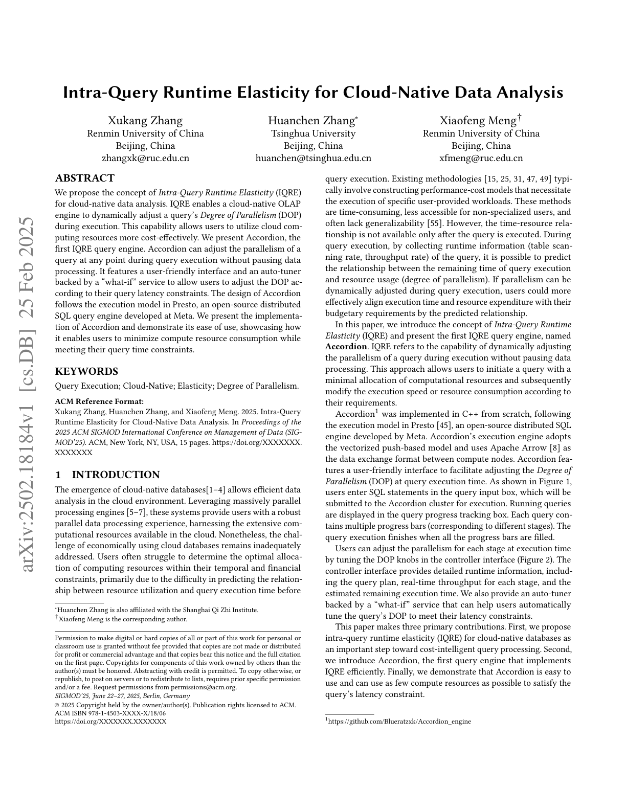
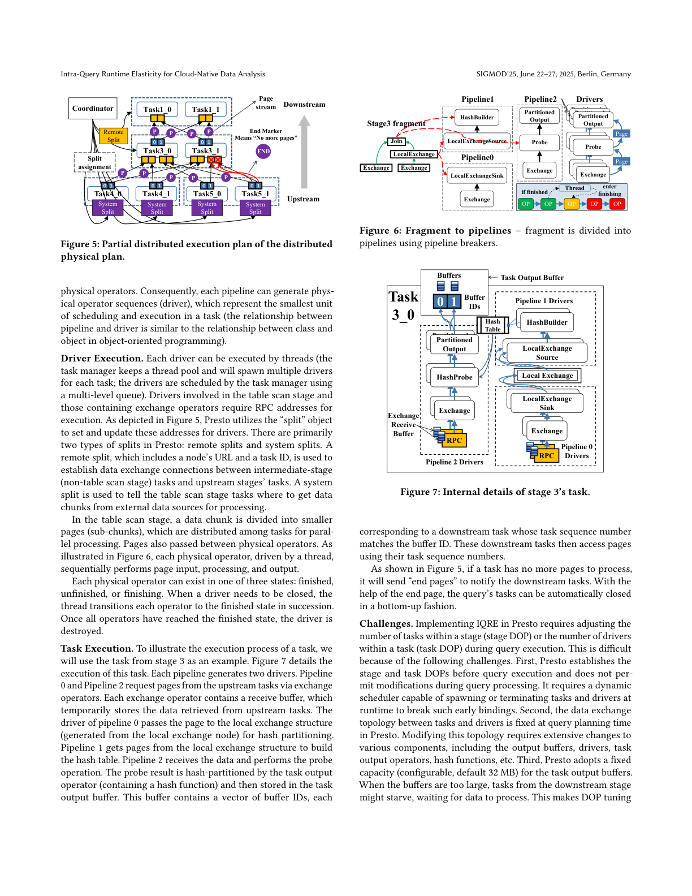
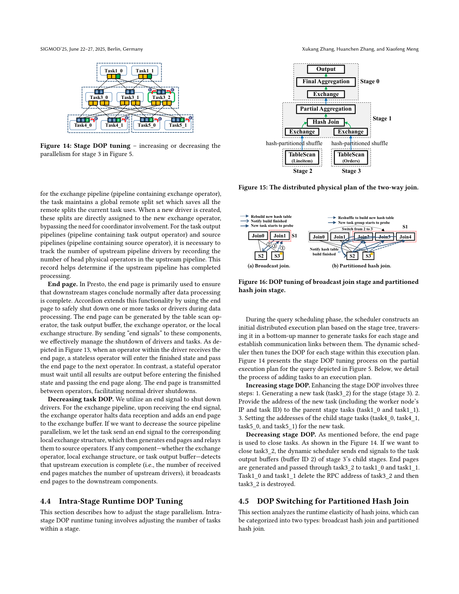
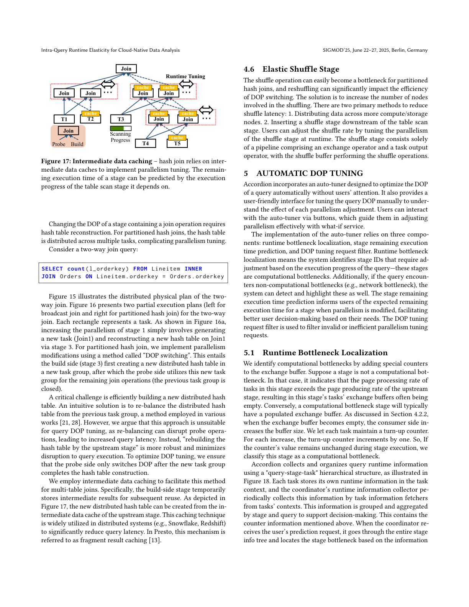
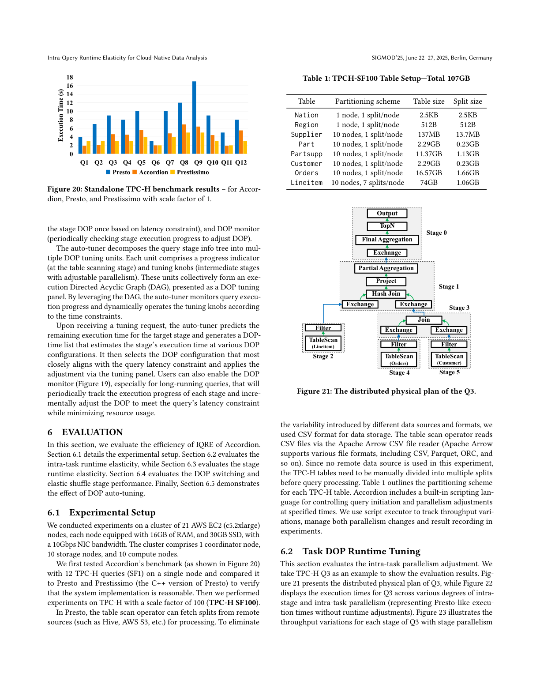
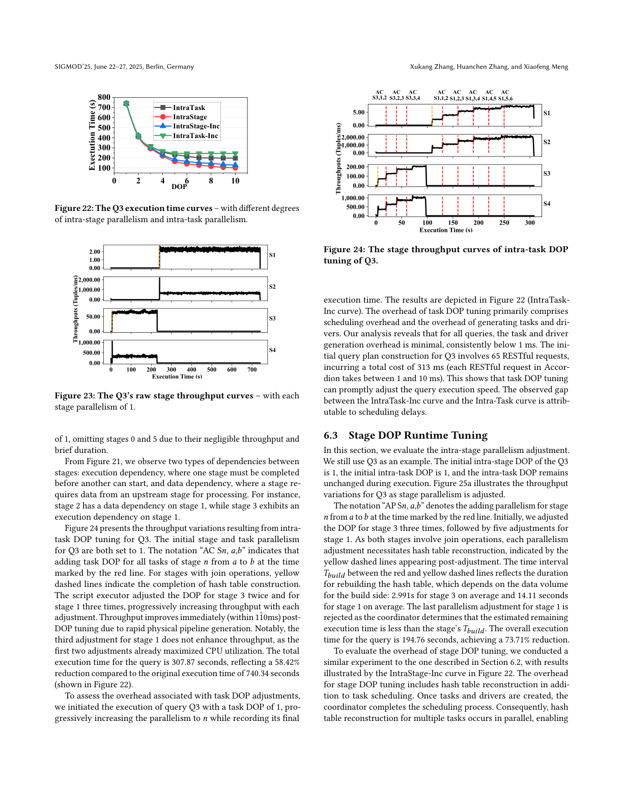
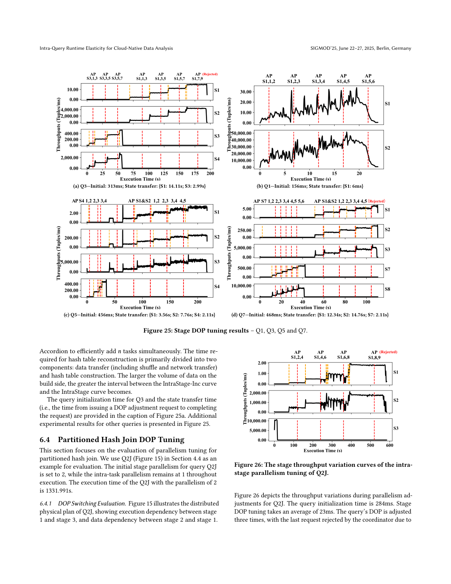
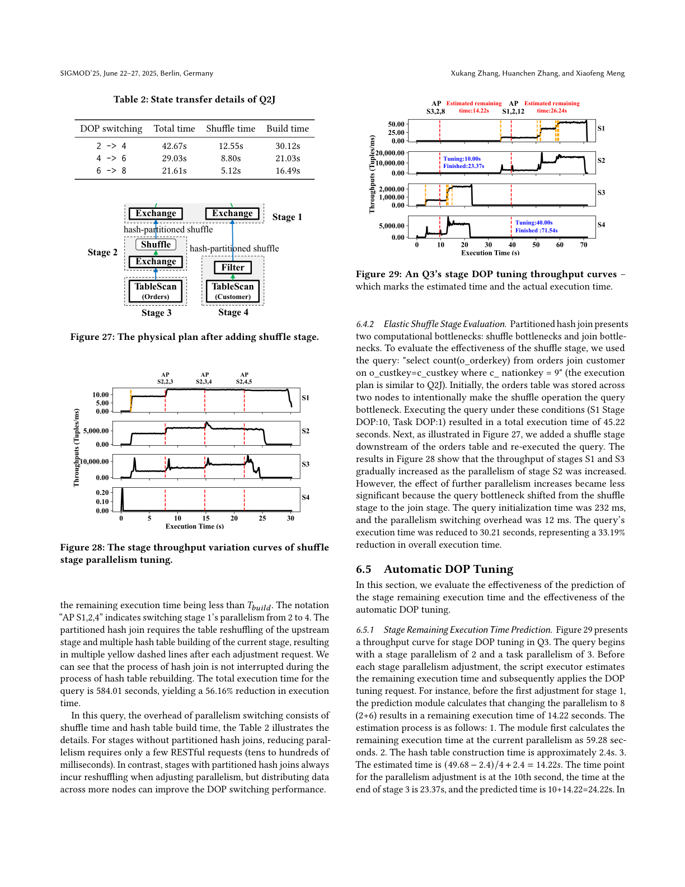
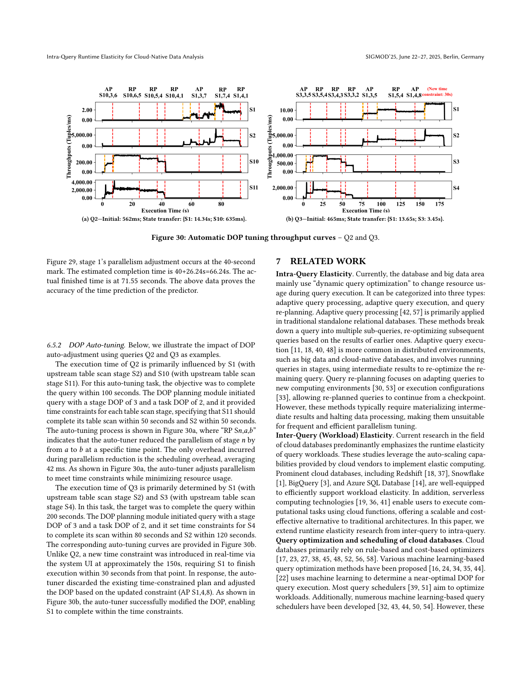

# Intra-Query Runtime Elasticity for Cloud-Native Data Analysis

> Convertido automaticamente de PDF para Markdown
>
> Arquivo original: `referencias/Intra-Query Runtime Elasticity for Cloud-Native Data Analysis.pdf`
> Data de conversão: 22/08/2026 13:04:11
> Imagens extraídas: 33 arquivo(s)

---

**Intra-Query Runtime Elasticity for Cloud-Native Data Analysis**

Xukang Zhang

Renmin University of China

Beijing, China

zhangxk@ruc.edu.cn

Huanchen Zhang&#x2217;

Tsinghua University

Beijing, China

huanchen@tsinghua.edu.cn

Xiaofeng Meng&#x2020;

Renmin University of China

Beijing, China

xfmeng@ruc.edu.cn

**ABSTRACT**

We propose the concept of* Intra-Query Runtime Elasticity* (IQRE)

for cloud-native data analysis. IQRE enables a cloud-native OLAP

engine to dynamically adjust a query&#x2019;s* Degree of Parallelism* (DOP)

during execution. This capability allows users to utilize cloud com-

puting resources more cost-effectively. We present Accordion, the

first IQRE query engine. Accordion can adjust the parallelism of a

query at any point during query execution without pausing data

processing. It features a user-friendly interface and an auto-tuner

backed by a &#x201c;what-if&#x201d; service to allow users to adjust the DOP ac-

cording to their query latency constraints. The design of Accordion

follows the execution model in Presto, an open-source distributed

SQL query engine developed at Meta. We present the implementa-

tion of Accordion and demonstrate its ease of use, showcasing how

it enables users to minimize compute resource consumption while

meeting their query time constraints.

**KEYWORDS**

Query Execution; Cloud-Native; Elasticity; Degree of Parallelism.

**ACM Reference Format:**

Xukang Zhang, Huanchen Zhang, and Xiaofeng Meng. 2025. Intra-Query

Runtime Elasticity for Cloud-Native Data Analysis. In* Proceedings of the*

*2025 ACM SIGMOD International Conference on Management of Data (SIG-*

*MOD&#x2019;25).* ACM, New York, NY, USA, 15 pages. https://doi.org/XXXXXXX.

XXXXXXX

**1**

**INTRODUCTION**

The emergence of cloud-native databases[1&#x2013;4] allows efficient data

analysis in the cloud environment. Leveraging massively parallel

processing engines [5&#x2013;7], these systems provide users with a robust

parallel data processing experience, harnessing the extensive com-

putational resources available in the cloud. Nonetheless, the chal-

lenge of economically using cloud databases remains inadequately

addressed. Users often struggle to determine the optimal alloca-

tion of computing resources within their temporal and financial

constraints, primarily due to the difficulty in predicting the relation-

ship between resource utilization and query execution time before

&#x2217;Huanchen Zhang is also affiliated with the Shanghai Qi Zhi Institute.

&#x2020;Xiaofeng Meng is the corresponding author.

Permission to make digital or hard copies of all or part of this work for personal or

classroom use is granted without fee provided that copies are not made or distributed

for profit or commercial advantage and that copies bear this notice and the full citation

on the first page. Copyrights for components of this work owned by others than the

author(s) must be honored. Abstracting with credit is permitted. To copy otherwise, or

republish, to post on servers or to redistribute to lists, requires prior specific permission

and/or a fee. Request permissions from permissions@acm.org.

*SIGMOD&#x2019;25, June 22&#x2013;27, 2025, Berlin, Germany*

&#xa9; 2025 Copyright held by the owner/author(s). Publication rights licensed to ACM.

ACM ISBN 978-1-4503-XXXX-X/18/06

https://doi.org/XXXXXXX.XXXXXXX

query execution. Existing methodologies [15, 25, 31, 47, 49] typi-

cally involve constructing performance-cost models that necessitate

the execution of specific user-provided workloads. These methods

are time-consuming, less accessible for non-specialized users, and

often lack generalizability [55]. However, the time-resource rela-

tionship is not available only after the query is executed. During

query execution, by collecting runtime information (table scan-

ning rate, throughput rate) of the query, it is possible to predict

the relationship between the remaining time of query execution

and resource usage (degree of parallelism). If parallelism can be

dynamically adjusted during query execution, users could more

effectively align execution time and resource expenditure with their

budgetary requirements by the predicted relationship.

In this paper, we introduce the concept of* Intra-Query Runtime*

*Elasticity* (IQRE) and present the first IQRE query engine, named

**Accordion**. IQRE refers to the capability of dynamically adjusting

the parallelism of a query during execution without pausing data

processing. This approach allows users to initiate a query with a

minimal allocation of computational resources and subsequently

modify the execution speed or resource consumption according to

their requirements.

Accordion1 was implemented in C++ from scratch, following

the execution model in Presto [45], an open-source distributed SQL

engine developed by Meta. Accordion&#x2019;s execution engine adopts

the vectorized push-based model and uses Apache Arrow [8] as

the data exchange format between compute nodes. Accordion fea-

tures a user-friendly interface to facilitate adjusting the* Degree of*

*Parallelism* (DOP) at query execution time. As shown in Figure 1,

users enter SQL statements in the query input box, which will be

submitted to the Accordion cluster for execution. Running queries

are displayed in the query progress tracking box. Each query con-

tains multiple progress bars (corresponding to different stages). The

query execution finishes when all the progress bars are filled.

Users can adjust the parallelism for each stage at execution time

by tuning the DOP knobs in the controller interface (Figure 2). The

controller interface provides detailed runtime information, includ-

ing the query plan, real-time throughput for each stage, and the

estimated remaining execution time. We also provide an auto-tuner

backed by a &#x201c;what-if&#x201d; service that can help users automatically

tune the query&#x2019;s DOP to meet their latency constraints.

This paper makes three primary contributions. First, we propose

intra-query runtime elasticity (IQRE) for cloud-native databases as

an important step toward cost-intelligent query processing. Second,

we introduce Accordion, the first query engine that implements

IQRE efficiently. Finally, we demonstrate that Accordion is easy to

use and can use as few compute resources as possible to satisfy the

query&#x2019;s latency constraint.

1https://github.com/Blueratzxk/Accordion_engine

arXiv:2502.18184v1  [cs.DB]  25 Feb 2025

---

SIGMOD&#x2019;25, June 22&#x2013;27, 2025, Berlin, Germany

Xukang Zhang, Huanchen Zhang, and Xiaofeng Meng

**Welcome to**** Accordion Cloud !**

**SQL**>

**SQL**>

**SQL**> select    l_orderkey ...

 from    orders, lineitem

 where    ... ;

**SQL>**

**#QUERY-2024-09-26-172446-da95fe9**

** Execution time: ---s**

**Stage:2 **

**Stage:3**

**#QUERY-2024-09-25-123415-4fca483**

** Execution time: 34.032s**

**Controller**

**In Progress**

**Controller**

** Complete**

**Figure 1: Accordion&#x2019;s Main Interface** &#x2013; it includes a SQL input

box on the left and the query execution progress tracking box on

the right.

**Output**

**TopN**

**Filter**

**Scan**

**Filter**

**Scan**

**Exch**

**Exch**

**Tuner**

**3**

**Factor**

**Get Tips**

**Stage 1 is bottleneck!**

**Predicted time: 12.43s**

**Physical Plan**

**Hash**

**Join**

**Exch**

**Stage 0**

**Throughputs: 0.0000 tuples/ms**

**Time Left: 0.000s**

**Stage 1**

**Throughputs: 723.00 tuples/ms**

**Time Left: 0.122s**

**Stage 2**

**Throughputs: 217.00  tuples/ms**

**Time Left: 36.42s**

**Stage 3**

**Throughputs: 0.0000  tuples/ms**

**Time Left: 0.000s**

**RemoteSource**

**HashBuilder**

**Driver:1**

**Close**

**RemoteSource**

**HashJoin**

**TaskOutput**

**Response:**

**ACCEPT**

**No.of tasks: 1**

**Add Task**

**DOP: 2**

**Close A Task**

**Task 0 --- pipelines**

**Stage0**

**Stage1**

**Stage2**

**Stage3**

**10**

**Expected Time**

**Auto Tune**

**Figure 2: Accordion&#x2019;s Controller Interface** &#x2013; it is composed of

three sections: the query plan display box, the auto-tuner box, and

the stage information box.

**2**

**BACKGROUND**

Presto [45] has been widely used by enterprises and cloud database

vendors for large-scale data analysis due to its high flexibility and

elasticity. It is a query engine without storage components. In this

section, we provide an overview of Presto&#x2019;s architecture and discuss

the challenges of implementing IQRE directly in Presto.

As illustrated in Figure 3, a Presto cluster consists of a coordinator

node and multiple worker nodes. The coordinator is responsible for

query parsing, analyzing, planning, optimizing, and task scheduling.

Worker nodes are responsible for query processing and result return.

Upon receiving a query, the coordinator analyzes the SQL statement,

generates a distributed physical plan through optimization, and

then schedules tasks &#x2014; the smallest unit for distributed execution

&#x2014; on the worker nodes. Each worker node contains a task manager

for creating and terminating tasks. Worker nodes execute these

tasks to process data from base tables or to handle intermediate

data generated by other workers. Presto uses RPC to exchange data

between tasks.

**Physical Plan to Fragments.** Consider a simple query:

**SELECT** l_orderkey

**FROM** lineitem

**INNER JOIN** orders

**ON** l_orderkey=o_orderkey

**INNER JOIN** customer** ON** c_custkey=o_custkey

**WHERE** o_orderdate < 1994 -03 -05

Presto obtains a physical plan after parsing, analyzing, and opti-

mizing the query. There are two special types of nodes in the plan:

**Analyzer/**

**Planner**

**Optimizer**

**Scheduler**

**Data**

**Source**

**task**

**Task**

**Manager**

**Worker**

**Worker**

**task**

**task**

**task**

**Coordinator**

**Parser**

**Worker**

**Worker**

**Data**

**Source**

**Results**

**SQL**

**Figure 3: Architecture of Presto.**

**Project**

**Filter **

**TableScan**

(lineitem)

**Hash Join**

**Hash Join **

**Output**

**LocalExchange**

**Exchange**

**Exchange**

**Exchange**

**Exchange**

**Stage0**

**Stage1**

**Stage2**

**Stage3**

**Stage4**

**Stage5**

hash-partitioned shuffle

hash-partitioned shuffle

hash-partitioned shuffle

hash-partitioned shuffle

**LocalExchange**

**TableScan**

(Customer)

**TableScan **(Orders)

**Exchange**

**Figure 4: Distributed physical plan of example query.**

the exchange node and the local exchange node. These nodes are

introduced during query optimization to partition the plan into sub-

plans. The query optimizer divides the physical plan into multiple

fragments based on the locations of the exchange nodes, resulting

in a fragment (stage) tree as illustrated in Figure 4. The scheduler

allocates tasks across the cluster based on this stage tree to create

a distributed execution plan. An execution stage includes multiple

tasks. Each task is mapped to a compute node. Figure 5 presents a

partially distributed execution plan for the stage tree, displaying

only stages 1, 3, 4, and 5. Each stage is assigned two tasks, with

each task identified by a unique task ID that consists of the stage

number and the task sequence number.

**Fragment to Pipelines.** A fragment cannot be executed directly

within a task; it must first be rewritten and then subdivided into a

collection of pipelines. The division is performed by pipeline break-

ers, including the local exchange node and the hash join node in

this plan. Figure 6 illustrates the process of converting a fragment

into pipelines within the task of stage 3. Initially, the fragment is

rewritten to introduce an output node. Subsequently, each local

exchange node is divided into a sink node and a source node, while

each join node is split into a probe node and a build node. This

process results in a collection of plan node sequences, each of which

will be transformed into a pipeline. A pipeline is defined as a se-

quence of operator factories, each capable of producing multiple

---

Intra-Query Runtime Elasticity for Cloud-Native Data Analysis

SIGMOD&#x2019;25, June 22&#x2013;27, 2025, Berlin, Germany

**Task4_0**

**Task4_1**

**Task5_0**

**Task5_1**

**Task3_0**

**Task3_1**

**Task1_0**

**Task1_1**

**0 1**

**0 1**

**0 1**

**0 1**

**0 1**

**0 1**

**Upstream**

**Downstream**

**END**

**End Marker**

**Means &#x201c;No more pages&#x201d;**

**Coordinator**

System

Split

System

Split

System

Split

System

Split

**Split **

**assignment**

**P**

**P**

**P**

**P**

**P**

**P**

**P**

**P**

**P**

**Page **

**stream**

Remote

Split

**Figure 5: Partial distributed execution plan of the distributed**

**physical plan.**

physical operators. Consequently, each pipeline can generate phys-

ical operator sequences (driver), which represent the smallest unit

of scheduling and execution in a task (the relationship between

pipeline and driver is similar to the relationship between class and

object in object-oriented programming).

**Driver Execution.** Each driver can be executed by threads (the

task manager keeps a thread pool and will spawn multiple drivers

for each task; the drivers are scheduled by the task manager using

a multi-level queue). Drivers involved in the table scan stage and

those containing exchange operators require RPC addresses for

execution. As depicted in Figure 5, Presto utilizes the &#x201c;split&#x201d; object

to set and update these addresses for drivers. There are primarily

two types of splits in Presto: remote splits and system splits. A

remote split, which includes a node&#x2019;s URL and a task ID, is used to

establish data exchange connections between intermediate-stage

(non-table scan stage) tasks and upstream stages&#x2019; tasks. A system

split is used to tell the table scan stage tasks where to get data

chunks from external data sources for processing.

In the table scan stage, a data chunk is divided into smaller

pages (sub-chunks), which are distributed among tasks for paral-

lel processing. Pages also passed between physical operators. As

illustrated in Figure 6, each physical operator, driven by a thread,

sequentially performs page input, processing, and output.

Each physical operator can exist in one of three states: finished,

unfinished, or finishing. When a driver needs to be closed, the

thread transitions each operator to the finished state in succession.

Once all operators have reached the finished state, the driver is

destroyed.

**Task Execution.** To illustrate the execution process of a task, we

will use the task from stage 3 as an example. Figure 7 details the

execution of this task. Each pipeline generates two drivers. Pipeline

0 and Pipeline 2 request pages from the upstream tasks via exchange

operators. Each exchange operator contains a receive buffer, which

temporarily stores the data retrieved from upstream tasks. The

driver of pipeline 0 passes the page to the local exchange structure

(generated from the local exchange node) for hash partitioning.

Pipeline 1 gets pages from the local exchange structure to build

the hash table. Pipeline 2 receives the data and performs the probe

operation. The probe result is hash-partitioned by the task output

operator (containing a hash function) and then stored in the task

output buffer. This buffer contains a vector of buffer IDs, each

**Join **

**LocalExchange**

**Exchange**

**Exchange**

**Probe**

**Partitioned**

**Output**

**LocalExchangeSource**

**HashBuilder**

**Exchange**

**LocalExchangeSink**

**Pipeline2**

**Pipeline1**

**Pipeline0**

**Exchange**

**LookupJoin**

**Partitioned**

**Output**

**Exchange**

**L**

**Partitioned**

**Output**

**Exchange**

**Probe**

**Partitioned**

**Output**

**Drivers**

**Exchange**

Page

Page

**Stage3 fragment**

OP

OP

OP

OP

OP

**Thread**

**if finished**

**enter **

**finishing**

**Figure 6: Fragment to pipelines** &#x2013; fragment is divided into

pipelines using pipeline breakers.

**0 1**

**Exchange**

**LookupJoin**

**Partitioned**

**Output**

**RPC**

**Exchange**

**HashProbe**

**Partitioned**

**Output**

**RPC**

**Pipeline 2 Drivers**

**LocalExchangeSource**

**HashBuilder**

**Exchange**

**LocalExchangeSink**

**RPC**

**Exchange**

**LocalExchange**

**Sink**

**RPC**

**Local Exchange**

**LocalExchange**

**Source**

**HashBuilder**

**Pipeline 0**

**Drivers**

**Pipeline 1 Drivers**

**Buffers**

**Task Output Buffer**

**Task**

**3_0**

**Buffer**

**IDs**

**Exchange**

**Receive**

**Buffer**

**Hash**

**Table**

**Figure 7: Internal details of stage 3&#x2019;s task.**

corresponding to a downstream task whose task sequence number

matches the buffer ID. These downstream tasks then access pages

using their task sequence numbers.

As shown in Figure 5, if a task has no more pages to process,

it will send &#x201c;end pages&#x201d; to notify the downstream tasks. With the

help of the end page, the query&#x2019;s tasks can be automatically closed

in a bottom-up fashion.

**Challenges.** Implementing IQRE in Presto requires adjusting the

number of tasks within a stage (stage DOP) or the number of drivers

within a task (task DOP) during query execution. This is difficult

because of the following challenges. First, Presto establishes the

stage and task DOPs before query execution and does not per-

mit modifications during query processing. It requires a dynamic

scheduler capable of spawning or terminating tasks and drivers at

runtime to break such early bindings. Second, the data exchange

topology between tasks and drivers is fixed at query planning time

in Presto. Modifying this topology requires extensive changes to

various components, including the output buffers, drivers, task

output operators, hash functions, etc. Third, Presto adopts a fixed

capacity (configurable, default 32 MB) for the task output buffers.

When the buffers are too large, tasks from the downstream stage

might starve, waiting for data to process. This makes DOP tuning

---

SIGMOD&#x2019;25, June 22&#x2013;27, 2025, Berlin, Germany

Xukang Zhang, Huanchen Zhang, and Xiaofeng Meng

**000**

**Scheduler**

**Coordinator**

**Query**

**Optimizer**

**Runtime Information**

**Analyzer/**

**Planner**

**Parser**

**Predictor**

**Request**

**Filter**

**DOP**

**Auto**

**Tuner**

**Constraints/**

**Tuning **

**Requests**

**Runtime DOP Tun****ing Module**

**Dynamic**

**Optimizer**

**Dynamic**

**Scheduler**

**Figure 8: Architecture of Accordion.**

&#x2a1d;

**DOP-Aware**

**Output Buffer**

**0 1**

**Coordinator**

**Distributed **

**Execution Plan**

**Task 4_0**

**Task 5_0**

**Task 3_0**

**Task 3_1**

**Task 3_2**

**0 1 2**

**0 1 2**

**0 1**

**0 1**

**0 1**

&#x2a1d;

**Task 1_0**

**Task 1_1**

**0 1**

**0 1**

...

...

O

C

**Reception**

**Output**

**Stage**

**Task**

**Operator**

**Page**

**Stage4**

**Stage5**

**Stage3**

**Stage1**

** Dynamic**

**Schedule**

**Data Flow**

**Add **

**task**

**Upstream**

**Downstream**

**Local**

**Exchange**

**Source**

**Join **

**Task**

**Output **

**Exchange**

**Local**

**Exchange**

**Sink**

**Exchange**

**Local**

**Exchange**

**Sink**

**Local**

**Exchange**

**Source**

**Join **

**Task**

**Output **

**Add **

**driver**

**Exchanger**

**&#x2460;**** **

**&#x2461;**** **

**&#x2460;**

**&#x2461;**

**Figure 9: DOP tuning types in Accordion** &#x2013; intra-task DOP

runtime tuning ( 2*&#x25cb;*) and intra-stage DOP runtime tuning ( 1*&#x25cb;*).

at this stage ineffective. On the other hand, if the buffers are too

small, the network overhead becomes significant.

We will address these challenges in Section 4. First, we present

the new architecture of Accordion in the next section.

**3**

**SYSTEM OVERVIEW**

Accordion is also a vectorized and push-based query engine like

Presto. As shown in Figure 8, Accordion introduces a DOP auto-

tuner and a runtime DOP tuning module on top of the existing

design. The auto-tuner contains a predictor and tuning request fil-

ter. The Predictor (what-if service, as detailed in Section 5) handles

prediction tasks. It obtains query runtime information from the

scheduler to estimate the remaining execution time and the antici-

pated time after parallelism adjustments. These results are returned

to users or used for DOP auto-tuning. The request filter is used

to filter unreasonable tuning requests (e.g., requests that would

cause a waste of resources and requests for finished queries). The

runtime DOP tuning module encompasses a dynamic optimizer

and a dynamic scheduler. Upon receiving a tuning request, the

auto tuner will generate tuning actions to the dynamic optimizer,

which determines the type of DOP tuning required and invokes

the dynamic scheduler to perform the tuning operations. Figure 9

illustrates the two types of DOP tuning available in Accordion:

**intra-task DOP tuning** ( 1*&#x25cb;*), which involves changing the number

of drivers for a pipeline (detailed in Section 4.3), and** intra-stage**

**DOP tuning** ( 2*&#x25cb;*), which involves changing the number of tasks

for a stage (detailed in Section 4.4). In the next section, we describe

how we implement these new features.

**4**

**INTRA-QUERY RUNTIME ELASTICITY**

In this section, we focus on how to address the challenges men-

tioned in Section 2 to implement IQRE. Section 4.1 provides a solu-

tion overview of IQRE. Section 4.2 describes the redesign of buffers

for efficient stage DOP tuning. Section 4.3 and Section 4.4 show the

process of tuning task DOP and stage DOP, respectively. Section 4.5

discusses the parallelism tuning for hash join. Section 4.6 describes

how to use runtime elasticity to reduce shuffle overhead.

**4.1**

**Solution of Runtime Elasticity**

We now analyze the overall solution for runtime elasticity. Op-

erators in query plans can be classified into two types: stateless

and stateful. Stateless operators process pages without relying on

any state, directly generating output pages from input pages. In

contrast, stateful operators depend on external or historical data to

compute output and cannot derive results solely from input pages.

In Accordion, stateless operators include filter, project, sink, source,

exchange, task output, and table scan. If a stage or pipeline con-

sists of stateless operators only, we can freely adjust its DOP by

generating tasks or drivers dynamically.

Stateful operators in Accordion include aggregation (aggregation

operator) and join (hash join operator and cross join operator).

The aggregation operator maintains global data, which limits the

flexibility to modify the parallelism of the task or stage it resides

in. To enable runtime elasticity, we adopt a two-stage aggregation

model [9, 10], similar to Presto. This model divides the aggregation

into a partial and final aggregation. The partial aggregation operator

handles group-by and pre-aggregation operations, and since its

state data can be destroyed and reconstructed, it is considered

stateless. The final aggregation operator is stateful: it merges all the

partial results with its task and stage parallelism fixed at 1. For join

operators, probe-side data processing must wait for the build-side

to complete before it can begin. In tasks containing join operations,

we focus on adjusting the parallelism of the probe pipeline. When

the hash table building is finished on the build side, the probe

pipeline can freely generate and close drivers. However, increasing

the parallelism for the stage containing the join operation requires

hash table repartition/reconstruction, which we will discuss in

detail in Section 4.5.

**4.2**

**Redesign of Buffers**

As previously mentioned, generating new tasks for a stage requires

adjusting numerous components of both upstream and downstream

stages. To ensure efficiency and robustness in stage DOP adjust-

ments, we confine the scope of components affected by parallelism

modifications to the upstream and downstream buffers. We made

significant enhancements to the task output buffer, redistributing

more responsibilities to it and enabling its capacity to dynamically

adjust as the DOP of the downstream stage changes.

*4.2.1*

*Redesign of Task Output Buffer.* The task output buffer is

now responsible for data distribution, shuffling, and parallelism

variation adaptation, while the task output operator focuses solely

on page delivery. This design ensures that when downstream par-

allelism changes, the task output buffer can quickly detect new

---

Intra-Query Runtime Elasticity for Cloud-Native Data Analysis

SIGMOD&#x2019;25, June 22&#x2013;27, 2025, Berlin, Germany

**0**

**1**

**2**

**3**

**4**

**5**

**6**

**7**

**ID**

**Groups**

**Cache**

**E**

**E**

**E**

**E**

**E**

**E**

**E**

**E**

**TaskOutput**

P

P

P

P

P

P

P

P

P

P

P

P

P

P

P

P

P

**Page Queue**

**Shuffled **

**Queues**

**Shuffle**

**Executors**

**reshuffle**

**get pages**

...

**Task 0**

**Task 1**

**Task 5**

**Task 6** ...

...

**Task group 0**

**Task group 1**

**0**

**1**

**2**

**3**

**4**

**5**

**6**

**7**

**Buffer ID array**

**Cache**

P

P

P

P

P

P

**Page Queue**

**redistribution**

**TaskOutput**

...

**Task 0**

**Task 1**

**Task 2** ...

**(a) Shared buffer**

**(b) Shuffle buffer**

**Figure 10: Shared buffer and shuffle buffer.**

**P**

**P**

Consumer

Producer

If empty then turn up the buffer size

Producer

Consumer

Time out and reset buffer size

**Figure 11: Runtime elastic buffer** &#x2013; the consumer side automat-

ically adjusts the buffer capacity to ensure that the rate of data

generation matches the rate of data consumption.

downstream tasks and update the data allocation scheme accord-

ingly. It resembles a shuffle service found in big data frameworks,

such as the Spark shuffle service [46] and BigQuery shuffle service

[26]. A shuffling service typically consists of a shuffling cluster that

receives intermediate data generated by other clusters (e.g., a Spark

cluster) to assist in performing shuffling operations. Additionally,

shuffle services can perform dynamic optimizations, leveraging

technologies like Adaptive Query Execution (AQE) [11] to deter-

mine appropriate parallelism for subsequent job execution stages.

However, AQE can only adjust parallelism for a stage after the

completion of the previous stage and does not allow for DOP modi-

fications during data processing. In contrast, Accordion can alter

stage DOP at any moment (but we believe that adaptive query

execution is quite orthogonal to IQRE, and they can be applied

simultaneously in one system).

Accordion currently features two types of output buffers: shared

buffers and shuffle buffers. As illustrated in Figure 10, both buffers

contain a page queue and a page cache. All pages produced by a task

are stored in the page queue via the task output operator. The page

cache, which is not always necessary, is utilized for reshuffling

or redistributing pages for the join build side. The page queue

is implemented using TBB&#x2019;s concurrent queue [12] to facilitate

efficient concurrent access.

Each downstream task retrieves pages using a buffer ID. The

Buffer ID array can dynamically change in response to fluctuations

in the number of upstream tasks. The shuffle buffer employs shuf-

flers to process pages, with each shuffler containing multiple shuffle

executors&#x2014;threads that perform shuffling operations. The number

of executors corresponds to the number of downstream tasks. Each

**Upstream **

**Drivers:1+1 **

**EndPageRec:0**

**Task Output Buffer**

**OP**

**Exchange**

**OP**

**Task**

**Output**

**OP**

**Exchange**

**OP**

**Task**

**Output**

Global

Remote

Split Set

**UpstreamTasks:5 **

**EndPageRec:0**

**End**

**Signal**

**End**

**Signal**

**Tail**

**Head**

**(a) Exchange pipeline and task**

**output pipeline.**

**Sink**

**Exchange**

**Source**

**Task**

**Output**

**OP**

**Sink**

**Exchange**

**Source**

**OP**

**Upstream **

**Drivers:1+1**

**EndPageRec:0**

**Local Exchange Structure**

**Task**

**Output**

**End**

**Signal**

**(b)**

**Sink**

**pipeline**

**and**

**source**

**pipeline.**

**Figure 12: Intra-task DOP tuning** &#x2013; the driver in the red box is

the newly generated driver.

**END**** ****Generate**

**End-Page**

**Finished**

**Finished**

**Unfinished**

**Unfinished**

**OP**

**OP**

**OP**

**OP**

**Receive**

**End-Page**

**END**

**Figure 13: End page relay game** &#x2013; the end page is passed between

operators to gracefully close a driver.

shuffled page queue is linked to a specific buffer ID. And buffer IDs

are grouped according to the shuffler to which they belong to form

buffer ID groups. And the downstream tasks corresponding to the

buffer ID group form task groups.

*4.2.2*

*Runtime Elastic Buffer.* As mentioned before, to prevent the

buffer capacity from affecting the query execution, we designed the

runtime elastic buffer. The buffer capacity is adjusted dynamically

by the consumer side at runtime. As illustrated in Figure 11, if

the consumer detects that the buffer is empty, it indicates that the

consumption rate is exceeding the production rate. In this case, the

consumer will increase the buffer size to accommodate more pages

generated or requested by the producer. To align the buffer size

with the consumption rate, the consumer periodically (e.g., every

500 milliseconds) counts the number of pages processed and uses

this data to resize the buffer. This means that the consumer can

determine the optimal amount of data to cache based on its recent

consumption capabilities. Since the buffer size is adjusted in real

time, we can initially set all buffer capacities to the size of a page.

**4.3**

**Intra-Task Runtime DOP Tuning**

This section describes how to adjust the task parallelism. Tun-

ing intra-task DOP involves adjusting the number of drivers for a

pipeline within a task.

**Increasing task DOP.** Adding task DOP involves generating

new drivers for pipelines, but certain data must be preserved to

ensure logical correctness during tuning. As shown in Figure 12a,

---

SIGMOD&#x2019;25, June 22&#x2013;27, 2025, Berlin, Germany

Xukang Zhang, Huanchen Zhang, and Xiaofeng Meng

**Task****4****_0**

**Task****4****_1**

**Task****5****_0**

**Task****5****_1**

**Task3_0**

**Task3_1**

**Task****1****_0**

**Task****1****_1**

**0 1**

**0 1**

**Task3_2**

**0 1**

**0 1 2**

**0 1 2**

**0 1 2**

**0 1 2**

**E**

**E**

**E**

**E**

**E**

**E**

**E**

**Figure 14: Stage DOP tuning** &#x2013; increasing or decreasing the

parallelism for stage 3 in Figure 5.

for the exchange pipeline (pipeline containing exchange operator),

the task maintains a global remote split set which saves all the

remote splits the current task uses. When a new driver is created,

these splits are directly assigned to the new exchange operator,

bypassing the need for coordinator involvement. For the task output

pipelines (pipeline containing task output operator) and source

pipelines (pipeline containing source operator), it is necessary to

track the number of upstream pipeline drivers by recording the

number of head physical operators in the upstream pipeline. This

record helps determine if the upstream pipeline has completed

processing.

**End page.** In Presto, the end page is primarily used to ensure

that downstream stages conclude normally after data processing

is complete. Accordion extends this functionality by using the end

page to safely shut down one or more tasks or drivers during data

processing. The end page can be generated by the table scan op-

erator, the task output buffer, the exchange operator, or the local

exchange structure. By sending &#x201c;end signals&#x201d; to these components,

we effectively manage the shutdown of drivers and tasks. As de-

picted in Figure 13, when an operator within the driver receives the

end page, a stateless operator will enter the finished state and pass

the end page to the next operator. In contrast, a stateful operator

must wait until all results are output before entering the finished

state and passing the end page along. The end page is transmitted

between operators, facilitating normal driver shutdowns.

**Decreasing task DOP.** We utilize an end signal to shut down

drivers. For the exchange pipeline, upon receiving the end signal,

the exchange operator halts data reception and adds an end page

to the exchange buffer. If we want to decrease the source pipeline

parallelism, we let the task send an end signal to the corresponding

local exchange structure, which then generates end pages and relays

them to source operators. If any component&#x2014;whether the exchange

operator, local exchange structure, or task output buffer&#x2014;detects

that upstream execution is complete (i.e., the number of received

end pages matches the number of upstream drivers), it broadcasts

end pages to the downstream components.

**4.4**

**Intra-Stage Runtime DOP Tuning**

This section describes how to adjust the stage parallelism. Intra-

stage DOP runtime tuning involves adjusting the number of tasks

within a stage.

**Output**

**Partial Aggregation**

**Exchange**

**Hash Join **

**Exchange**

**Exchange**

**Final Aggregation**

**TableScan**

**TableScan**

**(Lineitem)**

**(Orders)**

**Stage 0**

**Stage 1**

**Stage 2**

**Stage 3**

hash-partitioned shuffle

hash-partitioned shuffle

**Figure 15: The distributed physical plan of the two-way join.**

**S2**

**S3**

**Join0**

**Join1**

**Re****build**** new hash table**** **

**Notify**** build finished**** **

**New task starts ****to probe**

**1**

**2**

**3**

**S****1**

**(a) Broadcast join.**

**S2**

**S3**

**Join0**

**Join1**

**Join2**

**Join3**

**Join4**

**Reshuffle to build new hash table**

**New task group starts to probe**

**Switch from 2 to 3**

**S1**

**N****otify hash table **

**build finished**

**(b) Partitioned hash join.**

**Figure 16: DOP tuning of broadcast join stage and partitioned**

**hash join stage.**

During the query scheduling phase, the scheduler constructs an

initial distributed execution plan based on the stage tree, travers-

ing it in a bottom-up manner to generate tasks for each stage and

establish communication links between them. The dynamic sched-

uler then tunes the DOP for each stage within this execution plan.

Figure 14 presents the stage DOP tuning process on the partial

execution plan for the query depicted in Figure 5. Below, we detail

the process of adding tasks to an execution plan.

**Increasing stage DOP.** Enhancing the stage DOP involves three

steps: 1. Generating a new task (task3_2) for the stage (stage 3). 2.

Provide the address of the new task (including the worker node&#x2019;s

IP and task ID) to the parent stage tasks (task1_0 and task1_1).

3. Setting the addresses of the child stage tasks (task4_0, task4_1,

task5_0, and task5_1) for the new task.

**Decreasing stage DOP.** As mentioned before, the end page

is used to close tasks. As shown in the Figure 14. If we want to

close task3_2, the dynamic scheduler sends end signals to the task

output buffers (buffer ID 2) of stage 3&#x2019;s child stages. End pages

are generated and passed through task3_2 to task1_0 and task1_1.

Task1_0 and task1_1 delete the RPC address of task3_2 and then

task3_2 is destroyed.

**4.5**

**DOP Switching for Partitioned Hash Join**

This section analyzes the runtime elasticity of hash joins, which can

be categorized into two types: broadcast hash join and partitioned

hash join.

---

Intra-Query Runtime Elasticity for Cloud-Native Data Analysis

SIGMOD&#x2019;25, June 22&#x2013;27, 2025, Berlin, Germany

**T4**

**T5**

**T3**

**Join**

**Join**

**Join**

**cache**

**Join**

**Join**

**cache**

**cache**

**cache**

**T1**

**T2**

**cache**

**Join**

**Join**

**cache**

...

...

...

**Runtime Tuning**

Scanning

Progress

**Join**

Probe  Build

**Figure 17: Intermediate data caching** &#x2013; hash join relies on inter-

mediate data caches to implement parallelism tuning. The remain-

ing execution time of a stage can be predicted by the execution

progress of the table scan stage it depends on.

Changing the DOP of a stage containing a join operation requires

hash table reconstruction. For partitioned hash joins, the hash table

is distributed across multiple tasks, complicating parallelism tuning.

Consider a two-way join query:

**SELECT count**(l_orderkey)** FROM** Lineitem** INNER**

**JOIN** Orders** ON** Lineitem.orderkey = Orders.orderkey

Figure 15 illustrates the distributed physical plan of the two-

way join. Figure 16 presents two partial execution plans (left for

broadcast join and right for partitioned hash join) for the two-way

join. Each rectangle represents a task. As shown in Figure 16a,

increasing the parallelism of stage 1 simply involves generating

a new task (Join1) and reconstructing a new hash table on Join1

via stage 3. For partitioned hash join, we implement parallelism

modifications using a method called &#x201c;DOP switching&#x201d;. This entails

the build side (stage 3) first creating a new distributed hash table in

a new task group, after which the probe side utilizes this new task

group for the remaining join operations (the previous task group is

closed).

A critical challenge is efficiently building a new distributed hash

table. An intuitive solution is to re-balance the distributed hash

table from the previous task group, a method employed in various

works [21, 28]. However, we argue that this approach is unsuitable

for query DOP tuning, as re-balancing can disrupt probe opera-

tions, leading to increased query latency. Instead, &#x201c;rebuilding the

hash table by the upstream stage&#x201d; is more robust and minimizes

disruption to query execution. To optimize DOP tuning, we ensure

that the probe side only switches DOP after the new task group

completes the hash table construction.

We employ intermediate data caching to facilitate this method

for multi-table joins. Specifically, the build-side stage temporarily

stores intermediate results for subsequent reuse. As depicted in

Figure 17, the new distributed hash table can be created from the in-

termediate data cache of the upstream stage. This caching technique

is widely utilized in distributed systems (e.g., Snowflake, Redshift)

to significantly reduce query latency. In Presto, this mechanism is

referred to as fragment result caching [13].

**4.6**

**Elastic Shuffle Stage**

The shuffle operation can easily become a bottleneck for partitioned

hash joins, and reshuffling can significantly impact the efficiency

of DOP switching. The solution is to increase the number of nodes

involved in the shuffling. There are two primary methods to reduce

shuffle latency: 1. Distributing data across more compute/storage

nodes. 2. Inserting a shuffle stage downstream of the table scan

stage. Users can adjust the shuffle rate by tuning the parallelism

of the shuffle stage at runtime. The shuffle stage consists solely

of a pipeline comprising an exchange operator and a task output

operator, with the shuffle buffer performing the shuffle operations.

**5**

**AUTOMATIC DOP TUNING**

Accordion incorporates an auto-tuner designed to optimize the DOP

of a query automatically without users&#x2019; attention. It also provides a

user-friendly interface for tuning the query DOP manually to under-

stand the effect of each parallelism adjustment. Users can interact

with the auto-tuner via buttons, which guide them in adjusting

parallelism effectively with what-if service.

The implementation of the auto-tuner relies on three compo-

nents: runtime bottleneck localization, stage remaining execution

time prediction, and DOP tuning request filter. Runtime bottleneck

localization means the system identifies stage IDs that require ad-

justment based on the execution progress of the query&#x2014;these stages

are computational bottlenecks. Additionally, if the query encoun-

ters non-computational bottlenecks (e.g., network bottleneck), the

system can detect and highlight these as well. The stage remaining

execution time prediction informs users of the expected remaining

execution time for a stage when parallelism is modified, facilitating

better user decision-making based on their needs. The DOP tuning

request filter is used to filter invalid or inefficient parallelism tuning

requests.

**5.1**

**Runtime Bottleneck Localization**

We identify computational bottlenecks by adding special counters

to the exchange buffer. Suppose a stage is not a computational bot-

tleneck. In that case, it indicates that the page processing rate of

tasks in this stage exceeds the page producing rate of the upstream

stage, resulting in this stage&#x2019;s tasks&#x2019; exchange buffers often being

empty. Conversely, a computational bottleneck stage will typically

have a populated exchange buffer. As discussed in Section 4.2.2,

when the exchange buffer becomes empty, the consumer side in-

creases the buffer size. We let each task maintain a turn-up counter.

For each increase, the turn-up counter increments by one. So, If

the counter&#x2019;s value remains unchanged during stage execution, we

classify this stage as a computational bottleneck.

Accordion collects and organizes query runtime information

using a "query-stage-task" hierarchical structure, as illustrated in

Figure 18. Each task stores its own runtime information in the task

context, and the coordinator&#x2019;s runtime information collector pe-

riodically collects this information by task information fetchers

from tasks&#x2019; contexts. This information is grouped and aggregated

by stage and query to support decision-making. This contains the

counter information mentioned above. When the coordinator re-

ceives the user&#x2019;s prediction request, it goes through the entire stage

info tree and locates the stage bottleneck based on the information

---

SIGMOD&#x2019;25, June 22&#x2013;27, 2025, Berlin, Germany

Xukang Zhang, Huanchen Zhang, and Xiaofeng Meng

**S2**

**S4**

**S1**

**TaskInfo**

TaskInfoFetcher

**TaskInfo**

TaskInfoFetcher

**TaskInfo**

TaskInfoFetcher

**TaskInfo list**

**S0**

**StageInfo**

**StageInfo Tree**

**S4**

**S6**

**S5**

**Coordinator**

**Worker**

**Task**

**Task **

**Context**

traverse

to find

bottlenecks

**QueryInfo**

**QueryInfo**

**QueryInfo**

drivers informations,

CPU usage, NIC usage,

buffer informations...

...

**Figure 18: Query runtime information collection** &#x2013; runtime

information of queries is organized to multiple levels. The coordi-

nator finds the query bottleneck by traversing the stage tree.

recorded. The coordinator also monitors other metrics, such as the

NIC utilization to determine if a stage is experiencing a network

bottleneck.

**5.2**

**DOP Tuning Request Filter**

In some scenarios, tuning parallelism may be ineffective. The DOP

tuning filter is designed to block such inappropriate requests. Cur-

rently, the filter handles two types of requests: 1. parallelism adjust-

ment requests for queries or stages that have already been finished,

2. unsuitable requests for stages containing join operations. For

example, if a stage is close to completion and the time required

to rebuild the hash table exceeds the remaining execution time,

adjusting the parallelism would be a waste of resources.

To realize this, we need to estimate the remaining execution time

for a stage and compare it with the hash table construction time.

We illustrate this with the example in Figure 17. Since a stage has

multiple tasks (each task has a hash table build time), we represent

the hash table build time for the stage by the maximum hash table

build time of its tasks. To predict the remaining time, we monitor

the progress [20, 29] of the stage&#x2019;s execution. In this paper, we lever-

age the table scanning progress of the table scan stage (upstream

stage of probe side) to predict the remaining execution time for the

join stage. The coordinator periodically records the remaining data

volume (*&#x1d449;**&#x1d45f;&#x1d452;&#x1d45a;&#x1d44e;&#x1d456;&#x1d45b;*) of the table scan stage and calculates the data

consumption rate (*&#x1d445;**&#x1d450;&#x1d45c;&#x1d45b;&#x1d460;&#x1d462;&#x1d45a;&#x1d452;*). The remaining time can then be esti-

mated as* &#x1d447;**&#x1d45f;&#x1d452;&#x1d45a;&#x1d44e;&#x1d456;&#x1d45b;*=* &#x1d449;**&#x1d45f;&#x1d452;&#x1d45a;&#x1d44e;&#x1d456;&#x1d45b;*/*&#x1d445;**&#x1d450;&#x1d45c;&#x1d45b;&#x1d460;&#x1d462;&#x1d45a;&#x1d452;*. If the estimated remaining

time is less than the hash table construction time, the DOP tuning

request is rejected.

Below we explain why it is sufficient to compute only the progress

of the table scan stage. In fact, the query progress on the Accordion

main UI only shows the progress of each table scan stage. Given

that query execution processes data in a streaming fashion, data

from the table scan stage is incrementally passed to downstream

stages rather than all at once. Each intermediate stage retrieves a

limited number of pages from the table scan stage at a rate aligned

with its own processing capacity, thereby avoiding the problem

**Router**

**Tuning Units**

**Join**

**Scan**

**Scan**

**Output**

**Progress**

**Knob**

**Timer**

**TU0**

**TU1**

**TU2**

**TU3**

**Time**

**Constraints**

**Apply**

**Wait**

**Check**

**Tuning Panel**

**DOP**

**Time**

**1**

**200s**

**2**

**100s**

**3**

**70s**

**4**

**50s**

**DOP Auto Tuner**

**Stage Info Tree to Tuning Panel**

**One-Time**

**Tuner**

**DOP **

**Monitor**

**Tune**

**Generate**

**DOP-Time**

**List**

**Determine**

**New**

**DOP**

**Tune**

**&#x2460;**

**&#x2461;**

**DAG**

**Figure 19: Automatic DOP Tuning Workflow.**

of excessive data caching. Consequently, the rate at which data is

consumed in the table scan stage serves as a reliable approximation

of overall query execution progress.

**5.3**

**Stage Remaining Execution Time Prediction**

We employ a straightforward principle to predict the remaining

execution time of a stage. Specifically, if the DOP of a target stage

is scaled up by a factor of* &#x1d45b;*, then the throughput of its upstream

stage must also scale up by the same factor. In Section 5.2, we out-

lined how to calculate the remaining execution time* &#x1d447;**&#x1d45f;&#x1d452;&#x1d45a;&#x1d44e;&#x1d456;&#x1d45b;*of a

stage. Assume that the current parallelism of the target stage is

*&#x1d45b;*1, and the desired parallelism is* &#x1d45b;*2, where* &#x1d45b;*2* >** &#x1d45b;*1, the factor

for the increase in parallelism is* &#x1d45b;**&#x1d453;*=* &#x1d45b;*2/*&#x1d45b;*1. If the throughput of

the current stage can indeed increase by a factor of* &#x1d45b;**&#x1d453;*, we pre-

dict the remaining execution time of the current stage as follows:

*&#x1d447;**&#x1d45d;&#x1d45f;&#x1d452;&#x1d451;&#x1d456;&#x1d450;&#x1d461;&#x1d452;&#x1d451;*= (*&#x1d447;**&#x1d45f;&#x1d452;&#x1d45a;&#x1d44e;&#x1d456;&#x1d45b;*&#x2212;*&#x1d447;**&#x1d461;&#x1d462;&#x1d45b;&#x1d456;&#x1d45b;&#x1d454;*)/*&#x1d45b;**&#x1d453;*. Here,*&#x1d447;**&#x1d461;&#x1d462;&#x1d45b;&#x1d456;&#x1d45b;&#x1d454;*refers to the time

needed for parallelism adjustment. If the stage does not involve

join operators, then* &#x1d447;**&#x1d461;&#x1d462;&#x1d45b;&#x1d456;&#x1d45b;&#x1d454;*&#x2248;0. However, if the stage includes

join operators,* &#x1d447;**&#x1d461;&#x1d462;&#x1d45b;&#x1d456;&#x1d45b;&#x1d454;*&#x2248;*&#x1d447;**&#x1d44f;&#x1d462;&#x1d456;&#x1d459;&#x1d451;*, where* &#x1d447;**&#x1d44f;&#x1d462;&#x1d456;&#x1d459;&#x1d451;*represents the time

required for hash table reconstruction.

However,* &#x1d45b;**&#x1d453;*cannot be arbitrarily large values in practice. The

maximum* &#x1d45b;**&#x1d453;*is influenced by the upstream stage&#x2019;s CPU and net-

work utilization, among other factors. If the upstream throughput

rate is affected by CPU utilization, we can use the remaining CPU

resources and the current CPU utilization of the upstream stage

to estimate a maximum* &#x1d45b;**&#x1d453;*. This value is calculated in real-time

from data collected by the runtime information collector. Estimat-

ing* &#x1d45b;**&#x1d453;*helps prevent unreasonable parallelism adjustments, such

as increasing stage parallelism by a factor of 1000. When a user

requests an increase in parallelism by a factor of* &#x1d45b;*, the coordinator

first calculates* &#x1d45b;**&#x1d453;*based on runtime data. If* &#x1d45b;**<** &#x1d45b;**&#x1d453;*, the coordinator

uses* &#x1d45b;*to compute the remaining time; otherwise, it uses* &#x1d45b;**&#x1d453;*directly

for the calculation.

**5.4**

**DOP Auto-Tuner**

In this section, we describe the auto-tuner in detail (Figure 19).

The DOP auto-tuner supports three types of requests: direct DOP

tuning (manual adjustment of DOP), one-time auto-tuning (tuning

---

Intra-Query Runtime Elasticity for Cloud-Native Data Analysis

SIGMOD&#x2019;25, June 22&#x2013;27, 2025, Berlin, Germany

**0**

**2**

**4**

**6**

**8**

**10**

**12**

**14**

**16**

**18**

**Q1**

**Q2**

**Q3**

**Q4**

**Q5**

**Q6**

**Q7**

**Q8**

**Q9 Q10 Q11 Q12**

**Execution Time (s)**

**Presto**

**Accordion**

**Prestissimo**

**Figure 20: Standalone TPC-H benchmark results** &#x2013; for Accor-

dion, Presto, and Prestissimo with scale factor of 1.

the stage DOP once based on latency constraint), and DOP monitor

(periodically checking stage execution progress to adjust DOP).

The auto-tuner decomposes the query stage info tree into mul-

tiple DOP tuning units. Each unit comprises a progress indicator

(at the table scanning stage) and tuning knobs (intermediate stages

with adjustable parallelism). These units collectively form an exe-

cution Directed Acyclic Graph (DAG), presented as a DOP tuning

panel. By leveraging the DAG, the auto-tuner monitors query execu-

tion progress and dynamically operates the tuning knobs according

to the time constraints.

Upon receiving a tuning request, the auto-tuner predicts the

remaining execution time for the target stage and generates a DOP-

time list that estimates the stage&#x2019;s execution time at various DOP

configurations. It then selects the DOP configuration that most

closely aligns with the query latency constraint and applies the

adjustment via the tuning panel. Users can also enable the DOP

monitor (Figure 19), especially for long-running queries, that will

periodically track the execution progress of each stage and incre-

mentally adjust the DOP to meet the query&#x2019;s latency constraint

while minimizing resource usage.

**6**

**EVALUATION**

In this section, we evaluate the efficiency of IQRE of Accordion.

Section 6.1 details the experimental setup. Section 6.2 evaluates the

intra-task runtime elasticity, while Section 6.3 evaluates the stage

runtime elasticity. Section 6.4 evaluates the DOP switching and

elastic shuffle stage performance. Finally, Section 6.5 demonstrates

the effect of DOP auto-tuning.

**6.1**

**Experimental Setup**

We conducted experiments on a cluster of 21 AWS EC2 (c5.2xlarge)

nodes, each node equipped with 16GB of RAM, and 30GB SSD, with

a 10Gbps NIC bandwidth. The cluster comprises 1 coordinator node,

10 storage nodes, and 10 compute nodes.

We first tested Accordion&#x2019;s benchmark (as shown in Figure 20)

with 12 TPC-H queries (SF1) on a single node and compared it

to Presto and Prestissimo (the C++ version of Presto) to verify

that the system implementation is reasonable. Then we performed

experiments on TPC-H with a scale factor of 100 (**TPC-H SF100**).

In Presto, the table scan operator can fetch splits from remote

sources (such as Hive, AWS S3, etc.) for processing. To eliminate

**Table 1: TPCH-SF100 Table Setup&#x2014;Total 107GB**

Table

Partitioning scheme

Table size

Split size

Nation

1 node, 1 split/node

2.5KB

2.5KB

Region

1 node, 1 split/node

512B

512B

Supplier

10 nodes, 1 split/node

137MB

13.7MB

Part

10 nodes, 1 split/node

2.29GB

0.23GB

Partsupp

10 nodes, 1 split/node

11.37GB

1.13GB

Customer

10 nodes, 1 split/node

2.29GB

0.23GB

Orders

10 nodes, 1 split/node

16.57GB

1.66GB

Lineitem

10 nodes, 7 splits/node

74GB

1.06GB

**Join **

**Output**

**Exchange**

**Project**

**Partial Aggregation**

**TopN**

**Exchange**

**Hash Join **

**Exchange**

**Exchange**

**Exchange**

**Final Aggregation**

**TableScan**

**Filter**

**TableScan**

**Filter**

**TableScan**

**Filter**

**(Lineitem)**

**(Orders)**

**(Customer)**

**Stage 0**

**Stage 1**

**Stage 2**

**Stage 4**

**Stage 5**

**Stage 3**

**Figure 21: The distributed physical plan of the Q3.**

the variability introduced by different data sources and formats, we

used CSV format for data storage. The table scan operator reads

CSV files via the Apache Arrow CSV file reader (Apache Arrow

supports various file formats, including CSV, Parquet, ORC, and

so on). Since no remote data source is used in this experiment,

the TPC-H tables need to be manually divided into multiple splits

before query processing. Table 1 outlines the partitioning scheme

for each TPC-H table. Accordion includes a built-in scripting lan-

guage for controlling query initiation and parallelism adjustments

at specified times. We use script executor to track throughput vari-

ations, manage both parallelism changes and result recording in

experiments.

**6.2**

**Task DOP Runtime Tuning**

This section evaluates the intra-task parallelism adjustment. We

take TPC-H Q3 as an example to show the evaluation results. Fig-

ure 21 presents the distributed physical plan of Q3, while Figure 22

displays the execution times for Q3 across various degrees of intra-

stage and intra-task parallelism (representing Presto-like execu-

tion times without runtime adjustments). Figure 23 illustrates the

throughput variations for each stage of Q3 with stage parallelism

---

SIGMOD&#x2019;25, June 22&#x2013;27, 2025, Berlin, Germany

Xukang Zhang, Huanchen Zhang, and Xiaofeng Meng

**0**

**2**

**4**

**6**

**8**

**10**

**100**

**200**

**300**

**400**

**500**

**600**

**700**

**800**

**Exectution Time (s)**

**DOP**

** IntraTask**

** IntraStage**

** IntraStage-Inc**

** IntraTask-Inc**

**Figure 22: The Q3 execution time curves** &#x2013; with different degrees

of intra-stage parallelism and intra-task parallelism.

0.00

1.00

2.00

 S1

0.00

1,000.00

2,000.00

 S2

0.00

50.00

 S3

0

100

200

300

400

500

600

700

0.00

500.00

1,000.00

 S4

Execution Time (s)

Throughputs (Tuples/ms)

**Figure 23: The Q3&#x2019;s raw stage throughput curves** &#x2013; with each

stage parallelism of 1.

of 1, omitting stages 0 and 5 due to their negligible throughput and

brief duration.

From Figure 21, we observe two types of dependencies between

stages: execution dependency, where one stage must be completed

before another can start, and data dependency, where a stage re-

quires data from an upstream stage for processing. For instance,

stage 2 has a data dependency on stage 1, while stage 3 exhibits an

execution dependency on stage 1.

Figure 24 presents the throughput variations resulting from intra-

task DOP tuning for Q3. The initial stage and task parallelism

for Q3 are both set to 1. The notation &#x201c;AC S*&#x1d45b;*,* &#x1d44e;*,*&#x1d44f;*&#x201d; indicates that

adding task DOP for all tasks of stage* &#x1d45b;*from* &#x1d44e;*to* &#x1d44f;*at the time

marked by the red line. For stages with join operations, yellow

dashed lines indicate the completion of hash table construction.

The script executor adjusted the DOP for stage 3 twice and for

stage 1 three times, progressively increasing throughput with each

adjustment. Throughput improves immediately (within 1&#x2dc;10ms) post-

DOP tuning due to rapid physical pipeline generation. Notably, the

third adjustment for stage 1 does not enhance throughput, as the

first two adjustments already maximized CPU utilization. The total

execution time for the query is 307.87 seconds, reflecting a 58.42%

reduction compared to the original execution time of 740.34 seconds

(shown in Figure 22).

To assess the overhead associated with task DOP adjustments,

we initiated the execution of query Q3 with a task DOP of 1, pro-

gressively increasing the parallelism to* &#x1d45b;*while recording its final

0.00

5.00

 S1

AC

**S3,1,2**

AC

AC

S3,**3,4**

AC

AC

AC

AC

AC

0.00

1,000.00

2,000.00

 S2

0.00

100.00

200.00

 S3

0

50

100

150

200

250

300

0.00

500.00

1,000.00

 S4

Execution Time (s)

Throughputs (Tuples/ms)

**S3,2,3**

**S1,1,2 S1,2,3 S1,3,4 S1,4,5 S1,5,6**

**Figure 24: The stage throughput curves of intra-task DOP**

**tuning of Q3.**

execution time. The results are depicted in Figure 22 (IntraTask-

Inc curve). The overhead of task DOP tuning primarily comprises

scheduling overhead and the overhead of generating tasks and dri-

vers. Our analysis reveals that for all queries, the task and driver

generation overhead is minimal, consistently below 1 ms. The ini-

tial query plan construction for Q3 involves 65 RESTful requests,

incurring a total cost of 313 ms (each RESTful request in Accor-

dion takes between 1 and 10 ms). This shows that task DOP tuning

can promptly adjust the query execution speed. The observed gap

between the IntraTask-Inc curve and the Intra-Task curve is attrib-

utable to scheduling delays.

**6.3**

**Stage DOP Runtime Tuning**

In this section, we evaluate the intra-stage parallelism adjustment.

We still use Q3 as an example. The initial intra-stage DOP of the Q3

is 1, the initial intra-task DOP is 1, and the intra-task DOP remains

unchanged during execution. Figure 25a illustrates the throughput

variations for Q3 as stage parallelism is adjusted.

The notation &#x201c;AP S*&#x1d45b;*,*&#x1d44e;*,*&#x1d44f;*&#x201d; denotes the adding parallelism for stage

*&#x1d45b;*from*&#x1d44e;*to*&#x1d44f;*at the time marked by the red line. Initially, we adjusted

the DOP for stage 3 three times, followed by five adjustments for

stage 1. As both stages involve join operations, each parallelism

adjustment necessitates hash table reconstruction, indicated by the

yellow dashed lines appearing post-adjustment. The time interval

*&#x1d447;**&#x1d44f;&#x1d462;&#x1d456;&#x1d459;&#x1d451;*between the red and yellow dashed lines reflects the duration

for rebuilding the hash table, which depends on the data volume

for the build side: 2.991s for stage 3 on average and 14.11 seconds

for stage 1 on average. The last parallelism adjustment for stage 1 is

rejected as the coordinator determines that the estimated remaining

execution time is less than the stage&#x2019;s* &#x1d447;**&#x1d44f;&#x1d462;&#x1d456;&#x1d459;&#x1d451;*. The overall execution

time for the query is 194.76 seconds, achieving a 73.71% reduction.

To evaluate the overhead of stage DOP tuning, we conducted a

similar experiment to the one described in Section 6.2, with results

illustrated by the IntraStage-Inc curve in Figure 22. The overhead

for stage DOP tuning includes hash table reconstruction in addi-

tion to task scheduling. Once tasks and drivers are created, the

coordinator completes the scheduling process. Consequently, hash

table reconstruction for multiple tasks occurs in parallel, enabling

---

Intra-Query Runtime Elasticity for Cloud-Native Data Analysis

SIGMOD&#x2019;25, June 22&#x2013;27, 2025, Berlin, Germany

0.00

10.00

 S1

AP

**S3,1,3**

AP

**S3,3,5**

AP

**S3,5,7**

AP

**S1,1,3**

AP

**S1,3,5**

AP

S1,**5,7**

AP

S1,**7,9**

0.00

2,000.00

4,000.00

 S2

0.00

200.00

400.00

 S3

0

25

50

75

100

125

150

175

200

0.00

2,000.00

 S4

Execution Time (s)

Throughputs (Tuples/ms)

**(Rejected)**

**(a) Q3&#x2014;Initial: 313ms; State transfer: {S1: 14.11s; S3: 2.99s}**

0.00

10.00

20.00

30.00

 S1

AP

AP

**S1,2,3**

AP

AP

AP

0

5

10

15

20

0.00

10,000.00

20,000.00

30,000.00

40,000.00

50,000.00

 S2

Execution Time (s)

Throughputs (Tuples/ms)

**S1,****1****,****2**

**S1,****3****,****4**

**S1,****4****,****5**

**S1,****5****,****6**

**(b) Q1&#x2014;Initial: 156ms; State transfer: {S1: 6ms}**

0.00

2.00

 S1

**AP S4**** 1**,**2 2,3 3,4**

**AP S1****&S2  1,2  2,3  3,4  4,5**

0.00

200.00

 S2

0.00

5,000.00

 S3

0

50

100

150

200

0.00

200.00

400.00

 S4

Execution Time (s)

Throughputs (Tuples/ms)

**(c) Q5&#x2014;Initial: 456ms; State transfer: {S1: 3.56s; S2: 7.76s; S4: 2.11s}**

0.00

5.00

 S1

** AP S7**** ****1**,**2 2,3 3,4 4,5 5,6**

**AP S1****&****S2**** ****1****,2 2,3 3,4 4,5**

0.00

250.00

 S2

0.00

5,000.00

 S3

0.00

500.00

 S7

0

20

40

60

80

100

0.00

10,000.00

 S8

Execution Time (s)

Throughputs (Tuples/ms)

**&#xff08;****Rejected****&#xff09;**

**(d) Q7&#x2014;Initial: 468ms; State transfer: {S1: 12.34s; S2: 14.76s; S7: 2.11s}**

**Figure 25: Stage DOP tuning results** &#x2013; Q1, Q3, Q5 and Q7.

Accordion to efficiently add* &#x1d45b;*tasks simultaneously. The time re-

quired for hash table reconstruction is primarily divided into two

components: data transfer (including shuffle and network transfer)

and hash table construction. The larger the volume of data on the

build side, the greater the interval between the IntraStage-Inc curve

and the IntraStage curve becomes.

The query initialization time for Q3 and the state transfer time

(i.e., the time from issuing a DOP adjustment request to completing

the request) are provided in the caption of Figure 25a. Additional

experimental results for other queries is presented in Figure 25.

**6.4**

**Partitioned Hash Join DOP Tuning**

This section focuses on the evaluation of parallelism tuning for

partitioned hash join. We use Q2J (Figure 15) in Section 4.4 as an

example for evaluation. The initial stage parallelism for query Q2J

is set to 2, while the intra-task parallelism remains at 1 throughout

execution. The execution time of the Q2J with the parallelism of 2

is 1331.991s.

*6.4.1*

*DOP Switching Evaluation.* Figure 15 illustrates the distributed

physical plan of Q2J, showing execution dependency between stage

1 and stage 3, and data dependency between stage 2 and stage 1.

0.00

1.00

2.00

 S1

AP

**S1,2,4**

AP

AP

AP

0.00

1,000.00

2,000.00

 S2

0

100

200

300

400

500

600

0.00

5,000.00

10,000.00

 S3

Execution Time (s)

Throughputs (Tuples/ms)

**(Rejected)**

**S1,4,6**

**S1,6,8**

**S1,8,9**

**Figure 26: The stage throughput variation curves of the intra-**

**stage parallelism tuning of Q2J.**

Figure 26 depicts the throughput variations during parallelism ad-

justments for Q2J. The query initialization time is 284ms. Stage

DOP tuning takes an average of 23ms. The query&#x2019;s DOP is adjusted

three times, with the last request rejected by the coordinator due to

---

SIGMOD&#x2019;25, June 22&#x2013;27, 2025, Berlin, Germany

Xukang Zhang, Huanchen Zhang, and Xiaofeng Meng

**Table 2: State transfer details of Q2J**

DOP switching

Total time

Shuffle time

Build time

2 -> 4

42.67s

12.55s

30.12s

4 -> 6

29.03s

8.80s

21.03s

6 -> 8

21.61s

5.12s

16.49s

**Exchange**

**Exchange**

**TableScan**

**TableScan**

**(Orders)**

**(Customer)**

**Stage 1**

**Stage 3**

**Stage 4**

hash-partitioned shuffle

**Exchange**

**Shuffle**

hash-partitioned shuffle

**Stage 2**

**Filter**

**Figure 27: The physical plan after adding shuffle stage.**

0.00

5.00

10.00

 S1

AP

**S2,2,3**

AP

AP

0.00

5,000.00

 S2

0.00

10,000.00

 S3

0

5

10

15

20

25

30

0.00

0.10

0.20

 S4

Execution Time (s)

Throughputs (Tuples/ms)

**S2,3,4**

**S2,4,5**

**Figure 28: The stage throughput variation curves of shuffle**

**stage parallelism tuning.**

the remaining execution time being less than* &#x1d447;**&#x1d44f;&#x1d462;&#x1d456;&#x1d459;&#x1d451;*. The notation

&#x201c;AP S1,2,4&#x201d; indicates switching stage 1&#x2019;s parallelism from 2 to 4. The

partitioned hash join requires the table reshuffling of the upstream

stage and multiple hash table building of the current stage, resulting

in multiple yellow dashed lines after each adjustment request. We

can see that the process of hash join is not interrupted during the

process of hash table rebuilding. The total execution time for the

query is 584.01 seconds, yielding a 56.16% reduction in execution

time.

In this query, the overhead of parallelism switching consists of

shuffle time and hash table build time, the Table 2 illustrates the

details. For stages without partitioned hash joins, reducing paral-

lelism requires only a few RESTful requests (tens to hundreds of

milliseconds). In contrast, stages with partitioned hash joins always

incur reshuffling when adjusting parallelism, but distributing data

across more nodes can improve the DOP switching performance.

0.00

25.00

50.00

 S1

AP

S3,**2,8**

AP

S1,**2,**1**2**

0.00

10,000.00

20,000.00

 S2

0.00

1,000.00

2,000.00

 S3

0

10

20

30

40

50

60

70

0.00

5,000.00

 S4

Execution Time (s)

Throughputs (Tuples/ms)

**Estimated remaining**

**time:****14.22****s**

**Tuning:10.00s**

**Finished:23.37s**

**Estimated remaining**

**time:****26****.2****4s**

**Tuning:40.00s**

**Finished :71.54s**

**Figure 29: An Q3&#x2019;s stage DOP tuning throughput curves** &#x2013;

which marks the estimated time and the actual execution time.

*6.4.2*

*Elastic Shuffle Stage Evaluation.* Partitioned hash join presents

two computational bottlenecks: shuffle bottlenecks and join bottle-

necks. To evaluate the effectiveness of the shuffle stage, we used

the query: "select count(o_orderkey) from orders join customer

on o_custkey=c_custkey where c_ nationkey = 9" (the execution

plan is similar to Q2J). Initially, the orders table was stored across

two nodes to intentionally make the shuffle operation the query

bottleneck. Executing the query under these conditions (S1 Stage

DOP:10, Task DOP:1) resulted in a total execution time of 45.22

seconds. Next, as illustrated in Figure 27, we added a shuffle stage

downstream of the orders table and re-executed the query. The

results in Figure 28 show that the throughput of stages S1 and S3

gradually increased as the parallelism of stage S2 was increased.

However, the effect of further parallelism increases became less

significant because the query bottleneck shifted from the shuffle

stage to the join stage. The query initialization time was 232 ms,

and the parallelism switching overhead was 12 ms. The query&#x2019;s

execution time was reduced to 30.21 seconds, representing a 33.19%

reduction in overall execution time.

**6.5**

**Automatic DOP Tuning**

In this section, we evaluate the effectiveness of the prediction of

the stage remaining execution time and the effectiveness of the

automatic DOP tuning.

*6.5.1*

*Stage Remaining Execution Time Prediction.* Figure 29 presents

a throughput curve for stage DOP tuning in Q3. The query begins

with a stage parallelism of 2 and a task parallelism of 3. Before

each stage parallelism adjustment, the script executor estimates

the remaining execution time and subsequently applies the DOP

tuning request. For instance, before the first adjustment for stage 1,

the prediction module calculates that changing the parallelism to 8

(2+6) results in a remaining execution time of 14.22 seconds. The

estimation process is as follows: 1. The module first calculates the

remaining execution time at the current parallelism as 59.28 sec-

onds. 2. The hash table construction time is approximately 2.4s. 3.

The estimated time is (49*.*68 &#x2212;2*.*4)/4 + 2*.*4 = 14*.*22*&#x1d460;*. The time point

for the parallelism adjustment is at the 10th second, the time at the

end of stage 3 is 23.37s, and the predicted time is 10+14.22=24.22s. In

---

Intra-Query Runtime Elasticity for Cloud-Native Data Analysis

SIGMOD&#x2019;25, June 22&#x2013;27, 2025, Berlin, Germany

0.00

2.00

 S1

AP

S10**,3**,**6**

**RP**

S**10,6,5**

AP

S1,**3,7**

S1,**7,4** S1,**4,1**

0.00

5,000.00

 S2

0.00

200.00

 S10

0

20

40

60

80

0.00

2,000.00

4,000.00

 S11

Execution Time (s)

Throughputs (Tuples/ms)

**RP**

**RP**

**RP**

S**10,****5**,**4**

**RP**

S**10,****4**,**1**

**(a) Q2&#x2014;Initial: 562ms; State transfer: {S1: 14.34s; S10: 635ms}.**

0.00

10.00

 S1

AP

S3,**3,5**

**RP**

S3**,5,4**

AP

S1,**3,5**

**RP**

S1,**5,4**

AP

S1,**4,8**

0.00

5,000.00

 S2

0.00

500.00

1,000.00

 S3

0

25

50

75

100

125

150

175

0.00

2,000.00

 S4

Execution Time (s)

Throughputs (Tuples/ms)

**RP**

S3,**4****,3**

**RP**

S3,**3****,2**

**(New time **

**constraint: 30s)**

**(b) Q3&#x2014;Initial: 465ms; State transfer: {S1: 13.65s; S3: 3.45s}.**

**Figure 30: Automatic DOP tuning throughput curves** &#x2013; Q2 and Q3.

Figure 29, stage 1&#x2019;s parallelism adjustment occurs at the 40-second

mark. The estimated completion time is 40+26.24s=66.24s. The ac-

tual finished time is at 71.55 seconds. The above data proves the

accuracy of the time prediction of the predictor.

*6.5.2*

*DOP Auto-tuning.* Below, we illustrate the impact of DOP

auto-adjustment using queries Q2 and Q3 as examples.

The execution time of Q2 is primarily influenced by S1 (with

upstream table scan stage S2) and S10 (with upstream table scan

stage S11). For this auto-tuning task, the objective was to complete

the query within 100 seconds. The DOP planning module initiated

query with a stage DOP of 3 and a task DOP of 2, and it provided

time constraints for each table scan stage, specifying that S11 should

complete its table scan within 50 seconds and S2 within 50 seconds.

The auto-tuning process is shown in Figure 30a, where &#x201c;RP S*&#x1d45b;*,*&#x1d44e;*,*&#x1d44f;*&#x201d;

indicates that the auto-tuner reduced the parallelism of stage* &#x1d45b;*by

from* &#x1d44e;*to* &#x1d44f;*at a specific time point. The only overhead incurred

during parallelism reduction is the scheduling overhead, averaging

42 ms. As shown in Figure 30a, the auto-tuner adjusts parallelism

to meet time constraints while minimizing resource usage.

The execution time of Q3 is primarily determined by S1 (with

upstream table scan stage S2) and S3 (with upstream table scan

stage S4). In this task, the target was to complete the query within

200 seconds. The DOP planning module initiated query with a stage

DOP of 3 and a task DOP of 2, and it set time constraints for S4

to complete its scan within 80 seconds and S2 within 120 seconds.

The corresponding auto-tuning curves are provided in Figure 30b.

Unlike Q2, a new time constraint was introduced in real-time via

the system UI at approximately the 150s, requiring S1 to finish

execution within 30 seconds from that point. In response, the auto-

tuner discarded the existing time-constrained plan and adjusted

the DOP based on the updated constraint (AP S1,4,8). As shown in

Figure 30b, the auto-tuner successfully modified the DOP, enabling

S1 to complete within the time constraints.

**7**

**RELATED WORK**

**Intra-Query Elasticity**. Currently, the database and big data area

mainly use &#x201c;dynamic query optimization&#x201d; to change resource us-

age during query execution. It can be categorized into three types:

adaptive query processing, adaptive query execution, and query

re-planning. Adaptive query processing [42, 57] is primarily applied

in traditional standalone relational databases. These methods break

down a query into multiple sub-queries, re-optimizing subsequent

queries based on the results of earlier ones. Adaptive query execu-

tion [11, 18, 40, 48] is more common in distributed environments,

such as big data and cloud-native databases, and involves running

queries in stages, using intermediate results to re-optimize the re-

maining query. Query re-planning focuses on adapting queries to

new computing environments [30, 53] or execution configurations

[33], allowing re-planned queries to continue from a checkpoint.

However, these methods typically require materializing interme-

diate results and halting data processing, making them unsuitable

for frequent and efficient parallelism tuning.

**Inter-Query (Workload) Elasticity**. Current research in the field

of cloud databases predominantly emphasizes the runtime elasticity

of query workloads. These studies leverage the auto-scaling capa-

bilities provided by cloud vendors to implement elastic computing.

Prominent cloud databases, including Redshift [18, 37], Snowflake

[1], BigQuery [3], and Azure SQL Database [14], are well-equipped

to efficiently support workload elasticity. In addition, serverless

computing technologies [19, 36, 41] enable users to execute com-

putational tasks using cloud functions, offering a scalable and cost-

effective alternative to traditional architectures. In this paper, we

extend runtime elasticity research from inter-query to intra-query.

**Query optimization and scheduling of cloud databases**. Cloud

databases primarily rely on rule-based and cost-based optimizers

[17, 23, 27, 38, 45, 48, 52, 56, 58]. Various machine learning-based

query optimization methods have been proposed [16, 24, 34, 35, 44].

[22] uses machine learning to determine a near-optimal DOP for

query execution. Most query schedulers [39, 51] aim to optimize

workloads. Additionally, numerous machine learning-based query

schedulers have been developed [32, 43, 44, 50, 54]. However, these

---

SIGMOD&#x2019;25, June 22&#x2013;27, 2025, Berlin, Germany

Xukang Zhang, Huanchen Zhang, and Xiaofeng Meng

methods typically lack the capability for intra-query runtime opti-

mization and scheduling.

**8**

**CONCLUSION AND FUTURE WORK**

In this paper, we propose the concept of intra-query runtime elas-

ticity, which enables a cloud-native OLAP engine to dynamically

adjust the query degree of parallelism during execution. We intro-

duce Accordion, the first IQRE query engine, capable of modifying

parallelism at any point without pausing or interrupting the query

execution. we experimentally demonstrate that Accordion is able

to efficiently and automatically regulate the degree of parallelism

to satisfy the user&#x2019;s query time constraints while minimizing com-

putational resource usage. In the future, we will further enhance

IQRE in three key directions: 1. Heterogeneous IQRE. Incorporating

heterogeneous nodes, such as GPU nodes, to dynamically optimize

query performance. 2. Dynamic execution plan. Modifying exe-

cution plans during query processing, such as inserting shuffle

stage between stages. 3. Intelligent IQRE. Leveraging deep learning

techniques to enable Accordion to better understand user prefer-

ences for query time and cost, allowing for more effective automatic

selection and adjustment of DOP.

**REFERENCES**

[1] 2025. https://www.snowflake.com/.

[2] 2025. https://aws.amazon.com/cn/redshift.

[3] 2025. https://cloud.google.com/bigquery.

[4] 2025. https://azure.microsoft.com.

[5] 2025. https://github.com/prestodb/presto.

[6] 2025. https://github.com/apache/impala.

[7] 2025. https://github.com/facebookincubator/velox.

[8] 2025. https://github.com/apache/arrow.

[9] 2025. https://www.postgresql.org/docs/current/xaggr.html#XAGGR-PARTIAL-

AGGREGATES.

[10] 2025. https://prestodb.io/docs/current/functions/aggregate.html.

[11] 2025. https://docs.databricks.com/en/optimizations/aqe.html.

[12] 2025. https://github.com/oneapi-src/oneTBB.

[13] 2025. http://prestodb.io/blog/2021/02/04/raptorx/#fragment-result-cache.

[14] 2025. https://azure.microsoft.com/.

[15] Omid Alipourfard, Hongqiang Harry Liu, Jianshu Chen, Shivaram Venkataraman,

Minlan Yu, and Ming Zhang. 2017. CherryPick: Adaptively Unearthing the

Best Cloud Configurations for Big Data Analytics. In* 14th USENIX Symposium*

*on Networked Systems Design and Implementation, NSDI 2017, Boston, MA, USA,*

*March 27-29, 2017*, Aditya Akella and Jon Howell (Eds.). USENIX Association, 469&#x2013;

482. https://www.usenix.org/conference/nsdi17/technical-sessions/presentation/

alipourfard

[16] Christoph Anneser, Nesime Tatbul, David E. Cohen, Zhenggang Xu, Prithviraj

Pandian, Nikolay Laptev, and Ryan Marcus. 2023. AutoSteer: Learned Query

Optimization for Any SQL Database.* Proc. VLDB Endow.* 16, 12 (2023), 3515&#x2013;3527.

https://doi.org/10.14778/3611540.3611544

[17] Michael Armbrust, Reynold S. Xin, Cheng Lian, Yin Huai, Davies Liu, Joseph K.

Bradley, Xiangrui Meng, Tomer Kaftan, Michael J. Franklin, Ali Ghodsi, and

Matei Zaharia. 2015. Spark SQL: Relational Data Processing in Spark. In* Pro-*

*ceedings of the 2015 ACM SIGMOD International Conference on Management*

*of Data, Melbourne, Victoria, Australia, May 31 - June 4, 2015*, Timos K. Sel-

lis, Susan B. Davidson, and Zachary G. Ives (Eds.). ACM, 1383&#x2013;1394.

https:

//doi.org/10.1145/2723372.2742797

[18] Nikos Armenatzoglou, Sanuj Basu, Naga Bhanoori, Mengchu Cai, Naresh

Chainani, Kiran Chinta, Venkatraman Govindaraju, Todd J. Green, Monish Gupta,

Sebastian Hillig, Eric Hotinger, Yan Leshinksy, Jintian Liang, Michael McCreedy,

Fabian Nagel, Ippokratis Pandis, Panos Parchas, Rahul Pathak, Orestis Polychro-

niou, Foyzur Rahman, Gaurav Saxena, Gokul Soundararajan, Sriram Subramanian,

and Doug Terry. 2022. Amazon Redshift Re-invented. In* SIGMOD &#x2019;22: Interna-*

*tional Conference on Management of Data, Philadelphia, PA, USA, June 12 - 17, 2022*,

Zachary G. Ives, Angela Bonifati, and Amr El Abbadi (Eds.). ACM, 2205&#x2013;2217.

https://doi.org/10.1145/3514221.3526045

[19] Thomas Bodner. 2020. Elastic Query Processing on Function as a Service Plat-

forms. In* Proceedings of the VLDB 2020 PhD Workshop co-located with the 46th*

*International Conference on Very Large Databases (VLDB 2020), ONLINE, August*

*31 - September 4, 2020 (CEUR Workshop Proceedings, Vol. 2652)*, Ziawasch Abedjan

and Katja Hose (Eds.). CEUR-WS.org. https://ceur-ws.org/Vol-2652/paper12.pdf

[20] Surajit Chaudhuri, Vivek Narasayya, and Ravishankar Ramamurthy. 2004. Esti-

mating progress of execution for SQL queries. In* Proceedings of the 2004 ACM*

*SIGMOD International Conference on Management of Data* (Paris, France)* (SIG-*

*MOD &#x2019;04)*. Association for Computing Machinery, New York, NY, USA, 803&#x2013;814.

https://doi.org/10.1145/1007568.1007659

[21] Beno&#xee;t Dageville, Thierry Cruanes, Marcin Zukowski, Vadim Antonov, Artin

Avanes, Jon Bock, Jonathan Claybaugh, Daniel Engovatov, Martin Hentschel,

Jiansheng Huang, Allison W. Lee, Ashish Motivala, Abdul Q. Munir, Steven Pelley,

Peter Povinec, Greg Rahn, Spyridon Triantafyllis, and Philipp Unterbrunner. 2016.

The Snowflake Elastic Data Warehouse. In* Proceedings of the 2016 International*

*Conference on Management of Data, SIGMOD Conference 2016, San Francisco, CA,*

*USA, June 26 - July 01, 2016*, Fatma &#xd6;zcan, Georgia Koutrika, and Sam Madden

(Eds.). ACM, 215&#x2013;226. https://doi.org/10.1145/2882903.2903741

[22] Zhiwei Fan, Rathijit Sen, Paraschos Koutris, and Aws Albarghouthi. 2020. Au-

tomated tuning of query degree of parallelism via machine learning. In* Pro-*

*ceedings of the Third International Workshop on Exploiting Artificial Intelli-*

*gence Techniques for Data Management* (Portland, Oregon)* (aiDM &#x2019;20)*. Asso-

ciation for Computing Machinery, New York, NY, USA, Article 2, 4 pages.

https://doi.org/10.1145/3401071.3401656

[23] Goetz Graefe. 1995. The Cascades Framework for Query Optimization.* IEEE Data*

*Eng. Bull.* 18, 3 (1995), 19&#x2013;29. http://sites.computer.org/debull/95SEP-CD.pdf

[24] Tomer Kaftan, Magdalena Balazinska, Alvin Cheung, and Johannes Gehrke.

2018. Cuttlefish: A Lightweight Primitive for Adaptive Query Processing.* CoRR*

abs/1802.09180 (2018). arXiv:1802.09180 http://arxiv.org/abs/1802.09180

[25] Viktor Leis and Maximilian Kuschewski. 2021. Towards Cost-Optimal Query

Processing in the Cloud.* Proc. VLDB Endow.* 14, 9 (2021), 1606&#x2013;1612.

https:

//doi.org/10.14778/3461535.3461549

[26] Justin Levandoski, Garrett Casto, Mingge Deng, Rushabh Desai, Pavan Edara,

Thibaud Hottelier, Amir Hormati, Anoop Johnson, Jeff Johnson, Dawid Kurzyniec,

Sam McVeety, Prem Ramanathan, Gaurav Saxena, Vidya Shanmugam, and Yuri

Volobuev. 2024. BigLake: BigQuery&#x2019;s Evolution toward a Multi-Cloud Lakehouse.

In* SIGMOD*.

[27] Changji Li, Hongzhi Chen, Shuai Zhang, Yingqian Hu, Chao Chen, Zhenjie

Zhang, Meng Li, Xiangchen Li, Dongqing Han, Xiaohui Chen, Xudong Wang,

Huiming Zhu, Xuwei Fu, Tingwei Wu, Hongfei Tan, Hengtian Ding, Mengjin

Liu, Kangcheng Wang, Ting Ye, Lei Li, Xin Li, Yu Wang, Chenguang Zheng,

Hao Yang, and James Cheng. 2022. ByteGraph: A High-Performance Distributed

Graph Database in ByteDance.* Proc. VLDB Endow.* 15, 12 (2022), 3306&#x2013;3318.

https://doi.org/10.14778/3554821.3554824

[28] Chen Luo and Michael J. Carey. 2022. DynaHash: Efficient Data Rebalancing in

Apache AsterixDB. In* 38th IEEE International Conference on Data Engineering,*

*ICDE 2022, Kuala Lumpur, Malaysia, May 9-12, 2022*. IEEE, 485&#x2013;497.

https:

//doi.org/10.1109/ICDE53745.2022.00041

[29] Gang Luo, Jeffrey F. Naughton, Curt J. Ellmann, and Michael W. Watzke. 2004.

Toward a progress indicator for database queries. In* Proceedings of the 2004 ACM*

*SIGMOD International Conference on Management of Data* (Paris, France)* (SIGMOD*

*&#x2019;04)*. Association for Computing Machinery, New York, NY, USA, 791&#x2013;802. https:

//doi.org/10.1145/1007568.1007658

[30] Kshiteej Mahajan, Mosharaf Chowdhury, Aditya Akella, and Shuchi Chawla.

2018. Dynamic Query Re-Planning using QOOP. In* 13th USENIX Symposium*

*on Operating Systems Design and Implementation, OSDI 2018, Carlsbad, CA, USA,*

*October 8-10, 2018*, Andrea C. Arpaci-Dusseau and Geoff Voelker (Eds.). USENIX

Association, 253&#x2013;267. https://www.usenix.org/conference/osdi18/presentation/

mahajan

[31] Ashraf Mahgoub, Alexander Medoff, Rakesh Kumar, Subrata Mitra, Ana Klimovic,

Somali Chaterji, and Saurabh Bagchi. 2020. OPTIMUSCLOUD: Heterogeneous

Configuration Optimization for Distributed Databases in the Cloud. In* Proceedings*

*of the 2020 USENIX Annual Technical Conference, USENIX ATC 2020, July 15-17,*

*2020*, Ada Gavrilovska and Erez Zadok (Eds.). USENIX Association, 189&#x2013;203.

https://www.usenix.org/conference/atc20/presentation/mahgoub

[32] Hongzi Mao, Malte Schwarzkopf, Shaileshh Bojja Venkatakrishnan, Zili Meng,

and Mohammad Alizadeh. 2019. Learning scheduling algorithms for data pro-

cessing clusters. In* Proceedings of the ACM Special Interest Group on Data Com-*

*munication, SIGCOMM 2019, Beijing, China, August 19-23, 2019*, Jianping Wu and

Wendy Hall (Eds.). ACM, 270&#x2013;288. https://doi.org/10.1145/3341302.3342080

[33] Yancan Mao, Zhanghao Chen, Yifan Zhang, Meng Wang, Yong Fang, Guanghui

Zhang, Rui Shi, and Richard T. B. Ma. 2023. StreamOps: Cloud-Native Runtime

Management for Streaming Services in ByteDance.* Proc. VLDB Endow.* 16, 12

(2023), 3501&#x2013;3514. https://doi.org/10.14778/3611540.3611543

[34] Ryan Marcus, Parimarjan Negi, Hongzi Mao, Nesime Tatbul, Mohammad Al-

izadeh, and Tim Kraska. 2022. Bao: Making Learned Query Optimization Practical.

*SIGMOD Rec.* 51, 1 (2022), 6&#x2013;13. https://doi.org/10.1145/3542700.3542703

[35] Barzan Mozafari, Radu Alexandru Burcuta, Alan Cabrera, Andrei Constantin,

Derek Francis, David Gr&#xf6;mling, Alekh Jindal, Maciej Konkolowicz, Valentin Mar-

ian Spac, Yongjoo Park, Russell Razo Carranzo, Nicholas Richardson, Abhishek

Roy, Aayushi Srivastava, Isha Tarte, Brian Westphal, and Chi Zhang. 2023. Mak-

ing Data Clouds Smarter at Keebo: Automated Warehouse Optimization using

---

Intra-Query Runtime Elasticity for Cloud-Native Data Analysis

SIGMOD&#x2019;25, June 22&#x2013;27, 2025, Berlin, Germany

Data Learning. In* Companion of the 2023 International Conference on Manage-*

*ment of Data, SIGMOD/PODS 2023, Seattle, WA, USA, June 18-23, 2023*, Sudipto

Das, Ippokratis Pandis, K. Sel&#xe7;uk Candan, and Sihem Amer-Yahia (Eds.). ACM,

239&#x2013;251. https://doi.org/10.1145/3555041.3589681

[36] Ingo M&#xfc;ller, Renato Marroqu&#xed;n, and Gustavo Alonso. 2020. Lambada: Interactive

Data Analytics on Cold Data Using Serverless Cloud Infrastructure. In* Proceedings*

*of the 2020 International Conference on Management of Data, SIGMOD Conference*

*2020, online conference [Portland, OR, USA], June 14-19, 2020*, David Maier, Rachel

Pottinger, AnHai Doan, Wang-Chiew Tan, Abdussalam Alawini, and Hung Q.

Ngo (Eds.). ACM, 115&#x2013;130. https://doi.org/10.1145/3318464.3389758

[37] Vikram Nathan, Vikramank Singh, Zhengchun Liu, Mohammad Rahman, An-

dreas Kipf, Dominik Horn, Davide Pagano, Gaurav Saxena, Balakrishnan

Narayanaswamy, and Tim Kraska. 2024. Intelligent Scaling in Amazon Red-

shift. In* Companion of the 2024 International Conference on Management of Data*

(Santiago AA, Chile)* (SIGMOD/PODS &#x2019;24)*. Association for Computing Machinery,

New York, NY, USA, 269&#x2013;279. https://doi.org/10.1145/3626246.3653394

[38] Parimarjan Negi, Matteo Interlandi, Ryan Marcus, Mohammad Alizadeh, Tim

Kraska, Marc T. Friedman, and Alekh Jindal. 2021. Steering Query Optimizers: A

Practical Take on Big Data Workloads. In* SIGMOD &#x2019;21: International Conference*

*on Management of Data, Virtual Event, China, June 20-25, 2021*, Guoliang Li,

Zhanhuai Li, Stratos Idreos, and Divesh Srivastava (Eds.). ACM, 2557&#x2013;2569. https:

//doi.org/10.1145/3448016.3457568

[39] Jignesh M. Patel, Harshad Deshmukh, Jianqiao Zhu, Navneet Potti, Zuyu Zhang,

Marc Spehlmann, Hakan Memisoglu, and Saket Saurabh. 2018. Quickstep: A

Data Platform Based on the Scaling-Up Approach.* Proc. VLDB Endow.* 11, 6 (2018),

663&#x2013;676. https://doi.org/10.14778/3184470.3184471

[40] Christina Pavlopoulou, Michael J. Carey, and Vassilis J. Tsotras. 2023. Revisiting

Runtime Dynamic Optimization for Join Queries in Big Data Management Sys-

tems.* SIGMOD Rec.* 52, 1 (2023), 104&#x2013;113. https://doi.org/10.1145/3604437.3604460

[41] Matthew Perron, Raul Castro Fernandez, David J. DeWitt, and Samuel Madden.

2020. Starling: A Scalable Query Engine on Cloud Functions. In* Proceedings of*

*the 2020 International Conference on Management of Data, SIGMOD Conference*

*2020, online conference [Portland, OR, USA], June 14-19, 2020*, David Maier, Rachel

Pottinger, AnHai Doan, Wang-Chiew Tan, Abdussalam Alawini, and Hung Q.

Ngo (Eds.). ACM, 131&#x2013;141. https://doi.org/10.1145/3318464.3380609

[42] Matthew Perron, Zeyuan Shang, Tim Kraska, and Michael Stonebraker. 2019. How

I Learned to Stop Worrying and Love Re-optimization. In* 35th IEEE International*

*Conference on Data Engineering, ICDE 2019, Macao, China, April 8-11, 2019*. IEEE,

1758&#x2013;1761. https://doi.org/10.1109/ICDE.2019.00191

[43] Ibrahim Sabek, Tenzin Samten Ukyab, and Tim Kraska. 2022. LSched: A Workload-

Aware Learned Query Scheduler for Analytical Database Systems. In* SIGMOD*

*&#x2019;22: International Conference on Management of Data, Philadelphia, PA, USA, June*

*12 - 17, 2022*, Zachary G. Ives, Angela Bonifati, and Amr El Abbadi (Eds.). ACM,

1228&#x2013;1242. https://doi.org/10.1145/3514221.3526158

[44] Gaurav Saxena, Mohammad Rahman, Naresh Chainani, Chunbin Lin, George

Caragea, Fahim Chowdhury, Ryan Marcus, Tim Kraska, Ippokratis Pandis, and

Balakrishnan (Murali) Narayanaswamy. 2023. Auto-WLM: Machine Learning

Enhanced Workload Management in Amazon Redshift. In* Companion of the 2023*

*International Conference on Management of Data, SIGMOD/PODS 2023, Seattle,*

*WA, USA, June 18-23, 2023*, Sudipto Das, Ippokratis Pandis, K. Sel&#xe7;uk Candan,

and Sihem Amer-Yahia (Eds.). ACM, 225&#x2013;237. https://doi.org/10.1145/3555041.

3589677

[45] Raghav Sethi, Martin Traverso, Dain Sundstrom, David Phillips, Wenlei Xie,

Yutian Sun, Nezih Yegitbasi, Haozhun Jin, Eric Hwang, Nileema Shingte, and

Christopher Berner. 2019. Presto: SQL on Everything. In* 35th IEEE International*

*Conference on Data Engineering, ICDE 2019, Macao, China, April 8-11, 2019*. IEEE,

1802&#x2013;1813. https://doi.org/10.1109/ICDE.2019.00196

[46] Min Shen, Ye Zhou, and Chandni Singh. 2020. Magnet: Push-based Shuffle Service

for Large-scale Data Processing.* Proc. VLDB Endow.* 13, 12 (2020), 3382&#x2013;3395.

https://doi.org/10.14778/3415478.3415558

[47] Tarique Siddiqui, Alekh Jindal, Shi Qiao, Hiren Patel, and Wangchao Le. 2020.

Cost Models for Big Data Query Processing: Learning, Retrofitting, and Our

Findings. In* Proceedings of the 2020 International Conference on Management of*

*Data, SIGMOD Conference 2020, online conference [Portland, OR, USA], June 14-19,*

*2020*, David Maier, Rachel Pottinger, AnHai Doan, Wang-Chiew Tan, Abdussalam

Alawini, and Hung Q. Ngo (Eds.). ACM, 99&#x2013;113. https://doi.org/10.1145/3318464.

3380584

[48] Yutian Sun, Tim Meehan, Rebecca Schlussel, Wenlei Xie, Masha Basmanova, Orri

Erling, Andrii Rosa, Shixuan Fan, Rongrong Zhong, Arun Thirupathi, Nikhil

Collooru, Ke Wang, Sameer Agarwal, Arjun Gupta, Dionysios Logothetis, Kostas

Xirogiannopoulos, Amit Dutta, Varun Gajjala, Rohit Jain, Ajay Palakuzhy, Prithvi

Pandian, Sergey Pershin, Abhisek Saikia, Pranjal Shankhdhar, Neerad Somanchi,

Swapnil Tailor, Jialiang Tan, Sreeni Viswanadha, Zac Wen, Biswapesh Chat-

topadhyay, Bin Fan, Deepak Majeti, and Aditi Pandit. 2023. Presto: A Decade

of SQL Analytics at Meta.* Proc. ACM Manag. Data* 1, 2 (2023), 189:1&#x2013;189:25.

https://doi.org/10.1145/3589769

[49] Chunxu Tang, Beinan Wang, Zhenxiao Luo, Huijun Wu, Shajan Dasan, Maosong

Fu, Yao Li, Mainak Ghosh, Ruchin Kabra, Nikhil Kantibhai Navadiya, Da Cheng,

Fred Dai, Vrushali Channapattan, and Prachi Mishra. 2021. Forecasting SQL

Query Cost at Twitter. In* IEEE International Conference on Cloud Engineering,*

*IC2E 2021, San Francisco, CA, USA, October 4-8, 2021*. IEEE, 154&#x2013;160.

https:

//doi.org/10.1109/IC2E52221.2021.00030

[50] Immanuel Trummer, Junxiong Wang, Ziyun Wei, Deepak Maram, Samuel Mose-

ley, Saehan Jo, Joseph Antonakakis, and Ankush Rayabhari. 2021. SkinnerDB:

Regret-bounded Query Evaluation via Reinforcement Learning.* ACM Trans.*

*Database Syst.* 46, 3 (2021), 9:1&#x2013;9:45. https://doi.org/10.1145/3464389

[51] Benjamin Wagner, Andr&#xe9; Kohn, and Thomas Neumann. 2021. Self-Tuning Query

Scheduling for Analytical Workloads. In* SIGMOD &#x2019;21: International Conference*

*on Management of Data, Virtual Event, China, June 20-25, 2021*, Guoliang Li,

Zhanhuai Li, Stratos Idreos, and Divesh Srivastava (Eds.). ACM, 1879&#x2013;1891. https:

//doi.org/10.1145/3448016.3457260

[52] Jianying Wang, Tongliang Li, Haoze Song, Xinjun Yang, Wenchao Zhou, Feifei

Li, Baoyue Yan, Qianqian Wu, Yukun Liang, Chengjun Ying, Yujie Wang, Baokai

Chen, Chang Cai, Yubin Ruan, Xiaoyi Weng, Shibin Chen, Liang Yin, Chengzhong

Yang, Xin Cai, Hongyan Xing, Nanlong Yu, Xiaofei Chen, Dapeng Huang, and

Jianling Sun. 2023. PolarDB-IMCI: A Cloud-Native HTAP Database System at

Alibaba.* Proc. ACM Manag. Data* 1, 2 (2023), 199:1&#x2013;199:25. https://doi.org/10.

1145/3589785

[53] Xiaoyong Xu, Maolin Tang, and Yu-Chu Tian. 2018. QoS-guaranteed resource

provisioning for cloud-based MapReduce in dynamical environments.* Future*

*Generation Computer Systems* 78 (2018), 18&#x2013;30. https://doi.org/10.1016/j.future.

2017.08.005

[54] Chi Zhang, Ryan Marcus, Anat Kleiman, and Olga Papaemmanouil. 2020. Buffer

Pool Aware Query Scheduling via Deep Reinforcement Learning. In* AIDB@VLDB*

*2020, 2nd International Workshop on Applied AI for Database Systems and Applica-*

*tions, Held with VLDB 2020, Monday, August 31, 2020, Online Event / Tokyo, Japan*,

Bingsheng He, Berthold Reinwald, and Yingjun Wu (Eds.). https://drive.google.

com/file/d/1trNYAcQ3S71SHu5dbtkBR2hjcK-VWFSx/view?usp=sharing

[55] Huanchen Zhang, Yihao Liu, and Jiaqi Yan. 2024. Cost-Intelligent Data Analytics

in the Cloud. In* 14th Conference on Innovative Data Systems Research, CIDR 2024,*

*Chaminade, HI, USA, January 14-17, 2024*. www.cidrdb.org. https://www.cidrdb.

org/cidr2024/papers/p78-zhang.pdf

[56] Wangda Zhang, Matteo Interlandi, Paul Mineiro, Shi Qiao, Nasim Ghazanfari,

Karlen Lie, Marc T. Friedman, Rafah Hosn, Hiren Patel, and Alekh Jindal. 2022.

Deploying a Steered Query Optimizer in Production at Microsoft. In* SIGMOD*

*&#x2019;22: International Conference on Management of Data, Philadelphia, PA, USA, June*

*12 - 17, 2022*, Zachary G. Ives, Angela Bonifati, and Amr El Abbadi (Eds.). ACM,

2299&#x2013;2311. https://doi.org/10.1145/3514221.3526052

[57] Junyi Zhao, Huanchen Zhang, and Yihan Gao. 2023.

Efficient Query Re-

optimization with Judicious Subquery Selections.* Proc. ACM Manag. Data* 1,

2 (2023), 185:1&#x2013;185:26. https://doi.org/10.1145/3589330

[58] Jingren Zhou, Nicolas Bruno, Ming-Chuan Wu, Per-&#xc5;ke Larson, Ronnie Chaiken,

and Darren Shakib. 2012. SCOPE: parallel databases meet MapReduce.* VLDB J.*

21, 5 (2012), 611&#x2013;636. https://doi.org/10.1007/S00778-012-0280-Z

## Imagens Extraídas

*Página 1 renderizada como imagem (499986 bytes)*

*Figura 1 da página 2 (30140 bytes)*

*Figura 2 da página 2 (8885 bytes)*

*Figura 3 da página 2 (3527 bytes)*

*Figura 4 da página 2 (3526 bytes)*

*Figura 5 da página 2 (62708 bytes)*

*Figura 6 da página 2 (1783 bytes)*

*Figura 7 da página 2 (289 bytes)*

*Figura 8 da página 2 (289 bytes)*

*Figura 9 da página 2 (289 bytes)*

*Figura 10 da página 2 (289 bytes)*

*Figura 11 da página 2 (62708 bytes)*

*Figura 12 da página 2 (1879 bytes)*

*Figura 13 da página 2 (1817 bytes)*

*Página 3 renderizada como imagem (456971 bytes)*

*Figura 1 da página 4 (3094 bytes)*

*Figura 2 da página 4 (56728 bytes)*

*Figura 3 da página 4 (59439 bytes)*

*Figura 1 da página 5 (266 bytes)*

*Figura 2 da página 5 (251 bytes)*

*Figura 3 da página 5 (332 bytes)*

*Figura 4 da página 5 (318 bytes)*

*Página 6 renderizada como imagem (429650 bytes)*

*Página 7 renderizada como imagem (485288 bytes)*

*Figura 1 da página 8 (284 bytes)*

*Figura 2 da página 8 (296 bytes)*

*Figura 3 da página 8 (332 bytes)*

*Figura 4 da página 8 (3160 bytes)*

*Página 9 renderizada como imagem (406586 bytes)*

*Página 10 renderizada como imagem (409825 bytes)*

*Página 11 renderizada como imagem (326711 bytes)*

*Página 12 renderizada como imagem (391414 bytes)*

*Página 13 renderizada como imagem (441536 bytes)*

