# Optimizing_Cloud_Data_Lake_Queries_With_a_Balanced_Coverage_Plan

> Convertido automaticamente de PDF para Markdown
>
> Arquivo original: `referencias/Optimizing_Cloud_Data_Lake_Queries_With_a_Balanced_Coverage_Plan.pdf`
> Data de conversão: 22/08/2026 13:04:12
> Imagens extraídas: 20 arquivo(s)

---

84

IEEE TRANSACTIONS ON CLOUD COMPUTING, VOL. 12, NO. 1, JANUARY-MARCH 2024

Optimizing Cloud Data Lake Queries

With a Balanced Coverage Plan

Grisha Weintraub

, Ehud Gudes

, Shlomi Dolev

*, Fellow, IEEE*, and Jeffrey D. Ullman

***Abstract*****&#x2014;Clouddatalakesemergeasaninexpensivesolutionfor**

**storing very large amounts of data. The main idea is the separation**

**of compute and storage layers. Thus, cheap cloud storage is used**

**for storing the data, while compute engines are used for running**

**analytics on this data in &#x201c;on-demand&#x201d; mode. However, to perform**

**any computation on the data in this architecture, the data should**

**be moved from the storage layer to the compute layer over the**

**network for each calculation. Obviously, that hurts calculation**

**performance and requires huge network bandwidth. In this paper,**

**we study different approaches to improve query performance in a**

**data lake architecture. We de&#xfb01;ne an optimization problem that can**

**provably speed up data lake queries. We prove that the problem is**

**NP-hard and suggest heuristic approaches. Then, we demonstrate**

**through the experiments that our approach is feasible and ef&#xfb01;cient**

**(up to***** &#xd7;*****30 query execution time improvement based on the TPC-H**

**benchmark).**

***Index Terms*****&#x2014;Cloud storage, data lakes, query optimization.**

I. INTRODUCTION

**T**

RADITIONALLY, storage systems have been favoring

data locality (meaning they wanted to be as close to

the data as possible to speed up calculations on the data). In

single-node databases, data locality occurs trivially, whereas in

shared-nothing distributed systems (e.g., [1], [2], [3], [4]), data

locality is achieved by performing computation on the same

machines that store the data.

However, with the rise of cloud technologies, a new family of

storage systems has emerged &#x2013; cloud object stores (e.g., AWS

S3 [5], Google Cloud Storage [6], and Azure Blob Storage [7]).

These systems provide object storage service [8] through a web

interface. Users create buckets, and each bucket may contain

multiple binary objects uniquely identi&#xfb01;ed within the bucket by

a string key. Supported operations on objects in the bucket follow

a simple key-value API:

Manuscript received 19 May 2023; revised 9 October 2023; accepted 1

December 2023. Date of publication 5 December 2023; date of current version 8

March 2024. This work was supported in part by the Israeli Council for Higher

Education (CHE) via the Data Science Research Center, in part by the Israel

Data Science Initiative (IDSI), and in part by Rita Altura trust chair in computer

science and Israeli Science Foundation under Grant 465/22. Recommended for

acceptance by S. Khan.* (Corresponding author: Grisha Weintraub.)*

Grisha Weintraub, Ehud Gudes, and Shlomi Dolev are with the Com-

puter Science Department, Ben-Gurion University of the Negev, Beer-

Sheva 84105, Israel (e-mail: grisha.weintraub@gmail.com; ehud@cs.bgu.ac.il;

dolev@cs.bgu.ac.il).

Jeffrey D. Ullman is with the Stanford University, Stanford, CA 94305 USA

(e-mail: ullman@gmail.com).

This

article

has

supplementary

downloadable

material

available

at

https://doi.org/10.1109/TCC.2023.3339208, provided by the authors.

Digital Object Identi&#xfb01;er 10.1109/TCC.2023.3339208

Fig. 1.

Data lake system model.

r* get(k)* &#x2013; get the object with the key* k*

r* put(k, o)* - put object* o* with associated key* k* into a bucket

It is common to construct object keys in a &#x201c;&#xfb01;le system&#x201d;

style. For example, we can simulate folder hierarchy by creating

objects with keys &#x201c;root/folder1/obj1&#x201d; and &#x201c;root/folder1/obj2&#x201d;.

Object stores support metadata &#x201c;List-Objects&#x201d; operation that

allows users to get the keys of all objects from the particular

&#x201c;folder&#x201d; (e.g., list on &#x201c;root/folder1/&#x201d; pre&#xfb01;x would return &#x201c;obj1&#x201d;

and &#x201c;obj2&#x201d;).

Cloud object stores are often recognized for their cost-

effectiveness [9], [10], [11], [12]. As a result, they are heavily

used as the main building block of enterprise data repositories

that have come to be known as* cloud data lakes* [4], [9], [10],

[11], [12], [13].

The main feature of the cloud data lakes is that they store

data in cloud object stores and, as a result, do not follow the

traditionalshared-nothingarchitecturebut,instead,disaggregate

the compute layer from the storage layer. A typical approach for

storing enterprise relational data in a cloud data lake looks as in

Fig. 1:

1) Raw events arriving from the outside of the organization

(e.g., from sensors) are processed by the dedicated ETL

job (e.g., Apache Spark [14] or MapReduce [15]) and

uploaded to the object store in a columnar format (e.g.,

Parquet [16] or ORC [17]). The columnar format provides

ef&#xfb01;cient column-level compression and speeds up projec-

tion queries. Other formats, like JSON and CSV, are also

supported.

2) Data lake &#xfb01;les are usually organized into partitions [18]

according to the domain business logic, which allows

2168-7161 &#xa9; 2023 IEEE. Personal use is permitted, but republication/redistribution requires IEEE permission.

See https://www.ieee.org/publications/rights/index.html for more information.

Authorized licensed use limited to: PUC MG. Downloaded on October 04,2025 at 14:51:44 UTC from IEEE Xplore.  Restrictions apply.

---

WEINTRAUB et al.: OPTIMIZING CLOUD DATA LAKE QUERIES WITH A BALANCED COVERAGE PLAN

85

skipping irrelevant &#xfb01;les during the reads (e.g., &#x201c;year&#x201d; and

&#x201c;month&#x201d; in Fig. 1).

3) Query engines (e.g., SparkSQL [19], Presto [20],

Hive [18]) running on dedicated clusters execute SQL

queries over the data in the lake.

Cloud data lakes introduce both bene&#xfb01;ts and challenges and,

not surprisingly, are identi&#xfb01;ed as a promising research direction

by recent studies [10], [13]. Main bene&#xfb01;ts include:

r* Independent scaling of compute and storage layers:* For ex-

ample, users can have very large data lakes (petabytes and

beyond) but query them occasionally with an &#x201c;on-demand&#x201d;

cluster. Such a scenario makes perfect sense for analytical

use cases, but it is supported neither in traditional databases

nor in Hadoop [3], where hardware is optimized for both

storage and compute.

r* No vendor lock-in:* Disaggregated architecture and usage

of standard tools in both storage and compute layers result

in users&#x2019; &#xfb02;exibility in moving between different cloud

providers. This also simpli&#xfb01;es the adoption of new tech-

nologies, which in turn promotes research and innovation

in this area.

r* General cloud bene&#xfb01;ts:* Cloud model brings a lot of advan-

tages: pay-as-you-go, expert management, economies of

scale resulting in a lower operational cost, and more [21].

The drawbacks are:

r* Poor query performance:* Data should be moved from the

storage layer to the compute layer for each calculation,

and that signi&#xfb01;cantly hurts query performance. This issue

is particularly problematic in interactive queries, as users

have to wait an excessive amount of time for their results.

r* Dif&#xfb01;culties with handing updates:* Object stores support

only simple &#x201c;put&#x201d; operations, and as a result, there is no

atomicity across multiple objects. In addition, mutations

inside objects are not supported, so when there is a need

to change the content of some &#xfb01;le, the entire &#xfb01;le should be

rewritten.

r* Securityissues:*Therearemanysecurity-relatedchallenges

in the cloud model, including privacy, integrity, and avail-

ability issues [21].

In this paper, we focus on the &#xfb01;rst drawback (poor query

performance); we discuss and de&#xfb01;ne it formally in the following

section.

Our main contributions are as follows:

r We identify the key challenges to improving query per-

formance in cloud data lakes and discuss why existing

solutions are not suf&#xfb01;cient.

r We provide a theoretical model that formally de&#xfb01;nes the

problem of poor query performance in cloud data lakes.

The main component of the model is an optimization

problem that clearly de&#xfb01;nes the relevant trade-offs. We

prove that the problem is NP-hard and provide ef&#xfb01;cient

ways to overcome its hardness.

r Based on our theoretical model, we design a generic &#x201c;opti-

mization framework&#x201d; that provides a practical solution to

the problem. The framework consists of three independent

modules and can be implemented in different ways; we

TABLE I

SAMPLE METRIC DATA

Fig. 2.

Example query 1.

present our implementation and conduct large-scale ex-

periments to show the ef&#xfb01;ciency of our approach.

The rest of the paper is structured as follows:

r In Section II we formally de&#xfb01;ne the problem.

r In Section III we review related work.

r In Section IV we present our approach to the presented

problem.

r In Section V we present our prototype implementation and

experimental results.

r We conclude in Section VI.

II. PROBLEM STATEMENT AND PRELIMINARIES

Let us introduce the problem via a simple example &#xfb01;rst (we

are going to use this example throughout the paper). Consider

a typical metric data presented in Table I. Let us assume that

this table is stored in the cloud data lake depicted in Fig. 1, such

that records 1-3 are stored in &#x201c;&#xfb01;le201&#x201d; records 4-6 are stored

in &#x201c;&#xfb01;le170&#x201d; and records 7-9 in &#x201c;&#xfb01;le051&#x201d;. Files&#x2019; format can be

any of the standard supported formats (e.g., Parquet, ORC, CSV,

JSON, etc.).

Let us brie&#xfb02;y review how the state-of-the-art query en-

gines [18], [19], [20] would execute a typical query on Table I

stored in the cloud data lake. For example, when a query engine

receives Example Query 1 (Fig. 2), it reads the &#xfb01;les from the

storage (usually in parallel), scans them in-memory to &#xfb01;nd the

records satisfying the predicate, and returns the result. In our

example, only record* 3* from* &#xfb01;le201* will be returned. However,

all the data lake &#xfb01;les should be read from the storage and

processed,andsinceproductiondatalakesmightcontainbillions

of &#xfb01;les [22], this approach is extremely wasteful.

Even though this example might look oversimpli&#xfb01;ed, many

real-world scenarios have the same limitation. In fact, any query

that needs only a small part of the data lake for its calculation

will suffer from the same problem. Examples of such scenarios

include:

r Looking for a speci&#xfb01;c record(s) in the data lake for trou-

bleshooting

Authorized licensed use limited to: PUC MG. Downloaded on October 04,2025 at 14:51:44 UTC from IEEE Xplore.  Restrictions apply.

---

86

IEEE TRANSACTIONS ON CLOUD COMPUTING, VOL. 12, NO. 1, JANUARY-MARCH 2024

TABLE II

NOTATION

r Fetching records related to a particular pattern for further

analysis or ML training

r Managing the General Data Protection Regulation (GDPR)

compliance [23], where records related to a speci&#xfb01;c user

should be found in the data lake upon user request

So, intuitively, we would like to read only the &#x201c;relevant&#x201d; &#xfb01;les

for a given query (*&#xfb01;le201* in our example) and skip all the rest.

Let us de&#xfb01;ne the problem formally now.

*A. Formal Problem De&#xfb01;nition*

We model data lake tables according to the standard relational

model [24]. Given a set of* m* domains* D* =* {**D*1*, D*2*, . . . , D**m**}*,

a table (relation)* T* is de&#xfb01;ned as a subset of the Cartesian product

*D*1* &#xd7;** D*2* &#xd7;** . . .** &#xd7;** D**m*. Each domain* D**i** &#x2208;**D* has an associated

column name* c**i** &#x2208;**L*, where* L* is the set of all column names.* T*

is a set of tuples* {**t*1*, t*2*, . . . , t**|**T** |**}*, where each tuple* t* is a set of

pairs* {*(*c**i* :* v*)* |** c**i** &#x2208;**L, v** &#x2208;**D**i**, i** &#x2208;{*1*, . . . , m**}}*.

*T* is stored in a cloud object store as a collection of &#xfb01;les de-

noted by* F* =* {**f*1*, f*2*, . . . , f**|**F** |**}*.* F* is a partition of* T*, meaning

that* &#x2200;**i**&#x338;*=*j* :* f**i** &#x2286;**T,* &#x2;* **F* =* T, f**i** &#x2229;**f**j* =* &#x2205;*. For the purpose of

the formal de&#xfb01;nition, we assume that all the &#xfb01;les are of the same

size, so all the read operations from the cloud are equivalent

from the cost perspective.

*Cost Model:* In our cost model, we assume that the cost of

query engine operations is dominated by the reads from the

remote storage and denote the cost of operation* x* as* C*(*x*)

(i.e., to execute* x*, we need to perform* C*(*x*) reads from the

cloud storage). Our decision to use reads from the storage as the

dominant component of the cost is consistent with the traditional

DBMS approach [25], where the main cost metric is the number

of I/O requests.

The notation used throughout the paper is presented in Ta-

ble II.

*De&#xfb01;nition 1 (data lake query):* We de&#xfb01;ne a data lake query

*Q* as a standard SQL query on table* T* and denote the predicate

in the* where* clause of* Q* as* P**Q*. We assume that* P**Q* is given in a

conjunctive normal form (CNF), which looks as follows: (*T*11* &#x2228;*

*T*12* &#x2228;**. . .* )* &#x2227;*(*T*21* &#x2228;**T*22* . . .* )* &#xb7; &#xb7; &#xb7; &#x2227;*(*T**n*1* &#x2228;**T**n*2* . . .* ). CNF is a

conjunction of* clauses* where a clause is a disjunction of* terms*.

A term is a condition of type* <*column** op** value*>* (e.g.,

age* >* 40) or* <*column1** op** column2*>* (e.g., salary* &#x2264;*

department-avg-salary),wherecolumnsaretakenfrom*L*,values

from domains in* D*, and* op** &#x2208;{*=*,** &#x338;*=*,** &#x2265;**,** &#x2264;**, >, <**}*.

If tuple* t* from the &#xfb01;le* f** &#x2208;**F* satis&#xfb01;es* P**Q* we denote it by

*S*(*P**Q**, t*).

*De&#xfb01;nition 2 (query coverage):* Given a data lake query* Q*,

*X** &#x2286;**F* covers* Q** &#x2194;&#x2200;**f** &#x2208;**F** \** X,** &#xac;&#x2203;**t** &#x2208;**f, S*(*P**Q**, t*).

When* X* satis&#xfb01;es De&#xfb01;nition 2 for some data lake query* Q*,

we say that* X** covers** Q* (meaning that* X* contains all the &#xfb01;les

needed to satisfy* Q*) and denote it by* Cov*(*X, Q*). We call such

*X* a* coverage set* of* Q*. Note that for any* Q*, holds* Cov*(*F, Q*).

*De&#xfb01;nition 3 (query tight coverage):* Given a data lake query

*Q*,* X** &#x2286;**F* tightly covers* Q** &#x2194;**Cov*(*X, Q*) &#x3;* **&#xac;&#x2203;**f** &#x2208;**X,** &#x2200;**t** &#x2208;*

*f,** &#xac;**S*(*P**Q**, t*)

When* X* satis&#xfb01;es De&#xfb01;nition 3 for some data lake query* Q*,

we say that* X* tightly covers* Q* (meaning that* X* contains all

the &#xfb01;les needed to satisfy* Q* and* only* them) and denote it by

*TCov*(*X, Q*). We call such* X* a* tight coverage set* of* Q* and

denote it by* TC*(*Q*). By considering the example query above

(Fig. 2), we can say that the query is covered by {&#x201c;&#xfb01;le201&#x201d;

&#x201c;&#xfb01;le170&#x201d; &#x201c;&#xfb01;le051&#x201d;} but not by {&#x201c;&#xfb01;le170&#x201d; &#x201c;&#xfb01;le051&#x201d;} and is

*tightly covered* only by {&#x201c;&#xfb01;le201&#x201d;}.

We can also extend the de&#xfb01;nitions of* coverage* and* tight*

*coverage* to the record level (instead of the &#xfb01;les level de&#xfb01;ned

in De&#xfb01;nitions 2, 3). In this case, tight coverage of the query* Q*

in a record level is simply the actual record IDs returned by* Q*,

and a coverage set of* Q* in a record level is any subset of table

record IDs that contains the result record ids of* Q*.

If, for any data lake query* Q*, we could (ef&#xfb01;ciently) compute

*X* such that* TCov*(*X, Q*), we would be able to signi&#xfb01;cantly

improve query performance in a cloud data lake architecture by

accessing only &#xfb01;les in* X* instead of all those in* F* (and in most

real-world scenarios* |**X**|** <<** |**F**|*). In fact, as we show below,

in many cases, &#xfb01;nding the exact tight coverage might be too

complicated, and we can be content with some coverage set that

is not tight but still can help us improve query performance. For

such scenarios, the de&#xfb01;nition of* tightness* and* coverage* degrees

might be useful.

*De&#xfb01;nition 4 (tightness degree):* Given a data lake query* Q*,

for any coverage set* X* of* Q*, the tightness degree of* X* is de&#xfb01;ned

as:

*TD*(*X, Q*) =

&#x4;

1* &#x2212;**|**X**|&#x2212;|**T C*(*Q*)*|*

*|**F** |&#x2212;|**T C*(*Q*)*|*

if* |**TC*(*Q*)*|** <** |**F**|*

0

otherwise

(1)

Intuitively, the tightness degree shows to what extent the given

coverage set is close to the tight coverage set (1 means a perfect

match).

*De&#xfb01;nition 5 (coverage degree):* Given the data lake query* Q*,

the coverage degree of* Q* is de&#xfb01;ned as:

*CD*(*Q*) =* **|**TC*(*Q*)*|*

*|**F**|*

(2)

Coverage degree shows what part of the data lake must be

scanned by* Q*. The best coverage degree is 0 (when no &#xfb01;les need

to be accessed), and the worst is 1 (when all &#xfb01;les are required).

Authorized licensed use limited to: PUC MG. Downloaded on October 04,2025 at 14:51:44 UTC from IEEE Xplore.  Restrictions apply.

---

WEINTRAUB et al.: OPTIMIZING CLOUD DATA LAKE QUERIES WITH A BALANCED COVERAGE PLAN

87

Fig. 3.

Example query 2.

Based on the above semantics, we can formulate the main

research questions of this paper as follows:

1) Can we develop an algorithm that, for any data lake query

*Q*, can &#xfb01;nd a coverage set of* Q*,* X*, such that:

a) tightness degree of* X* is maximized

b) cost of computing* X* is minimized

c) as a result of the above, the total execution time of Q

is reduced as much as possible

2) What are the practical considerations of applying the

algorithm from question 1 in real-world systems?

Research question 1 above can be de&#xfb01;ned formally as the

following multi-objective optimization problem [26]:

minimize* {**C*(*X*)*,* 1* &#x2212;**TD*(*X, Q*)*}*

subject to* X** &#x2286;**F, Cov*(*X, Q*)

(3)

In the next section, we review related work with a focus on

different approaches to the presented problem. In Sections IV

and V, we present our approach to answering questions 1 and 2,

respectively.

III. RELATED WORK

The most trivial approach for query execution in cloud data

lakes is to read all the &#xfb01;les. Clearly,* F** covers* any* Q*, but the

coverage is far from being* tight* (except speci&#xfb01;c cases where

*CD*(*Q*) = 1), and hence query performance is poor.

*A. Partitioning*

One of the &#xfb01;rst suggested optimizations was data partition-

ing [18]. Consider again sample data in Table I where the table

is partitioned by &#x201c;year&#x201d; and &#x201c;month&#x201d; columns. For queries

whose predicates are based on partition columns, we can easily

calculate the tight coverage set. For example, for the query

in Example 2 (Fig. 3), we need to access only &#xfb01;les in folder

&#x201c;year=2020/month=02&#x201d; &#x2013; {&#x201c;&#xfb01;le201&#x201d; &#x201c;&#xfb01;le170&#x201d;}.

Partitioning is a simple and powerful technique and is sup-

ported by all modern query engines (e.g., [4], [9], [14], [18],

[20], [27]). Unfortunately, only a limited subset of table columns

can be used in partitioning, while production tables may con-

tain tens of thousands of columns [28]. As a result, global

(cross-partition) queries cannot bene&#xfb01;t from partitioning and

need to scan all the data lake &#xfb01;les. In our approach, on the

other hand, we can skip irrelevant &#xfb01;les for both global and local

(partition-based) queries.

*B. Data Skipping*

Another well-known approach [29] is to attach metadata to

each data lake &#xfb01;le and use it during the reads to skip irrelevant

&#xfb01;les. For example, the query in Example 3 (Fig. 4) on Table I,

Fig. 4.

Example query 3.

can use min/max values from the metadata section to calculate

the query&#x2019;s tight coverage set &#x2013; &#x201c;&#xfb01;le051&#x201d;.

Columnar formats support metadata-based skipping out-of-

the-box [16], [17], [30] by storing the metadata and the data

in the same &#xfb01;le and relying on the fact that cloud object stores

support reading of the particular sections of the &#xfb01;le. To reduce

the overhead of reading metadata from each &#xfb01;le, recent studies

suggest keeping all the metadata in a centralized place [9], [18],

[28], [31] instead of per &#xfb01;le.

Unfortunately, metadata-based skipping is very sensitive to

data distribution and helps only in cases where the data is nicely

clustered. For example, the query in Example 1 above (Fig. 2)

cannot skip any of the &#xfb01;les based on metadata, while its tight

coverage set contains only a single &#xfb01;le (&#x201c;&#xfb01;le201&#x201d;). There have

been several approaches to optimize data organization during

the writes so it will maximize the bene&#xfb01;ts of metadata-based

skipping [9], [32], [33], [34]; such approaches focus on improv-

ing speci&#xfb01;c queries and cannot serve as a general solution. In

our approach, we do not rely on the data layout and can skip

irrelevant &#xfb01;les regardless of the way the data is distributed.

*C. Predicate Pushdown*

Some cloud providers in some cases (e.g., [11], [35], [36])

support pushing the query predicate to the storage layer, so

irrelevant records might be &#xfb01;ltered out during the read operation,

and only the relevant records would be returned to the compute

layer. This technique is a great optimization, as we do not need to

move huge amounts of data between storage and compute layers.

However, we still perform a lot of costly &#xfb01;ltering operations; the

only difference is that the operation is performed in a different

place.

The predicate pushdown technique does not help with skip-

pingthereadingofirrelevant&#xfb01;lesbutmakesthisoperationfaster.

Thus, it cannot help with the problem we consider in this paper

but can be combined with our technique as an optimization (we

discuss it further in Section VI).

*D. Data Warehouses*

Data warehouses have been used for decades to optimize

query performance and support business intelligence (BI) in-

side enterprises. In the cloud era, modern data warehouses (as

Redshift [4], Snow&#xfb02;ake [37], and BigQuery [38]) are used

as a second tier in the data platform architecture: Data &#xfb01;rst

is uploaded into the data lake (as described above) and later

ingested into the data warehouse.

While certainly improving query performance, the data ware-

house approach has the following signi&#xfb01;cant drawbacks:

r* Maintenance complexity* - keeping two very large storage

systems (data lake and warehouse) in sync is not a trivial

Authorized licensed use limited to: PUC MG. Downloaded on October 04,2025 at 14:51:44 UTC from IEEE Xplore.  Restrictions apply.

---

88

IEEE TRANSACTIONS ON CLOUD COMPUTING, VOL. 12, NO. 1, JANUARY-MARCH 2024

engineering task, which requires building and maintaining

complex ETL processes. In addition, the data warehouse

will always have stale data compared to that of the data

lake, which can cause issues with BI &#xfb02;ows.

r* Cost* - in addition to the ETL cost, the same data is stored

twice, hence the double storage cost.

Ideally, we would like to &#xfb01;nd a solution that adds data

warehouse capabilities to the data lake instead of keeping two

different storage systems for the same data. This novel approach

has been named* lakehouse* in recent studies [10], [22], [39],

[40]. Our approach is a step towards achieving the &#x201c;lakehouse&#x201d;

horizon.

*E. Table Format*

Table format (e.g., Delta Lake [9], Apache Iceberg [41],

and Apache Hudi [42]) is a novel approach to add missing

capabilities (e.g., transactions, schema evolution, query opti-

mization) to the data lake architecture. The main idea is to add an

additional layer of metadata between the &#xfb01;les in the storage and

the compute layer. This metadata can then be used, for example,

for storing information about schema changes, data mutation,

and various statistics to improve query performance.

While table format is an important step towards the lakehouse

vision (and in some works, it is already considered to be a lake-

house [22]), it still does not solve the main problem considered

in this paper: reading of (a lot of) irrelevant &#xfb01;les from the storage.

The main reason is the same as in data skipping (Section III-B)

- if we have a predicate that is based on columns that are not

clustered, we are unable to fully utilize &#xfb01;le statistics and may end

up reading unnecessary &#xfb01;les; our approach tackles this problem

effectively.

*F. Caching*

Most query engines use some sort of caching to improve query

performance. For example, in [9], [37], data retrieved from the

object store is cached on compute nodes&#x2019; local disks. In [19],

users can explicitly cache query results in memory or on disk

for subsequent usage.

Recent work of [11] introduced an interesting concept of

&#x201c;separable operators&#x201d;. Simply put, for some query types (e.g.,

projections), we can get some of the data from the cache another

part from the object store, and merge their results for the &#xfb01;nal

output.

Caching clearly improves query performance, but unless we

cache all the data lake on the compute layer, it does not prevent

the reading of irrelevant &#xfb01;les from the storage. However, we can

combine our technique with caching to achieve better results.

We discuss it further in Section VI.

*G. Indexing*

Indexing is the primary method for improving query perfor-

mance in relational databases, and it sounds reasonable to apply

these well-known techniques in the cloud data lakes as well. Just

like traditional indexes map column values to their actual data

blocks on disk, we can map data lake column values to their &#xfb01;les

in the cloud object store, thereby &#xfb01;nding a tight coverage set for

the query.

However, whereas the general concept of using indexing in

databases and data lakes is similar, some practical aspects are

very different. For example:

r Big data volumes of cloud data lakes imply Big Data cloud

indexes, and hence, highly scalable and cloud-native index

implementation is required.

r Index in relational databases returns a list of record IDs that

are mapped to the disk blocks, and in many cases, reading

from disk via record IDs is less ef&#xfb01;cient than performing

a full table scan (sequential read versus random read). The

rule of thumb [25] says that &#x201c;it is probably cheaper to

simply scan the entire table if over 5% of the tuples are

to be retrieved&#x201d;. In the data lake model, on the other hand,

sequential reads cannot cross multiple objects, and hence,

it is always better to use an index result (even if the index

returned 99% of the data lake &#xfb01;les).

These differences introduce both opportunities and chal-

lenges. On the one hand, we cannot apply existing techniques

as-is due to the different scales and environments. On the other

hand, we can utilize the fact that having a tight coverage set

is always bene&#xfb01;cial to design much simpler and more ef&#xfb01;cient

algorithms and data structures for indexing in cloud data lakes.

Existing indexing techniques for cloud data lakes include

industry approaches like [43], where a simple inverted index

is stored in a key-value store. This approach, however, does not

consider a relational model and focuses on very simple queries

on raw data. Our previous work in [44] presents an indexing

scheme for relational data in cloud data lakes where indexes are

stored inside the lake, and their creation is performed by parallel

algorithms. This scheme, however, limits the query model to

simple selection/projection queries with a single-column predi-

cate.

To the best of our knowledge, there have not been deep studies

on indexing in cloud data lakes based on the ideas from relational

databases (neither in the industry nor in the academy). In the next

section, we introduce our approach which is inspired by previous

work on indexing in relational databases.

IV. OUR APPROACH

We start with an overview of our approach (Section IV-A)

and then zoom into its building blocks (Section IV-B, IV-C, and

IV-D).

*A. Overview and Intuition*

Let us &#xfb01;rst show what the problem is with the existing (naive)

approach. Algorithm 1 presents the naive way of calculating the

tight coverage set for a given query. As the algorithm reads all the

data lake &#xfb01;les from the cloud, its cost is* |**F**|*. Interestingly, that is

also the best cost we can have in a general (worst-case) scenario,

as assuming we can &#xfb01;nd the tight coverage set of an arbitrary

query in sub-linear cost* o*(*F*), would imply we can build a data

structure of sub-linear size that can answer arbitrary search

queries, and that would contradict the information-theoretic

lower bound [45].

Authorized licensed use limited to: PUC MG. Downloaded on October 04,2025 at 14:51:44 UTC from IEEE Xplore.  Restrictions apply.

---

WEINTRAUB et al.: OPTIMIZING CLOUD DATA LAKE QUERIES WITH A BALANCED COVERAGE PLAN

89

Fig. 5.

Query estimations structure.

**Algorithm 1:** Naive Get Tight Coverage.

**Input:** data lake query* Q*, data lake &#xfb01;les* F*

**Output:*** TC*(*Q*)

1:

*result** &#x2190;&#x2212;&#x2205;*

2:

**for** each file* f* in* F*** do**

3:

read* f* from the cloud

4:

**for** each tuple* t* in* f*** do**

5:

**if*** S*(*P**Q**, t*)** then**

6:

*result** &#x2190;&#x2212;**result** &#x222a;**f*

7:

*break*

8:

**end if**

9:

**end for**

10:

**end for**

11:

return* result*

Fortunately, for many practical scenarios, we can do better

(in terms of the query performance cost) if we allow reducing

the tightness degree. The main idea is, instead of looking for the

*tight* coverage set of the given query, to &#xfb01;nd* some* coverage set

that will result in an optimal* total* query execution time; we are

looking for the coverage set* X* such that the sum of the cost of

&#xfb01;nding* X* and its size is minimized.

In our approach, for each data lake query, we focus on the

&#x201c;where&#x201d; condition and look at each predicate clause separately

(*C* values in Fig. 5). There may be many coverage sets associated

with each clause, and there may be many ways to compute each

of these coverage sets (*P* values in Fig. 5). We will assume that

for each possible* coverage execution plan*, we can estimate (e.g.,

via statistics, caching, ML models, etc.) what is the expected cost

and expected result of each plan (our approach for estimation

is presented in Section IV-D). One example of a coverage plan

is trivially to return* F*, which is a coverage set of any query. In

this case, the cost of the plan is 0, as we do not read &#xfb01;les from

the cloud storage at all, and its result is* F*. Another example of

a coverage plan is to run Algorithm 1. In this case, the cost is

*|**F**|*, as we scan all the data lake &#xfb01;les, and the result is* TC*(*Q*),

which can be any subset of* F*, depending on the query.

Fig. 6.

Example query 4.

TABLE III

COVERAGE PLANS ESTIMATIONS FOR &#x201c;EXAMPLE QUERY 4&#x201d;

An important observation (de&#xfb01;ned formally in Theorem 1

below and proved in Appendix A, available online) is that the

intersection of coverage sets of any subset of the query clauses

is a coverage set of the original query. Based on this observation,

we can explain the main idea of our approach (de&#xfb01;ned formally

in De&#xfb01;nition 6 below) as follows:

1) Given a query and its estimated values as in Fig. 5, we

want to &#xfb01;nd a subset of clauses (and their corresponding

coverage plans) such that the sum of their estimated costs

and the size of the intersection of the coverage sets is

minimized.

2) Then, we execute each of the coverage plans (in parallel),

intersect their results and execute the original query on the

&#xfb01;les in the intersection only (which is a coverage set of

the original query according to Theorem 1).

*Theorem 1:* Let* Q* be a data lake query,* C* =* {**C*1*, C*2*,*

*. . . , C**n**}* Q clauses,* X* =* {**X*1*, X*2*, . . . , X**n**}* coverage sets such

that* X**i** &#x2286;**F* is a coverage set of a data lake query whose &#x201c;where&#x201d;

condition contains clause* C**i* only.

*&#x2200;**X**&#x2032;** **&#x2286;**X, Cov*

&#x5; &#x6;

*x**&#x2208;**X**&#x2032;*

*, Q*

&#x7;

(4)

*Example 1:* As an example, let us consider Example Query

4 (Fig. 6) and let us assume that its estimation values are given

in Table III (we assume here a single plan per clause and that

the results are estimated based on the hypothetical extension

of Table I). Now, we are interested in &#xfb01;nding a subset of

*{**C*1*, C*2*, C*3*}* that will provide us with the optimal total query

execution performance. All the possible combinations are listed

in Table IV along with their estimated total cost. We can see that

the optimal cost(=4) is achieved by clauses* {**C*2*, C*3*}* with the

coverage set {&#xfb01;le051}.

To summarize this example, based on the given estimations

in Table III, the optimal execution strategy for Example Query

4 is:

1) Get coverage set of* C*2(val*<*7) with the estimated 1 cloud

read.

Authorized licensed use limited to: PUC MG. Downloaded on October 04,2025 at 14:51:44 UTC from IEEE Xplore.  Restrictions apply.

---

90

IEEE TRANSACTIONS ON CLOUD COMPUTING, VOL. 12, NO. 1, JANUARY-MARCH 2024

TABLE IV

COVERAGE PLANS COMBINATIONS FOR &#x201c;EXAMPLE QUERY 4&#x201d;

2) Get coverage set of* C*3(metric=&#x2019;cpu&#x2019;) with the estimated

2 cloud reads.

3) Perform the query only on the &#xfb01;les in the intersection of

results from (1) and (2). The expected number of &#xfb01;les is 1.

So, in total, we perform around four reads from the cloud

instead of* |**F**|*.

So, intuitively, we are looking for a balanced solution, where

we balance between the estimated coverage plan cost and its

result size. The following &#x201c;Balanced Query Coverage Plan

Problem&#x201d; de&#xfb01;nes this problem formally.

*De&#xfb01;nition 6 (Balanced Query Coverage Plan Problem*

*(BQCPP)):* Given* C* =* {**C**i**, C*2*, . . . , C**n**}* representing query

clauses, with* C**i* =* {**P**i*1*, P**i*2*, . . . , P**ik**}* being the set of possible

coverage plans of the clause* C**i*, and* P**ij* = (*c, R*), where* c** &#x2208;**N*

is the estimated cost of* P**ij*, and* R** &#x2208;**G* is its estimated result.

(*G,** &#x2297;*) is a semigroup where* G* represents a domain of possible

plan results and binary operation* &#x2297;*de&#xfb01;nes results&#x2019; intersection.

A function* size* :* G** &#x2212;&#x2192;**N* assigns a positive integer value to

each result in* G*. The problem is to &#xfb01;nd the smallest set of plans

*X** &#x2286;**P* = &#x2;* **C* such that at most one plan is taken for each

clause and the sum of* X* plans&#x2019; estimated costs and the* size*()

of their estimated results&#x2019; intersection (by* &#x2297;*) is minimized (we

call such* X* a balanced coverage plan):

*X* =argmin

*X*

&#x8;

*|**X**|* :* X** &#x2208;*argmin

*Y** &#x2286;**P*

&#x239b;

&#x239d;&#xb;

*y**&#x2208;**Y*

*y.c* +* size*

&#x239b;

&#x239d;&#xc;

*y**&#x2208;**Y*

*y.R*

&#x239e;

&#x23a0;

&#x239e;

&#x23a0;*,*

*&#xac;&#x2203;**i, k, j* :* P**ij** &#x2208;**X, P**ik** &#x2208;**X*

&#xf;

(5)

*De&#xfb01;nition 7 (Coverage Plan Estimated Cost):* The estimated

cost of the given coverage plan* P* is de&#xfb01;ned as:

*C**e*(*P*) =

&#x10; &#xb;

*p**&#x2208;**P*

*p.c* +* size*

&#x239b;

&#x239d;&#xc;

*p**&#x2208;**P*

*p.R*

&#x239e;

&#x23a0;

(6)

Looking again at Example 1 above, we can de&#xfb01;ne BQCPP

parameters for this example as follows:

r* C* =* {**C*1*, C*2*, C*3*}*

r* C*1 = {(5, {&#x201d;&#xfb01;le170&#x201d;, &#x201c;&#xfb01;le051&#x201d;})},* C*2 = {(1, {&#x201d;&#xfb01;le033&#x201d;,

&#x201c;&#xfb01;le051&#x201d;, &#x201c;&#xfb01;le048&#x201d;, &#x201c;&#xfb01;le302&#x201d;})},* C*3 = {(2, {&#x201d;&#xfb01;le170&#x201d;,

&#x201c;&#xfb01;le051&#x201d;, &#x201c;&#xfb01;le201&#x201d;, &#x201c;&#xfb01;le079&#x201d;})}

r* G* = 2*F* ,* &#x2297;*is set intersection,* size*() is set cardinality

To achieve more accurate results, instead of estimating cov-

erage results as &#xfb01;les, we can estimate them at the records level.

Then,* G* would be de&#xfb01;ned as 2*T* , and* size* would be de&#xfb01;ned as

Fig. 7.

High level architecture.

*size*(*R*) =* |{**f** | &#x2203;**t** &#x2208;**R, t** &#x2208;**f, f** &#x2208;**F**}|*. Similarly, we can use

BQCPP in many other different variations.

BQCPP clearly gives us what we need - the optimal plan

to calculate a coverage set for the given query. However, it

introduces two signi&#xfb01;cant challenges: &#xfb01;rst, it is not clear how

we can ef&#xfb01;ciently estimate coverage &#xfb01;les or records for a given

clause; second, according to Theorem 2, it is NP-hard (proved

in Appendix B, available online). We deal with both these

challenges in the following sections.

*Theorem 2:* BQCPP is NP-hard when* &#x2297;*is de&#xfb01;ned as set

intersection, and* size*() is de&#xfb01;ned as set cardinality.

Now we can outline the high-level architecture of our overall

solution (Fig. 7):

1) Client submits a query to the query engine.

2) Query engine passes the query to our &#x201c;Optimization

Framework&#x201d; (OF), which is denoted by the green dotted

square in the diagram. OF can be embedded in the query

engine or run as a separate service.

3) OF consists of the following three modules (marked by

red numbers in the diagram):

a) Estimations calculation - this module re-

ceives the original query from the query engine and

prepares estimation values in the format of BQCPP

input de&#xfb01;ned in De&#xfb01;nition 6 (and depicted in Fig. 5).

b) BQCPP Solver - this module receives BQCPP input

from module 1 and solves the BQCPP problem to &#xfb01;nd

a balanced coverage plan* P*. We want to be sure that

OF improves query performance and does not degrade

it, so we check that the balanced coverage plan* P* has

an estimated cost below the prede&#xfb01;ned threshold* K* (if

it does not, we fallback to the default &#xfb02;ow).

c) Coverage plans execution - module 3 gets

the balanced coverage plan P from module 2 and

executes it to get the corresponding coverage set (each

one of the plans from* P* is executed in parallel, and

Authorized licensed use limited to: PUC MG. Downloaded on October 04,2025 at 14:51:44 UTC from IEEE Xplore.  Restrictions apply.

---

WEINTRAUB et al.: OPTIMIZING CLOUD DATA LAKE QUERIES WITH A BALANCED COVERAGE PLAN

91

their results are intersected) and returns it to the query

engine.

4) Query engine reads the coverage set &#xfb01;les from the storage,

executes the query based on the retrieved &#xfb01;les, and returns

the query result to the client.

Our architecture is based on the following two core principles:

r** Do no harm****:** We want to be sure that we do not degrade

existing query performance; we can either improve it or

keep it as-is. In our optimization framework, modules 1

and 2 should have all the required information in-memory

and hence, in our cost model, can not increase the cost of

the query. The only component that can increase the cost

is module 3, but it is* cost-bound*, meaning that users can

limit the maximal estimated cost of the balanced coverage

plan, and in case this threshold (*K*) is reached, fallback to

the default (existing) strategy. An obvious threshold is* |**F**|*,

but because the cost is estimated, different users can use

different thresholds according to their datasets and needs.

r** Pluggability****:** It can be seen that our architecture is

generic and agnostic to the actual types of the different

components. We can run on any cloud, use any query

engine, storage layer, etc. New components introduced in

our optimizationframework(BQCPPalgorithms, coverage

plans, estimations) also can be replaced by more ef&#xfb01;cient

(or appropriate) implementations.

In the following sections, we explain how we implement

each one of the OF modules. First, we explain how we solve

BQCPP (Section IV-B); then how we calculate coverage sets

(Section IV-C); and &#xfb01;nally, how we calculate estimation values

(Section IV-D). It is important to note here that our implementa-

tion of the modules is only one of the many possible options. Our

architecture allows replacing each of the modules with another

implementation and even mixing different strategies in the same

module. The only constraint is to respect the following basic

contract:

r Module 1 gets a query and returns corresponding estima-

tions as BQCPP input (De&#xfb01;nition 6).

r Module 2 gets BQCPP input and returns BQCPP output

(De&#xfb01;nition 6).

r Module 3 runs the given coverage plan and returns the

corresponding coverage set.

*B. BQCPP Solver (Module 2)*

BQCPP is NP-hard when* &#x2297;*is de&#xfb01;ned as set intersection,

and* size*() is de&#xfb01;ned as set cardinality (proved in Appendix

B, available online). To deal with its hardness, we propose the

following two simple strategies:

1) Optimistic (Algorithm 2): We assume here that in

mostreal-worldscenarios,thenumberofclausesandplans

is relatively small (at most dozen clauses per query with

one or two plans per clause). In such scenarios, we can

simply iterate through all the options and choose the best

one (just like we did in the example presented in Table IV

above). Since the number of options is &#xfb01;xed, the running

time is* O*(1).

**Algorithm 2:** Optimistic BQCPP Solver.

**Input:** clauses* C* with the associated plans and

estimations, functions* &#x2297;**, size*()

**Output:** balanced coverage plan

1:

out* &#x2190;&#x2205;*

2:

**for** each* X** &#x2286;*&#x2;* **C* s.t.*&#xac;&#x2203;**i, k, j* :

*P**ij** &#x2208;**X, P**ik** &#x2208;**X*** do**

3:

cost* &#x2190;*&#x11;

*x**&#x2208;**X*

*x.c*

4:

size* &#x2190;**size*(&#x12;

*x**&#x2208;**X** **x.R*)

5:

sum* &#x2190;*cost + size

6:

**if** out =* &#x2205;*or sum* <*

&#x11;

*x**&#x2208;*out

*x.c* +* size*

(&#x12;

*x**&#x2208;*out* **x.R*)** then**

7:

out* &#x2190;&#x2212;**X*

8:

**end if**

9:

**end for**

10:

return out

2) Greedy (Algorithm 3): For predicates with many clauses

and/or plans, we can perform a simple greedy algorithm:

Iterate over all the plans (lines 4&#x2013;12), while considering

at most one plan per clause, and on each iteration add a

plan to the result set if it produces the minimal total cost

(line 14). We stop when no plan can improve the cost (line

16) of the current set or the plans for all the clauses were

added (line 18). In the worst case we iterate through all the

clauses and for each clause through all the plans, so the

complexity of the greedy algorithm is* O*(*m*2*k*) (where* m*

is the number of clauses and* k* is the number of plans per

clause). Considering the example estimations in Table III

again, the greedy algorithm would start with the clause

that has the minimal total cost (*C*2), then it would add* C*3

as it reduces the cost from 5 to 4, and then it would stop

as adding* C*1 would increase the cost from 4 to 9.

*C. Coverage Sets Calculation (Module 3)*

Here, we focus on module 3 from Fig. 7. We assume that we

got from the previous module (2) a balanced coverage plan* P*,

and we need to execute it to get the corresponding coverage set.

Since we present a single strategy, we do not need the granularity

of plans and can focus on clauses only. Let* C* =* {**C**i**, C**j**, . . .** }*

be clauses associated with the given coverage plan* P*. Our goal is

to &#xfb01;nd the corresponding coverage set. Our approach is based on

indexing. We &#xfb01;rst explain how we build and update our indexes

(Section IV-C1) and then how we use them to calculate query

coverage sets (Section IV-C2).

*1) Index Computation:* We start with the following de&#xfb01;nition

of the* data lake index*.

*De&#xfb01;nition 8 (data lake index):*

*I**c**i* =*{*(*v, j, k*)*| &#x2203;**t**k** &#x2208;**f**j**, f**j** &#x2208;**F,* (*c**i**, v*)* &#x2208;**t**k**, c**i** &#x2208;**L, v** &#x2208;**D**i**}*

(7)

Less formally, we can say that the* data lake index* on column

*c* in table* T* is a relation with the following three columns:

r* value* - all non-empty values of* c* in* T* (*v* in De&#xfb01;nition 8)

Authorized licensed use limited to: PUC MG. Downloaded on October 04,2025 at 14:51:44 UTC from IEEE Xplore.  Restrictions apply.

---

92

IEEE TRANSACTIONS ON CLOUD COMPUTING, VOL. 12, NO. 1, JANUARY-MARCH 2024

**Algorithm 3:** Greedy BQCPP Solver.

**Input:** Clauses* C* with the associated plans and

estimations, functions* &#x2297;**, size*()

**Output:** approximated balanced coverage plan

1:

out* &#x2190;&#x2205;*

2:

**repeat**

3:

*T*1* &#x2190;&#x2212;*out

4:

**for** each* P**ij** &#x2208;*&#x2;* **C* s.t.*&#xac;&#x2203;**P**ik** &#x2208;*out** do**

5:

*T*2* &#x2190;&#x2212;*out* &#x222a;**P**ij*

6:

cost* &#x2190;&#x2212;*&#x11;

*x**&#x2208;**T*2

*x.c*

7:

size* &#x2190;&#x2212;**size*(&#x12;

*x**&#x2208;**T*2* **x.R*)

8:

sum* &#x2190;&#x2212;*cost + size

9:

**if*** T*1 =* &#x2205;*or sum*<* &#x11;

*x**&#x2208;**T*1

*x.c* +* size*(&#x12;

*x**&#x2208;**T*1* **x.R*)

**then**

10:

*T*1* &#x2190;&#x2212;**T*2

11:

**end if**

12:

**end for**

13:

**if** &#x11;

*x**&#x2208;**T*1

*x.c* +* size*(&#x12;

*x**&#x2208;**T*1* **x.R*)* <*

&#x11;

*x**&#x2208;*out

*x.c* +

*size*(&#x12;

*x**&#x2208;*out* **x.R*)** then**

14:

out* &#x2190;&#x2212;**T*1

15:

**else**

16:

break

17:

**end if**

18:

**until** |out|* <* |C|

19:

return out

r* &#xfb01;le* - &#xfb01;le id where a particular column value appears (*j* in

De&#xfb01;nition 8)

r* record* 1 - record id where a particular column value appears

(*k* in De&#xfb01;nition 8)

Using this de&#xfb01;nition, indexes built on columns &#x201c;value&#x201d; and

&#x201c;date&#x201d; from Table I would look as in Table V. Our index

maps column values to their records. This design allows us to

calculate the tight coverage set for any given query; however, it

requires relatively high storage overhead. For some scenarios

(e.g., needle in a haystack [44]), it may be suf&#xfb01;cient to use

the index only at the &#xfb01;le level, which would require much less

storage.

We store index tables in the data lake as regular tables sorted

bytheindexedcolumnvalue.Tospeedupindexqueries,webuild

the* root* index - a table that serves as an index of indexes. The root

index stores per each index &#xfb01;le a single record that summarizes

the most important statistics about the &#xfb01;le. The creation of the

root index can be represented by the query in Fig. 9. An example

of the root index for the indexes in Table V might look as in

Table VI. The root index allows us to ef&#xfb01;ciently locate relevant

index &#xfb01;les by checking their min/max values. We assume that

the root index is cached by the query engine.

Creation of index &#xfb01;les, as well as the root index update, is

performed by the same ETL that inserts new bulk of data into

1For the sake of the formulation simplicity, we use global record id (in a table

level) to de&#xfb01;ne the &#x201c;record-id&#x201d; in De&#xfb01;nition 8, but record id in a &#xfb01;le-level would

be suf&#xfb01;cient as well

TABLE V

INDEX EXAMPLE

TABLE VI

ROOT INDEX EXAMPLE

Fig. 8.

Example query 5.

the lake (step 1 in Fig. 1). Just like in relational databases, we

create indexes only for searchable columns de&#xfb01;ned by a user

and only those that have a relatively high cardinality.

*2) Index Usage:* Algorithm 4 presents a function that com-

putes the tight coverage set of the query with the given set of

clauses* C*, assuming the availability of data lake indexes (*I**c**i*)

for each column appearing in the clauses. Note that we compute

the tight coverage of the subset of the original query clauses and

not the tight coverage of the original query (we rely here on

Theorem 1), and hence we do not need to build indexes on

all columns that appear in the &#x201c;where&#x201d; condition, only the

most relevant ones. Algorithm 4 can be easily parallelized (our

implementationbasedonApacheSpark[14]isavailablein[46]).

Algorithm 4 iterates over the clauses (line 2) and clauses&#x2019;

terms (line 4) and for each term, computes a relation representing

&#xfb01;les and records satisfying the corresponding term (lines 6, 9).

Files and records are computed based on relevant indexes. For

terms of type* <*column**op**value*>*, we simply apply the given

operationandvalueonthecorrespondingindex;fortermsoftype

*<*column1**op**column2*>*, we join between two correspond-

ing indexes on columns &#x201c;value&#x201d; and &#x201c;record&#x201d; (value is joined by

applying &#x201c;op&#x201d; while the record is joined by equality). The results

are union-ed between terms in the same clause and intersected

between different clauses (line 12).

LetusdemonstratehowbasedonAlgorithm4wecancompute

the tight coverage set of Example Query 5 from Fig. 8 (based

on data from Table I):

r for the term &#x201c;date = 2020-02-20&#x201d;,* temp*1 =* {*(170*,* 5)*}*

r for the term &#x201c;date = 2020-03-13&#x201d;,* temp*2 =* {*(051*,* 7)*}*

r for the term &#x201c;val* >* 80&#x201d;,* temp*3 =* {*(170*,* 5)*,* (051*,* 8)*}*

r &#xfb01;nal result is (*temp*1* &#x222a;**temp*2)* &#x2229;**temp*3 =* {*(170*,* 5)*}*

Authorized licensed use limited to: PUC MG. Downloaded on October 04,2025 at 14:51:44 UTC from IEEE Xplore.  Restrictions apply.

---

WEINTRAUB et al.: OPTIMIZING CLOUD DATA LAKE QUERIES WITH A BALANCED COVERAGE PLAN

93

**Algorithm 4:** Get Tight Coverage By Index.

**Input:** clauses* C* of Query* Q*, data lake indexes

*I**c**i**, i** &#x2208;{*1*, . . . , m**}*

**Output:*** TC*(*Q*)

1:

*result** &#x2190;&#x2212;**U*

2:

**for** each clause* c* in* C*** do**

3:

*temp** &#x2190;&#x2212;&#x2205;*

4:

**for** each term* t* in* c*** do**

5:

**if** t is of type* <c**i* op* v>*** then**

6:

*temp** &#x2190;&#x2212;**temp** &#x222a;**&#x3c0;**file,record*(*&#x3c3;*value op* v**i*(*I**c**i*))

7:

**end if**

8:

**if** t is of type* <c**i* op* c**j**>*

9:

*temp** &#x2190;&#x2212;**temp** &#x222a;**&#x3c0;**file,record*(*I**c**i* &#x25b7;&#x25c1;*value,record*

*I**c**j*)** then**

10:

**end if**

11:

**end for**

12:

*result** &#x2190;&#x2212;**result** &#x2229;**temp*

13:

**end for**

14:

return* &#x3c0;**file*(*result*)

r hence, the tight coverage of Query 5 is {170}

*D. Estimations (Module 1)*

As an input to BQCPP Solver (module 2), we need to provide

the estimated cost and estimated result of Algorithm 4 for each

of the clauses in the given query. As mentioned above, we can

ignore clauses containing non-indexed columns (Theorem 1), so

we set the estimated cost for all such clauses as +*&#x221e;*and their

estimated result as* F*. For the rest of the clauses, we perform the

following calculation.

*Cost Estimation:* The cost of a particular clause* C**i* =* T**i*1* &#x2228;*

*T**i*2* . . .** &#x2228;**T**ik* can be estimated precisely by the following calcu-

lation based on the root index:

1) For terms of type* <*col** op** val*>* we scan the root index

to &#xfb01;nd ranges that can satisfy the term based on min/max

values. The estimated cost of the term (*C**e*(*T*)) is the

number of corresponding index &#xfb01;les.

2) For terms of type* <*col1** op** col2*>* we need to perform

a full scan of indexes* I**col*1*, I**col*2, so the estimated cost of

the term, in this case, is the number of index &#xfb01;les in both

indexes:* C**e*(*T*) =* |**I**col*1*|* +* |**I**col*2*|**.*

3) Finally, the estimated cost of disjunction of two terms* T*1* &#x2228;*

*T*2 is equal to* C**e*(*T*1) +* C**e*(*T*2). Hence, the estimated cost

of the particular clause is the sum of the estimated costs of

itsterms-*C**e*(*C**i*) =* C**e*(*T**i*1) +* C**e*(*T**i*2) +* . . .* +* C**e*(*T**ik*)

*Result Estimation:* The result estimation is based on the

regular relational databases* selection size estimation* [47], in

which we can estimate the number of records satisfying the

predicate based on the statistical information (i.e.,* G* value in

De&#xfb01;nition 6 equals* N*). In our case, statistics are stored in the

root index (which can serve as a histogram for the estimation

needs). For example, the term of type &#x201c;column = val&#x201d; can be

estimated by the query in Fig. 10.

Once we have the estimated number of records (*R*) for the

given clause, we can estimate the corresponding number of

TABLE VII

BENCHMARK TABLES SIZES (GB)

&#xfb01;les (*size*(*R*)) as the number of non-empty bins after randomly

throwing* R* balls into* |**F**|* bins:

*size*(*R*) =* |**F**| &#xb7;*

&#x5;

1* &#x2212;*

&#x10;*|**F**| &#x2212;*1

*|**F**|*

&#x13;*R*&#x7;

(8)

When the result is estimated by the number of records, the

intersection (*&#x2297;*) is calculated as:

*&#x2297;*(*R*1*, R*2) =

&#x14;*R*1* &#xb7;** R*2

*|**T**|*

&#x15;

(9)

where* |**T**|* is the total number of records in the table. In this case,

BQCPP is not NP-hard and can be solved in polynomial time

by Algorithm 3. The reason why the problem becomes simpler

is that when using numbers for the results estimation and the

equation above for intersection, each subset with the minimal

cost must be included in the &#xfb01;nal result, and that drastically

reduces the number of possible solutions.

V. EXPERIMENTS

We built a prototype of our solution; the implementation is

available online [46]. We used Apache Spark (3.3.0) as the main

computeengineforindexcreationandqueryevaluation.Weused

AWS as the cloud provider, its EMR platform (6.9.0) for running

Spark jobs, and S3 as a storage service. For all the experiments,

we used an EMR cluster with the same hardware con&#xfb01;guration

- 10 nodes of m5.2xlarge instance type (each with 8 vCore, 32

GB memory, 128 GB EBS storage).

For the benchmark, we used the TPC-H dataset (3.0.1) [48]

with a scale factor of 1TB. We generated the largest (lineitem)

table with around 6 billion records and stored it in S3 in three

different formats (CSV, Iceberg, Parquet) and four different

settings of a number of &#xfb01;les (10 k, 20 k, 50 k, 100 k). In total,

we got 12 instances of the same table (see Table VII for details).

We then created indexes for each of the 12 tables (according

to the De&#xfb01;nition 8) on three columns (extendedprice, shipdate,

commitdate) and stored them in S3 as 3,000 Parquet &#xfb01;les (1,000

&#xfb01;les per each indexed column) with the average total size of

344GB.Therootindexwascreatedasasinglenewline-delimited

JSON &#xfb01;le according to the query in Fig. 9 with an average size

of 654KB. The root index was stored in S3 and cached in the

Spark cluster during the query evaluation. Index and root index

creation by the dedicated Spark job [46] took around 1 h per

table.

As benchmark queries, we used TPC-H Query 1 (Fig. 11)

and Query 6 (Fig. 12). We used different query arguments and

additional conditions to simulate queries with various query

coverage degrees. The complete details about each query used

in the benchmark are available in [46].

Authorized licensed use limited to: PUC MG. Downloaded on October 04,2025 at 14:51:44 UTC from IEEE Xplore.  Restrictions apply.

---

94

IEEE TRANSACTIONS ON CLOUD COMPUTING, VOL. 12, NO. 1, JANUARY-MARCH 2024

Fig. 9.

Root index.

Fig. 10.

Records number estimation.

Fig. 11.

TPC-H query 1 (taken from [48]).

Fig. 12.

TPC-H query 6 (taken from [48]).

In our evaluation, we executed queries with and without our

scheme. We veri&#xfb01;ed that both executions returned exactly the

same result. We set the upper limit of the balanced coverage plan

cost* K* as the number of data lake &#xfb01;les* |**F**|* in all experiments.

The main results of the evaluation are presented in Figs. 13, 14,

15, and 16 (full experimental details are available in [46]).

Graphs in Figs. 13, 14, 15, and 16 compare our scheme with

the following three approaches by query run time:

r CSV - the baseline of the TPC-H benchmark without any

optimizations discussed in Section III.

r Iceberg

-

table

format/lakehouse

approach

(Section III-E)

r Parquet - data skipping approach (Section III-B)

To better understand the trade-offs, we added the following

dimensions to our evaluation:

r TPC-H query type - Q1 (Fig. 11) or Q6 (Fig. 12)

r Query coverage degree - we have 14 variations of

TPC-H queries, each with a different coverage degree; the

higher the query number, the higher the coverage degree

r Number of files in the data lake - 10,000,

20,000, 50,000, 100,000

*A. Results Analysis and Discussion*

Before starting the analysis of the experiments, let us recall

the main steps of our approach (Fig. 7):

r For each query, we &#xfb01;rst extract the predicate from the

&#x201c;where&#x201d; condition and estimate the cost and result of the

coverage plan for each of the predicate clauses. We get a

data structure as in Fig. 5.

r Based on the estimated values from the previous step, we

&#xfb01;nd the best (balanced) coverage plan for the query. We

use Algorithm 3 in the benchmark.

r If the estimated cost of the balanced coverage plan is

higher than the prede&#xfb01;ned threshold* K*, we fallback to

the default &#xfb02;ow. Otherwise, we execute the plan to get

a balanced coverage set for the query. Technically, we are

using indexes to &#xfb01;nd the coverage set for each of the clauses

in the balanced plan and then intersect their results to get

the &#xfb01;nal coverage set.

r Finally, we execute the query only on the &#xfb01;les found in the

balanced coverage set from the previous step.

So, from the practical perspective, we want to achieve the

following two goals:

1) Improve query execution as much as possible (by running

on a subset of data lake &#xfb01;les).

2) Do not degrade the existing query execution as much

as possible (by successfully estimating the cost of our

approach and falling back to the default strategy if our

execution is slower).

In the below analysis, we assess to what extent we succeeded

in these two goals, what are the limitations of our approach and

how we can overcome them.

*1) Analysis of Query Run Time Improvement:* We have four

different dimensions in our evaluation - query type (Q1/Q6),

query coverage (1&#x2013;14), data format (CSV, Iceberg, Parquet),

and number of &#xfb01;les (10 k/20 k/50 k/100 k). Below, we discuss

the impact of each of them on the query run time.

*Query Type:* We can see that in all graphs (Fig. 13, 14, 15, and

16), Q1 takes more time than Q6, and that is consistent across

all other dimensions with and without our scheme. That result

makes sense as Q6 (Fig. 12) is a simple table scan, while Q1

(Fig. 11) is a &#x201c;group by&#x201d; operation. Besides having different

run times, Q1 and Q6 behave similarly in all other aspects,

demonstrating that our approach is query-type agnostic.

*Query Coverage:* As expected, the existing approaches (with-

out our scheme) are almost unaffected by the query number,

Authorized licensed use limited to: PUC MG. Downloaded on October 04,2025 at 14:51:44 UTC from IEEE Xplore.  Restrictions apply.

---

WEINTRAUB et al.: OPTIMIZING CLOUD DATA LAKE QUERIES WITH A BALANCED COVERAGE PLAN

95

Fig. 13.

Evaluation of TPC-H Q1 and Q6 on a table with 10,000 &#xfb01;les. (a) CSV. (b) Iceberg. (c) Parquet.

Fig. 14.

Evaluation of TPC-H Q1 and Q6 on a table with 20,000 &#xfb01;les. (a) CSV. (b) Iceberg. (c) Parquet.

Fig. 15.

Evaluation of TPC-H Q1 and Q6 on a table with 50,000 &#xfb01;les. (a) CSV. (b) Iceberg. (c) Parquet.

as they need to access all the &#xfb01;les regardless of the coverage

degree. In our scheme, on the other hand, it can be clearly seen

that we perform best for queries with a low coverage degree (up

to* &#xd7;*30 times faster as in Fig. 16(a)). This result is expected as

our approach is based on the idea of reading only the relevant

&#xfb01;les from the data lake, and when the coverage degree is low,

we need to read fewer &#xfb01;les.

*Number of Files:* With the dimension of &#x201c;number of &#xfb01;les&#x201d;, we

have a similar pattern to &#x201c;query coverage&#x201d; but in the opposite

direction. As the number of &#xfb01;les in the data lake increases,

our approach maintains more or less the same run time while

other methods slow down. As an example, let us consider the

performance of &#x201c;Parquet&#x201d; on different table sizes. The average

run time increases more than fourfold when we move from a

10 k table (Fig. 13(c)) to a 100 k table (Fig. 16(c)), going from

30 seconds to 142 seconds. On the other hand, our approach

only shows a slight increase in the run time, from 38 seconds to

45 seconds.

*Data Format:* It is important to note that our approach

is not intended to compete with other data formats. Rather,

it is an optimization that can be applied to any of them.

Our primary goal is to enhance the query performance

Authorized licensed use limited to: PUC MG. Downloaded on October 04,2025 at 14:51:44 UTC from IEEE Xplore.  Restrictions apply.

---

96

IEEE TRANSACTIONS ON CLOUD COMPUTING, VOL. 12, NO. 1, JANUARY-MARCH 2024

Fig. 16.

Evaluation of TPC-H Q1 and Q6 on a table with 100,000 &#xfb01;les. (a) CSV. (b) Iceberg. (c) Parquet.

TABLE VIII

RUN TIME DEGRADATION METRICS

of a particular data lake by making minimal infrastructure

changes.

By analyzing the evaluation results, we can clearly see the

difference between the approaches. CSV is the slowest format,

while Iceberg performs much faster than CSV but slower than

Parquet. Parquet is by far the fastest of the three. The slowness

of CSV is expected because it is the most basic scheme, and

all &#xfb01;les are read entirely for any execution. Iceberg and Parquet

store data in columnar format and can skip irrelevant columns

and rows when possible. In addition, Iceberg keeps metadata that

is supposed to add additional functionality and improve query

performance. Surprisingly, in our benchmark, we see only the

overhead introduced by Iceberg, compared to Parquet, but no

improvement. The reason may be that it needs careful tuning to

work best while we use the default con&#xfb01;guration.

As a result, our scheme outperformed Iceberg and CSV in

virtually all experiments. The only exceptions were queries

12 and 13 in Fig. 13(a). With regard to &#x201c;Parquet,&#x201d; it partially

outperformed us in tables with a low number of &#xfb01;les (Figs. 13(c)

and 14(c)). However, as the number of &#xfb01;les grows, we perform

much better. This is illustrated in Figs. 15(c) and 16-(c).

*2) Analysis of Query Run Time Degradation:* As demon-

strated in the previous section, our approach outperforms the

baseline in most experiments. Even in the small number of

experiments where we run slower than the baseline, it is not a

problem as long as we can anticipate it and revert to the default

&#xfb02;ow. Now, let us focus on the relevant metrics to gain insight

into why, in some cases, we failed to detect the issue and what

steps we can take to overcome it.

In Table VIII, we have all the relevant information regarding

the queries that degraded baseline performance. For each query,

the table presents (by the order of the table columns):

r serial number of the entry

r data format

r number of &#xfb01;les in the data lake (*|**F**|*)

r &#xfb01;gure containing this query

r query number

r estimated balanced coverage size (*|**BQCPP**E**|*)

r actual balanced coverage size (*|**BQCPP**|*)

r number of accessed index &#xfb01;les by the balanced coverage

plan (*|**index**|*)

To gain a better understanding of performance degradation, let

ustakeacloserlookataspeci&#xfb01;cquery,entry#1inTableVIII.For

this query our scheme estimated the result size of the balanced

coverage size to be 1689 &#xfb01;les and the number of indexes to scan

in the plan was 25. Thus, the total estimated cost of the balanced

Authorized licensed use limited to: PUC MG. Downloaded on October 04,2025 at 14:51:44 UTC from IEEE Xplore.  Restrictions apply.

---

WEINTRAUB et al.: OPTIMIZING CLOUD DATA LAKE QUERIES WITH A BALANCED COVERAGE PLAN

97

Fig. 17.

Linear regression (estimated coverage size versus actual).

coverage plan was:

1689 + 25 = 1714* < K* =* |**F**|* = 10*,* 000

(10)

As the estimated cost of the balanced coverage plan was lower

than the set threshold* K* (which we set to be equal to the value of

*|**F**|* in all of our experiments), we proceeded to run the coverage

plan as outlined in step 3 of Fig. 7. The actual balanced coverage

plan turned out to be 9515, and the total query execution time

was slower (as shown in query 13 of Fig. 13(a)). Thus, we

encountered two issues during this experiment. First, our initial

estimation was signi&#xfb01;cantly off the mark (1689vs. 9515), and

second, even if we had predicted the actual result accurately,

we would still have run our scheme and degraded performance

(since 9515* < K* = 10*,* 000).

To summarize, we have identi&#xfb01;ed two problems in our ap-

proach: inaccurate estimation of a balanced coverage size and

inappropriate value of threshold* K*. The &#xfb01;rst problem is not

surprising since our estimation technique (Section IV-D) relies

on simple statistical methods. To improve its accuracy, we can

use the linear regression method. Fig. 17 presents a simple

approach to regressing* |**BQCPP**E**|* values from Table VIII onto

*|**BQCPP**|*, and the numeric results of applying this approach

are presented in Table IX (denoted by* |**BQCPP** **&#x2032;*

*E**|*).

The second problem is also expected as setting threshold* K*

to* |**F**|* assumes that our approach does not incur any additional

overhead besides reading &#xfb01;les from the cloud storage. However,

that is not the case; one example is that we need to intersect

index &#xfb01;les after reading them, which is a costly operation.

Moreover, for different data formats, the threshold should be

de&#xfb01;ned differently since, for example, the read operation for

CSV format is much heavier than for Parquet or Iceberg, where

only a subset of the &#xfb01;le is actually read. Similarly, the number

of data lake &#xfb01;les also affects the threshold.

Choosing the optimal value of* K* in advance is not easy, but

once we have the evaluation results, we can set it properly.

Table IX shows the value of* K* (denoted as* K**&#x2032;*) that should

be de&#xfb01;ned in each case to ensure we fallback to the default &#xfb02;ow

TABLE IX

ADJUSTED ESTIMATION AND* K* THRESHOLD

when needed. We have also veri&#xfb01;ed that setting these values

does not negatively affect other queries (those not presented in

the table).

*3) Discussion:* Our experiments yield two main conclusions:

1) Our approach outperforms other schemes in most of cases,

and two independent factors that make our approach faster

are a low coverage degree and a high number of data lake

&#xfb01;les.

2) Inaccurate estimation of results and inappropriate thresh-

old choice may lead to our suggestion of using a coverage

plan that results in worse total query time compared to the

existing approach.

Conclusion (1) demonstrates that our approach is highly

relevant, especially since there are many practical scenarios

where users run queries with low coverage degree, as previously

mentioned in Section II. In addition, real-world data lakes can

contain billions of &#xfb01;les [22], and our experiments have shown

that even in data lakes with as few as 100,000 &#xfb01;les, our scheme

outperforms all other tested schemes for all queries.

Conclusion (2) is an important observation. It emphasizes

the need to tune our scheme for a speci&#xfb01;c data lake to avoid

query degradation. It can be done based on real user queries.

While this approach is acceptable for real production systems,

it would be more robust if we could eliminate this step. To

achieve this, we could consider a potential solution based on

the following approach: instead of assuming that we cannot

access cloud storage during the estimation phase, we could

&#x201c;guess&#x201d; that for some subsets of clauses, it is worth access-

ing the cloud for better estimations, which would provide us

with a more accurate solution. In our future work, we plan

to train machine learning models to assist us in making these

&#x201c;guesses&#x201d;.

VI. CONCLUSION AND FUTURE DIRECTIONS

The amount of data being generated is constantly increasing,

which has led to the development of new technologies to help

manage this growth. One such solution is cloud data lakes, which

have proven to be highly successful in dealing with Big Data

Authorized licensed use limited to: PUC MG. Downloaded on October 04,2025 at 14:51:44 UTC from IEEE Xplore.  Restrictions apply.

---

98

IEEE TRANSACTIONS ON CLOUD COMPUTING, VOL. 12, NO. 1, JANUARY-MARCH 2024

challenges. They offer excellent scalability, usability, and cost-

effectiveness, but they are not very ef&#xfb01;cient when it comes to

handling queries.

In this paper, we analyze the problem of poor query perfor-

mance in cloud data lakes. We identify the main obstacles to

achieving better performance and formally de&#xfb01;ne the problem

by introducing a new concept of the query (tight) coverage

set. We use our terminology to de&#xfb01;ne an optimization problem

(BQCPP) that &#xfb01;nds the best (balanced) coverage set for the given

query. We show that BQCPP is NP-hard in its most precise

version (when the result is estimated by &#xfb01;les or records). We deal

with the hardness of BQCPP by two strategies: suggest heuristic

algorithms and estimate the result by the number of records

(rather than actual &#xfb01;les or records). Our solution is based on

ideas from relational databases related to indexing and statistics

management. The main idea is that the storage resources are

usually much cheaper than the compute resources [12], [44],

so if we could provably improve query performance by adding

more storage, it probably would be very useful for many data

lake users. We demonstrate through the experiments that our

approach works well and outperforms the existing approaches

in most cases.

Our solution focuses on a very speci&#xfb01;c niche in a query

optimization area - reducing the number of &#xfb01;les read from the

storage. That is why our cost model is solely based on reads

from the cloud. There are many other possible optimizations,

most known of which were presented in Section III, that are

orthogonal to our work and can be easily combined with. More-

over, our scheme itself can be used for additional optimizations.

For example, our index data structure can be trivially used for

the optimization of index-only accesses [49], like &#xfb01;nding min,

max, count, sum, average, and distinct values. The coverage

set of a join query can be computed by joining corresponding

index &#xfb01;les. An interesting caching technique can be based on

the tight coverage sets:* TCov* function de&#xfb01;nes an equivalence

relation on a set of all possible queries over the table, and we

can say that two queries* Q*1 and* Q*2 are in the same equivalence

class if and only if there is* X* such that* TCov*(*X, Q*1) and

*TCov*(*X, Q*2). The intuition behind this statement is that many

queries have the same tight coverage set (i.e., need to read the

same &#xfb01;les from the data lake). So, if for any query* Q* we could

tell for each equivalence class it belongs, we would be able

to cache tight coverage set per equivalence class on the query

engine side and, by that, improve query performance even more

while using limited memory resources. Another cache-related

approach that is also worth considering is the caching of index

parts on the user side. Previous work concentrated on caching

on the query engine side, as the assumption was that a parallel

execution engine should process each query anyway. But once

we start using indexing, we do not have to use a cluster of

nodes for each query anymore, and a single user&#x2019;s machine can

perform query processing end-to-end for many types of queries.

Then, caching techniques can be focused on storing &#x201c;hot&#x201d; in-

dex sections on the user&#x2019;s machine (disk or memory). We are

planning to study all these potential optimizations in our future

work.

ACKNOWLEDGMENTS

The authors would like to thank anonymous reviewers for pro-

viding them with valuable feedback. The problem presented in

this paper and the outline of the solution were published in [50].

REFERENCES

[1] S. Ghemawat, H. Gobioff, and S.-T. Leung, &#x201c;The google &#xfb01;le system,&#x201d; in

*Proc. 19th ACM Symp. Operating Syst. Princ.*, 2003, pp. 29&#x2013;43.

[2] J. D. Fay Chang et al., &#x201c;Bigtable: A distributed storage system for struc-

tured data,&#x201d;* ACM Trans. Comput. Syst*, vol. 26, no. 4, pp. 1&#x2013;4, 2006.

[3] K. Shvachko, H. Kuang, S. Radia, and R. Chansler, &#x201c;The hadoop dis-

tributed &#xfb01;le system,&#x201d; in* Proc. IEEE 26th Symp. Mass Storage Syst. Tech-*

*nol.*, 2010, pp. 1&#x2013;10.

[4] A. Gupta et al., &#x201c;Amazon redshift and the case for simpler data ware-

houses,&#x201d; in* Proc. ACM SIGMOD Int. Conf. Manage. Data*, 2015, pp. 1917&#x2013;

1923.

[5] Amazon, AWS S3, 2023. [Online]. Available: https://aws.amazon.com/s3

[6] Google, Google cloud storage, 2023. [Online]. Available: https://cloud.

google.com/storage

[7] Microsoft. Azure blob storage, 2023. [Online]. Available: https://azure.

microsoft.com/en-us/services/storage/blobs

[8] M. Mesnier, G. R. Ganger, and E. Riedel, &#x201c;Object-based storage,&#x201d;* IEEE*

*Commun. Mag.*, vol. 41, no. 8, pp. 84&#x2013;90, Aug. 2003.

[9] M. Armbrust et al., &#x201c;Delta lake: High-performance acid table storage over

cloud object stores,&#x201d; in* Proc. VLDB Endowment*, vol. 13, no. 12, pp. 3411&#x2013;

3424, 2020.

[10] M. Armbrust, A. Ghodsi, R. Xin, and M. Zaharia, &#x201c;Lakehouse: A new gen-

erationofopenplatformsthatunifydatawarehousingandadvancedanalyt-

ics,&#x201d; in* Proc. Annu. Conf. Innov. Data Syst. Res.*, 2021. [Online]. Available:

https://www.cidrdb.org/cidr2021/papers/cidr2021_paper17.pdf

[11] Y. Yang et al., &#x201c;FlexPushdownDB: Hybrid pushdown and caching in a

cloud DBMS,&#x201d; in* Proc. VLDB Endowment*, vol. 14, no. 11, pp. 2101&#x2013;2113,

2021.

[12] J. Tan et al., &#x201c;Choosing a cloud DBMS: Architectures and tradeoffs,&#x201d; in

*Proc. VLDB Endowment*, vol. 12, no. 12, pp. 2170&#x2013;2182, 2019.

[13] D. Abadi et al., &#x201c;The seattle report on database research,&#x201d;* Commun. ACM*,

vol. 65, no. 8, pp. 72&#x2013;79, 2022.

[14] M. Zaharia et al., &#x201c;Apache spark: A uni&#xfb01;ed engine for big data processing,&#x201d;

*Commun. ACM*, vol. 59, no. 11, pp. 56&#x2013;65, 2016.

[15] J. Dean and S. Ghemawat, &#x201c;MapReduce: Simpli&#xfb01;ed data processing on

large clusters,&#x201d;* Commun. ACM*, vol. 51, no. 1, pp. 107&#x2013;113, 2008.

[16] Apache, Apache parquet, 2023. [Online]. Available: https://parquet.

apache.org/

[17] Apache, Apache orc, 2023. [Online]. Available: https://orc.apache.org/

[18] J. Camacho-Rodr&#xed;guez et al., &#x201c;Apache hive: From MapReduce to

enterprise-grade Big Data warehousing,&#x201d; in* Proc. Int. Conf. Manage. Data*,

2019, pp. 1773&#x2013;1786.

[19] M. Armbrust et al., &#x201c;Spark sql: Relational data processing in spark,&#x201d; in

*Proc. ACM SIGMOD Int. Conf. Manage. data*, 2015, pp. 1383&#x2013;1394.

[20] R. Sethi et al., &#x201c;Presto: SQL on everything,&#x201d; in* Proc. IEEE 35th Int. Conf.*

*Data Eng.*, 2019, pp. 1802&#x2013;1813.

[21] M. Armbrust et al., &#x201c;A view of cloud computing,&#x201d;* Commun. ACM*, vol. 53,

no. 4, pp. 50&#x2013;58, 2010.

[22] P.Jain,P.Kraft,C.Power,T.Das,I.Stoica,andM.Zaharia,&#x201c;Analyzingand

comparing lakehouse storage systems,&#x201d; in* Proc. Conf. Innov. Data Syst.*

*Res.*, 2023. [Online]. Available: https://www.cidrdb.org/cidr2023/papers/

p92-jain.pdf

[23] I. G. P. Team,* EU General Data Protection Regulation (GDPR)&#x2013;An*

*implementation and compliance guide*, Ely, U.K.: IT Governance Ltd.,

2020.

[24] E. F. Codd, &#x201c;Extending the database relational model to capture more

meaning,&#x201d;* ACM Trans. Database Syst.*, vol. 4, no. 4, pp. 397&#x2013;434, 1979.

[25] R. Ramakrishnan, J. Gehrke, and J. Gehrke,* Database Management Sys-*

*tems*, vol. 3. New York, NY, USA: McGraw-Hill, 2003.

[26] K. Miettinen,* Nonlinear Multiobjective Optimization*, vol. 12. Berlin,

Germany: Springer, 1999.

[27] M. Saxena et al., &#x201c;The story of aws glue,&#x201d; in* Proc. VLDB Endow.*, vol. 16,

no. 12, pp. 3557&#x2013;3569, 2023.

[28] P. Edara and M. Pasumansky, &#x201c;Big metadata: When metadata is Big

Data,&#x201d; in* Proc. VLDB Endowment*, vol. 14, no. 12, pp. 3083&#x2013;3095,

2021.

Authorized licensed use limited to: PUC MG. Downloaded on October 04,2025 at 14:51:44 UTC from IEEE Xplore.  Restrictions apply.

---

WEINTRAUB et al.: OPTIMIZING CLOUD DATA LAKE QUERIES WITH A BALANCED COVERAGE PLAN

99

[29] G. Moerkotte, &#x201c;Small materialized aggregates: A light weight index struc-

ture for data warehousing,&#x201d; in* Proc. 24rd Int. Conf. Very Large Data Bases*,

A. Gupta, O. Shmueli, and J. Widom, Eds, New York City, NY, USA,

Morgan Kaufmann, Aug. 24&#x2013;27, 1998, pp. 476&#x2013;487. [Online]. Available:

http://www.vldb.org/conf/1998/p476.pdf

[30] C. Liu, A. Pavlenko, M. Interlandi, and B. Haynes, &#x201c;A deep dive into

common open formats for analytical dbmss,&#x201d; in* Proc. VLDB Endowment*,

vol. 16, no. 11, pp. 3044&#x2013;3056, 2023.

[31] P. Ta-Shma, G. Khazma, G. Lushi, and O. Feder, &#x201c;Extensible data skip-

ping,&#x201d; in* Proc. IEEE Int. Conf. Big Data*, 2020, pp. 372&#x2013;382.

[32] L. Sun, M. J. Franklin, S. Krishnan, and R. S. Xin, &#x201c;Fine-grained parti-

tioning for aggressive data skipping,&#x201d; in* Proc. ACM SIGMOD Int. Conf.*

*Manage. Data*, 2014, pp. 1115&#x2013;1126.

[33] L.Sun,M.J.Franklin,J.Wang,andE.Wu,&#x201c;Skipping-orientedpartitioning

for columnar layouts,&#x201d; in* Proc. VLDB Endowment*, vol. 10, no. 4, pp. 421&#x2013;

432, 2016.

[34] Z. Yang et al., &#x201c;QD-tree: Learning data layouts for Big Data analytics,&#x201d; in

*Proc. ACM SIGMOD Int. Conf. Manage. Data*, 2020, pp. 193&#x2013;208.

[35] Microsoft, Data lake storage query acceleration, 2023. [Online].

Available:

https://learn.microsoft.com/en-gb/azure/storage/blobs/data-

lake-storage-query-acceleration

[36] AWS, Amazon S3 select, 2023. [Online]. Available: https://docs.

aws.amazon.com/AmazonS3/latest/userguide/selecting-content-from-

objects.html

[37] B. Dageville et al., &#x201c;The snow&#xfb02;ake elastic data warehouse,&#x201d; in* Proc. Int.*

*Conf. Manage. Data*, 2016, pp. 215&#x2013;226.

[38] Google, Google bigquery, 2023. [Online]. Available: https://cloud.google.

com/bigquery

[39] A. Behm et al., &#x201c;Photon: A fast query engine for lakehouse systems,&#x201d; in

*Proc. Int. Conf. Manage. Data*, 2022, pp. 2326&#x2013;2339.

[40] S. Vakharia, P. Li, W. Liu, and S. Narayanan, &#x201c;Shared foundations: Mod-

ernizing meta&#x2019;s data lakehouse,&#x201d; in* Proc. Conf. Innov. Data Syst. Res.*,

2023. [Online]. Available: https://www.cidrdb.org/cidr2023/papers/p77-

chattopadhyay.pdf

[41] Apache, Apache iceberg, 2023. [Online]. Available: https://iceberg.

apache.org/

[42] Apache, Apache hudi, 2023. [Online]. Available: https://hudi.apache.org/

[43] Amazon, Building and maintaining an amazon S3 metadata index without

servers, 2015. [Online]. Available: https://tinyurl.com/3m7wa35f

[44] G. Weintraub, E. Gudes, and S. Dolev, &#x201c;Needle in a haystack queries

in cloud data lakes,&#x201d; in* Proc. Int. Conf. Extending Database Tech-*

*nol./Database Theory Workshops*, 2021, Art. no. 125.

[45] A. Brodnik and J. I. Munro, &#x201c;Membership in constant time and almost-

minimum space,&#x201d;* SIAM J. Comput.*, vol. 28, no. 5, pp. 1627&#x2013;1640, 1999.

[46] G. Weintraub, Data-lake-coverage, 2023. [Online]. Available: https://

github.com/grishaw/data-lake-coverage

[47] A. Silberschatz et al.,* Database System Concepts*, vol. 5. New York, NY,

USA: McGraw-Hill, 2002.

[48] TPC, TPC-H, 2023. [Online]. Available: https://www.tpc.org/tpch/

[49] C. Mohan, D. Haderle, Y. Wang, and J. Cheng, &#x201c;Single table access

using multiple indexes: Optimization, execution, and concurrency control

techniques,&#x201d; in* Proc. Int. Conf. Extending Database Technol.*, Springer,

1990, pp. 29&#x2013;43.

[50] G. Weintraub, &#x201c;Optimizing cloud data lakes queries,&#x201d; in* Proc. Conf. Very*

*Large Data Bases*, 2023, pp. 13&#x2013;16.

**Grisha Weintraub** received the BSc and MSc de-

grees from the Open University of Israel. Currently,

he is working towards the PhD degree with the De-

partment of Computer Science, Ben-Gurion Univer-

sity. His research focuses on developing innovative

solutions to tackle (Big) Data management chal-

lenges. In addition to pursuing an academic path,

he is an experienced industry professional, currently

working as a Big Data Team Lead with IBM.

**Ehud Gudes** received the BSc and MSc degrees from

the Technion - Israel Institute of Technology, and

the PhD degree in computer and information science

from Ohio State University in 1976. Following his

PhD, he worked both in academia (Penn State Univer-

sity, BenGurion University), where he did research in

the areas of Database Systems and Data Security, and

in Industry (Wang Labs, National Semi, IBM ), where

he developed Query languages, CAD Software, and

Expert systems. He has published more than 120

papers in the above general areas, and was the chair

of several international conferences, including the 2002 and 2009 IFIP WG11.3

conference on Data and Application security and the IFIPTM 2014 conference

on Trust management. He is currently a professor with Ben-Gurion university

and leading several research projects in data security. His research interests

encompass the domain of knowledge and databases, data security including

trust and privacy, and data mining especially privacy-preserving data mining.

**Shlomi Dolev** (Fellow, IEEE) received the DSc de-

gree in computer science from the Technion in 1992.

He is the founder and the &#xfb01;rst department head of the

Computer Science Department at BenGurion Univer-

sity, established in 2000. He is the author of a book

entitled &#x201c;Self-Stabilization&#x201d; published by MIT Press

in 2000. His publications include more than three

hundred publications. He is EAI fellow, and served

in more than a hundred program committees, chair-

ing several including the two leading conferences in

distributed computing, DISC 2006, and PODC 2014.

He holds the Ben-Gurion university Rita Altura trust chair in Computer Sciences.

From 2011 to 2014, he served as the dean of the Natural Sciences Faculty with

Ben-Gurion University of the Negev. From 2010 to 2016, he has served as head

of the Inter University Computation Center of Israel. He currently serves as

the steering committee head of the Computer Science discipline of the Israeli

ministry of education.

**Jeffrey D. Ullman** received the BS degree from

Columbia University in 1963 and the PhD degree

from Princeton in 1966. He is the Stanford W. As-

cherman professor of engineering (Emeritus) with

the Department of Computer Science at Stanford and

CEO of Gradiance Corp. Prior to his appointment at

Stanford in 1979, he was a member of the technical

staff of Bell Laboratories from 1966 to 1969, and on

the faculty of Princeton University between 1969 and

1979. From 1990 to 1994, he was chair of the Stanford

Computer Science Department. He has served as the

chair of the CS-GRE Examination board, a member of the ACM Council, the

chair of the New York State CS Doctoral Evaluation Board, on several US

National Science Foundation advisory boards, and is past or present editor of

several journals. Ullman was elected to the National Academy of Engineering in

1989 and has held Guggenheim and Einstein Fellowships. He has received the

Sigmod Contributions Award in 1996, the ACM Karl V. Karlstrom Outstanding

Educator Award in 1998, the Knuth Prize in 2000, the Sigmod E. F. Codd

Innovations award in 2006, and the IEEE von Neumann medal in 2010. He

is the author of 16 books, including widely read books on database systems,

compilers, automata theory, and algorithms.

Authorized licensed use limited to: PUC MG. Downloaded on October 04,2025 at 14:51:44 UTC from IEEE Xplore.  Restrictions apply.

## Imagens Extraídas

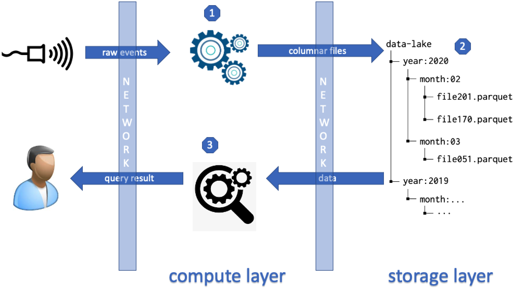

*Figura 1 da página 1 (344482 bytes)*

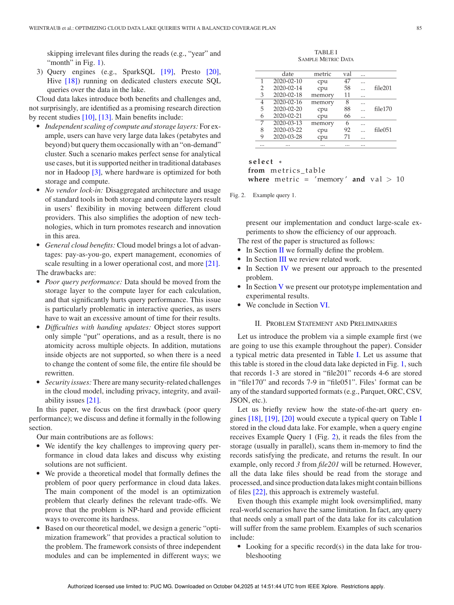

*Página 2 renderizada como imagem (444190 bytes)*

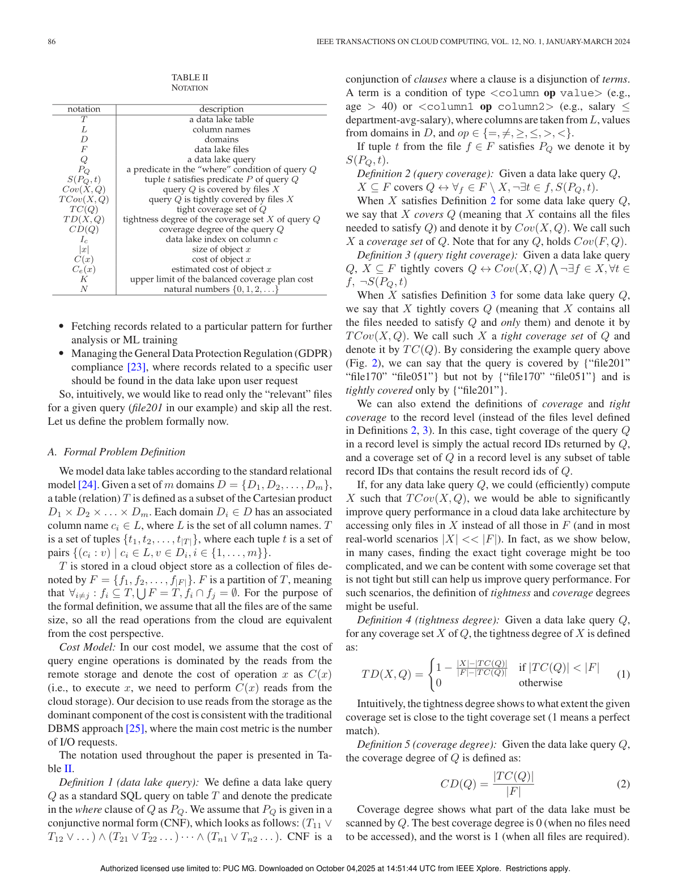

*Página 3 renderizada como imagem (492463 bytes)*

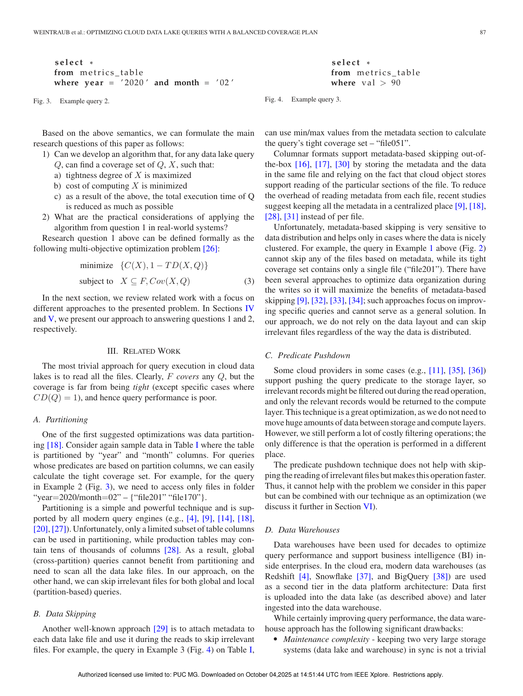

*Página 4 renderizada como imagem (437887 bytes)*

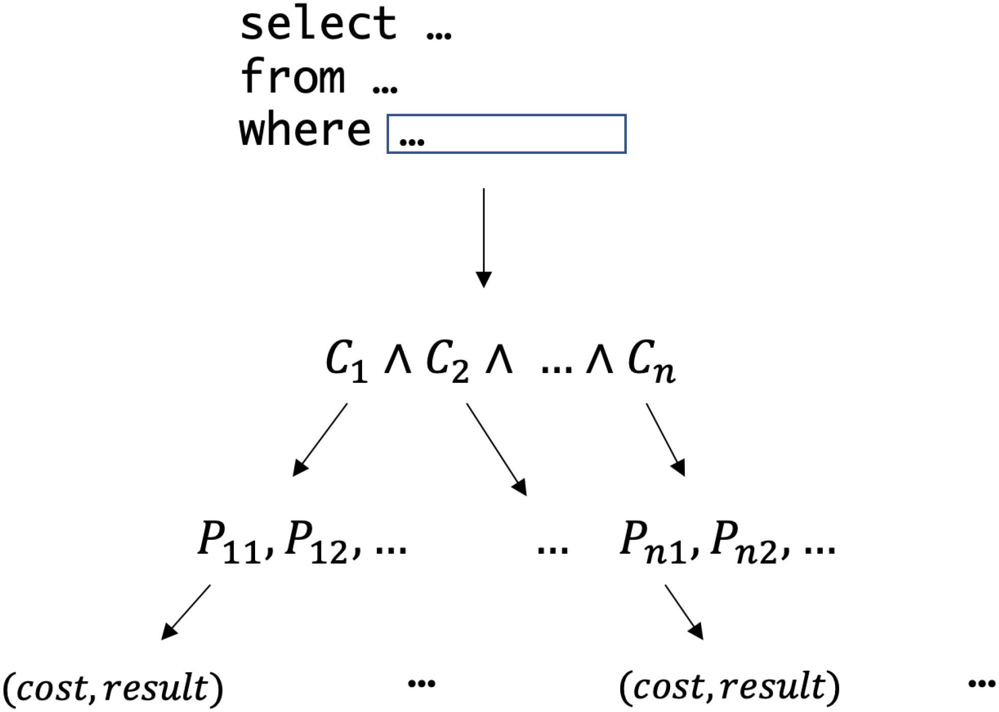

*Figura 1 da página 6 (153580 bytes)*

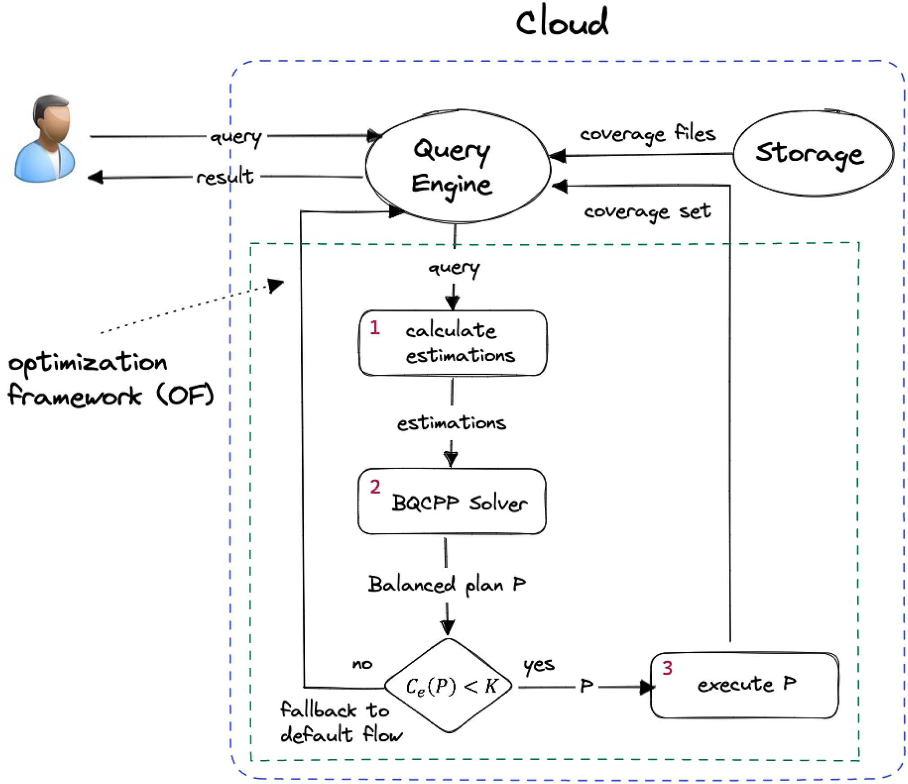

*Figura 1 da página 7 (842103 bytes)*

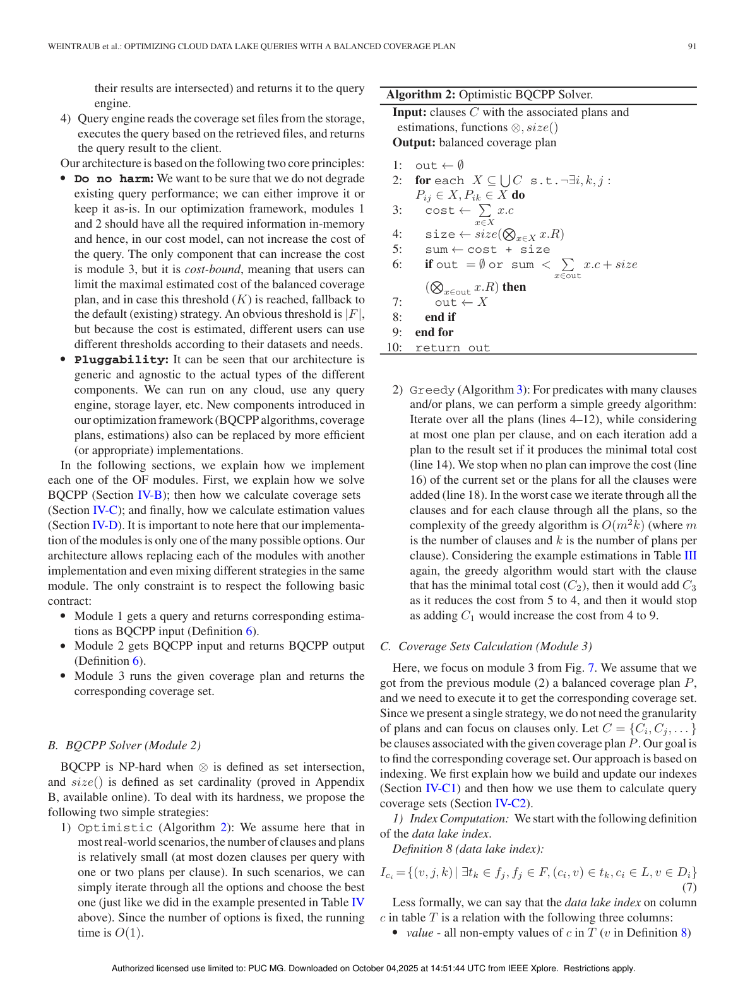

*Página 8 renderizada como imagem (454934 bytes)*

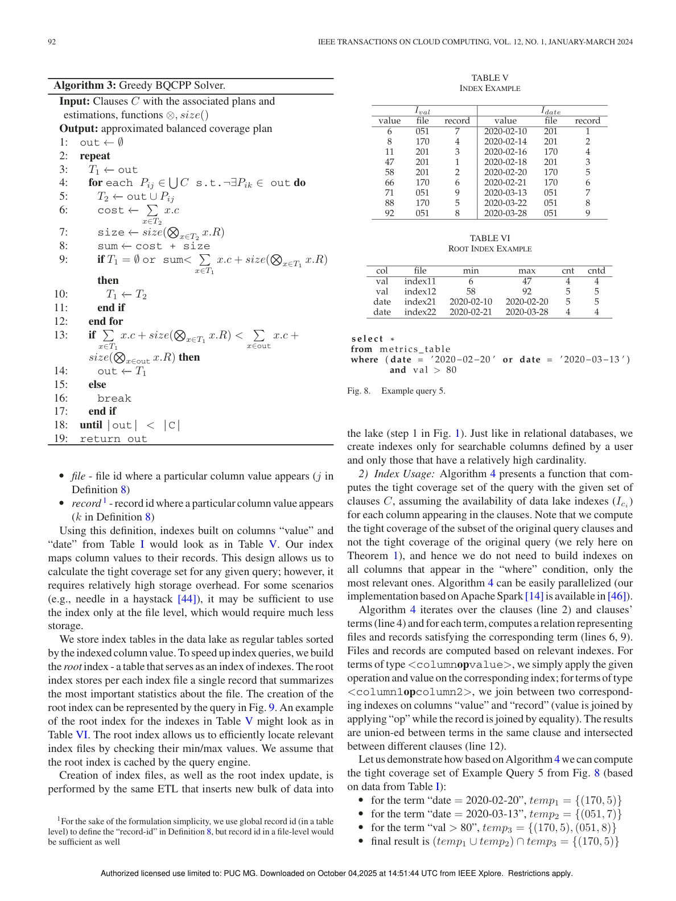

*Página 9 renderizada como imagem (389819 bytes)*

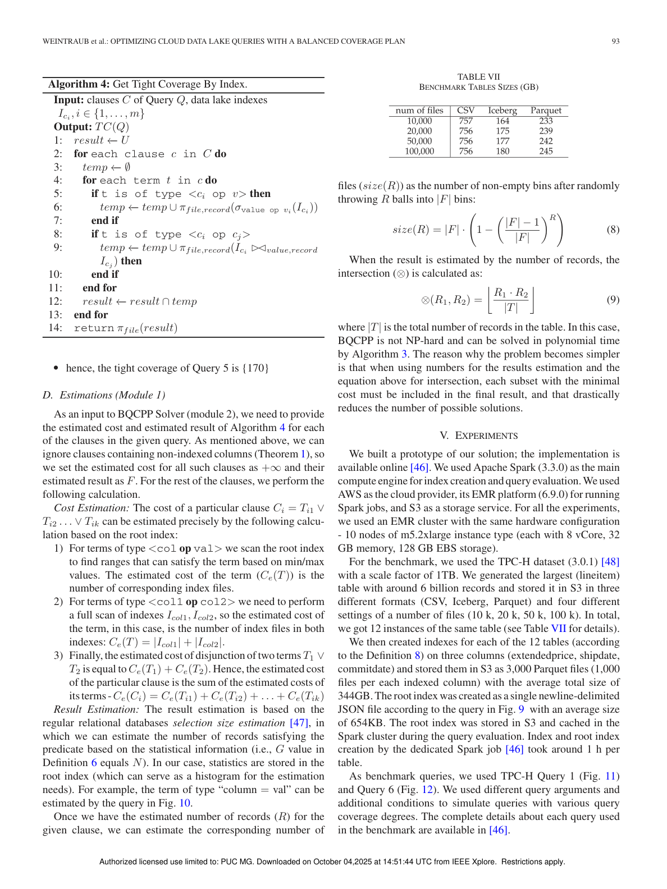

*Página 10 renderizada como imagem (429809 bytes)*

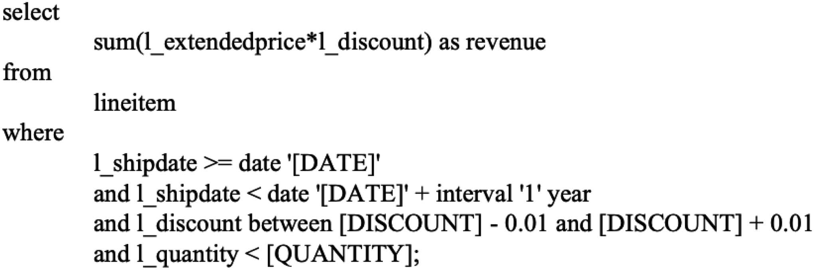

*Figura 1 da página 11 (189363 bytes)*

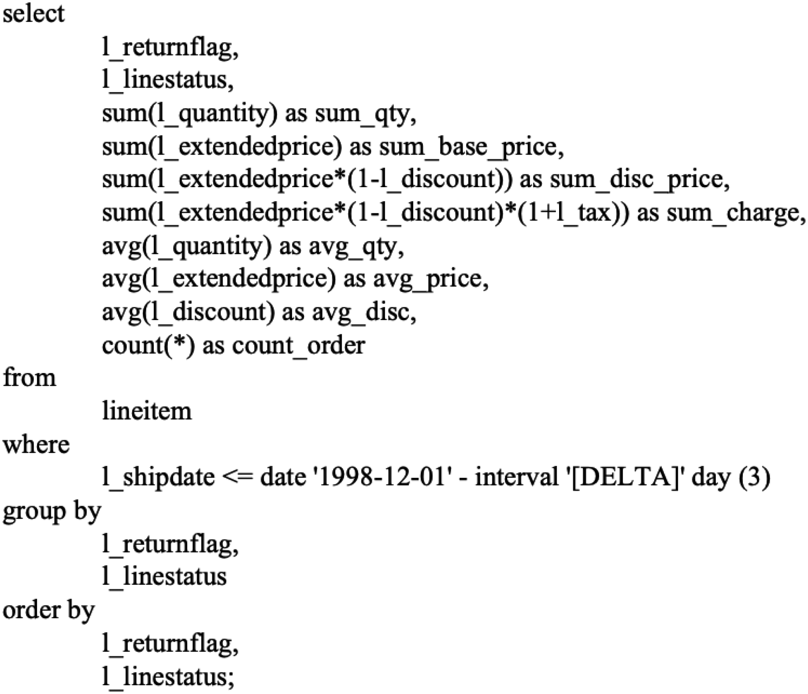

*Figura 2 da página 11 (257224 bytes)*

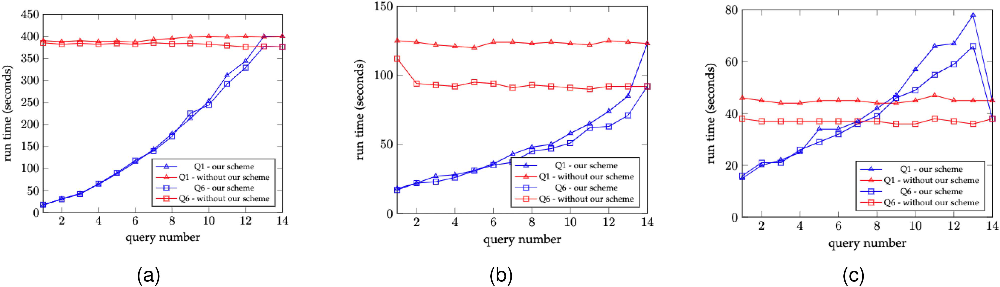

*Figura 1 da página 12 (1234250 bytes)*

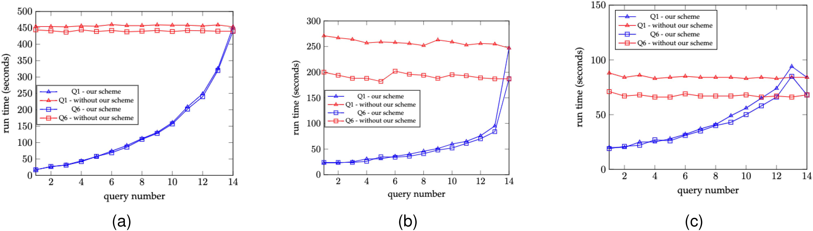

*Figura 2 da página 12 (1188054 bytes)*

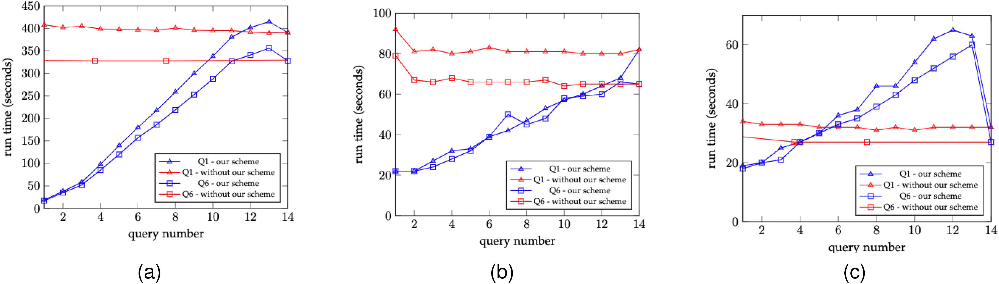

*Figura 3 da página 12 (1191095 bytes)*

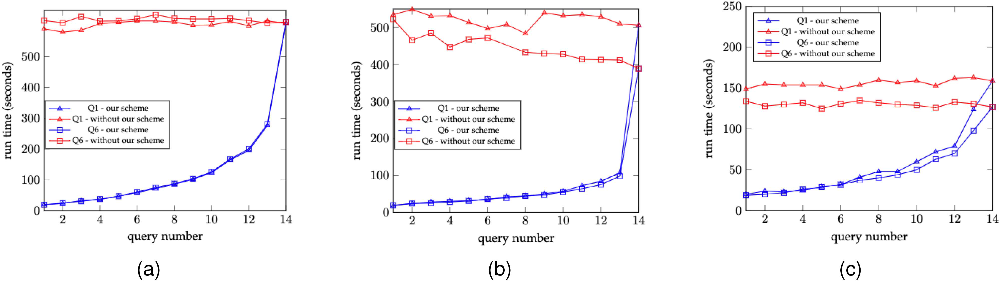

*Figura 1 da página 13 (1216924 bytes)*

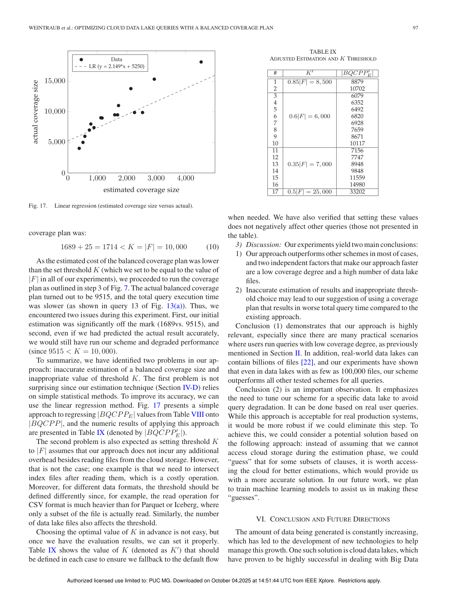

*Página 14 renderizada como imagem (390185 bytes)*

*Figura 1 da página 16 (221883 bytes)*

*Figura 2 da página 16 (184418 bytes)*

*Figura 3 da página 16 (203100 bytes)*

*Figura 4 da página 16 (181969 bytes)*

