# automated-multidimensional-data-layouts-in-amazon-redshift

> Convertido automaticamente de PDF para Markdown
>
> Arquivo original: `referencias/automated-multidimensional-data-layouts-in-amazon-redshift.pdf`
> Data de conversão: 22/08/2026 13:04:13
> Imagens extraídas: 18 arquivo(s)

---

**Automated Multidimensional Data Layouts in Amazon Redshift**

Jialin Ding

Amazon Web Services

jialind@amazon.com

Matt Abrams

Amazon Web Services

mpabrams@amazon.com

Sanghita Bandyopadhyay

Amazon Web Services

ssanghit@amazon.com

Luciano Di Palma

Amazon Web Services

ldpalma@amazon.com

Yanzhu Ji

Amazon Web Services

yanzhuji@amazon.com

Davide Pagano

Amazon Web Services

dpagano@amazon.com

Gopal Paliwal

Amazon Web Services

gppaliwa@amazon.com

Panos Parchas

Amazon Web Services

parchp@amazon.com

Pascal Pfeil

Amazon Web Services

pfeip@amazon.com

Orestis Polychroniou

Amazon Web Services

orestis@amazon.com

Gaurav Saxena

Amazon Web Services

gssaxena@amazon.com

Aamer Shah

Amazon Web Services

aamers@amazon.com

Amina Voloder

Amazon Web Services

avolode@amazon.com

Sherry Xiao

Amazon Web Services

xioyo@amazon.com

Davis Zhang

Amazon Web Services

zhanyeha@amazon.com

Tim Kraska

Amazon Web Services

timkrask@amazon.com

**ABSTRACT**

Analytic data systems typically use data layouts to improve the

performance of scanning and filtering data. Common data layout

techniques include single-column sort keys, compound sort keys,

andmorecomplexmultidimensionaldatalayoutssuchastheZ-order.

An appropriately-selected data layout over a table, in combination

with metadata such as zone maps, enables the system to skip irrele-

vant data blocks when scanning the table, which reduces the amount

of data scanned and improves query performance.

In this paper, we introduce Multidimensional Data Layouts

(MDDL), a new data layout technique which outperforms existing

data layout techniques for query workloads with repetitive scan

filters. Unlike existing data layout approaches, which typically sort

tables based on* columns*, MDDL sorts tables based on a collection

of* predicates*, which enables a much higher degree of specialization

to the user&#x2019;s workload. We additionally introduce an algorithm

for automatically learning the best MDDL for each table based on

telemetry collected from the historical workload. We implemented

MDDL within Amazon Redshift. Benchmarks on internal datasets

and workloads show that MDDL achieves up to 85% reduction in

end-to-end workload runtime compared to using traditional column-

based data layout techniques. MDDL is, to the best of our knowledge,

This work is licensed under a Creative Commons Attribution

International 4.0 License.

*SIGMOD-Companion &#x2019;24, June 9&#x2013;15, 2024, Santiago, AA, Chile*

&#xa9; 2024 Copyright held by the owner/author(s).

ACM ISBN 979-8-4007-0422-2/24/06.

https://doi.org/10.1145/3626246.3653379

the first data layout technique in a commercial product that sorts

based on predicates and automatically learns the best predicates.

**CCS CONCEPTS**

&#x2022;** Information systems** &#x2192;**Data layout**;** Autonomous database**

**administration**;** Online analytical processing engines**.

**KEYWORDS**

machine learning, data warehouse, analytic database, sort key

**ACM Reference Format:**

Jialin Ding, Matt Abrams, Sanghita Bandyopadhyay, Luciano Di Palma,

Yanzhu Ji, Davide Pagano, Gopal Paliwal, Panos Parchas, Pascal Pfeil, Orestis

Polychroniou, Gaurav Saxena, Aamer Shah, Amina Voloder, Sherry Xiao,

Davis Zhang, and Tim Kraska. 2024. Automated Multidimensional Data Lay-

outs in Amazon Redshift. In* Companion of the 2024 International Conference*

*on Management of Data (SIGMOD-Companion &#x2019;24), June 9&#x2013;15, 2024, Santi-*

*ago, AA, Chile.* ACM, New York, NY, USA, 13 pages. https://doi.org/10.1145/

3626246.3653379

**1**

**INTRODUCTION**

Analytic data systems support workloads which typically scan and

filter large amounts of data. Therefore, one important method for

improving performance is to minimize the amount of data accessed

during the scan step. There are generally two approaches to reduc-

ing data access for relational database systems. The first is to use

columnar storage so that only the relevant columns for each query

are accessed. The second is to use an appropriate data layout so that

only the relevant rows for each query are accessed.

---

SIGMOD-Companion &#x2019;24, June 9&#x2013;15, 2024, Santiago, AA, Chile

Jialin Ding et al.

**(a) Single-column sort key over**

**column A.**

**(b) Highlighted blocks scanned**

**when executing Listing 1.**

**Figure 1: Example of using a single-column sort key.**

**Listing 1: Example query**

**SELECT avg**(colA)** FROM** T

**WHERE** colC ILIKE &apos;%black%&apos;

**Listing 2: Example query rewritten to use MDDL**

**SELECT avg**(colA)** FROM** T

**WHERE** mddl_col** IN** (2, 3)

The predominant data layout technique in analytic data systems

is to use a sort key (also known as a partitioning key or clustering

key) to sort and cluster rows into horizontal partitions, also known

as data blocks. Metadata is then constructed and stored for each

block, which enables the execution engine to skip irrelevant blocks

during query processing. One common form of metadata is to store

the minimum and maximum values in each column for the block,

oftenknownasazonemap[3,9]orsmallmaterializedaggregate[23].

During query execution, the system uses the zone map for each data

blocktoquicklydetermineifanyrowintheblockcouldberelevantto

the query, i.e., if any row would satisfy the scan filter. If not, then the

entire block is skipped. For instance, assume a scan predicate colA

> 42 and a data block of colA with min = 10 and max = 20. Clearly,

this block cannot contain any tuple that satisfies the predicate, so

it can be safely skipped. Reducing the number of blocks and rows

scanned can substantially improve overall query performance.

The choice of sort key&#x2014;and more generally the data layout tech-

nique overall&#x2014;has a significant impact on the effectiveness of block

skipping. Almost all data systems support a single-column sort key,

whichworkswellifthereisonedominantcolumnthatisfilteredover

in the workload. However, this is not as effective if there are multiple

columns that are filtered over. In that case, some systems support

compound sort keys (i.e., sort by a series of columns in sequence) or

Z-order sorting (i.e., sort by a collection of columns simultaneously,

also known as interleaved sort key). However, even these sort orders

may fail to specialize to the user&#x2019;s workload.

Fundamentally, a data layout&#x2019;s purpose is to divide the data in

such a way that for a given query with a scan filter, the relevant data

blocks are physically separated from the irrelevant ones. Sorting by a

column or a collection of columns is a coarse-grained way to achieve

that. The most direct way is to separate the data based on whether or

not they qualify for the expected filters. This is especially effective

for workloads with repetitive filter predicates, so that the filters seen

in the past are indicative of those that will be seen in the future.

**An Illustrative Example.** Fig. 1 introduces a running example,

which we use throughout the remainder of this paper. Assume a

**(a) Sorting by MDDL with two**

**predicates (****colA > colB**** and**** colC**

**ILIKE &#x2019;%black%&#x2019;****) results in four**

**distinct regions.**

**(b) Highlighted blocks are read**

**when executing Listing 1, which**

**is**

**internally**

**rewritten**

**into**

**Listing 2.**

**Figure 2: For a workload that consists of queries that**

**frequently filter by the same predicates (****colA > colB**** and**** colC**

**ILIKE &#x2019;%black%&#x2019;****), using MDDL results in much fewer rows**

**and blocks scanned compared to column-based sort keys.**

table T with three columns, as shown in Fig. 1a. T is sorted by column

colA and is stored in columnar format. Data blocks are denoted by

bold black lines (Fig. 1b). Different columns may contain different

numbers of rows in a data block depending on the column&#x2019;s data

type and encoding. Imagine that scans over T almost always contain

at least one of these two filter predicates: colA > colB and colC

ILIKE &#x2018;%black%&#x2019;. Neither of these filters can take advantage of

sort keys or zone maps. For example, if the user issues the query in

Listing 1 then even if we sorted the table by colC, we would still need

to read all blocks from colC, because we cannot determine whether a

colC block contains a value like &#x2018;%black%&#x2019; based only on per-block

min/max statistics. As a result, this query scans many blocks during

execution; specifically, in Fig. 1b, we read all predicate column (colC)

blocks in green and all payload column (colA) blocks in orange.

To improve scans over this table, we first define a multidimen-

sional sort function which takes a row and returns a number:

if (

colC ILIKE &apos;%black%&apos; AND

colA > colB) return 3

if (

colC ILIKE &apos;%black%&apos; AND NOT colA > colB) return 2

if (NOT colC ILIKE &apos;%black%&apos; AND

colA > colB) return 1

if (NOT colC ILIKE &apos;%black%&apos; AND NOT colA > colB) return 0

Note that this can be expressed more concisely in SQL as

case when colC ILIKE &apos;%black%&apos; then 2 else 0 end +

case when colA > colB then 1 else 0 end

Using this function, we can map each row of T to a value between

0 and 3. We materialize these values in a new column mddl_col and

set it as the new sort key (Fig. 2a). Now if the user issues the same

query as before (Listing 1), we know based on the sort function defi-

nition that any rows satisfying the filter can only have an mddl_col

value of 2 or 3, so we can rewrite the scan filter to the equivalent

WHERE mddl_col IN (2, 3) AND colC ILIKE &#x2018;%black%&#x2019;. This

injected filter allows us to skip blocks over the mddl_col column

via min/max pruning and therefore reduce the number of rows to

scan. In fact, we can do even better: since mddl_col IN (2, 3) is

semantically equivalent to colC ILIKE &#x2018;%black%&#x2019;, we can remove

the latter predicate altogether. We have essentially rewritten the

query in Listing 1 into the equivalent query in Listing 2.

Applying this multidimensional sort function, which we call a

multidimensional data layout (MDDL), results in much better per-

formance for this query: firstly, we can now skip blocks based on

mddl_col. Secondly, we avoid scanning colC altogether, which not

only reduces I/O but also avoids evaluating an expensive string

regex predicate. Thirdly, we read fewer blocks of colA, since rele-

vant values are now co-located in the same block. In Fig. 2b, we

---

Automated Multidimensional Data Layouts in Amazon Redshift

SIGMOD-Companion &#x2019;24, June 9&#x2013;15, 2024, Santiago, AA, Chile

read all predicate blocks in green and all payload blocks in or-

ange, which is much less than the number of blocks we needed

to read for executing the same query under a single-column sort key

(Fig. 1b).

We implement MDDL inside Amazon Redshift, AWS&#x2019;s cloud data

warehouse product. MDDL is a completely automated feature, which

means that Redshift decides when and how to apply MDDL to user

tables, as long as users have not already explicitly chosen a sort key.

Benchmarks on internal datasets and workloads show that MDDL

achieves up to 85% reduction in end-to-end workload runtime and up

to 100&#xd7; faster performance on individual queries, compared to tradi-

tional column-based data layouts such as single-column, compound,

and interleaved sort keys. MDDL is, to the best of our knowledge, the

first data layout technique in a commercial product that sorts based

on predicates* and* automatically learns the most effective predicates.

MDDL has now been released to customers in Public Preview1 and

will be rolled out in general availability in the coming months.

In the remainder of this paper, we provide background (Section 2),

give an overview of MDDL (Section 3), describe how MDDL is phys-

ically constructed, maintained, and used on a table (Section 4), de-

scribe the algorithm for automatically selecting MDDL (Section 5),

present an experimental evaluation (Section 6), discuss design de-

cisions and future directions (Section 7), and conclude (Section 8).

**2**

**BACKGROUND**

MDDL is an automated data layout technique implemented in Ama-

zon Redshift. This section provides the background for existing data

layout techniques, automation for data layouts, and Redshift itself.

**2.1**

**Data layouts**

In modern analytic systems, the physical data layout of a table is typi-

cally based on a sort column (e.g., sort all records by their value in the

timestamp column, then partition contiguous records into blocks) or

morecomplexmulti-columnsortorderssuchasZ-order[8,31].How-

ever, single-column sort orders are less useful when the workload

filters on multiple different columns, and manually tuning multi-

column sort orders is laborious and error-prone.

Amazon Redshift and Databricks offer the ability to automati-

cally select the best column-based data layout and evolve the lay-

out over time [5, 14], but neither supports predicate-based layouts.

Snowflake and Oracle support clustering or indexing based on pred-

icates [7, 10], but neither supports automatic predicate selection. In

contrast, MDDL is an automated predicate-based data layout.

Instance-optimized data layouts [21, 22, 24, 27, 28, 30] are tech-

niquesthataimtoautomaticallygeneratemorecomplexdatalayouts

that are highly specialized to a particular dataset and workload. For

example, Flood [24] automatically produces fine-grained grid-based

data layouts that are specialized for data stored in memory, and

qd-tree [30] automatically produces coarse-grained tree-based data

layouts that are specialized for data stored on disk or on remote cloud

storage. MDDL takes inspiration from these techniques.

1https://aws.amazon.com/blogs/big-data/improve-performance-of-workloads-

containing-repetitive-scan-filters-with-multidimensional-data-layout-sort-keys-in-

amazon-redshift/

**2.2**

**Amazon Redshift**

Amazon Redshift [17] is AWS&#x2019;s cloud data warehouse. Each Redshift

cluster uses an MPP execution engine spread across multiple EC2

nodes. Data is persisted on S3 and is cached on the local disk of EC2

nodes for faster access. Redshift uses columnar storage. It stores the

data of each column in data blocks (in compressed form), and uses

a fixed size of 1MB per data block, therefore data blocks of different

columns are not horizontally aligned. This is in contrast to the PAX-

style [16] partitions of other analytic systems such as Snowflake

and Azure Synapse Analytics [11, 12], in which each column of the

partition has the same number of rows.

Redshift maintains min/max values per data block. These are es-

pecially helpful for early pruning of blocks whose [min,max] range

does not overlap with the predicate range of a filter column. When

executing scans, Redshift uses this metadata to construct* row ranges*

for each column that need to be scanned, based on the column fil-

ters. If there are filters over multiple columns, the row ranges are

intersected (or unioned in the case of OR) to construct an overall set

of row ranges. Then, only data blocks across relevant columns that

intersect any row range are scanned.

Redshift uses SIMD-vectorized scan execution with late materi-

alization: the query predicates are ordered in decreasing order of

estimated selectivity, so that the most selective predicate is evaluated

first. Redshift executes each predicate sequentially, maintaining a

bitvector that represents the rows that have qualified for all predi-

cates so far. Finally, this bitvector is used to decide which blocks or

rows to read from the payload columns, i.e., the columns used for

downstream operations.

*2.2.1*

*Automation in Redshift.* Redshift automates many decisions

that database administrators would traditionally need to make man-

ually. In particular, Redshift Advisor [2] is a component that makes

performance-related recommendations about a table&#x2019;s physical de-

sign, such as changes in sort key, distribution key [25], and column

encoding (compression). These recommendations are continuously

re-evaluated in case of workload changes. Unless the user has made

explicit choices, Automatic Table Optimization [14] applies these

recommended changes in the background on behalf of the users.

In terms of sort keys, Advisor currently only recommends single-

column sort keys. With the addition of MDDL, we integrate with

Advisor so that it not only recommends MDDL, but it also intelli-

gently chooses between the two for each table.

Redshift also offers Automatic Table Sort [4], which uses back-

ground tasks to gradually sort a table by its sort key, focusing only

on the parts of the table that would improve performance if sorted

(e.g., data blocks that are never scanned anyway do not need to be

sorted). This capability is scheduled to minimize impact on user&#x2019;s

workload and yields if resources become scarce [26]. When Redshift

Advisor changes a table&#x2019;s sort key, the table is not immediately re-

sorted, but rather relies on Automatic Table Sort to perform the sort

incrementally.

**3**

**MDDL OVERVIEW**

This section, provides a high-level overview of MDDL, including our

design principles, and its strengths and weaknesses. Fig. 3 illustrates

the overall life cycle of MDDL:

---

SIGMOD-Companion &#x2019;24, June 9&#x2013;15, 2024, Santiago, AA, Chile

Jialin Ding et al.

**Figure 3: The life cycle of MDDL on a given table.**

(1) Redshift Advisor uses historical telemetry to decide which tables

should get MDDL, and if so, which predicates to use in MDDL

(Section 5).

(2) MDDL is a new physical column in the table, and the predicate

definitions are stored in the catalog (Section 4.1).

(3) As part of Automatic Table Optimization (ATO), a background

worker receives recommendations from Redshift Advisor and

creates the MDDL column in the background. Initially, the col-

umn is populated with default values (Section 4.3).

(4) Any inserts and updates into the table will automatically com-

pute the MDDL column values for the new rows (Section 4.4).

(5) Queries with scan filters that match with the MDDL predicates

will automatically use the MDDL column to accelerate the scan

(Section 4.2).

(6) Background tasks will gradually compute any missing MDDL

column values and sort the table by the MDDL column over time

(Section 4.3).

(7) (Not shown in Fig. 3) The MDDL column may eventually be

dropped from the table, because either the user or Advisor de-

cides to set a different sort key (Section 4.5).

Note that a table does not need to be fully sorted in order to benefit

from MDDL (see Section 4.3).

**3.1**

**Design Principles**

We followed several design principles while implementing MDDL.

**Make data-driven design decisions.** Before designing MDDL,

we performed fleet-wide analysis to make quantifiable decisions

about the most impactful ways to improve performance through

datalayouts.Wefoundthatfilterpredicatesarehighlyrepetitive,and

that in over 50% of customer clusters, over 80% of scan filters repeat

exactly. As a result, in MDDL we decided to focus on exact match of

predicates, unlike existing work on instance-optimized data layouts

that typically targets predicate intersection and subsumption (see

Section 2.1). Although restricting ourselves to exact match may seem

like a missed opportunity, we decided it was appropriate given the

statistics we collected; we designed MDDL in such a way that we

can extend its capabilities to inexact match in the future, if desired.

**Minimize impact on customer workloads.** Creation and main-

tenance of MDDL should impact customer workload performance

as little as possible. Therefore, the MDDL design relies as much as

possible on background tasks for maintenance operations, which are

scheduled when there is least impact to the customer&#x2019;s workload.

**Play nice with other components.** Redshift is a complex system

with many existing components. We designed MDDL to interact

nicely with them, and also to build on top of components such as the

background task scheduler and Automatic Table Sort where appro-

priate. See Section 7.2 for a discussion of MDDL&#x2019;s interaction with

non-data-layout components.

**3.2**

**Strengths and Limitations**

Compared to data layout techniques that rely on column-based

sorting, such as single-column sort keys, compound sort keys, and

interleaved sort keys, MDDL is able to highly specialize to the user&#x2019;s

workload by sorting directly on important frequently-occurring

predicates. Many scan filters contain predicates that cannot take

advantage of block skipping via zone maps (e.g., the predicates in

Fig.2),butthosepredicatescanbeusedtoskipblocksifusedinMDDL.

Another subtle but impactful strength is that unlike column-based

sorting, which enforces a natural order (e.g., alphanumeric order)

over column values, MDDL can use predicates to sort on any arbi-

trary order. In particular, Redshift does not allow sorting on columns

with semistructured data like JSON [13] and spatial data [18] be-

cause there is no natural sort order. However, with MDDL we can

sort based on predicates over semistructured and geographic data.

OnelimitationofMDDListhatitonlyusespredicatesoverasingle

table. It does not use join predicates, or join-induced predicates [21].

As a result, it is not as effective on workloads in which scans on

large tables can benefit from laying out data based on predicates

from smaller tables, such as in TPC-DS. Naturally, MDDL cannot

use predicates that are nondeterministic, i.e., whose output might

change on each invocation. For example, it skips predicates that use

mutable functions such as RANDOM().

---

Automated Multidimensional Data Layouts in Amazon Redshift

SIGMOD-Companion &#x2019;24, June 9&#x2013;15, 2024, Santiago, AA, Chile

**4**

**MDDL LIFE CYCLE**

In this section, we provide details about the MDDL life cycle after

it has been recommended by Redshift Advisor.

**4.1**

**Storage**

A table that uses MDDL as its data layout incurs storage overhead

in two places: in an additional column in the table itself and in some

further metadata in the catalog.

*4.1.1*

*MDDL Column.* Tables that use MDDL have an additional

column, which we refer to as the MDDL column. This column is hid-

den from users: it is not returned for SELECT * queries, it cannot be

read explicitly with SELECT mddl_col, users cannot explicitly insert,

delete, or update values in the column, and users cannot alter other

column properties such as its encoding style. Instead, Redshift man-

ages setting column entries to the appropriate values (Section 4.4)

and usage of the column for accelerating scans (Section 4.2) behind

the scenes.

The MDDL column has an integer data type and each column

value is interpreted as a bitmap. Each bit position (except for the

most significant bit) is potentially associated with a predicate, and

the bit&#x2019;s value represents whether that predicate is satisfied on the

associated row of the table. The width of the integer data type there-

fore determines the maximum number of predicates that the MDDL

can use (e.g., an MDDL column with 4-byte integer data type sup-

ports up to 31 predicates). Some bit positions might not be associated

with a predicate, either because we purposefully decided to include

fewer predicates in the MDDL than the maximum (see Section 5) or

because the bit position was originally associated with a predicate

but the predicate was subsequently invalidated (see Section 4.1.2).

The most significant bit of each MDDL column value is set to 0

if and only if the bits in all other positions have been properly set

according to their associated predicates (bit positions that are not

associated with any predicate do not matter). Therefore, a negative

MDDL column value (i.e., an integer with its most significant bit set

to 1) is a temporary value which represents that the correct value

has not yet been computed. Such* uncomputed values* arise when first

creating the MDDL column (see Section 4.3) and in other edge cases

(see Section 4.4). MDDL column values may transition from uncom-

puted to computed (Section 4.3), but once an MDDL column value is

computed, it never becomes uncomputed (Section 4.4). We decided

to encode computedness in the most significant bit instead of using

NULL to denote uncomputed values because non-nullable columns

have better performance than nullable columns. In fact, values with

themostsignificantbitsetrepresentmultiplerowswithuncomputed

MDDL, as the remaining bits are used as a counter for run length en-

coding. Thus we can encode sequences of uncomputed MDDL values

trivially and also skip them instantly during scans (see Section 4.2).

*4.1.2*

*MDDL in the Catalog.* We store the MDDL&#x2019;s definition in the

catalog.Itconsistsof(1)thedefinitionsofthepredicatesthatcompose

the MDDL, in text form, and (2) the bit position that each predicate is

associated with. The catalog acts as the single source of truth about

the MDDL definition. Over time, some predicates may become in-

valid. For example, one of the predicates may reference a column that

is subsequently dropped from the table, and therefore the predicate

becomes semantically meaningless. Redshift detects such cases and

**Figure 4: Filters use per-block zone maps to determine the row**

**range(s) that need to be scanned. A scan that filters by**** colA =**

**0 AND colB > 1**** would determine row ranges for**** colA**** and**** colB**

**independently, then intersect them. A scan that filters by**** colC**

**ILIKE &#x2019;%black%&#x2019;**** cannot use zone map information to skip**

**blocks, but the equivalent MDDL filter (****mddl_col & 2 = 2****) can.**

automaticallyinvalidatesthepredicatebydeletingitsdefinitionfrom

the catalog, so that the associated bit position in the MDDL column is

ignored for all future maintenance and scan operations (Sections 4.2

and 4.4). Note that other bits in the MDDL column still remain valid.

In other words, an MDDL is created with a set of predicates, and

predicates can be removed over time, independently of each other.

On the flip side, we do not allow predicates to be added to the

MDDL column after it has been created, since this would require

rewriting the entire MDDL column to set the associated bit correctly

for each MDDL column value; this would be equivalent to simply

creating an entirely new MDDL on the table.

**4.2**

**Usage in Accelerating Scans**

At a high level, there are two parts to using MDDL in scans, which

we describe in further detail below: (1) Using MDDL to skip blocks,

which reduces the number of rows scanned, and (2) skipping redun-

dantuserpredicates,whichreducesthenumberofcolumnsscanned.

*4.2.1*

*Using MDDL to reduce rows scanned.* MDDL operates over a

single table. Therefore, we allow a query to pass through the query

planner and for filters to be pushed down to scans, before we apply

any MDDL logic. If a query scans multiple tables, then MDDL logic

is applied to each table scan independently; MDDL usage does not

affect the optimal join order or other downstream operators because

the output of the scan step is exactly the same regardless of whether

MDDL is used. At this point, we have already collected the list of

predicates in the filter, and we have an initial ordering of this list by

decreasing estimated selectivity, so that the most selective predicate

will be evaluated first. Redshift automatically applies MDDL with

the following steps:

(1) We read the table&#x2019;s MDDL predicates from the catalog and con-

vert each to an internal AST representation, then perform pair-

wise comparisons with the predicates in the query filter to find

those that exactly match.

(2) If at least one predicate matched, then we construct an MDDL

filter, i.e., a predicate over the MDDL column that is semantically

---

SIGMOD-Companion &#x2019;24, June 9&#x2013;15, 2024, Santiago, AA, Chile

Jialin Ding et al.

**Listing 3: Logic to determine whether to skip a block based on**

**the block&#x2019;s min/max values and the MDDL filter&#x2019;s bitmask.**

def can_skip_block(bitmask: int , minval: int , maxval: int):

#  Find the first value greater than or equal to minval

#  that satisfies &apos;value & bitmask = bitmask &apos;. The

#  trick is to find the most significant bit that is 1

#  in bitmask and 0 in minval.

x: int = bitmask & ~minval

if (x == 0) return False

msb: int = get_most_significant_set_bit_position(x)

trailing_bits_mask: int = (1 << (msb + 1)) - 1

next_value = (( minval & ~trailing_bits_mask) |

(bitmask & trailing_bits_mask ))

return next_value > max_val

equivalenttotheconjunctionofallmatcheduserpredicates.Con-

ceptually, the MDDL filter checks whether the MDDL column

valueisoneofthevalidvalues(e.g.,thefilterinListing2),butthis

can result in a long IN-list that is expensive to evaluate. There-

fore, we write the MDDL filter as a bit comparison that follows

the form mddl_col & bitmask = bitmask, where bitmask is

an integer where bits corresponding to matched predicates are 1.

(3) WeplacetheMDDLfilterintothefilterpredicateslist,whilemain-

taining the property that predicates are ordered by selectivity.

Fig. 4 continues our running example for a query with slightly differ-

ent filters. The rectangles depict the various data blocks per column,

with the corresponding row ranges denoted at the top and bottom

of each block. The zone maps table contains the min/max values per

data block. For the orange filter, zone maps can be dirrectly used to

determine the row ranges for colA and colB. Consider the green

filter, which is the same as in Listing 1. Without MDDL, we would

not be able to use min/max values per block to determine whether

a block of colC can be skipped. Since MDDL filters always follow

the form mddl_col & bitmask = bitmask, we can use specialized

bit manipulation logic to determine whether any value between the

min and max can satisfy the predicate, without individually checking

every qualifying MDDL column value.

Listing 3 contains the pseudocode for the block skipping logic.

Unlike literal predicates, simply checking if the bitmask overlaps

with the [min, max] range is not enough. For example, assume the

bit representations min = 01001, max = 01100, and bitmask =

00100. Clearly the bitmask value does not fall inside the [min, max]

range, but there is a value in the range that could satisfy mddl_col

& bitmask = bitmask, which is 01100. The pseudocode in Listing 3

finds the smallest value greater than min that would satisfy the con-

dition value & bitmask = bitmask and checks whether that value

is greater than max, in which case the block can be skipped.

After skipping blocks, Redshift begins to read the data blocks that

qualified. When applying the MDDL filter, we use a specialized vec-

torized scan operator with SIMD instructions to efficiently evaluate

the MDDL filter over the MDDL column. The output is a bitvector

that represents rows that have qualified by the MDDL filter, and this

is passed to subsequent filter predicates. Note that rows with uncom-

puted MDDL values (Section 4.1.1) are treated as pass-through, since

we cannot filter based on an uncomputed MDDL value.

*4.2.2*

*Using MDDL to reduce columns scanned.* Since the MDDL fil-

terissemanticallyequivalenttothematchedpredicates,ifwehaveal-

ready applied the MDDL filter, then we do not even need to apply the

matched predicates. Therefore, we can avoid executing the matched

predicates altogether, and the predicate columns referenced by those

skipped predicates do not need to be read at all. In this sense, MDDL

acts as a predicate evaluation cache, so that predicates evaluated in

the past do not need to be re-evaluated again, but rather the evalua-

tionresultcanbereaddirectlyfromthecache,i.e.,theMDDLcolumn.

In cases where the MDDL column is not fully computed, we can-

not entirely skip the matched predicates. However, Redshift does

not evaluate filters over the entire table at once, but rather in tum-

bling windows of rows whose size is configured to match cache sizes.

Therefore, we perform an adaptive execution, where for windows

in which the MDDL column is fully computed, we skip the matched

predicates. If the MDDL column is partially computed in the window,

we still execute the matched predicates. In this case, using the MDDL

filter is still beneficial, since it helps narrow down the bitvector of

qualified rows. In cases where the entire window only contains un-

computed MDDL values, then the MDDL filter is truly a no-op and

offers no benefit; likewise it does not introduce any overhead, since

Redshift skips sequences of rows with uncomputed MDDL instantly

by taking advantage of the run length encoding.

**4.3**

**Creation**

There are three stages to creating MDDL on a table: (1) creating the

MDDL column itself, filled with uncomputed values, and populating

the catalog with the predicate definitions, (2) computing the values

of the MDDL column, and (3) sorting the table by the MDDL column.

The stages are in increasing order of time consumption. Creating

the column itself is highly efficient: we fill the column with repeats

of the same uncomputed value (since all uncomputed values are

semantically equivalent, we use -1 by default), encoded as a run

length, which typically only requires writing a single data block.

The second stage of computing the MDDL column values is slightly

more costly because we replace all MDDL column blocks with new

blocks that contain the computed values. This also requires reading

the columns that are referenced in the MDDL predicates. The last

stage is the most expensive, since it essentially involves a VACUUM

operation that requires rewriting all blocks of all columns.

The first stage is performed atomically (i.e., we add the complete

column, not a partial column), and the following two stages are per-

formed incrementally (e.g., we compute only a part of the MDDL

column at a time). All stages are performed by background tasks

in order to minimize interference with the user&#x2019;s workload. Specif-

ically, the background tasks for the first two stages are processed

in a FIFO manner by Redshift&#x2019;s background task scheduler along

with other background tasks, whereas the background task for stage

3 is scheduled according to the existing logic for Automatic Table

Sort, i.e., it is only scheduled when internal telemetry indicates that

sorting would improve scan performance.

We separate creation into three distinct stages instead of per-

forming them all at once because it is easier for the background

task scheduler to fairly schedule many inexpensive tasks than one

expensive task, and longer-duration tasks have a higher probability

of preemption due to spikes in the user workload, which results in

loss of progress. Also, note that MDDL will already become useful as

soon as stage 2 has begun, i.e., as soon as the MDDL column becomes

partially computed: even though the table is not sorted by MDDL,

---

Automated Multidimensional Data Layouts in Amazon Redshift

SIGMOD-Companion &#x2019;24, June 9&#x2013;15, 2024, Santiago, AA, Chile

we can use MDDL to avoid reading from other predicate columns

(see Section 4.2.2).

**4.4**

**Maintenance Under Changing Data**

As rows are inserted, updated and deleted from the table, there are

two aspects of MDDL that need to be maintained: first, we must

maintain the correct values in the MDDL column. Second, we must

maintain the overall sorted order of the table by the MDDL column.

This subsection only describes maintenance in cases where the data

changes but the MDDL definition remains the same. For discussion

of when and how we would change the MDDL definition entirely,

see Section 4.5.

*4.4.1*

*Maintenance of MDDL Column Values.* As long as a row re-

mains unchanged, its MDDL value also remains correct. That is, a

given row&#x2019;s MDDL value does not need to change in response to data

changes in other rows. Therefore, we only need to maintain correct

MDDL values in newly inserted rows2. We automatically compute

the MDDL value on the write path of inserts and COPY commands.

This adds minimal overhead to the overall insert, since the computa-

tionisperformedwhenthedataisalreadyinmemory,andistherefore

cheap compared to the existing cost of reading data from S3 (in the

caseof COPY),distributingrowstodifferentnodes,andwritingtodata

blocks. In cases where extremely low-latency inserts are required

(e.g., Redshift&#x2019;s APPEND command [1]), we skip MDDL computation

and simply insert an uncomputed MDDL value; a background task

will eventually replace it with the correctly-computed value.

*4.4.2*

*Maintenance of Sortedness.* Second, we must maintain the

overall sortedness of the table according to the MDDL column. In

Redshift, inserted rows are appended to the end of the table. If there

is a sort key on a table, then all rows inserted by the same command

(such as all rows in batch insert with COPY) are sorted in memory

before they are inserted. Therefore, batch inserts into tables that use

MDDLwillalreadybeappendedtotheendofthetableinsortedorder.

However, even though each batch of inserts is sorted, there is not

necessarily a sorted order between batches. To maintain the global

sorted order of a table, MDDL relies on the mechanisms that are

already in place in Redshift for tables with sort keys. In particular,

there are two mechanisms:

(1) The user can manually run VACUUM SORT, which fully sorts the

table. This can be an expensive operation since it rewrites all

data blocks of all columns in the table, and it places the burden

on the user to schedule the vacuum.

(2) Redshift offers Automatic Table Sort (ATS), which is a back-

ground process that periodically checks historical telemetry to

determine whether sorting would improve performance, and

only performs sorting if it does. ATS intelligently schedules the

sort operations so that they are performed on more impactful

tables first. Furthermore, ATS does not sort the entire table, but

only the horizontal partitions of the table that would see the

most benefit (hot partitions that are often scanned by queries).

**4.5**

**Retirement**

Due to either changing data or changing workloads, the MDDL

defined on a table may no longer be appropriate: there may be a

2In Redshift, an update is implemented as a delete followed by an insert.

better alternative MDDL with different predicates, or a traditional

single-column sort key may be more performant. To decide when

to transition to a different sort key, we use the Advisor algorithm

from Section 5. Even after Advisor recommends an MDDL sort key

over a table, it continues to run its algorithm over each table, but

only computes benefits based on the workload since the last rec-

ommendation, not over the entire historical workload. If Advisor

determines that the benefit of an alternative sort key becomes higher

than the observed benefit of the existing sort key on the table, then

it automatically begins the transition. We also maintain a static con-

stant for the minimum amount of time between sort key changes,

so that we prevent frequent thrashing between different sort keys.

**5**

**AUTOMATIC MDDL SELECTION**

Redshift Advisor automatically decides which tables to create MDDL

on and which predicates to use in each MDDL. This section provides

background on the existing Advisor service, then describes how

MDDL integrates into it.

**5.1**

**Redshift Advisor**

Redshift Advisor makes per-table sort key recommendations, which

were limited to single-column sort keys before the introduction of

MDDL. It relies on historical telemetry collected from the user&#x2019;s

workload: for each table scan, Redshift logs the number of rows

filtered by each column. At regular time intervals, Advisor reads this

telemetry and aggregates the total number of rows filtered by each

column across all queries in the entire history of the cluster (or since

the last time a recommendation was made), and selects the column

with the highest benefit (i.e., the column that filtered the most rows)

as its sort key recommendation.

Advisor uses fixed rules to decide whether or not to surface the

recommendation to the user or to Automatic Table Optimization

background workers. For example, it does not send the recommenda-

tion if the user already manually chose a sort key for the table, nor if

the telemetry indicates that the existing data layout already achieves

a degree of row filtering that is similar to the recommended sort key.

**5.2**

**MDDL in Redshift Advisor**

Two adjustments were made to incorporate MDDL into Advisor.

*5.2.1*

*Collecting telemetry.* In addition to logging rows filtered by

each column during scans, we added instrumentation to log rows

filtered by each predicate. For a given scan, the number of rows

filtered by a given predicate is composed of both the number of rows

in blocks that are skipped using the predicate, as well as the number

of rows that are filtered out using the predicate from the scanned row

ranges. Both of these metrics are efficient to collect as a side effect

of scan execution because the filtering effects of each individual

predicate are easily isolated.

For example, consider a query over the table from Fig. 1 that scans

the table and applies this filter:

colC ILIKE &apos;%black%&apos; AND (colA > colB OR colA = 0)

Thefiltercontainstwopredicates:(1)colC ILIKE &#x2018;%black%&#x2019;and(2)

(colA > colB OR colA = 0). Redshift first performs block skipping

on each of the predicates individually, resulting in a set of row ranges

for each predicate, then intersects the row ranges to form a global

---

SIGMOD-Companion &#x2019;24, June 9&#x2013;15, 2024, Santiago, AA, Chile

Jialin Ding et al.

set of row ranges to read (see Fig. 4 for a visualization). Therefore,

we can collect the number of rows filtered via block skipping (i.e.,

the number of rows not in the set of row ranges) for each predicate

individually. Then during scan execution, Redshift reads rows from

the global set of row ranges, first filtering by the first predicate to

produce an intermediate bitvector, and then filtering by the second

predicate to produce the final bitvector. By counting the number of

set bits in the bitvector after each predicate evaluation, we collect

the number of rows filtered for each predicate.

We only collect telemetry for top-level conjuncts in the filter, i.e.,

the predicates that are combined through conjunction to form the

overall scan filter. We do not collect telemetry for disjunctions or sub-

components of top-level predicates. In the above example, we would

not collect telemetry for colA > colB or for colA = 0 individually.

*5.2.2*

*Selecting MDDL.* For a given table, Advisor aggregates the

rows filtered by each predicate across all historical queries (or all

queries since the last time that a recommendation was made for the

cluster) and constructs a candidate MDDL by taking the top* &#x1d458;*predi-

cates,rankedbynumberofrowsfiltered. Thebenefitofthecandidate

MDDL is the total number of rows filtered by all of its predicates.

Advisor then compares the overall benefit of the candidate MDDL,

the candidate single-column sort key and the existing sort key (if

any), and recommends the one with the highest benefit, if different

from the existing one3.

Given an MDDL with* &#x1d458;*predicates, the ones with higher bene-

fit are associated with more significant bit positions in the MDDL

column (see Section 4.1.1), so that the sorted table will have fewer

contiguous row ranges that satisfy higher-benefit predicates. Any

table sorted by MDDL has exactly one contiguous row range that

satisfies the highest-benefit predicate but up to two row ranges that

satisfy the second-highest-benefit predicate (e.g., Fig. 2a), and up to

2*&#x1d45b;*&#x2212;1 row ranges that satisfy the* &#x1d45b;*th-highest-benefit predicate. Hav-

ing more row ranges increases the chance that a block with rows not

satisfyingthepredicate(andthereforepotentiallyskippable)alsohas

rows that do satisfy the predicate, which decreases the effectiveness

of skipping blocks using the associated predicate.

We select the value of* &#x1d458;*by using the rule of thumb that if there is

an equal number of rows for each distinct MDDL column value, then

all rows with the same MDDL value can fit into one 1MB data block.

The intuition is that the primary benefit of data layouts comes from

block skipping, so once a set of rows have been assigned to a given

block, there is minimal further benefit of differentiating the rows

within that block. We currently use a conservative estimate for* &#x1d458;*,

based on the assumption that given*&#x1d458;*predicates, there are 2*&#x1d458;*distinct

MDDL column values, since each predicate can be either true or false.

However, this is likely an overestimate in practice, since it is possible

that there are no rows with a given MDDL value, especially since

some predicates can be mutually exclusive (e.g., if colA = 0 andcolA

= 1arebothpredicatesfromdifferentqueries,thenclearlyanyMDDL

value corresponding to both predicates being true in the same query

is impossible). Determining a tighter bound for the maximum num-

berofdistinctMDDLvalueswouldrequirearobustwaytodetermine

predicate intersection and subsumption, and is left as future work.

3If the benefit of the best candidate is marginally higher than that of the existing sort

key, then Advisor refrains from surfacing the recommendation.

Note that unlike existing work on automated data layout selection

which rely on having a sample of the data in order to perform what-if

analysis of candidate layouts [21, 22, 24, 30], MDDL only relies on

telemetry collected as a side-effect of user query execution. This not

only reduces the performance overhead of collecting and storing the

data sample, but also avoids privacy and security concerns related

to handling customer data.

*5.2.3*

*Discussion.* The benefit of an MDDL recommendation is con-

ceptuallymeanttocapturethenumberofrowswecouldhavefiltered

on the historical workload using MDDL filters over a hypothetical

MDDL column. However, the benefit value we calculate using the

procedure described above can be inaccurate in two ways:

(1) By summing the number of rows filtered via block skipping from

each individual predicate, we overestimate benefit because dif-

ferent predicates in the same scan filter might skip overlapping

row ranges.

(2) Since the bitvector is reduced after each predicate evaluation,

we underestimate the number of rows filtered by any predicate

that appears second or later in evaluation order.

To mitigate these inaccuracies, we select the* &#x1d458;*predicates in such a

way that out of all observations of the predicates in the historical

telemetry, a high percentage are from cases where the predicate was

evaluated first. We found that fleet-wide, around half of scans with

filters only had one predicate. In cases with multiple predicates, the

most selective ones (which filter the most rows and are most likely to

be included in MDDL) are placed first in the predicate order anyway.

The first effect can in concept be avoided by logging rows filtered

viablockskippingnotonlyofindividualpredicates,butcombinations

of predicates, but we rejected this technique because it exponentially

increases the size of the logged telemetry. Furthermore, both effects

can in concept be avoided by using planner selectivity estimates

instead of telemetry to compute rows filtered, but we found that

inaccuracies in selectivity estimation far outweigh inaccuracies due

to the above effects.

**6**

**EVALUATION**

ThissectioncomparesMDDLagainstexistingdatalayouttechniques

in Redshift (single-column sort keys, compound sort keys, and inter-

leaved sort keys) across three internal workloads. We also describe

the projected impact of MDDL across the entire fleet of Redshift

customers, based on historical telemetry. Overall, this evaluation

shows that:

(1) MDDL achieves up to 10&#xd7; better end-to-end workload perfor-

mance compared to only using the optimal single-column sort

keys on each table, and up to 7&#xd7; better performance compared

to using compound and interleaved sort keys.

(2) MDDL is estimated to benefit around 25% of customer tables

across the entire Redshift fleet, and to increase workload-wide

rows filtered by 2&#xd7; for the top 5% of clusters.

**6.1**

**Setup**

We evaluate on three different internal workloads, described in Ta-

ble 1. All workloads are derived from actual customer workloads, but

have been de-identified and anonymized for internal benchmarking

purposes with the consent of the customer.

We compare the following data layout setups:

---

Automated Multidimensional Data Layouts in Amazon Redshift

SIGMOD-Companion &#x2019;24, June 9&#x2013;15, 2024, Santiago, AA, Chile

**Table 1: Workload characteristics.**

Workload

**A**

**B**

**C**

**Number of tables**

2

81

2

**Compressed data size (GB)**

367

182

337

**Number of queries**

18

11053

1400

**Frac. time spent in scans**

0.80

0.13

0.84

(1)** Original data layout**: this is the data layout of the table when

it is loaded. For Workload A, the tables already had manually

defined sort keys. For Workloads B and C, the table did not have

sort keys, so rows were loaded in ingestion order.

(2)** Advisor without MDDL**, also labeled as** SKR (Sort Key Rec-**

**ommendation)**: after running the query workload, we use Red-

shift Advisor to automatically generate single-column sort key

recommendations for relevant tables. Tables that have not been

scanned with filters will not get a sort key.

(3)** Advisor with MDDL**, also labeled as** MDDL**: similar to the

above, except that in addition to single-column sort key recom-

mendations, we also generate MDDL recommendations.

(4)** Compound sort keys**: Redshift Advisor currently does not

have the ability to recommend compound sort keys. For the sake

of comparison, we construct a compound sort key for each table

using the top three columns, ordered by number of rows filtered

by the column in the historical workload. In terms of scan perfor-

mance, a compound sort key with more columns is never worse

than one with fewer columns, as long as they share the same

prefix. However, in practice, longer compound sort keys incur

higher overhead for maintenance (e.g., it is slower to sort on a

compound sort key).

(5)** Interleaved sort keys**: Similar to compound sort keys, Redshift

Advisor currently does not have the ability to recommend in-

terleaved sort keys (Z-order). For the sake of comparison, we

construct an interleaved sort key for each table using the top two

columns, ordered by number of rows filtered by the column in

the historical workload. In general, interleaved sort keys are use-

ful when there are multiple predicate columns that are roughly

equally important.

For each workload, we use a dedicated Redshift cluster with the

same number of nodes and node types as the original customer clus-

ter from which the workload was derived. We load the data using the

original data layout and run all queries in the workload sequentially.

We then trigger Advisor to automatically generate sort key recom-

mendations based on the historical workload (or we use a separate

programmatic process to generate recommendations for the case of

compound and interleaved sort keys). We apply these new sort keys

to the relevant tables and fully sort them. We then rerun all queries

in the workload sequentially to measure the workload performance

with the new data layout.

We do not compare against more complex instance-optimized

datalayouttechniques[21,22,24,27,28,30]becausetheyaredifficult

to implement in practice: they assume the existence of robust inter-

section and subsumption logic over arbitrarily complex predicates

(which does not exist in Redshift) and their optimization techniques

require access to a data sample, which raises privacy concerns.

**6.2**

**Overall Results**

Fig. 5 shows that across the three workloads, MDDL achieves be-

tween 1% and 85% reduction in end-to-end workload runtime com-

pared to the alternative data layouts. MDDL not only outperforms

single-column sort keys, but also generally outperforms compound

sort keys and interleaved sort keys. In fact, in some cases interleaved

sort keys are worse than simply using single-column sort keys, es-

pecially for workloads in which there is a clear order of importance

among the predicate columns. MDDL does not achieve much im-

provement over single-column sort keys on Workload B, despite

achieving larger improvements in rows read and blocks read, be-

cause the overall time spent in scans is already low (see Table 1).

Furthermore, Workload B is actually best served by compound sort

keys&#x2014;this motivates the benefit of integrating compound sort key

into Advisor&#x2019;s search space of recommendations in the future.

In general, the improvement in runtime achieved by MDDL is

explained by the fact that MDDL enables Redshift to read fewer rows

andfewerblocksduringscans.Rowsreadandblocksreadarenotper-

fectlycorrelatedbecausethenumberofblocksisdifferentineachcol-

umn.Also,arowisconsideredreadifweneedtoaccess*any* column&#x2019;s

value in that row, but the number of column values read in each row

(and therefore the number of blocks read) depends on the effective-

nessoflatematerialization,i.e.,ifleadingpredicatesalreadyfilterout

a row, then the values for subsequent predicate columns are not read.

Furthermore, the improvement in runtime is sometimes greater

than the improvement in rows read or blocks read. At first glance,

this behavior may seem illogical, based on the intuition that rows

and blocks read are roughly correlated with scan time, and scan time

is only a fraction of overall runtime, so relative changes in runtime

should be less than relative changes in rows or blocks scanned. How-

ever, this behavior is explained by two observations: first, for a query

that scans multiple tables, reducing the amount of rows scanned in

onetablecanhaveamuchlargerimpactthananequivalentreduction

in another table, because the cost of filter evaluation and materializa-

tion is different on each table. For example, consider a query which

scans two tables, where one of the scans takes 80% of runtime and the

other scan takes 10% of runtime, but each table has the same number

ofrows.Reducingrowsscannedinthefirsttablebyhalfwouldreduce

overall rows scanned by 25%, but would reduce runtime by 40%. Sec-

ond,evenifimprovementinruntimeisalwayslessthanimprovement

inrows/blocksreadforeachindividualquery,itisnotnecessarilytrue

when applied to aggregated statistics across a workload of queries:

it is possible that queries that read much fewer rows and blocks by

using MDDL did not contribute significantly to total runtime in the

first place. This can be considered a form of Simpson&#x2019;s Paradox4.

Finally, we note that the improvement in runtime from using any

data layout sometimes exceeds the amount of time spent in scans (Ta-

ble 1). This is explained by the fact that the fraction shown in Table 1

is approximate (due to the fact that different plan steps are fused to-

gether in Redshift&#x2019;s generated code, so it is impossible to exactly pin-

point the time spent on each step), but also by the fact that sort orders

4https://en.wikipedia.org/wiki/Simpson&#x2019;s_paradox

---

SIGMOD-Companion &#x2019;24, June 9&#x2013;15, 2024, Santiago, AA, Chile

Jialin Ding et al.

**Figure 5: MDDL achieves up to 85% reduction in overall runtime compared to using the optimal single-column sort key on each**

**table. Runtime improves are explained by the corresponding reductions in rows read and blocks read during scans, achieved**

**through MDDL.**

can have unintended side effects beyond scan performance. For ex-

ample,atablethatisfullysortedanddistributedonthejoincolumnis

abletoperformmergejoinsinsteadofhashjoins,andatablethatisap-

proximately sorted by a column has better cache locality when build-

ingahashtableoverthecolumn&#x2019;svaluesforhashjoinsandgroup-bys.

These extraneous affects are currently not considered by Redshift

Advisor, but are an interesting direction for future improvement.

**6.3**

**Deep Dive into Workload A**

We perform a deeper dive into the behavior of MDDL on Workload A.

*6.3.1*

*Queries.* Table 2 contains the breakdown in performance for

each of the 18 queries in Workload A. We see that there is a range

of different speedups. We now examine a few specific queries to

understand why they benefit from MDDL.

Query 1 is of this form:

SELECT season, sum(metric2) AS "__measure__0",

FROM titles

WHERE lower(subregion) like &apos;%united states%&apos;

GROUP BY 1

ORDER BY 1 asc;

This query performs an aggregation over the titles table, after

filtering rows based on the subregion column. This was actually the

longest-runningqueryintheworkloadbecausethefilterisexpensive

to evaluate, since it includes both a function call and a regular expres-

sion comparison. A single-column sort key would not help reduce

rowsreadforthisquery:evenifwesortedthetablebysubregion,we

would not be able to leverage zone maps to perform block skipping,

and Redshift would need to scan all data blocks to evaluate the filter.

Compound and interleaved sort keys also do not reduce rows read,

for the same reason. However, if the predicate lower(subregion)

like &#x2018;%united states%&#x2019; appears repeatedly in the workload, then

Redshift might sort by it as part of MDDL. If that happens, then

all rows that satisfy this predicate would be co-located in the same

data blocks, and Redshift would automatically leverage MDDL dur-

ing scans to only scan data blocks that satisfy the predicate. Note

that due to a stipulation in Redshift that forces sort key columns to

not have any encoding, performance does improve when using the

column-based sort keys, despite not having any impact on rows read,

but blocks read also increases due to worse compression.

Query 4 is of this form:

SELECT * FROM titles

WHERE subregion = &apos;United States&apos;

AND date >= &apos;2007-01-01&apos; AND date <= &apos;2017-02-28&apos;

AND season_desc IS NULL

LIMIT 1

On this query, a single-column sort key over subregion was able to

reduce runtime by filtering rows and blocks based on the predicate

over subregion. A compound sort key performs even better because

it is able to filter over both the subregion and date columns, though

the improvement is not significant because the filter over the date

column is not very selective. MDDL performs the best because it

uses all of these predicates, and in particular, its improvement over

single-column and compound sort keys is not so much due to skip-

ping additional rows (in fact, Table 2 shows that compound sort keys

reads only marginally more rows than MDDL, because the predicate

over season_desc is not very selective anyway), but rather because

MDDL is able to avoid reading the blocks of any of the predicate

columns, and instead only reads the blocks of the MDDL column.

*6.3.2*

*MDDL Creation.* As described in Section 4.3, creating MDDL

on a table has three distinct stages: creating the MDDL with default

values, then computing the MDDL column values and re-sorting the

table. Table 3 shows that these three stages vary greatly in terms of

time to completion for the largest table of Workload A. Furthermore,

the last column of Table 3 shows the total runtime of executing Work-

load A on the table compared to having no sort key, after each stage.

There is no change in runtime after the first stage, because MDDL

cannot be used to accelerate scans when column values are not yet

computed. After the second stage, we already reduce the workload

runtime, because even though we do not reduce rows read, we do

reduce blocks read (see Section 4.2.2). This justifies our decision to

separate MDDL creation into stages, since we do not need to wait

for the table to be fully sorted in order to begin obtaining benefits

from MDDL. After the third stage, MDDL is fully created, and this

is the same performance illustrated in Fig. 5.

---

Automated Multidimensional Data Layouts in Amazon Redshift

SIGMOD-Companion &#x2019;24, June 9&#x2013;15, 2024, Santiago, AA, Chile

**Table 2: Per-query breakdown of runtime, rows read, and blocks read in Workload A for each data layout (SKR = Advisor w/o**

**MDDL, MDDL = Advisor w/ MDDL).**

Query

Runtime (relative to original layout)

Rows read (relative to original layout)

Blocks read (relative to original layout)

Orig.

SKR

MDDL

Compd.

Interleaved

Orig.

SKR

MDDL

Compd.

Interleaved

Orig.

SKR

MDDL

Compd.

Interleaved

q1

1.0

0.69

0.0729

0.693

0.697

1.0

1.0

0.0704

1.0

1.0

1.0

7.14

0.0239

7.14

7.14

q2

1.0

0.194

0.113

0.189

0.206

1.0

0.105

0.0904

0.0905

0.106

1.0

0.211

0.0678

0.181

0.216

q3

1.0

0.174

0.102

0.162

0.173

1.0

0.105

0.0904

0.0905

0.106

1.0

0.211

0.0678

0.182

0.216

q4

1.0

0.0922

0.00148

0.0802

0.0906

1.0

0.105

0.00288

0.0905

0.106

1.0

0.128

0.00342

0.111

0.138

q5

1.0

0.0726

0.00211

0.0716

0.0831

1.0

0.105

0.00288

0.0905

0.106

1.0

0.0145

0.00596

0.0136

0.0168

q6

1.0

0.864

0.876

1.26

1.27

1.0

1.0

1.0

1.0

1.0

1.0

1.0

1.96

9.59

8.59

q7

1.0

0.803

0.577

0.651

0.67

1.0

0.968

0.613

0.666

0.642

1.0

3.74

0.429

2.68

2.49

q8

1.0

0.874

0.907

1.0

1.02

1.0

1.0

1.0

1.0

1.0

1.0

0.857

1.14

2.79

2.38

q9

1.0

0.878

0.875

1.38

1.25

1.0

1.0

1.0

1.0

1.0

1.0

1.04

1.46

7.79

6.58

q10

1.0

0.622

0.392

0.467

0.451

1.0

0.955

0.458

0.533

0.499

1.0

3.06

0.349

1.76

1.56

q11

1.0

0.849

0.88

1.04

1.02

1.0

1.0

1.0

1.0

1.0

1.0

0.96

1.36

3.08

2.98

q12

1.0

0.834

0.854

1.08

1.05

1.0

1.0

1.0

1.0

1.0

1.0

0.958

1.25

4.71

4.21

q13

1.0

0.812

0.543

0.66

0.678

1.0

0.968

0.613

0.666

0.642

1.0

2.56

0.311

1.71

1.54

q14

1.0

0.791

0.614

0.677

0.782

1.0

0.968

0.613

0.666

0.642

1.0

3.45

0.406

2.41

2.24

q15

1.0

0.884

0.912

0.94

0.965

1.0

1.0

1.0

1.0

1.0

1.0

9.47

1.01

12.4

12.2

q16

1.0

0.625

0.602

0.182

0.202

1.0

1.0

1.0

1.0

1.0

1.0

1.0

0.94

3.47

3.47

q17

1.0

0.83

0.865

0.993

0.952

1.0

1.0

1.0

1.0

1.0

1.0

0.905

1.26

2.43

2.45

q18

1.0

0.84

0.9

1.12

1.16

1.0

1.0

1.0

1.0

1.0

1.0

1.13

1.57

6.04

5.87

Total

1.0

0.434

0.258

0.423

0.435

1.0

0.375

0.199

0.339

0.347

1.0

0.484

0.0756

0.421

0.44

**Table 3: MDDL Creation in Workload A.**

**Stage**

**Relative duration**

**Relative workload**

**runtime after stage**

**1. Create column**

1

1

**2. Compute values**

67

0.73

**3. Sort table**

2800

0.26

**6.4**

**Fleet Projections**

At Redshift, we collect anonymized telemetry from all customers and

clusters across all AWS regions. Using this telemetry, we computed

projections for how MDDL would perform across the Redshift fleet.

Note that these are only projections, because MDDL has not yet been

completely rolled out to all Redshift customers. Even if MDDL were

rolled out, any metrics comparing MDDL against alternative data

layouts would be estimates, since it would require a hypothetical:

each user query is executed on a given layout, and we will never

know what the runtime of the equivalent query on an alternative

layout would have been.

*6.4.1*

*Table-level projections.* First, we determine what fraction of

tables would benefit more from MDDL than from single-column

sort keys, by simulating the Advisor algorithm over the past day

of queries on each cluster (Fig. 6a). We found that on the top 10K

tables ranked by number of rows filtered, approximately 25% (those

above the dashed line) would filter more rows if they used MDDL

instead of the optimal single-column sort key. Of those 25% of ta-

bles, the P90 table would filter out 3&#xd7; more rows by using MDDL.

Note that Fig. 6a shows that the other 75% of tables (those below

the dashed line) would have worse performance with MDDL&#x2014;this

is only shown for illustrative purposes. In reality, Redshift Advisor

would not create MDDL on those tables at all, since it recognizes that

performance would be worse than using a single-column sort key.

**(a) Around 25% of tables (those**

**above the dashed line) would**

**benefit from MDDL over single-**

**column sort keys.**

**(b) The top 5% of clusters (those**

**above the dashed line) would**

**increaserowsfilteredacrosstheir**

**workload by 2**&#xd7;** by using MDDL.**

**Figure 6: Table-level and cluster-level analysis performed**

**over the entire Redshift fleet (projection). Redshift Advisor**

**picks the best layout, which avoids regressions due to MDDL.**

*6.4.2*

*Cluster-level projections.* We considered all clusters which

had at least 100 queries with filtered scans in the past day, and es-

timated the relative additional number of rows filtered if we used

MDDL instead of single-column sort keys (Fig. 6b). Overall, the P90

cluster would filter out around 1.5&#xd7; as many rows across* all scans*

on the cluster over the past day, and the P95 cluster would filter out

2&#xd7; as many rows. When computing these projections, we only use

MDDL on tables where it would perform better than the optimal

single-column sort key, and on other tables we simply use the opti-

mal single-column sort key. This is why the projected improvement

is always atleast 1, because adding thecapability (but not the require-

ment) to use MDDL on each table should not degrade performance.

**7**

**DISCUSSION**

In this section we discuss our design decisions, MDDL&#x2019;s interactions

with other components in Redshift, and directions for future work.

---

SIGMOD-Companion &#x2019;24, June 9&#x2013;15, 2024, Santiago, AA, Chile

Jialin Ding et al.

**7.1**

**Design Decisions**

In Redshift, we implemented MDDL as a materialized column in the

table, and we rely on existing column metadata (i.e., min/max values

per block). However, there are several alternative designs.

**Using a virtual column.** Instead of materializing the column, we

could have relied on a virtual column, with physical zone maps

over virtual data blocks. The advantage of using a virtual column is

that it saves space. However, since Redshift is a cloud-based system,

storage space is typically not a bottleneck. The downside of using a

virtual column is that values must be recomputed every time they are

used, which means that we would not save any row-level predicate

evaluation work for rows that are scanned.

**Using an index structure.** Instead of relying on existing zone maps,

we could have introduced a new index structure, e.g., a mapping

between predicates to all the blocks containing rows that match the

predicate. However, we found zone maps to already provide suffi-

cient block skipping capabilities, and this alternative index structure

would have introduced additional maintenance overhead.

**7.2**

**Interactions with Other Components**

MDDL complements existing performance-enhancing features in

Redshift.

**Column-based sort keys.** MDDL is not a replacement for single-

column sort keys, compound sort keys, and interleaved sort keys,

but rather an alternative. Column-based sort keys are useful for

tables where scan filters are diverse but filter over only a few dom-

inant columns, whereas MDDL is useful for workloads with a small

number of important frequently-repeating scan filters.

**Result cache.** Redshift has the ability to cache query results, so that

if the exact same query is issued again, and no data changes have

occurred, then the query can be answered directly from the result

cache. MDDL optimizes for scans in queries that do not hit the result

cache, so MDDL and the result cache are complementary. In general,

we found that although query filters repeat frequently, the queries

that contain these repeated filters often do not hit the result cache

because there have been data modifications in the intervening time,

which invalidate the cached result.

**Materialized views.** Redshift offers the capability of Automated

Materialized Views [6], which automatically creates and refreshes

materialized views that are useful for frequently-appearing user

query patterns. If a materialized view is created and queries that

used to hit a user table are now automatically rewritten to hit the

materialized view, then part of the MDDL on the user table might

no longer be useful. This can eventually be corrected by the Advisor,

whichwouldrecommendanewMDDLwithdifferentpredicates,ora

single-column sort key, over the user table. Furthermore, MDDL can

be applied on materialized views themselves, like any other sort key.

**7.3**

**Future Directions**

There are several directions for future work to improve MDDL.

**Inexact match.** We can extend MDDL to match based on inter-

section and subsumption instead of exact match, similar to the ap-

proaches proposed in past work on data layouts [21, 22, 24, 30].

However, the matching logic now becomes significantly more dif-

ficult. Matching for simple range predicates is simple enough (e.g.,

clearly the predicate colA > 10 is subsumed by the predicate colA

> 0, meaning that any row matching the latter must also match the

former, but becomes more involved when predicates contain func-

tions and operators other than the traditional comparison operators.

Also, we cannot skip evaluation of user predicates based on inexact

match (see Section 4.2.2).

**Integration with materialized view selection.** Data layouts such

as MDDL and materialized views essentially have the same goal,

i.e., they identify repeating query patterns in the past workload and

speed up similar queries in the future. However, their tradeoffs are

different: materialized views speed up the entire query whereas data

layouts speed up just the scan, MDDL is always usable whereas

materialized views are unusable when stale due to data changes in

the base tables, and MDDL maintenance is relatively cheap whereas

materialized view refresh cost must be factored into the selection

algorithm [29]. It would be interesting to analyze these tradeoffs and

combine the selection algorithms for these two.

There has been past work on joint selection of data layouts and

materialized views, but they are not directly applicable to our sce-

nario.Microsoftproposedintegratedselectionofindexes(aclustered

primary key index is comparable to a single-column sort key) and

materialized views as part of AutoAdmin [15, 19]. However, their

framework assumed a constraint on storage space, whereas in the

modern cloud environment of Redshift, storage space is typically no

longer a bottleneck. Instead, the maintenance overhead of data lay-

outs and materialized views is now the constraint. SageDB [20] like-

wise proposed joint selection of data layouts and materialized views,

but did so without directly comparing the benefits and costs of data

layouts and materialized views, instead opting to select the optimal

configuration of each component under separate storage budgets.

**8**

**CONCLUSION**

In this paper, we introduce a new feature in Amazon Redshift called

Multidimensional Data Layouts (MDDL), which is an alternative to

traditional data layout techniques such as single-column sort keys,

compound sort keys, and interleaved sort keys. MDDL outperforms

those traditional data layouts for workloads that exhibit repetitive

scan filters. Redshift learns from the user&#x2019;s historical workload to au-

tomatically implement, maintain, and use the best MDDL for each ta-

ble. Benchmarks derived from customer workloads show that MDDL

improves end-to-end workload times by up to 10&#xd7; compared to only

using single-column sort keys and by up to 7&#xd7; compared to using

more complex layouts such as compound and interleaved sort keys.

Our projections show that around 25% of tables of the Redshift fleet

can benefit more from MDDL than from single-column sort keys.

**Acknowledgements.**Thisprojectwasproducedthroughthecollab-

orative work of a wonderful team at Redshift. We extend our thanks

to Naresh Chainani, Jenny Chen, Zhao Chen, Oleksii Diubankov,

Wenjian Dong, Hinnerk Gildhoff, Stefan Gromoll, Mario Guerriero,

SanketHase,DominikHorn,AndreasKipf,MayureshKunjir,Mingda

Li, Balakrishnan (Murali) Narayanaswamy, Ippokratis Pandis, Raj

Patel, Runli Qiu, Isabelly Rocha, Qi Sun, Dante Taylor, Kapil Vaidya,

Alexander van Renen, and Doug White, all of whom played a part

in bringing this project to fruition.

---

Automated Multidimensional Data Layouts in Amazon Redshift

SIGMOD-Companion &#x2019;24, June 9&#x2013;15, 2024, Santiago, AA, Chile

**REFERENCES**

[1] [n.d.]. ALTER TABLE APPEND - Amazon Redshift &#x2014; docs.aws.amazon.com. https:

//docs.aws.amazon.com/redshift/latest/dg/r_ALTER_TABLE_APPEND.html.

[Accessed 25-11-2023].

[2] [n.d.].

Amazon Redshift Advisor recommendations - Amazon Redshift &#x2014;

docs.aws.amazon.com. https://docs.aws.amazon.com/redshift/latest/dg/advisor-

recommendations.html. [Accessed 20-11-2023].

[3] [n.d.].

Amazon Redshift Engineering&#x2019;s Advanced Table Design Playbook:

Compound and Interleaved Sort Keys | Amazon Web Services &#x2014; aws.amazon.com.

https://aws.amazon.com/blogs/big-data/amazon-redshift-engineerings-

advanced-table-design-playbook-compound-and-interleaved-sort-keys/.

[Accessed 28-11-2023].

[4] [n.d.].

Amazon Redshift introduces Automatic Table Sort, an automated

alternative to Vacuum Sort &#x2014; aws.amazon.com. https://aws.amazon.com/about-

aws/whats-new/2019/11/amazon-redshift-introduces-automatic-table-sort-

alternative-vacuum-sort/. [Accessed 20-11-2023].

[5] [n.d.]. Announcing Delta Lake 3.0 with New Universal Format and Liquid Clus-

tering &#x2014; databricks.com. https://www.databricks.com/blog/announcing-delta-

lake-30-new-universal-format-and-liquid-clustering. [Accessed 28-11-2023].

[6] [n.d.]. Automated materialized views - Amazon Redshift &#x2014; docs.aws.amazon.com.

https://docs.aws.amazon.com/redshift/latest/dg/materialized-view-auto-

mv.html. [Accessed 28-11-2023].

[7] [n.d.].

Clustering Keys & Clustered Tables | Snowflake Documentation

&#x2014; docs.snowflake.com.

https://docs.snowflake.com/en/user-guide/tables-

clustering-keys. [Accessed 28-11-2023].

[8] [n.d.]. Data skipping with Z-order indexes for Delta Lake &#x2014; docs.databricks.com.

https://docs.databricks.com/en/delta/data-skipping.html. [Accessed 28-11-2023].

[9] [n.d.]. Data Warehousing Guide &#x2014; docs.oracle.com. https://docs.oracle.com/en/

database/oracle/oracle-database/19/dwhsg/using-zone-maps.html. [Accessed

28-11-2023].

[10] [n.d.].

Indexing Expressions &#x2014; docs.oracle.com.

https://docs.oracle.com/

cd/E16338_01/appdev.112/e14919/exprn_indexexpressions.htm.

[Accessed

28-11-2023].

[11] [n.d.].

Micro-partitions & Data Clustering | Snowflake Documentation

&#x2014; docs.snowflake.com.

https://docs.snowflake.com/en/user-guide/tables-

clustering-micropartitions. [Accessed 28-11-2023].

[12] [n.d.]. Partitioning tables in dedicated SQL pool - Azure Synapse Analytics

&#x2014; learn.microsoft.com.

https://learn.microsoft.com/en-us/azure/synapse-

analytics/sql-data-warehouse/sql-data-warehouse-tables-partition. [Accessed

28-11-2023].

[13] [n.d.]. SUPER type - Amazon Redshift &#x2014; docs.aws.amazon.com. https://docs.aws.

amazon.com/redshift/latest/dg/r_SUPER_type.html. [Accessed 21-11-2023].

[14] [n.d.].

Working with automatic table optimization - Amazon Redshift &#x2014;

docs.aws.amazon.com.

https://docs.aws.amazon.com/redshift/latest/dg/t_

Creating_tables.html. [Accessed 20-11-2023].

[15] Sanjay Agrawal, Surajit Chaudhuri, and Vivek R. Narasayya. 2000. Automated

Selection of Materialized Views and Indexes in SQL Databases. In* Proceedings*

*of the 26th International Conference on Very Large Data Bases (VLDB &#x2019;00)*. Morgan

Kaufmann Publishers Inc., San Francisco, CA, USA, 496&#x2013;505.

[16] Anastassia Ailamaki, David J. DeWitt, and Mark D. Hill. 2002. Data Page Layouts

for Relational Databases on Deep Memory Hierarchies.* The VLDB Journal* 11,

3 (nov 2002), 198&#x2013;215. https://doi.org/10.1007/s00778-002-0074-9

[17] Nikos Armenatzoglou, Sanuj Basu, Naga Bhanoori, Mengchu Cai, Naresh

Chainani, Kiran Chinta, Venkatraman Govindaraju, Todd J. Green, Monish

Gupta, Sebastian Hillig, Eric Hotinger, Yan Leshinksy, Jintian Liang, Michael

McCreedy, Fabian Nagel, Ippokratis Pandis, Panos Parchas, Rahul Pathak, Orestis

Polychroniou, Foyzur Rahman, Gaurav Saxena, Gokul Soundararajan, Sriram

Subramanian, and Doug Terry. 2022. Amazon Redshift Re-Invented. In* Proceedings*

*of the 2022 International Conference on Management of Data* (Philadelphia, PA,

USA)* (SIGMOD &#x2019;22)*. Association for Computing Machinery, New York, NY, USA,

2205&#x2013;2217. https://doi.org/10.1145/3514221.3526045

[18] Nemanja Bori&#x107;, Hinnerk Gildhoff, Menelaos Karavelas, Ippokratis Pandis, and

Ioanna Tsalouchidou. 2020.

Unified Spatial Analytics from Heterogeneous

Sources with Amazon Redshift. In* Proceedings of the 2020 ACM SIGMOD*

*International Conference on Management of Data* (Portland, OR, USA)* (SIGMOD*

*&#x2019;20)*. Association for Computing Machinery, New York, NY, USA, 2781&#x2013;2784.

https://doi.org/10.1145/3318464.3384704

[19] Nicolas Bruno and Surajit Chaudhuri. 2005.

Automatic Physical Database

Tuning: A Relaxation-Based Approach. In* Proceedings of the 2005 ACM SIGMOD*

*International Conference on Management of Data* (Baltimore, Maryland)* (SIGMOD*

*&#x2019;05)*. Association for Computing Machinery, New York, NY, USA, 227&#x2013;238.

https://doi.org/10.1145/1066157.1066184

[20] Jialin Ding, Ryan Marcus, Andreas Kipf, Vikram Nathan, Aniruddha Nrusimha,

Kapil Vaidya, Alexander van Renen, and Tim Kraska. 2022.

SageDB: An

Instance-Optimized Data Analytics System.* Proc. VLDB Endow.* 15, 13 (2022),

4062&#x2013;4078. https://www.vldb.org/pvldb/vol15/p4062-ding.pdf

[21] JialinDing,UmarFarooqMinhas,BadrishChandramouli,ChiWang,YinanLi,Ying

Li, Donald Kossmann, Johannes Gehrke, and Tim Kraska. 2021.* Instance-Optimized*

*DataLayoutsforCloudAnalyticsWorkloads*. AssociationforComputingMachinery,

New York, NY, USA, 418&#x2013;431. https://doi.org/10.1145/3448016.3457270

[22] Jialin Ding, Vikram Nathan, Mohammad Alizadeh, and Tim Kraska.

2020.

Tsunami: A Learned Multi-Dimensional Index for Correlated

Data and Skewed Workloads.

*Proc. VLDB Endow.* 14, 2 (Oct. 2020), 74&#x2013;86.

https://doi.org/10.14778/3425879.3425880

[23] Guido Moerkotte. 1998. Small Materialized Aggregates: A Light Weight Index

Structure for Data Warehousing. In* Proceedings of the 24rd International Conference*

*on Very Large Data Bases (VLDB &#x2019;98)*. Morgan Kaufmann Publishers Inc., San

Francisco, CA, USA, 476&#x2013;487.

[24] Vikram Nathan, Jialin Ding, Mohammad Alizadeh, and Tim Kraska. 2020. Learning

Multi-dimensional Indexes. In* Proceedings of the 2020 International Conference*

*on Management of Data* (Portland, OR, USA)* (SIGMOD &#x2019;20)*. Association for Com-

puting Machinery, New York, NY, USA. https://doi.org/10.1145/3318464.3380579

[25] Panos Parchas, Yonatan Naamad, Peter Van Bouwel, Christos Faloutsos, and

Michalis Petropoulos. 2020. Fast and Effective Distribution-Key Recommen-

dation for Amazon Redshift.* Proc. VLDB Endow.* 13, 12 (jul 2020), 2411&#x2013;2423.

https://doi.org/10.14778/3407790.3407834

[26] Gaurav Saxena, Mohammad Rahman, Naresh Chainani, Chunbin Lin, George

Caragea, Fahim Chowdhury, Ryan Marcus, Tim Kraska, Ippokratis Pandis, and

Balakrishnan (Murali) Narayanaswamy. 2023. Auto-WLM: Machine Learning

Enhanced Workload Management in Amazon Redshift. In* Companion of the 2023*

*International Conference on Management of Data* (Seattle, WA, USA)* (SIGMOD*

*&#x2019;23)*. Association for Computing Machinery, New York, NY, USA, 225&#x2013;237.

https://doi.org/10.1145/3555041.3589677

[27] Sivaprasad Sudhir, Michael Cafarella, and Samuel Madden. 2021. Replicated

Layout for In-Memory Database Systems.* Proc. VLDB Endow.* 15, 4 (dec 2021),

984&#x2013;997. https://doi.org/10.14778/3503585.3503606

[28] Sivaprasad Sudhir, Wenbo Tao, Nikolay Laptev, Cyrille Habis, Michael Ca-

farella, and Samuel Madden. 2023.

Pando: Enhanced Data Skipping with

Logical Data Partitioning.

*Proc. VLDB Endow.* 16, 9 (may 2023), 2316&#x2013;2329.

https://doi.org/10.14778/3598581.3598601

[29] Christoforos Svingos, Andre Hernich, Hinnerk Gildhoff, Yannis Papakonstantinou,

and Yannis Ioannidis. 2023. Foreign Keys Open the Door for Faster Incremental

View Maintenance.* Proc. ACM Manag. Data* 1, 1, Article 40 (may 2023), 25 pages.

https://doi.org/10.1145/3588720

[30] Zongheng Yang, Badrish Chandramouli, Chi Wang, Johannes Gehrke, Yinan Li,

Umar F. Minhas, Per-&#xc5;ke Larson, Donald Kossmann, and Rajeev Acharya. 2020.

Qd-tree: Learning Data Layouts for Big Data Analytics. In* Proceedings of the 2020*

*International Conference on Management of Data*.

[31] Zack Slayton. 2017.

Z-Order Indexing for Multifaceted Queries in Amazon

DynamoDB.

https://aws.amazon.com/blogs/database/z-order-indexing-for-

multifaceted-queries-in-amazon-dynamodb-part-1/.

## Imagens Extraídas

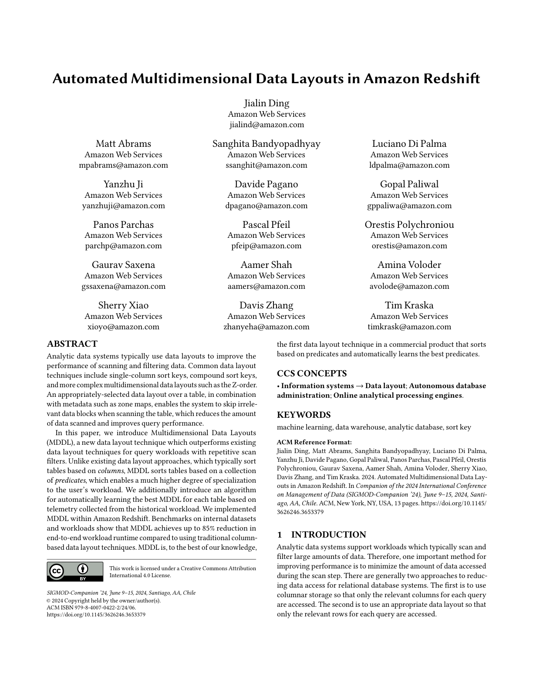

*Página 1 renderizada como imagem (369434 bytes)*

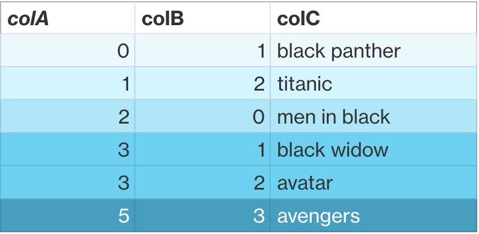

*Figura 1 da página 2 (27418 bytes)*

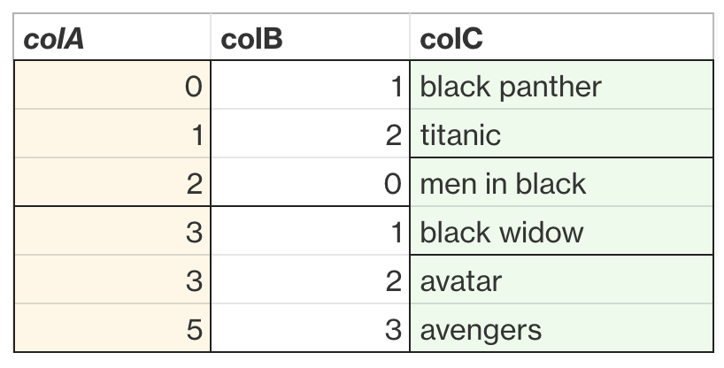

*Figura 2 da página 2 (28911 bytes)*

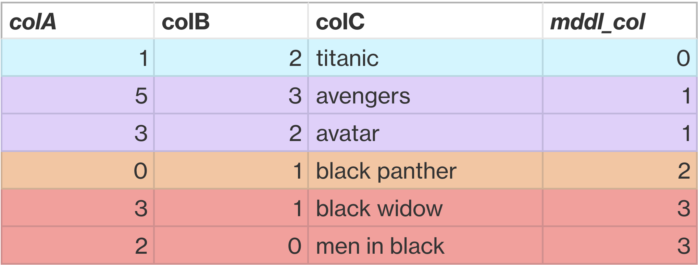

*Figura 3 da página 2 (72175 bytes)*

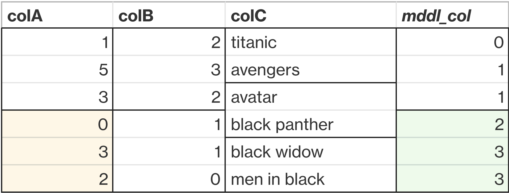

*Figura 4 da página 2 (73489 bytes)*

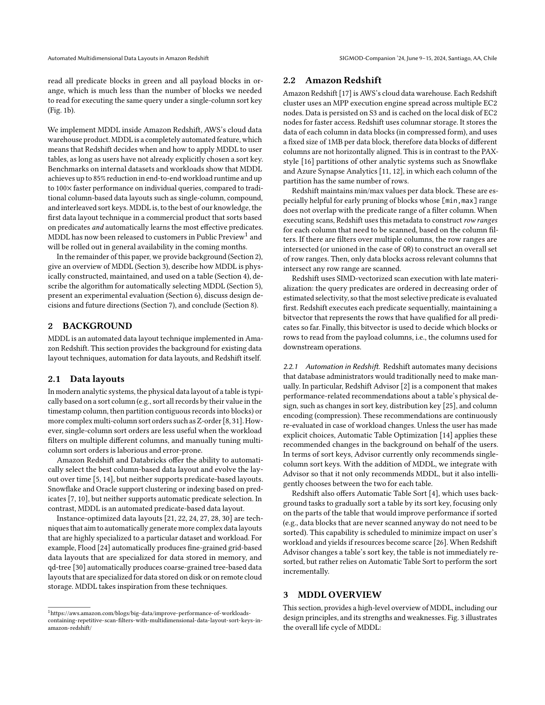

*Página 3 renderizada como imagem (515629 bytes)*

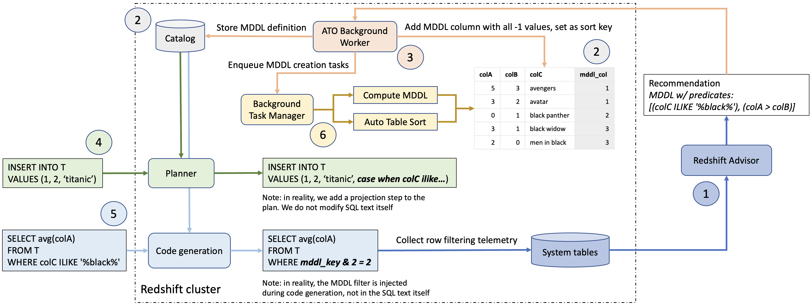

*Figura 1 da página 4 (248318 bytes)*

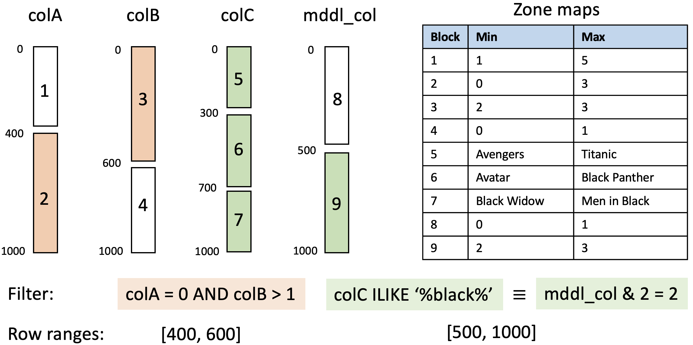

*Figura 1 da página 5 (132163 bytes)*

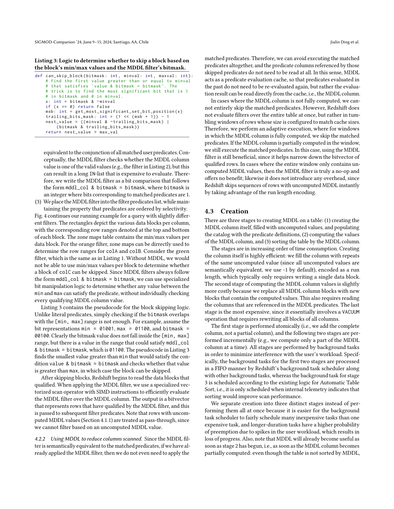

*Página 6 renderizada como imagem (531277 bytes)*

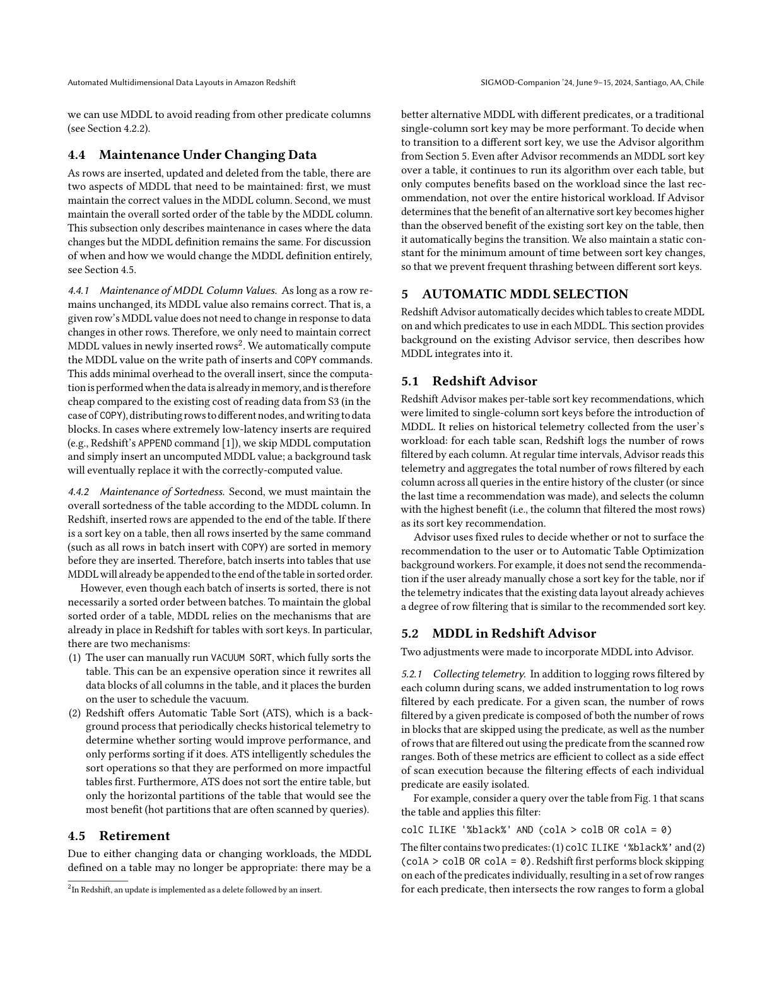

*Página 7 renderizada como imagem (499353 bytes)*

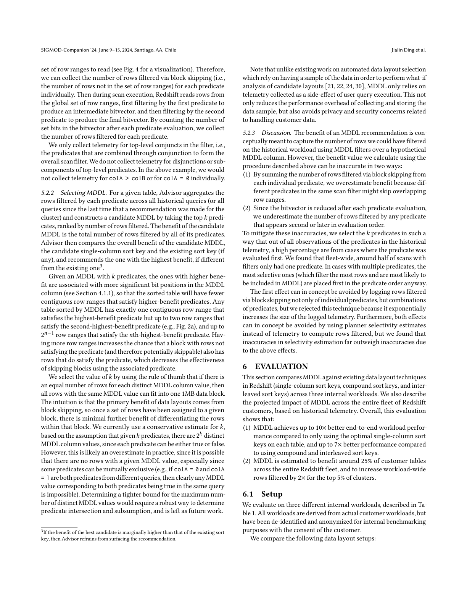

*Página 8 renderizada como imagem (517652 bytes)*

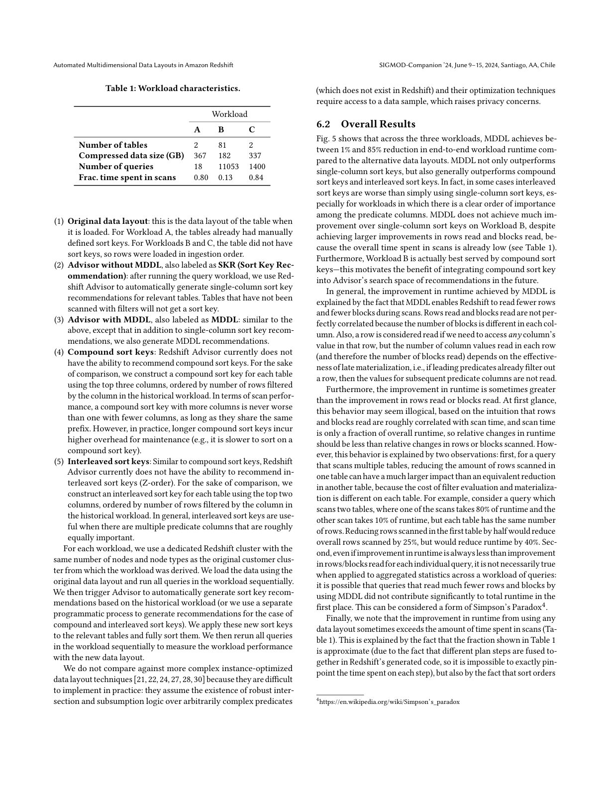

*Página 9 renderizada como imagem (510395 bytes)*

*Figura 1 da página 10 (31559 bytes)*

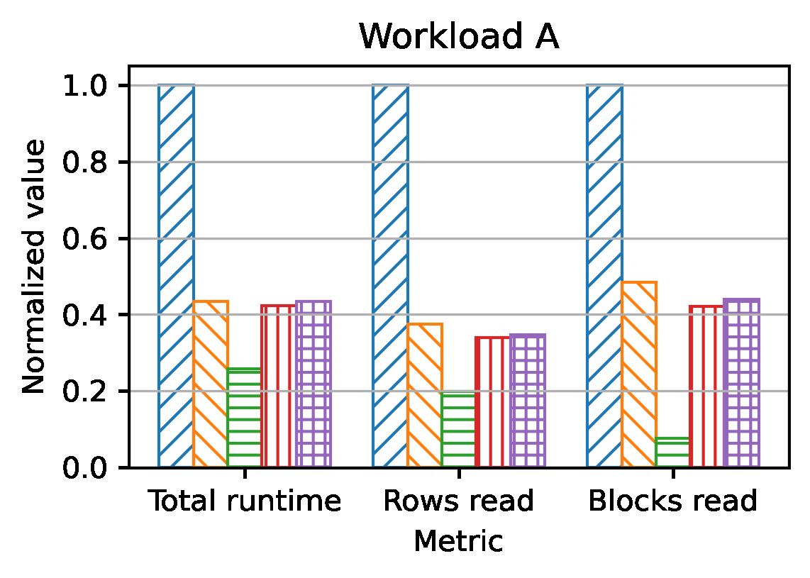

*Figura 2 da página 10 (31833 bytes)*

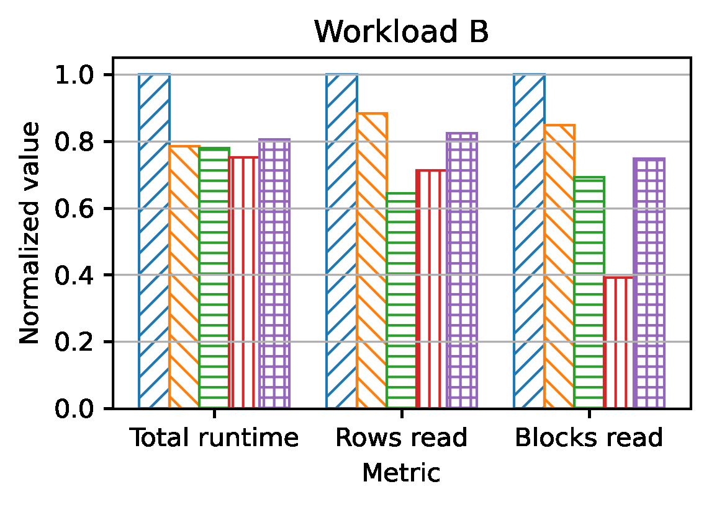

*Figura 3 da página 10 (39141 bytes)*

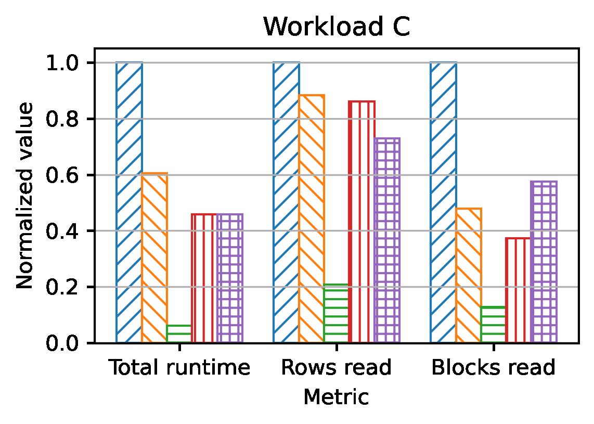

*Figura 4 da página 10 (36252 bytes)*

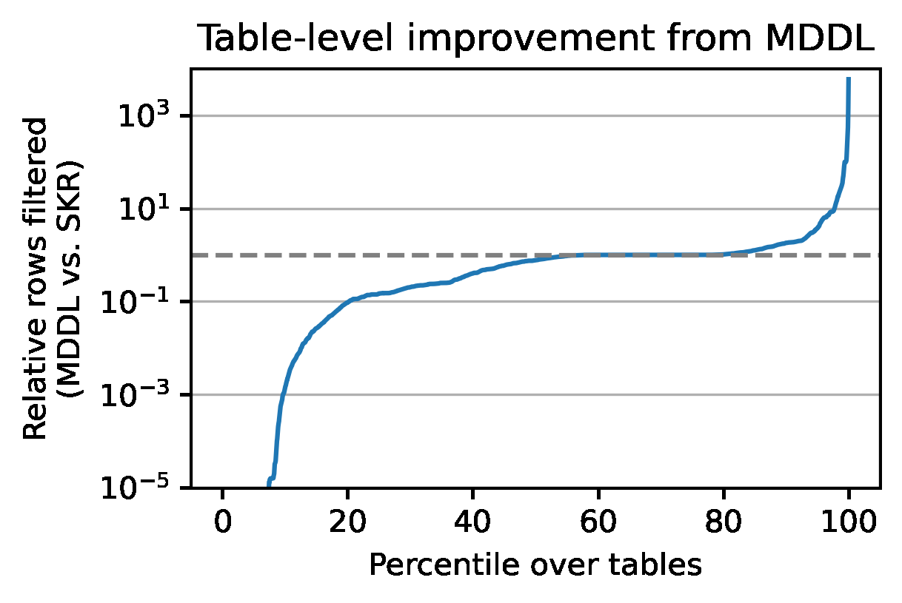

*Figura 1 da página 11 (29553 bytes)*

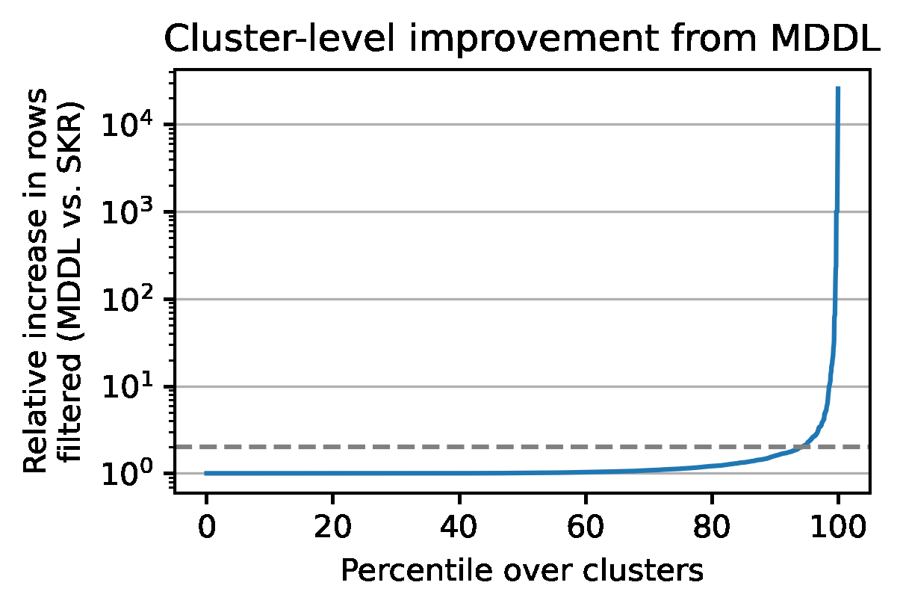

*Figura 2 da página 11 (28996 bytes)*

